# Adversary MCP Server

<div align="center">

[](https://badge.fury.io/py/adversary-mcp-server)
[](https://www.python.org/downloads/)
[](https://opensource.org/licenses/MIT)
[](https://github.com/brettbergin/adversary-mcp-server)
[](https://github.com/brettbergin/adversary-mcp-server)
[](https://pypi.org/project/adversary-mcp-server/)

**Software security analysis with hybrid AI-powered threat detection and configurable built-in and custom rule management**

[Installation](#installation) • [Quick Start](#quick-start) • [AI-Powered Analysis](#ai-powered-analysis) • [MCP Integration](#mcp-integration) • [Rule Management](#rule-management) • [CLI Reference](#cli-reference)

</div>

---

## Installation

### Prerequisites

- **Python 3.10+** (3.11+ recommended)
- **Cursor IDE** with MCP support
- **LLM API access** (optional, for enhanced AI-powered analysis)

### Quick Install

```bash
pip install adversary-mcp-server
```

### Verify Installation

```bash
adversary-mcp-cli --version
adversary-mcp-cli status
```

---

## Quick Start

### 1. Initial Setup

```bash
# Configure the security engine  
adversary-mcp-cli configure

# View available rules and setup
adversary-mcp-cli rules stats
```

### 2. Cursor IDE Integration

Create `.cursor/mcp.json` in your project or `~/.cursor/mcp.json` globally:

```json
{
  "mcpServers": {
    "adversary-security": {
      "command": "/Users/<user>/envs/.venv/bin/python",
      "args": ["-m", "adversary_mcp_server.server"],
      "env": {
        "ADVERSARY_CONFIG_DIR": "~/.local/share/adversary-mcp-server"
      }
    }
  }
}
```

### 3. Start Using in Cursor

Once configured, you can use these **enhanced** MCP tools in Cursor:

- `adv_scan_code` - Hybrid scanning with rules + AI analysis
- `adv_scan_file` - file scanning with LLM support
- `adv_scan_directory` - directory scanning
- `adv_list_rules` - List all 95+ security rules
- `adv_get_rule_details` - Get details about specific rules
- `adv_generate_exploit` - exploit generation
- `adv_configure_settings` - Configuration management
- `adv_get_status` - Check server status and AI availability
- `adv_get_version` - Get version information

### 4. Enable Hot-Reload (Optional)

For real-time rule updates during development:

```bash
# Start hot-reload service
adversary-mcp-cli watch start

# Now edit rules and they'll automatically reload!
```

---

## 🤖 AI-Powered Analysis

### **Hybrid Detection Engine**

The v0.7.1 release introduces a revolutionary **hybrid analysis approach** that combines:

1. **Rule-Based Detection** (95+ built-in rules)
   - Fast, deterministic vulnerability detection
   - Low false-positive rate
   - Comprehensive language support

2. **🆕 LLM-Powered Analysis** (External LLM Services)
   - Advanced pattern recognition
   - Context-aware vulnerability detection
   - Natural language explanations
   - Complex vulnerability chains

### **Enhanced Scanning Capabilities**

```bash
# Scan with AI enhancement (hybrid mode)
Use adv_scan_code with use_llm=true for maximum coverage

# Traditional rules-only scanning
Use adv_scan_code with use_llm=false for fast analysis

# Analysis with AI
Use adv_scan_directory with LLM analysis for comprehensive coverage
```

### **AI Analysis Features**

- **🎯 Smart Threat Detection**: Identifies vulnerabilities that traditional rules miss
- **📊 Confidence Scoring**: Each finding includes AI-generated confidence levels
- **🔍 Detailed Explanations**: Natural language descriptions of vulnerabilities
- **🏷️ CWE/OWASP Mapping**: Automatic categorization with industry standards
- **⚡ Intelligent Deduplication**: Merges similar findings from multiple engines

### **LLM Integration**

The scanner can integrate with external LLM services through your client application:

```bash
# Check LLM availability
adversary-mcp-cli status
```

**Note**: LLM analysis is provided through prompts that can be used with your preferred LLM service. The scanner generates structured prompts for:
- Security analysis
- Exploit generation
- Code review
- Vulnerability explanations

---

## MCP Integration

### Available Tools

| Tool | Description | **🆕 AI Features** |
|------|-------------|-------------------|
| `adv_scan_code` | **🆕 Hybrid scan** of source code | ✅ LLM prompts, confidence scoring |
| `adv_scan_file` | **🆕 Enhanced** file scanning | ✅ AI-powered prompts, detailed explanations |
| `adv_scan_directory` | **🆕 Intelligent** directory scanning | ✅ Batch LLM prompts, statistical insights |
| `adv_generate_exploit` | **🆕 AI-enhanced** exploit generation | ✅ Context-aware prompts, safety mode |
| `adv_list_rules` | List all 95+ threat detection rules | Enhanced with AI rule categories |
| `adv_get_rule_details` | Get detailed rule information | Improved formatting and examples |
| `adv_configure_settings` | **🆕 Advanced** configuration management | ✅ LLM settings, validation |
| `adv_get_status` | Get server status and **🆕 AI availability** | ✅ LLM configuration status |
| `adv_get_version` | Get version information | Shows AI capabilities |

### **🆕 Enhanced Tool Parameters**

All scanning tools now support:

```json
{
  "use_llm": true,              // Enable LLM prompts
  "severity_threshold": "medium", // Filter by severity
  "include_exploits": true,       // Include exploit examples
  "confidence_threshold": 0.8     // AI confidence filtering
}
```

### Example Usage in Cursor

```
# NEW: AI-powered vulnerability scanning
Use adv_scan_code with use_llm=true to analyze this function

# NEW: Generate AI-enhanced exploits
Use adv_generate_exploit for this SQL injection

# NEW: Check AI analysis availability
Use adv_get_status to get the MCP server status

# Enhanced directory scanning with AI
Use adv_scan_directory with use_llm=true for comprehensive analysis
```

---

## Rule Management

### **🆕 Enhanced Rule Engine**

The v0.7.1 release includes significant improvements to rule management:

- **95+ Built-in Rules** (expanded from 85)
- **🆕 AI-Enhanced Categories** with better organization
- **🆕 Confidence-Based Filtering** for more accurate results
- **🆕 Hybrid Rule Validation** using both static and AI analysis

### Rule Directory Structure

Rules are automatically organized in your user directory:

```
~/.local/share/adversary-mcp-server/rules/
├── built-in/              # Core security rules (95 rules)
│   ├── python-rules.yaml        # 🆕 Enhanced Python rules
│   ├── javascript-rules.yaml    # 🆕 Enhanced JavaScript rules  
│   ├── typescript-rules.yaml    # 🆕 Enhanced TypeScript rules
│   ├── web-security-rules.yaml  # 🆕 Enhanced Web security
│   ├── api-security-rules.yaml  # 🆕 Enhanced API security
│   ├── cryptography-rules.yaml  # 🆕 Enhanced Crypto rules
│   └── configuration-rules.yaml # 🆕 Enhanced Config rules
├── custom/                # Your custom rules
├── organization/          # Company/team rules
└── templates/             # 🆕 Enhanced rule templates
```

### **🆕 AI-Enhanced Rule Management**

```bash
# View enhanced rules with AI categories
adversary-mcp-cli list-rules --show-ai-categories

# Validate rules with AI assistance
adversary-mcp-cli rules validate --use-ai

# Enhanced rule statistics
adversary-mcp-cli rules stats --detailed
```

### Quick Rule Management

```bash
# View rules directory and contents
adversary-mcp-cli show-rules-dir

# List all loaded rules with source files  
adversary-mcp-cli list-rules

# List rules with full file paths
adversary-mcp-cli list-rules --verbose

# View detailed rule statistics
adversary-mcp-cli rules stats

# Export rules for backup/sharing
adversary-mcp-cli rules export my-rules.yaml

# Import custom rules
adversary-mcp-cli rules import-rules external-rules.yaml

# Validate all rules
adversary-mcp-cli rules validate

# Reload rules after changes
adversary-mcp-cli rules reload
```

### Creating Custom Rules

1. **Copy template:**
```bash
cp ~/.local/share/adversary-mcp-server/rules/templates/rule-template.yaml \
   ~/.local/share/adversary-mcp-server/rules/custom/my-rule.yaml
```

2. **Edit the rule:**
```yaml
rules:
  - id: api_key_hardcode
    name: Hardcoded API Key
    description: Detects hardcoded API keys in source code
    category: secrets
    severity: critical
    languages: [python, javascript, typescript]
    
    conditions:
      - type: pattern
        value: "API_KEY\\s*=\\s*['\"][a-zA-Z0-9-_]{20,}['\"]"
    
    remediation: |
      Store API keys in environment variables:
      - Use os.getenv('API_KEY') instead of hardcoding
      - Implement proper secrets management
    
    references:
      - https://owasp.org/Top10/A05_2021-Security_Misconfiguration/
    
    cwe_id: CWE-798
    owasp_category: A05:2021
```

3. **Reload rules:**
```bash
adversary-mcp-cli rules reload
```

---

## Hot-Reload Service

Enable real-time rule updates without server restart:

### Start Hot-Reload

```bash
# Start with default settings
adversary-mcp-cli watch start

# Start with custom directories and debounce time
adversary-mcp-cli watch start \
  --directory /path/to/project/rules/ \
  --debounce 2.0
```

### Monitor Status

```bash
# Check service status
adversary-mcp-cli watch status

# Test hot-reload functionality
adversary-mcp-cli watch test
```

### Development Workflow

```bash
# Terminal 1: Start hot-reload service
adversary-mcp-cli watch start

# Terminal 2: Edit rules (auto-reloads)
vim ~/.local/share/adversary-mcp-server/rules/custom/my-rule.yaml
# Changes are automatically detected and rules reload!
```

---

## CLI Reference

### Core Commands

| Command | Description |
|---------|-------------|
| `adversary-mcp-cli configure` | Initial setup and configuration |
| `adversary-mcp-cli status` | Show server status and configuration |
| `adversary-mcp-cli scan <target>` | Scan files/directories for vulnerabilities |
| `adversary-mcp-cli server` | Start MCP server (used by Cursor) |

### Rule Management Commands

| Command | Description |
|---------|-------------|
| `adversary-mcp-cli list-rules` | List all rules with source files |
| `adversary-mcp-cli rule-details <id>` | Get detailed rule information |
| `adversary-mcp-cli rules stats` | Show comprehensive rule statistics |
| `adversary-mcp-cli rules export <file>` | Export rules to YAML/JSON |
| `adversary-mcp-cli rules import-rules <file>` | Import external rules |
| `adversary-mcp-cli rules validate` | Validate all loaded rules |
| `adversary-mcp-cli rules reload` | Reload rules from files |

### Hot-Reload Commands

| Command | Description |
|---------|-------------|
| `adversary-mcp-cli watch start` | Start hot-reload service |
| `adversary-mcp-cli watch status` | Show service status |
| `adversary-mcp-cli watch test` | Test hot-reload functionality |

### Utility Commands

| Command | Description |
|---------|-------------|
| `adversary-mcp-cli show-rules-dir` | Show rules directory location |
| `adversary-mcp-cli demo` | Run interactive demo |
| `adversary-mcp-cli reset` | Reset all configuration |

---

## Security Coverage

### **🆕 Comprehensive Hybrid Analysis (95+ Rules + AI)**

#### **Traditional Rule-Based Detection**
- **Python** (25+ rules): SQL injection, command injection, deserialization, path traversal
- **JavaScript/TypeScript** (30+ rules): XSS, prototype pollution, eval injection, CORS issues  
- **Web Security** (18+ rules): CSRF, clickjacking, security headers, session management
- **API Security** (15+ rules): Authentication bypass, parameter pollution, mass assignment
- **Cryptography** (15+ rules): Weak algorithms, hardcoded keys, poor randomness
- **Configuration** (15+ rules): Debug mode, default credentials, insecure settings

#### **🆕 AI-Powered Detection**
- **Context-Aware Analysis**: Understands complex vulnerability patterns
- **Business Logic Flaws**: Identifies application-specific issues
- **Advanced Injection Variants**: Detects novel attack vectors
- **Compliance Violations**: Recognizes regulatory requirement breaches
- **Security Anti-Patterns**: Identifies poor security practices

### **🆕 Enhanced Standards Compliance**

- **OWASP Top 10 2021** - Complete coverage with AI enhancement
- **CWE** - Common Weakness Enumeration mappings + AI categorization
- **NIST** - Security framework alignment with intelligent analysis
- **Industry best practices** - SANS, CERT guidelines + AI insights
- **🆕 MITRE ATT&CK** - Threat modeling integration
- **🆕 ASVS** - Application Security Verification Standard

### **🆕 Advanced Language Support**

- **Python** - AST-based analysis + AI semantic understanding
- **JavaScript** - Modern ES6+ and Node.js patterns + AI context analysis
- **TypeScript** - Type safety vulnerabilities + AI-powered type inference analysis

---

## 🏗️ Enhanced Architecture

The v0.7.1 release features a **hybrid architecture** combining multiple analysis engines:

```mermaid
graph TB
    A[Source Code] --> B[Enhanced Scanner]
    B --> C[AST Scanner]
    B --> D[🆕 LLM Analyzer]
    
    C --> E[Rule Engine]
    E --> F[95+ Built-in Rules]
    E --> G[Custom Rules]
    
    D --> H[LLM Service]
    H --> I[AI Security Analysis]
    
    C --> J[Threat Matches]
    D --> K[LLM Findings]
    
    J --> L[🆕 Intelligent Merger]
    K --> L
    
    L --> M[Enhanced Results]
    M --> N[Confidence Scoring]
    M --> O[Deduplication]
    M --> P[Statistical Analysis]
    
    subgraph "🆕 AI Enhancement"
        D
        H
        I
        K
    end
    
    subgraph "Traditional Analysis"
        C
        E
        F
        G
        J
    end
    
    subgraph "🆕 Hybrid Output"
        L
        M
        N
        O
        P
    end
```



### **🆕 Core Components**

#### **1. Enhanced Scanner**
- **Hybrid Analysis Engine**: Orchestrates both rule-based and AI analysis
- **Intelligent Deduplication**: Merges findings from multiple sources
- **Confidence Scoring**: Provides reliability metrics for each finding
- **Statistical Analysis**: Generates comprehensive scan statistics

#### **2. LLM Security Analyzer**
- **LLM Integration**: Uses external LLM services for advanced pattern recognition
- **Context-Aware Analysis**: Understands code semantics and business logic
- **Natural Language Explanations**: Provides detailed vulnerability descriptions
- **CWE/OWASP Mapping**: Automatic categorization with industry standards

#### **3. Enhanced Credential Manager**
- **Secure Storage**: Encrypted API key management with keyring integration
- **Configuration Validation**: Automatic validation of LLM settings
- **Flexible Configuration**: Fine-grained control over analysis features
- **Error Handling**: Clear feedback on configuration issues

#### **4. Traditional Components (Enhanced)**
- **AST Scanner**: Enhanced with better language support
- **Threat Engine**: Improved rule management and validation
- **Exploit Generator**: AI-enhanced exploit generation capabilities
- **Hot-Reload Service**: Real-time rule updates

### **🆕 Analysis Flow**

1. **Input Processing**: Code is prepared for multi-engine analysis
2. **Parallel Analysis**: AST rules and LLM analysis run concurrently
3. **Intelligent Merging**: Findings are deduplicated and merged
4. **Confidence Scoring**: AI provides reliability metrics
5. **Enhanced Output**: Results include detailed explanations and statistics

### **🆕 Integration Architecture**

```
┌─────────────────┐    ┌─────────────────┐    ┌─────────────────┐
│   Cursor IDE    │───▶│🆕 Enhanced MCP  │───▶│🆕 Hybrid Engine │
│                 │    │     Server      │    │                 │
│ • Code editing  │    │ • adv_* tools   │    │ • AST Analysis  │
│ • Chat interface│    │ • AI integration│    │ • LLM Analysis  │
│ • Tool calling  │    │ • Protocol      │    │ • Hot-reload    │
└─────────────────┘    └─────────────────┘    └─────────────────┘
                                                        │
                              ┌─────────────────────────┼─────────────────────────┐
                              │                         ▼                         │
                    ┌─────────────────┐    ┌─────────────────┐    ┌─────────────────┐
                    │🆕 Enhanced Rules│    │  Custom Rules   │    │Organization Rules│
                    │   (95+ rules)   │    │  User defined   │    │ Company policies│
                    │ Multi-language  │    │ Project specific│    │  Compliance     │
                    │ + AI Categories │    │ + AI Templates  │    │ + AI Validation │
                    └─────────────────┘    └─────────────────┘    └─────────────────┘
                                                        │
                              ┌─────────────────────────┼─────────────────────────┐
                              │                         ▼                         │
                    ┌─────────────────┐    ┌─────────────────┐    ┌─────────────────┐
                    │ 🆕 LLM Service  │    │🆕 Confidence    │    │🆕 Statistical   │
                    │   Integration   │    │   Scoring       │    │   Analysis      │
                    │ • External APIs │    │ • Reliability   │    │ • Detailed      │
                    │ • Context-aware │    │ • Deduplication │    │   Metrics       │
                    │ • NL Explanations│    │ • Smart Merging │    │ • Trend Analysis│
                    └─────────────────┘    └─────────────────┘    └─────────────────┘
```

---

## 🆕 Advanced Features in v0.7.1

### **Hybrid Analysis Examples**

#### **Traditional Rules-Only Analysis**
```bash
# Fast, deterministic scanning
adversary-mcp-cli scan myproject/ --use-llm=false --severity=medium
```

#### **🆕 AI-Enhanced Analysis**
```bash
# Comprehensive hybrid analysis with LLM prompts
adversary-mcp-cli scan myproject/ --use-llm=true --confidence-threshold=0.8
```

#### **🆕 Batch AI Analysis**
```bash
# Process multiple files with LLM prompts
adversary-mcp-cli scan-batch file1.py file2.js file3.ts --use-llm=true
```

### **🆕 Advanced Configuration**

#### **LLM Configuration**
```bash
# Configure LLM analysis settings
adversary-mcp-cli configure --enable-llm-analysis=true
adversary-mcp-cli configure --exploit-safety-mode=true
```

#### **🆕 Confidence and Filtering**
```bash
# Filter by AI confidence levels
adversary-mcp-cli scan . --confidence-threshold 0.9 --use-llm=true

# Combine rules and AI with custom thresholds
adversary-mcp-cli scan . --severity=high --confidence-threshold=0.7
```

### **🆕 Enhanced Reporting**

#### **Detailed Analysis Reports**
```bash
# Generate comprehensive reports with AI insights
adversary-mcp-cli scan . --format=detailed --include-ai-analysis --output=report.json
```

#### **🆕 Statistical Analysis**
```bash
# Get detailed statistics about threats found
adversary-mcp-cli scan . --stats --use-llm=true
```

### **🆕 Integration Capabilities**

#### **IDE Integration**
The enhanced MCP server provides seamless integration with development environments:

- **Real-time Analysis**: Instant feedback as you type
- **Context-Aware Suggestions**: AI understands your specific codebase
- **Intelligent Deduplication**: No duplicate alerts from multiple engines
- **Confidence Indicators**: Know which findings are most reliable

#### **🆕 LLM Prompt Generation**
```python
# Use the enhanced scanner programmatically
from adversary_mcp_server.enhanced_scanner import EnhancedScanner

scanner = EnhancedScanner(enable_llm_analysis=True)
result = scanner.scan_code(source_code, file_path, language, use_llm=True)

# Access hybrid results
print(f"Total threats: {len(result.all_threats)}")
print(f"Rules-based: {len(result.rules_threats)}")
print(f"LLM prompts generated: {len(result.llm_prompts)}")
print(f"High confidence: {len(result.get_high_confidence_threats())}")
```

---

## Advanced Usage

### CI/CD Integration

```yaml
# .github/workflows/security.yml
name: Security Analysis
on: [push, pull_request]

jobs:
  security-scan:
    runs-on: ubuntu-latest
    steps:
      - uses: actions/checkout@v3
      - uses: actions/setup-python@v4
        with:
          python-version: '3.11'
      
      - name: Install Adversary MCP
        run: pip install adversary-mcp-server
      
      - name: Security Scan
        run: |
          adversary-mcp-cli scan . \
            --severity medium \
            --format json \
            --output security-report.json
      
      - name: Upload Results
        uses: actions/upload-artifact@v3
        with:
          name: security-report
          path: security-report.json
```

### Environment Configuration

```bash
# Configuration environment variables
export ADVERSARY_CONFIG_DIR="~/.local/share/adversary-mcp-server"
export ADVERSARY_RULES_DIR="~/.local/share/adversary-mcp-server/rules"
export ADVERSARY_LOG_LEVEL="INFO"
export ADVERSARY_SEVERITY_THRESHOLD="medium"
export ADVERSARY_HOT_RELOAD="enabled"
```

---

## Development

### Development Setup

```bash
# Clone repository
git clone https://github.com/brettbergin/adversary-mcp-server.git
cd adversary-mcp-server

# Install with uv (recommended)
pip install uv
uv venv
source .venv/bin/activate
uv pip install -e ".[dev]"

# Or with traditional pip
make install

# Run tests
make test

# Code quality checks  
make lint
```

### Project Structure

```
adversary-mcp-server/
├── src/adversary_mcp_server/
│   ├── server.py           # MCP server with adv_* tools
│   ├── threat_engine.py    # Rule engine with source file tracking
│   ├── ast_scanner.py      # Static analysis engine
│   ├── exploit_generator.py # Educational exploit generation
│   ├── hot_reload.py       # Real-time rule updates
│   └── cli.py             # Command-line interface
├── rules/                 # Packaged rules (copied to user directory)
│   ├── built-in/           # 95+ core security rules
│   └── templates/         # Rule creation templates
└── tests/                 # Comprehensive test suite (332 tests)
```

---

## License

MIT License - see [LICENSE](LICENSE) file for details.

---

## Contributing

1. Fork the repository
2. Create a feature branch: `git checkout -b feature-name`
3. Make your changes and add tests
4. Run the test suite: `make test`
5. Submit a pull request

---

## Support

- **Documentation**: [GitHub Wiki](https://github.com/brettbergin/adversary-mcp-server/wiki)
- **Issues**: [GitHub Issues](https://github.com/brettbergin/adversary-mcp-server/issues)
- **Discussions**: [GitHub Discussions](https://github.com/brettbergin/adversary-mcp-server/discussions)

---

<div align="center">

**Built with ❤️ for secure development**

</div>