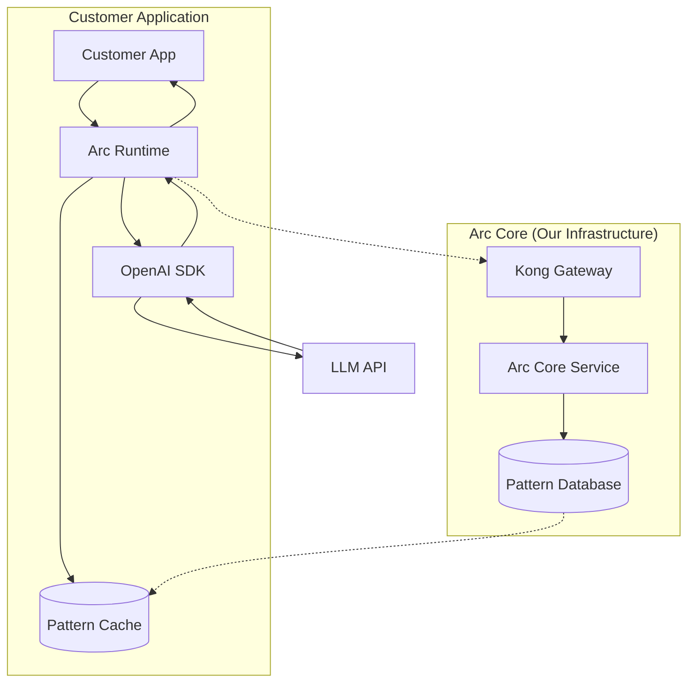

# Arc Runtime

[](https://www.python.org/downloads/)
[](https://opensource.org/licenses/MIT)
[](https://badge.fury.io/py/arc-runtime)
[](docs/performance_report.md)
[](https://opentelemetry.io/)

> **For Team Members**: This is the client-side SDK that customers integrate into their applications to enable Arc AI reliability. It intercepts LLM calls, applies learned fixes, and streams telemetry to Arc Core.

## What is Arc Runtime?

Arc Runtime is a lightweight Python interceptor that prevents AI agent failures in real-time. It's the **client-side component** of our Arc AI reliability system - the part that customers install in their applications.

**Key Insight**: Arc Runtime is invisible to customer applications. It patches LLM SDKs automatically and applies fixes *before* requests reach the LLM, creating a seamless reliability layer.

---

## 🚀 Quick Start (Tutorial)

### 1. Development Setup

```bash
git clone https://github.com/arc-computer/runtime.git
cd runtime
pip install -e ".[dev]"
```

### 2. Basic Usage

```python
import openai
from runtime import Arc

# Initialize Arc - automatically patches OpenAI
Arc()

# Customer uses OpenAI normally - Arc protects silently
client = openai.OpenAI()
response = client.chat.completions.create(
    model="gpt-4.1",
    messages=[{"role": "user", "content": "Hello"}],
    temperature=0.95  # Arc will fix this to 0.7 automatically
)
```

### 3. With Arc Core (Production)

```python
from runtime import Arc

# Connect to Arc Core via Kong Gateway
arc = Arc(
    endpoint="grpc://kong.arc.computer:9080",  # Kong gRPC proxy
    api_key="arc_live_customer_key_here"      # Customer API key
)

# All subsequent LLM calls are protected and telemetry streams to Arc Core
```

---

## 📖 How-To Guides

### Multi-Agent Pipeline Tracking

```python
from runtime import Arc
import openai

arc = Arc()
client = openai.OpenAI()

# Track complex agent workflows
with arc.create_multiagent_context(application_id="LOAN-2024-001") as ctx:
    # Each agent call is automatically tracked
    response1 = client.chat.completions.create(
        model="gpt-4.1",
        messages=[{"role": "user", "content": "Analyze loan application"}],
        extra_headers={"X-Agent-Name": "loan_officer"}
    )
    
    response2 = client.chat.completions.create(
        model="gpt-4.1", 
        messages=[{"role": "user", "content": "Review credit history"}],
        extra_headers={"X-Agent-Name": "credit_analyst"}
    )
    
    # Track context handoffs
    ctx.add_context_handoff(
        from_agent="loan_officer",
        to_agent="credit_analyst", 
        context={"loan_amount": 250000, "assessment": "positive"}
    )
    
    # Get pipeline metrics
    summary = ctx.get_pipeline_summary()
```

### LangGraph Integration

```python
from runtime import ArcStateGraph

# Use ArcStateGraph instead of StateGraph for automatic tracking
workflow = ArcStateGraph()

# Add nodes - each is tracked as an agent
workflow.add_node("process_application", process_fn)
workflow.add_node("verify_documents", verify_fn)

# Compile and run - Arc tracks everything
app = workflow.compile()
result = app.invoke({"application_id": "APP-123"})
```

### Custom Pattern Registration

```python
arc = Arc()

# Register custom failure patterns
arc.register_pattern(
    pattern={"model": "gpt-4.1", "temperature": {">": 0.9}},
    fix={"temperature": 0.7}
)

# Pattern will be applied automatically to matching requests
```

### Testing with Real APIs

```bash
# Set API key
export OPENAI_API_KEY="sk-..."

# Run integration tests
python tests/test_real_api.py

# Performance benchmarks
python tests/test_performance.py
```

---

## 🔧 Technical Reference

### System Architecture



### Core Components

| Component | Purpose | Location |
|-----------|---------|----------|
| **Arc Singleton** | Main coordinator, manages interceptor lifecycle | `runtime/arc.py` |
| **OpenAI Interceptor** | Patches OpenAI SDK, applies fixes | `runtime/interceptors/openai.py` |
| **Pattern Registry** | Thread-safe pattern storage and matching | `runtime/patterns/` |
| **Multi-Agent Context** | Pipeline execution tracking | `runtime/multiagent/` |
| **Telemetry Client** | gRPC streaming to Arc Core | `runtime/telemetry/` |
| **MCP Interceptor** | Model Context Protocol monitoring | `runtime/interceptors/mcp.py` |
| **LangGraph Integration** | Automatic workflow tracking | `runtime/integrations/langgraph.py` |

### Configuration Options

```python
from runtime import Arc

arc = Arc(
    endpoint="grpc://kong.arc.computer:9080",  # gRPC endpoint
    api_key="arc_live_...",                    # Customer API key
    log_level="DEBUG"                          # Logging level
)
```

**Environment Variables:**
- `ARC_DISABLE=1` - Disable Arc completely
- `ARC_ENDPOINT` - gRPC endpoint (default: grpc://localhost:50051)
- `ARC_API_KEY` - API key for Arc Core
- `ARC_LOG_LEVEL` - Logging level (default: INFO)

### Performance Characteristics

- **P99 Interception Overhead**: 0.011ms (requirement: <5ms)
- **Pattern Matching**: O(1) dictionary lookup
- **Memory Footprint**: <50MB base
- **Thread Safety**: Full concurrent request support

### Metrics & Monitoring

Arc Runtime exposes Prometheus metrics at `http://localhost:9090/metrics`:

```
arc_requests_intercepted_total     # Total requests intercepted
arc_fixes_applied_total           # Total fixes applied
arc_pattern_matches_total         # Total pattern matches
arc_interception_latency_ms       # Interception overhead histogram
```

---

## 🏗️ Development Workflows

### Local Development

```bash
# Setup
pip install -e ".[dev]"

# Run tests
pytest
pytest --cov=runtime --cov-report=html

# Code quality
black runtime tests
isort runtime tests
flake8 runtime tests
mypy runtime
```

### Release Process

```bash
# Update version in pyproject.toml
# Update CHANGELOG.md
# Run full test suite
pytest

# Build and publish
python -m build
twine upload dist/*
```

### Working with Arc Core

Arc Runtime connects to Arc Core via Kong Gateway:

1. **Development**: `grpc://localhost:50051` (direct Arc Core)
2. **Production**: `grpc://kong.arc.computer:9080` (via Kong)

Kong provides:
- Customer API key authentication
- Rate limiting per customer
- Multi-tenancy isolation
- Load balancing

---

## 🔍 Troubleshooting

### Arc Runtime not intercepting calls

**Symptoms**: LLM calls bypass Arc, no telemetry generated

**Solutions**:
1. Import Arc before LLM library:
   ```python
   from runtime import Arc  # Import Arc first
   Arc()
   import openai  # Then import OpenAI
   ```

2. Check if disabled:
   ```bash
   echo $ARC_DISABLE  # Should be empty or "0"
   ```

3. Enable debug logging:
   ```bash
   export ARC_LOG_LEVEL=DEBUG
   ```

### Telemetry not streaming

**Symptoms**: No data in Arc Core dashboard

**Solutions**:
1. Check endpoint connectivity:
   ```bash
   telnet kong.arc.computer 9080
   ```

2. Verify gRPC dependencies:
   ```bash
   pip install grpcio protobuf
   ```

3. Check API key:
   ```bash
   echo $ARC_API_KEY  # Should start with "arc_live_"
   ```

### Pattern matching not working

**Symptoms**: Known failure patterns not being fixed

**Solutions**:
1. Check pattern registry:
   ```python
   arc = Arc()
   print(arc.get_registered_patterns())
   ```

2. Verify pattern syntax:
   ```python
   # Correct
   {"model": "gpt-4.1", "temperature": {">": 0.9}}
   
   # Incorrect
   {"model": "gpt-4.1", "temperature": 0.9}  # Missing operator
   ```

---

## 📚 Additional Resources

### Team Documentation
- [Architecture Decision Records](docs/adr/)
- [Performance Benchmarks](docs/performance_report.md)
- [Testing Strategy](docs/testing.md)

### Customer Resources
- [Integration Guide](docs/integration.md)
- [API Reference](docs/api.md)
- [FAQ](docs/faq.md)

### Examples
- [Basic Integration](examples/basic_integration.py)
- [Multi-Agent Pipeline](examples/langgraph_workflow.py)
- [Custom Patterns](examples/custom_patterns.py)

---

## License

MIT License - see [LICENSE](LICENSE) for details.