# 🪄 bluer-algo

🪄 `@algo` carries AI algo.  

```bash
pip install bluer-algo
```

|   |
| --- |

```mermaid
graph LR
    image_classifier_dataset_ingest["@image_classifier<br>dataset<br>ingest<br>count=&lt;100&gt;,source=fruits_360<br>&lt;dataset-object-name&gt;"]

    image_classifier_dataset_review["@image_classifier<br>dataset<br>review -<br>&lt;dataset-object-name&gt;"]

    image_classifier_model_train["@image_classifier<br>model<br>train -<br>&lt;dataset-object-name&gt;<br>&lt;model-object-name&gt;"]

    fruits_360["🛜 fruits_360"]:::folder
    dataset_object["📂 dataset object"]:::folder
    model_object["📂 model object"]:::folder

    fruits_360 --> image_classifier_dataset_ingest
    image_classifier_dataset_ingest --> dataset_object

    dataset_object --> image_classifier_dataset_review

    dataset_object --> image_classifier_model_train
    image_classifier_model_train --> model_object

    classDef folder fill:#999,stroke:#333,stroke-width:2px;
```

| [`image classifier`](./bluer_algo/docs/image-classifier.md) [](./bluer_algo/docs/image-classifier.md) an image classifier. |



---

> for the [Global South](https://github.com/kamangir/bluer-south).

---


[](https://github.com/kamangir/bluer-algo/actions/workflows/pylint.yml) [](https://github.com/kamangir/bluer-algo/actions/workflows/pytest.yml) [](https://github.com/kamangir/bluer-algo/actions/workflows/bashtest.yml) [](https://pypi.org/project/bluer-algo/) [](https://pypistats.org/packages/bluer-algo)

built by 🌀 [`bluer README`](https://github.com/kamangir/bluer-objects/tree/main/bluer_objects/README), based on 🪄 [`bluer_algo-4.207.1`](https://github.com/kamangir/bluer-algo).
