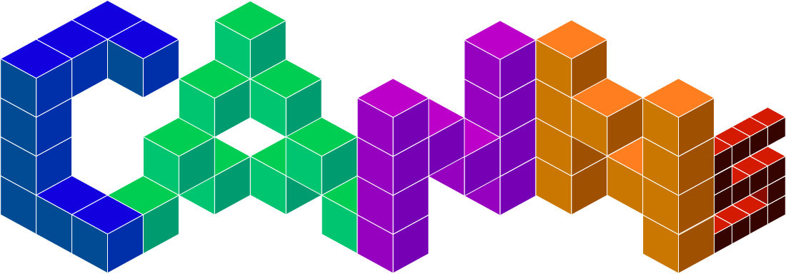

[![Contributors][contributors-shield]][contributors-url]
[![Forks][forks-shield]][forks-url]
[![Stargazers][stars-shield]][stars-url]
[![Issues][issues-shield]][issues-url]
[![project_license][license-shield]][license-url]

<!-- PROJECT LOGO -->
 

  

<h3 align="center">Continuous Attractor Neural Networks (CANNs) Python Library</h3>

  

    A Python Library for Continuous Attractor Neural Networks (CANNs) and other brain-inspired computational models. It provides a unified, high-level API to easily load, analyze, and train state-of-the-art CANN architectures, enabling researchers and developers to quickly experiment with and deploy brain-inspired solutions.
     
    <a href="https://github.com/routhleck/canns"><strong>Explore the docs »</strong></a>
     
     
    <a href="https://github.com/routhleck/canns">View Demo</a>
    &middot;
    <a href="https://github.com/routhleck/canns/issues/new?labels=bug&template=bug-report---.md">Report Bug</a>
    &middot;
    <a href="https://github.com/routhleck/canns/issues/new?labels=enhancement&template=feature-request---.md">Request Feature</a>
  

This project is currently in active development. Its features and functionality may be further refined and adjusted in future updates.

<!-- MARKDOWN LINKS & IMAGES -->
<!-- https://www.markdownguide.org/basic-syntax/#reference-style-links -->
[contributors-shield]: https://img.shields.io/github/contributors/routhleck/canns.svg?style=for-the-badge
[contributors-url]: https://github.com/routhleck/canns/graphs/contributors
[forks-shield]: https://img.shields.io/github/forks/routhleck/canns.svg?style=for-the-badge
[forks-url]: https://github.com/routhleck/canns/network/members
[stars-shield]: https://img.shields.io/github/stars/routhleck/canns.svg?style=for-the-badge
[stars-url]: https://github.com/routhleck/canns/stargazers
[issues-shield]: https://img.shields.io/github/issues/routhleck/canns.svg?style=for-the-badge
[issues-url]: https://github.com/routhleck/canns/issues
[license-shield]: https://img.shields.io/github/license/routhleck/canns.svg?style=for-the-badge
[license-url]: https://github.com/routhleck/canns/blob/master/LICENSE.txt
