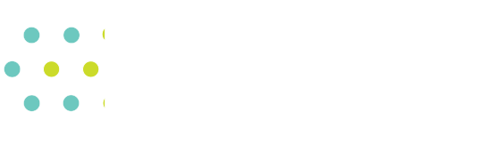

.. image:: _static/logo_outline.svg
  :alt: CASM logo
  :width: 600
  :class: only-light

casm-bset
=========

The casm-bset package is the CASM cluster expansion basis set construction module. This includes:

- Methods for generating coupled cluster expansion Hamiltonians of occupation, strain, displacement, and magnetic spin degrees of freedom (DoF) appropriate for the symmetry of any multi-component crystalline solid.
- Methods for generating C++ code for a CASM cluster expansion calculator (clexulator) which efficiently evaluates the cluster expansion basis function for configuration represented using the CASM `ConfigDoFValues` data structure
- Generalized methods for creating symmetry adapted basis functions of other variables

This package is designed to work with the cluster expansion calculator (clexulator) evaluation methods which are implemented in `libcasm-clexulator <https://github.com/prisms-center/CASMcode_clexulator>`_.

About CASM
==========

The casm-bset package is part of the CASM_ open source software package, which is designed to perform first-principles statistical mechanical studies of multi-component crystalline solids.

CASM is developed by the Van der Ven group, originally at the University of Michigan and currently at the University of California Santa Barbara.

For more information, see the `CASM homepage <CASM_>`_.

License
=======

GNU Lesser General Public License (LGPL). Please see the LICENSE file available on GitHub_.

Documentation
=============

.. toctree::
    :maxdepth: 2

    installation
    usage
    Reference <reference/casm/index>
    bibliography

casm-bset is available on GitHub_.

.. _CASM: https://prisms-center.github.io/CASMcode_docs/
.. _GitHub: https://github.com/prisms-center/CASMcode_bset
