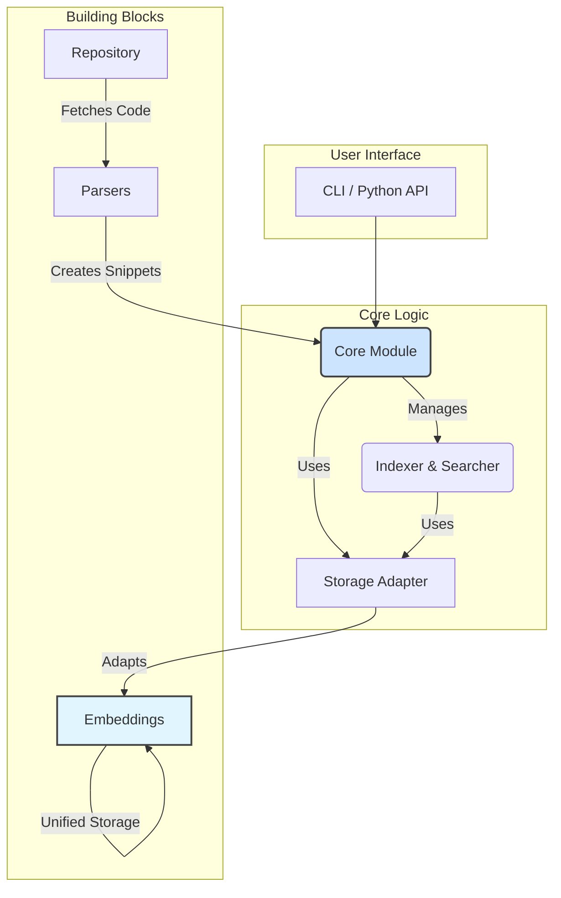

# CodeRepoIndex

<!-- <p align="center">
  
</p> -->

<p align="center">
  <strong>通过语义理解，释放代码仓库的全部潜力</strong>
</p>

<p align="center">
    <a href="https://codecov.io/gh/XingYu-Zhong/CodeRepoIndex">
        
    </a>
    <a href="https://pypi.org/project/coderepoindex/">
        
    </a>
    <a href="https://github.com/XingYu-Zhong/CodeRepoIndex/blob/main/LICENSE">
        
    </a>
</p>

**CodeRepoIndex** 是一个开源的本地化代码语义索引和搜索工具。它能够将完整的代码仓库转换为一个可被语义查询的本地索引，帮助开发者快速在大型代码库中定位相关的代码功能、实现和示例。

## 核心功能

- **🤖 智能代码解析**: 自动将代码文件分解为函数、类、方法等有意义的逻辑单元。
- **🧠 语义嵌入**: 使用先进的嵌入模型（如 OpenAI, 阿里云通义等）将代码块转换为高维向量。
- **💾 统一存储**: 基于embedding模块的统一存储架构，高效管理代码元数据和向量数据。
- **🔍 纯向量搜索**: 专注于语义向量搜索，支持中英文自然语言查询和代码片段查询。
- **⚙️ 灵活配置**: 支持环境变量、JSON配置文件、代码内直接传入等多种配置方式。
- **📦 开箱即用**: 提供简洁的 Python API 和命令行工具。

## 架构与模块设计

项目采用模块化设计，各组件职责清晰，易于扩展。下图展示了核心模块及其关系：



### 模块详解

想深入了解每个模块的设计和实现吗？请点击下面的链接查看详细文档：

- **[📄 `core` 模块](./docs/core_module.md)**: 项目的中央协调器，整合其他模块提供索引和搜索服务。
- **[📄 `embeddings` 模块](./docs/embeddings_module.md)**: 统一存储模块，负责将代码块转换为向量并管理存储。
- **[📄 `parsers` 模块](./docs/parsers_module.md)**: 代码解析核心，使用 `tree-sitter` 将源文件解析为结构化数据。
- **[📄 `repository` 模块](./docs/repository_module.md)**: 数据源获取层，负责从 Git 或本地目录获取代码。
- **[📄 `models` 模块](./docs/models_module.md)**: 对接外部AI模型（LLM 和 Embedding）的抽象层。
- **[📄 `cli` 模块](./docs/cli_module.md)**: 提供强大的命令行接口。

## 快速开始

### 1. 安装

```bash
# 从 PyPI 安装
pip install coderepoindex

# 或者从源码安装最新版本
git clone https://github.com/XingYu-Zhong/CodeRepoIndex.git
cd CodeRepoIndex
pip install -e .
```

### 2. 配置

CodeRepoIndex 提供了非常灵活的配置系统，支持分别配置 LLM 模型和 Embedding 模型的 API 密钥和基础 URL。您可以根据偏好选择其中一种配置方式。

**配置加载优先级**: `代码中直接传入的参数` > `环境变量` > `coderepoindex.json` > `默认值`。

#### 方式一：JSON 配置文件 (推荐)

在您的项目根目录下创建一个名为 `coderepoindex.json` 的文件。这是管理所有设置的最清晰的方式。CodeRepoIndex 会自动查找并加载此文件。

**`coderepoindex.json` 示例 (分离式配置):**
```json
{
  "project_name": "CodeRepoIndex",
  "log_level": "INFO",
  
  "llm": {
    "provider_type": "api",
    "model_name": "qwen-plus",
    "api_key": "your-llm-api-key",
    "base_url": "https://dashscope.aliyuncs.com/compatible-mode/v1",
    "timeout": 30.0,
    "extra_params": {
      "temperature": 0.7,
      "max_tokens": 2000
    }
  },
  
  "embedding": {
    "provider_type": "api",
    "model_name": "text-embedding-v3",
    "api_key": "your-embedding-api-key",
    "base_url": "https://dashscope.aliyuncs.com/compatible-mode/v1",
    "timeout": 30.0,
    "batch_size": 32
  },
  
  "storage": {
    "storage_backend": "local",
    "vector_backend": "chromadb",
    "base_path": "./my_code_index",
    "cache_enabled": true,
    "cache_size": 1000
  }
}
```

**兼容性配置 (统一 API):**
```json
{
  "api_key": "your-unified-api-key",
  "base_url": "https://dashscope.aliyuncs.com/compatible-mode/v1",
  "embedding_model": "text-embedding-v3",
  "storage_path": "./my_code_index",
  "vector_backend": "chromadb",
  "log_level": "INFO"
}
```

#### 方式二：环境变量

您也可以通过设置环境变量来配置，这在 CI/CD 或 Docker 环境中非常有用。

**分离式环境变量配置:**
```bash
# LLM 配置
export CODEREPO_LLM_API_KEY="your-llm-api-key"
export CODEREPO_LLM_BASE_URL="https://dashscope.aliyuncs.com/compatible-mode/v1"
export CODEREPO_LLM_MODEL="qwen-plus"

# Embedding 配置
export CODEREPO_EMBEDDING_API_KEY="your-embedding-api-key"
export CODEREPO_EMBEDDING_BASE_URL="https://dashscope.aliyuncs.com/compatible-mode/v1"
export CODEREPO_EMBEDDING_MODEL="text-embedding-v3"

# 存储配置
export CODEREPO_STORAGE_PATH="./my_code_index"
export CODEREPO_VECTOR_BACKEND="chromadb"
export CODEREPO_LOG_LEVEL="INFO"
```

**兼容性环境变量配置:**
```bash
# 统一 API 配置 (LLM 和 Embedding 使用相同的 API)
export CODEREPO_API_KEY="your-api-key"
export CODEREPO_BASE_URL="https://dashscope.aliyuncs.com/compatible-mode/v1"
export CODEREPO_STORAGE_PATH="./my_code_index"
```

#### 方式三：在代码中直接传入

在快速原型开发或测试时，可以直接在代码中定义配置。

**分离式配置:**
```python
from coderepoindex.config import load_config

config = load_config(
    llm_api_key="your-llm-key",
    llm_base_url="https://api.openai.com/v1",
    llm_model_name="gpt-4",
    
    embedding_api_key="your-embedding-key",
    embedding_base_url="https://api.cohere.ai/v1", 
    embedding_model_name="embed-english-v3.0",
    
    storage_base_path="./temp_index"
)
```

**兼容性配置:**
```python
from coderepoindex.config import load_config

config = load_config(
    api_key="your_api_key",
    base_url="https://your-api-provider.com/v1",
    storage_path="./temp_index"
)
```

> 更多高级配置选项和说明，请参考 [**配置文档 (`docs/configuration.md`)**](./docs/configuration.md)。

### 3. 使用示例

#### 示例 1: 本地项目快速索引与搜索 (推荐)

这是最简单、最核心的用法，展示了如何索引一个本地代码目录并进行搜索。

```python
from coderepoindex.config import load_config
from coderepoindex.core import CodeIndexer, CodeSearcher
from coderepoindex.repository import create_local_config

def main():
    # 1. 加载配置 (或使用环境变量/配置文件)
    # 注意：请替换为您的真实API密钥和URL
    config = load_config(config_dict={
        "embedding": {
            "api_key": "your-embedding-api-key",
            "base_url": "https://dashscope.aliyuncs.com/compatible-mode/v1",
            "model_name": "text-embedding-v3"
        },
        "storage": {
            "base_path": "./my_code_index"
        }
    })
    print(f"🔧 配置加载完成，使用模型: {config.embedding.model_name}")

    # 2. 初始化核心组件
    indexer = CodeIndexer(config=config)
    searcher = CodeSearcher(config=config)
    
    # 3. 定义要索引的本地仓库
    # 请将 './coderepoindex' 替换为您自己的项目路径
    local_repo_path = "./coderepoindex"
    repo_config = create_local_config(path=local_repo_path)
    
    # 4. 执行索引
    print(f"\n🔍 开始索引本地目录: {local_repo_path}")
    # 使用 with 上下文管理器确保资源被正确处理
    with indexer:
        index_stats = indexer.index_repository(repo_config, repository_id="my_local_project")
    
    print("✅ 索引完成!")
    print(f"  - 总文件数: {index_stats.get('total_files', 0)}")
    print(f"  - 代码块数: {index_stats.get('total_blocks', 0)}")

    # 5. 执行搜索
    print("\n🔎 开始搜索...")
    queries = [
        "如何处理文件上传",
        "数据库连接池配置",
        "def get_user_by_id"
    ]
    
    with searcher:
        for query in queries:
            print(f"\n▶️  查询: '{query}'")
            results = searcher.search(
                query=query,
                top_k=3,
                repository_id="my_local_project" # 指定在哪个项目中搜索
            )
            
            if results:
                print(f"  找到 {len(results)} 个相关结果:")
                for i, result in enumerate(results, 1):
                    print(f"    {i}. {result.block.file_path}:{result.block.line_start}")
                    print(f"       函数/类: {result.block.name}")
                    print(f"       相似度: {result.score:.4f}")
            else:
                print("  未找到相关结果。")

if __name__ == "__main__":
    main()
```

#### 示例 2: 索引 Git 仓库并使用多项目管理

这个例子展示了更高级的用法，包括从Git仓库拉取代码和管理多个项目。

```python
from coderepoindex.core import create_project_manager
from coderepoindex.repository import create_git_config

# 假设 config 对象已像上一个示例一样加载
# config = load_config(...) 

# 1. 创建项目管理器
pm = create_project_manager(config=config)

with pm:
    # 2. 定义并索引第一个项目
    repo1_url = "https://github.com/requests/requests.git"
    repo1_config = create_git_config(repo1_url, branch="main")
    pm.create_project(name="Python Requests", repository_url=repo1_url, project_id="requests")
    
    indexer = CodeIndexer(config=config)
    with indexer:
        indexer.index_repository(repo1_config, repository_id="requests")
    print("✅ 'requests' 项目索引完成。")

    # 3. 定义并索引第二个项目
    repo2_url = "https://github.com/expressjs/express.git"
    repo2_config = create_git_config(repo2_url, branch="master")
    pm.create_project(name="Node Express", repository_url=repo2_url, project_id="express")
    
    with indexer:
        indexer.index_repository(repo2_config, repository_id="express")
    print("✅ 'express' 项目索引完成。")

    # 4. 在特定项目中搜索
    print("\n🔍 在 'requests' 项目中搜索 'session management':")
    results = pm.search_in_project(
        query="session management",
        project_id="requests",
        top_k=2
    )
    for result in results:
        print(f"  - 找到: {result.block.file_path} - {result.block.name}")

    # 5. 列出所有项目
    print("\n📋 当前管理的所有项目:")
    for proj in pm.list_projects():
        print(f"  - {proj.name} (ID: {proj.project_id})")
```

#### 配置最佳实践

**生产环境配置 (`coderepoindex.json`)**:
```json
{
  "project_name": "MyCompanyProject",
  "log_level": "INFO",
  
  "embedding": {
    "provider_type": "api",
    "model_name": "text-embedding-v3",
    "api_key": "${EMBEDDING_API_KEY}",
    "base_url": "https://dashscope.aliyuncs.com/compatible-mode/v1",
    "timeout": 30.0,
    "batch_size": 32
  },
  
  "storage": {
    "storage_backend": "local",
    "vector_backend": "chroma",
    "base_path": "./company_code_index",
    "cache_enabled": true,
    "cache_size": 1000
  }
}
```

**开发环境快速配置**:
```bash
# 设置环境变量
export CODEREPO_EMBEDDING_API_KEY="your-key"
export CODEREPO_EMBEDDING_BASE_URL="https://api.provider.com/v1"
export CODEREPO_STORAGE_PATH="./dev_index"

# 运行代码
python your_script.py
```

## 命令行工具

CodeRepoIndex 还提供了强大的命令行工具，方便快速操作。使用前请确保已通过环境变量或配置文件设置好 API 密钥等配置。

```bash
# 索引一个本地目录
coderepoindex index local /path/to/your/project

# 索引一个 Git 仓库
coderepoindex index git https://github.com/requests/requests.git

# 向量语义搜索
coderepoindex search "how to send a post request"

# 中文语义搜索
coderepoindex search "错误处理和异常捕获"

# 代码片段搜索
coderepoindex search "def upload_file(request):"

# 列出已索引的仓库
coderepoindex list

# 查看配置状态
coderepoindex config show
```

## 贡献指南

我们欢迎所有形式的贡献！无论是报告问题、贡献代码还是改进文档，都对我们非常有价值。请查看 [**CONTRIBUTING.md**](CONTRIBUTING.md) 了解详细信息。

## 许可证

本项目基于 [MIT License](LICENSE) 开源。
