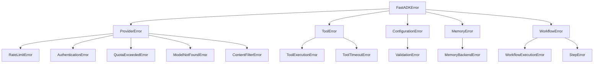

# Error Handling in FastADK

Effective error handling is crucial for building robust and reliable AI agents. This document explains the error handling mechanisms in FastADK, including exception types, retry strategies, and best practices.

## Exception Hierarchy

FastADK provides a structured exception hierarchy to make error handling more predictable and manageable:



### Base Exceptions

```python
from fastadk.core.exceptions import FastADKError, ProviderError, ToolError, ConfigurationError, MemoryError, WorkflowError

# Base exception for all FastADK errors
class FastADKError(Exception):
    """Base class for all FastADK exceptions."""
    pass

# Error related to LLM providers
class ProviderError(FastADKError):
    """Error occurred in a model provider."""
    pass

# Error related to tool execution
class ToolError(FastADKError):
    """Error occurred during tool execution."""
    pass

# Error related to configuration
class ConfigurationError(FastADKError):
    """Error in configuration or settings."""
    pass

# Error related to memory operations
class MemoryError(FastADKError):
    """Error in memory operations."""
    pass

# Error related to workflow execution
class WorkflowError(FastADKError):
    """Error occurred during workflow execution."""
    pass
```

### Provider-Specific Exceptions

```python
# Rate limit exceeded
class RateLimitError(ProviderError):
    """Provider rate limit exceeded."""
    pass

# Authentication failed
class AuthenticationError(ProviderError):
    """Provider authentication failed."""
    pass

# Quota or token limit exceeded
class QuotaExceededError(ProviderError):
    """Provider quota or token limit exceeded."""
    pass

# Model not found
class ModelNotFoundError(ProviderError):
    """Requested model not found or unavailable."""
    pass

# Content filtered by provider
class ContentFilterError(ProviderError):
    """Content was filtered by the provider's safety system."""
    pass
```

## Error Handling in Tools

Tools should use appropriate exceptions to indicate failures:

```python
from fastadk import Agent, BaseAgent, tool
from fastadk.core.exceptions import ToolError

@Agent(model="gemini-1.5-pro")
class WeatherAgent(BaseAgent):
    @tool
    def get_weather(self, city: str) -> dict:
        """Get the current weather for a city."""
        try:
            # Weather API call might fail
            if not city:
                raise ValueError("City name cannot be empty")
                
            # Implementation...
            weather_data = self._call_weather_api(city)
            
            if not weather_data:
                raise ToolError(f"No weather data found for city: {city}")
                
            return weather_data
        except ConnectionError as e:
            # Network error - could be temporary
            raise ToolError(f"Failed to connect to weather service: {str(e)}") from e
        except ValueError as e:
            # Invalid input
            raise ToolError(f"Invalid input: {str(e)}") from e
        except Exception as e:
            # Unexpected error
            raise ToolError(f"An unexpected error occurred: {str(e)}") from e
```

## Retry Mechanism

FastADK includes a configurable retry system for handling transient failures:

```python
from fastadk.core.retry import retry, RetryConfig
from fastadk.core.exceptions import ToolError

# Configure retry behavior
@retry(
    max_attempts=3,
    retry_on=[ConnectionError, TimeoutError],
    base_delay=1.0,
    max_delay=10.0,
    backoff_factor=2.0
)
async def fetch_data_with_retry(url: str) -> dict:
    """Fetch data with automatic retry on failure."""
    # Implementation that might fail
    
# Using retry with a tool
@tool
@retry(max_attempts=3)
def call_external_api(endpoint: str, params: dict) -> dict:
    """Call an external API with retry support."""
    # Implementation that might fail
    
# Manual retry control
async def process_with_manual_retry(data: dict) -> dict:
    """Process data with manual retry control."""
    retry_config = RetryConfig(
        max_attempts=5,
        retry_on=[ConnectionError, ToolError],
        on_retry=lambda attempt, error: print(f"Retry {attempt} after error: {error}")
    )
    
    async def _operation():
        # The operation that might fail
        
    result = await retry_config.execute(_operation)
    return result
```

## Graceful Degradation

Implement fallback mechanisms for graceful degradation:

```python
@tool
async def get_stock_price(symbol: str) -> float:
    """Get the current stock price for a symbol."""
    try:
        # Primary data source
        price = await self._fetch_from_primary_api(symbol)
        return price
    except Exception as primary_error:
        try:
            # Fallback to secondary data source
            self.logger.warning(f"Primary API failed, using fallback: {primary_error}")
            price = await self._fetch_from_secondary_api(symbol)
            return price
        except Exception as secondary_error:
            # Both sources failed
            self.logger.error(f"All stock APIs failed: {secondary_error}")
            raise ToolError(f"Could not retrieve stock price for {symbol}") from secondary_error
```

## Error Handling in Agents

Implement error handling in agent lifecycle methods:

```python
from fastadk import Agent, BaseAgent
from fastadk.core.exceptions import FastADKError, ProviderError

@Agent(model="gemini-1.5-pro")
class RobustAgent(BaseAgent):
    async def on_error(self, error: Exception, context: dict = None) -> str:
        """Handle errors during agent execution."""
        # Log the error
        self.logger.error(f"Agent error: {str(error)}", exc_info=True)
        
        # Handle different error types
        if isinstance(error, ProviderError):
            return "I'm having trouble connecting to my language model. Please try again in a moment."
        elif isinstance(error, ToolError):
            return "I encountered an error while trying to perform that action. Can you provide more details or try a different approach?"
        else:
            return "I'm sorry, but I encountered an unexpected error. Please try again or contact support if the issue persists."
    
    async def run(self, prompt: str) -> str:
        """Override run to add custom error handling."""
        try:
            return await super().run(prompt)
        except FastADKError as e:
            # Handle framework errors
            return await self.on_error(e)
        except Exception as e:
            # Handle unexpected errors
            self.logger.critical(f"Unhandled exception: {str(e)}", exc_info=True)
            return "I encountered a critical error and couldn't complete your request."
```

## Workflow Error Handling

Handle errors in workflows to ensure robustness:

```python
from fastadk.core.workflow import Workflow, step
from fastadk.core.exceptions import WorkflowError, StepError

@step(name="Risky Step")
async def risky_step(data: dict) -> dict:
    """A step that might fail."""
    # Implementation that might fail
    
@step(name="Error Handler")
async def error_handler(error: Exception, input_data: dict) -> dict:
    """Handle errors from the workflow."""
    import logging
    logging.error(f"Workflow error: {str(error)}")
    
    # Return a fallback result
    return {"status": "error", "message": str(error), "fallback_data": {...}}

# Create a workflow with error handling
workflow = Workflow.sequence(
    risky_step,
    name="Robust Workflow",
    error_handler=error_handler
)

# Execute with error handling
try:
    result = await workflow.execute(input_data)
except WorkflowError as e:
    # This will only be raised if the error handler itself fails
    print(f"Workflow failed: {str(e)}")
```

## Logging and Observability

Integrate error handling with logging and observability:

```python
from fastadk.observability import get_logger
from fastadk.observability.metrics import counter

logger = get_logger(__name__)
error_counter = counter("agent_errors_total", "Total number of agent errors")

@tool
async def perform_operation(data: dict) -> dict:
    """Perform an operation with comprehensive error handling."""
    try:
        # Operation implementation
        return result
    except Exception as e:
        # Log the error
        logger.error(
            "Operation failed",
            extra={
                "error_type": type(e).__name__,
                "error_message": str(e),
                "input_data": data,
            },
            exc_info=True
        )
        
        # Increment error metric
        error_counter.inc(labels={"error_type": type(e).__name__})
        
        # Re-raise as ToolError
        raise ToolError(f"Operation failed: {str(e)}") from e
```

## Best Practices

### 1. Use Specific Exceptions

Use the most specific exception type that applies:

```python
# Good: Specific exception
if not api_key:
    raise ConfigurationError("API key is required")

# Bad: Generic exception
if not api_key:
    raise Exception("Missing API key")
```

### 2. Include Context in Error Messages

Provide useful context in error messages:

```python
# Good: Contextual error message
raise ToolError(f"Failed to process order #{order_id}: Invalid payment method '{payment_method}'")

# Bad: Vague error message
raise ToolError("Processing failed")
```

### 3. Preserve Error Chains

Use `from` to preserve the original exception in the chain:

```python
try:
    # Operation that might fail
except ValueError as e:
    # Good: Preserves original exception
    raise ToolError("Invalid input value") from e
    
    # Bad: Loses original exception
    # raise ToolError("Invalid input value")
```

### 4. Handle Different Error Types Differently

Implement specific handling for different error types:

```python
try:
    result = await api_call()
except ConnectionError:
    # Network error - retry
    return await retry_with_backoff(api_call)
except AuthenticationError:
    # Auth error - refresh credentials
    await refresh_credentials()
    return await api_call()
except RateLimitError:
    # Rate limit - wait
    await asyncio.sleep(30)
    return await api_call()
except Exception as e:
    # Unknown error - log and propagate
    logger.error(f"Unexpected error: {str(e)}")
    raise
```

### 5. Don't Catch Too Broadly

Avoid catching exceptions too broadly:

```python
# Good: Catch specific exceptions
try:
    data = await fetch_data()
except ConnectionError:
    # Handle connection issues
except ValueError:
    # Handle value errors

# Bad: Catch everything
try:
    data = await fetch_data()
except Exception:
    # Too broad
```

### 6. Use Finally for Cleanup

Use `finally` for cleanup operations:

```python
resource = None
try:
    resource = acquire_resource()
    # Use resource
finally:
    # Clean up regardless of success or failure
    if resource:
        release_resource(resource)
```

## Conclusion

Effective error handling is essential for building robust and reliable AI agents. FastADK provides a comprehensive error handling system with structured exceptions, retry mechanisms, and observability integration. By following the best practices outlined in this document, you can create agents that gracefully handle errors and provide a consistent user experience even when things go wrong.
