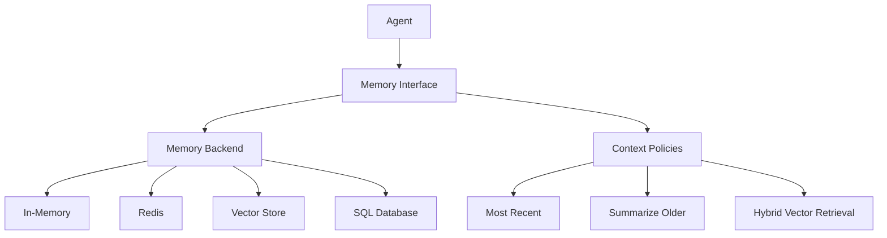

# Memory in FastADK

Memory is a crucial component of LLM agents, enabling them to maintain context across multiple interactions and retrieve relevant information from past conversations. This document explains how memory works in FastADK, the different types of memory backends available, and best practices for implementing memory in your agents.

## Memory Concepts

Memory in FastADK serves several important purposes:

1. **Conversation History**: Storing the back-and-forth between the user and agent
2. **Context Retention**: Maintaining information across multiple turns
3. **Knowledge Storage**: Storing factual information for later retrieval
4. **User Preferences**: Remembering user-specific settings and preferences
5. **Task State**: Tracking the state of ongoing tasks

## Memory Architecture



### Memory Interface

The core memory interface in FastADK is the `MemoryBackend` abstract class, which defines methods for storing and retrieving data:

```python
class MemoryBackend:
    """Abstract base class for memory backends."""
    
    async def get(self, key: str) -> Any:
        """Get a value from memory."""
        raise NotImplementedError
    
    async def set(self, key: str, value: Any) -> None:
        """Set a value in memory."""
        raise NotImplementedError
    
    async def delete(self, key: str) -> None:
        """Delete a value from memory."""
        raise NotImplementedError
    
    async def exists(self, key: str) -> bool:
        """Check if a key exists in memory."""
        raise NotImplementedError
    
    async def list_keys(self, pattern: str = "*") -> List[str]:
        """List all keys matching a pattern."""
        raise NotImplementedError
```

## Memory Backends

FastADK offers several memory backend implementations:

### InMemoryBackend

A simple in-memory backend suitable for development, testing, and simple applications:

```python
from fastadk.memory import InMemoryBackend

memory = InMemoryBackend()
await memory.set("user_name", "Alice")
name = await memory.get("user_name")  # Returns "Alice"
```

### RedisBackend

A Redis-based backend suitable for production and distributed systems:

```python
from fastadk.memory import RedisBackend

memory = RedisBackend(
    connection_string="redis://localhost:6379/0",
    namespace="my-agent",
    ttl_seconds=3600  # 1 hour expiration
)
await memory.set("user_preferences", {"theme": "dark", "language": "en"})
prefs = await memory.get("user_preferences")
```

### VectorMemoryBackend

A vector database backend for semantic search and retrieval:

```python
from fastadk.memory import VectorMemoryBackend

memory = VectorMemoryBackend(
    embedding_model="text-embedding-3-small",
    embedding_provider="openai",
    dimension=512,
    similarity_threshold=0.7
)

# Store text with embeddings
await memory.store_embedding(
    text="FastADK is a Python framework for building AI agents",
    metadata={"source": "documentation", "topic": "overview"}
)

# Search for semantically similar content
results = await memory.search_embeddings("Python frameworks for AI agents", limit=5)
```

### SQLBackend

A SQL-based backend for structured data storage:

```python
from fastadk.memory import SQLBackend

memory = SQLBackend(
    connection_string="sqlite:///agent_memory.db",
    table_name="memory",
    namespace="my-agent"
)
```

## Context Policies

Context policies in FastADK control how conversation history is managed and presented to the LLM. They address the challenge of limited context windows in language models.

### MostRecentPolicy

Keeps only the most recent N messages:

```python
from fastadk.core.context_policy import MostRecentPolicy

policy = MostRecentPolicy(max_messages=10)
```

### SummarizeOlderPolicy

Summarizes older messages when the context gets too large:

```python
from fastadk.core.context_policy import SummarizeOlderPolicy

policy = SummarizeOlderPolicy(
    threshold_tokens=3000,
    summarizer=model_provider,  # Uses the agent's model to create summaries
    keep_recent=5  # Always keep the 5 most recent messages without summarizing
)
```

### HybridVectorRetrievalPolicy

Combines recency with semantic relevance:

```python
from fastadk.core.context_policy import HybridVectorRetrievalPolicy

policy = HybridVectorRetrievalPolicy(
    embedding_model="text-embedding-3-small",
    embedding_provider="openai",
    recent_k=5,  # Keep 5 most recent messages
    vector_k=10,  # Retrieve 10 most relevant messages
    max_tokens=4000  # Total token budget
)
```

## Implementing Memory in Agents

### Basic Memory Usage

```python
from fastadk import Agent, BaseAgent
from fastadk.memory import InMemoryBackend

@Agent(model="gemini-1.5-pro")
class AssistantWithMemory(BaseAgent):
    def __init__(self):
        super().__init__()
        self.memory = InMemoryBackend()
    
    @tool
    async def remember_name(self, name: str) -> str:
        """Remember the user's name."""
        await self.memory.set("user_name", name)
        return f"I'll remember that your name is {name}."
    
    @tool
    async def recall_name(self) -> str:
        """Recall the user's name if previously stored."""
        name = await self.memory.get("user_name")
        if name:
            return f"Your name is {name}."
        else:
            return "I don't know your name yet."
```

### Persistent Memory

For agents that need to retain information across sessions:

```python
from fastadk import Agent, BaseAgent
from fastadk.memory import RedisBackend

@Agent(model="gemini-1.5-pro")
class PersistentAssistant(BaseAgent):
    def __init__(self, user_id: str):
        super().__init__()
        self.user_id = user_id
        self.memory = RedisBackend(
            connection_string="redis://localhost:6379/0",
            namespace=f"user:{user_id}",
            ttl_seconds=604800  # 1 week
        )
    
    async def on_start(self):
        """Called when agent starts processing a request."""
        # Load user preferences and history
        self.preferences = await self.memory.get("preferences") or {}
        history_count = await self.memory.get("interaction_count") or 0
        
        if history_count > 0:
            # Personalize greeting based on history
            return f"Welcome back! This is your {history_count + 1}th interaction."
    
    async def on_finish(self):
        """Called when agent finishes processing a request."""
        # Update interaction counter
        count = await self.memory.get("interaction_count") or 0
        await self.memory.set("interaction_count", count + 1)
        
        # Store last interaction time
        from datetime import datetime
        await self.memory.set("last_interaction", datetime.now().isoformat())
```

### Conversation History with Context Policies

```python
from fastadk import Agent, BaseAgent
from fastadk.memory import InMemoryBackend
from fastadk.core.context_policy import SummarizeOlderPolicy

@Agent(model="gemini-1.5-pro")
class ContextAwareAgent(BaseAgent):
    def __init__(self):
        super().__init__()
        self.memory = InMemoryBackend()
        
        # Set up context policy
        self.context_policy = SummarizeOlderPolicy(
            threshold_tokens=3000,
            summarizer=self.model,
            keep_recent=5
        )
    
    async def _prepare_context(self, prompt: str) -> str:
        """Override context preparation to apply context policy."""
        # Get conversation history
        history = await self.memory.get("conversation") or []
        
        # Add current prompt to history
        history.append({"role": "user", "content": prompt})
        
        # Apply context policy
        optimized_history = await self.context_policy.apply(history)
        
        # Store updated history
        await self.memory.set("conversation", optimized_history)
        
        # Return formatted context for the model
        return self._format_context(optimized_history)
```

### Semantic Memory with Vector Storage

```python
from fastadk import Agent, BaseAgent, tool
from fastadk.memory import VectorMemoryBackend
from typing import List, Dict

@Agent(model="gemini-1.5-pro")
class KnowledgeBaseAgent(BaseAgent):
    def __init__(self):
        super().__init__()
        self.memory = VectorMemoryBackend(
            embedding_model="text-embedding-3-small",
            embedding_provider="openai",
            similarity_threshold=0.7
        )
    
    @tool
    async def add_to_knowledge(self, text: str, source: str = None) -> str:
        """Add information to the knowledge base."""
        doc_id = await self.memory.store_embedding(
            text=text,
            metadata={"source": source, "timestamp": datetime.now().isoformat()}
        )
        return f"Added to knowledge base with ID: {doc_id}"
    
    @tool
    async def search_knowledge(self, query: str, limit: int = 5) -> List[Dict]:
        """Search the knowledge base for relevant information."""
        results = await self.memory.search_embeddings(query, limit=limit)
        return [
            {
                "text": item["text"],
                "relevance": item["score"],
                "source": item["metadata"].get("source", "unknown"),
                "timestamp": item["metadata"].get("timestamp")
            }
            for item in results
        ]
    
    async def run(self, prompt: str) -> str:
        """Override run to include relevant knowledge."""
        # Find relevant knowledge
        knowledge = await self.search_knowledge(prompt)
        
        # Prepare context with knowledge
        context = "Relevant information from my knowledge base:\n\n"
        for item in knowledge:
            context += f"- {item['text']}\n"
        context += f"\nUser question: {prompt}"
        
        # Generate response with context
        response = await self.model.generate(context)
        return response
```

## Advanced Memory Patterns

### Hierarchical Memory

A combination of different memory types for different purposes:

```python
from fastadk import Agent, BaseAgent
from fastadk.memory import InMemoryBackend, RedisBackend, VectorMemoryBackend

@Agent(model="gemini-1.5-pro")
class HierarchicalMemoryAgent(BaseAgent):
    def __init__(self, user_id: str):
        super().__init__()
        
        # Short-term memory (conversation)
        self.short_term = InMemoryBackend()
        
        # Medium-term memory (user preferences, session state)
        self.medium_term = RedisBackend(
            connection_string="redis://localhost:6379/0",
            namespace=f"user:{user_id}:session",
            ttl_seconds=3600  # 1 hour
        )
        
        # Long-term memory (knowledge, historical data)
        self.long_term = VectorMemoryBackend(
            embedding_model="text-embedding-3-small",
            embedding_provider="openai"
        )
```

### Memory with Summarization

Periodically summarize conversation to save context space:

```python
from fastadk import Agent, BaseAgent
from fastadk.memory import InMemoryBackend

@Agent(model="gemini-1.5-pro")
class SummarizingAgent(BaseAgent):
    def __init__(self):
        super().__init__()
        self.memory = InMemoryBackend()
        self.max_messages = 10
    
    async def _update_conversation(self, role: str, content: str):
        """Add message to conversation and summarize if needed."""
        conversation = await self.memory.get("conversation") or []
        conversation.append({"role": role, "content": content})
        
        # If conversation is too long, summarize
        if len(conversation) > self.max_messages:
            # Extract old messages to summarize
            to_summarize = conversation[:-self.max_messages]
            recent = conversation[-self.max_messages:]
            
            # Create summary
            summary_text = "\n".join([f"{m['role']}: {m['content']}" for m in to_summarize])
            summary_prompt = f"Summarize this conversation:\n{summary_text}"
            summary = await self.model.generate(summary_prompt)
            
            # Replace old messages with summary
            conversation = [{"role": "system", "content": f"Previous conversation summary: {summary}"}] + recent
        
        # Store updated conversation
        await self.memory.set("conversation", conversation)
```

## Best Practices

### Memory Segmentation

Divide memory into logical segments based on purpose:

```python
# User profile information
await memory.set("profile:name", "Alice")
await memory.set("profile:preferences", {"theme": "dark"})

# Conversation state
await memory.set("conversation:current_topic", "travel plans")
await memory.set("conversation:messages", [...])

# Task-specific data
await memory.set("task:booking:destination", "Paris")
await memory.set("task:booking:dates", ["2025-08-01", "2025-08-07"])
```

### TTL Management

Set appropriate Time-To-Live (TTL) values for different types of data:

```python
# Short-lived session data (1 hour)
await memory.set("session:id", "abc123", ttl_seconds=3600)

# Medium-term preferences (1 week)
await memory.set("preferences", {...}, ttl_seconds=604800)

# Long-term knowledge (permanent)
await memory.set("knowledge:facts", [...], ttl_seconds=None)
```

### Secure Storage

Be careful about storing sensitive information:

```python
# Store a reference or token, not the actual sensitive data
await memory.set("user:payment", {"token": "payment_token_123", "last4": "4242"})

# Or use encryption for sensitive data
from cryptography.fernet import Fernet
key = Fernet.generate_key()
cipher = Fernet(key)
encrypted = cipher.encrypt(sensitive_data.encode())
await memory.set("encrypted:data", encrypted)
```

### Performance Optimization

Consider caching frequently accessed data:

```python
async def get_user_profile(user_id: str) -> Dict:
    """Get user profile with caching."""
    cache_key = f"cache:user_profile:{user_id}"
    
    # Try to get from cache first
    profile = await self.memory.get(cache_key)
    if profile:
        return profile
    
    # If not in cache, fetch from database
    profile = await database.get_user(user_id)
    
    # Store in cache with expiration
    await self.memory.set(cache_key, profile, ttl_seconds=300)  # 5 minutes
    
    return profile
```

## Conclusion

Memory is a fundamental component of effective AI agents, enabling them to maintain context, learn from past interactions, and provide personalized experiences. FastADK provides a flexible memory system with multiple backends and context policies to address a wide range of agent requirements.

By choosing the right memory backend and implementing appropriate context policies, you can build agents that maintain coherent conversations, retrieve relevant information, and deliver increasingly personalized experiences over time.
