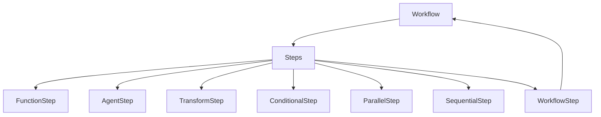

# Workflows in FastADK

Workflows in FastADK provide a powerful system for orchestrating complex processes involving multiple agents, tools, and processing steps. This document explains the workflow system's architecture, components, and patterns for implementing effective workflows.

## Introduction to Workflows

A workflow is a sequence of steps that process data and perform actions to achieve a complex goal. In the context of FastADK, workflows enable you to:

1. Coordinate multiple agents for complex tasks
2. Process data through a series of transformations
3. Handle branching logic and conditional execution
4. Run steps in parallel for improved performance
5. Manage errors and retries at each step

## Workflow Architecture



### Core Components

#### Workflow

The `Workflow` class is the main container that manages the execution of steps:

```python
from fastadk.core.workflow import Workflow

# Create a sequential workflow
workflow = Workflow.sequence(step1, step2, step3, name="My Workflow")

# Create a parallel workflow
workflow = Workflow.parallel(step1, step2, step3, name="Parallel Processing")

# Execute a workflow
result = await workflow.execute(input_data)
```

#### Step

A `Step` is a unit of work in a workflow. FastADK provides several built-in step types:

```python
from fastadk.core.workflow import step, transform, conditional

# Function step
@step(name="Data Loader")
async def load_data(source: str) -> dict:
    """Load data from a source."""
    # Implementation...
    return {"source": source, "data": [1, 2, 3]}

# Transform step (synchronous)
@transform(name="Formatter")
def format_result(data: dict) -> str:
    """Format the results for presentation."""
    return f"Data from {data['source']}: {data['processed']}"

# Conditional step
@conditional(name="Validator")
def should_process(data: dict) -> bool:
    """Determine if data should be processed."""
    return len(data.get("data", [])) > 0
```

## Creating Workflows

### Sequential Workflows

Sequential workflows execute steps one after another, passing the output of each step to the next:

```python
from fastadk.core.workflow import Workflow, step

@step(name="Fetch Data")
async def fetch_data(query: str) -> dict:
    """Fetch data based on a query."""
    # Implementation...
    return {"query": query, "results": [...]}

@step(name="Process Data")
async def process_data(data: dict) -> dict:
    """Process the fetched data."""
    results = data["results"]
    processed = [item * 2 for item in results]
    return {"query": data["query"], "processed": processed}

@step(name="Format Results")
async def format_results(data: dict) -> str:
    """Format the processed data for presentation."""
    return f"Results for '{data['query']}': {data['processed']}"

# Create a sequential workflow
data_workflow = Workflow.sequence(
    fetch_data,
    process_data,
    format_results,
    name="Data Processing Pipeline"
)

# Execute the workflow
result = await data_workflow.execute("example query")
```

### Parallel Workflows

Parallel workflows execute multiple steps concurrently:

```python
from fastadk.core.workflow import Workflow, step

@step(name="Fetch Weather")
async def fetch_weather(city: str) -> dict:
    """Fetch weather data for a city."""
    # Implementation...
    return {"city": city, "weather": "sunny", "temp": 22}

@step(name="Fetch News")
async def fetch_news(city: str) -> dict:
    """Fetch news for a city."""
    # Implementation...
    return {"city": city, "headlines": ["Local event", "Sports update"]}

@step(name="Fetch Attractions")
async def fetch_attractions(city: str) -> dict:
    """Fetch tourist attractions for a city."""
    # Implementation...
    return {"city": city, "attractions": ["Museum", "Park", "Monument"]}

@step(name="Combine Results")
async def combine_results(results: list) -> dict:
    """Combine results from parallel steps."""
    weather, news, attractions = results
    return {
        "city": weather["city"],
        "weather": weather["weather"],
        "temp": weather["temp"],
        "headlines": news["headlines"],
        "attractions": attractions["attractions"]
    }

# Create a workflow with parallel steps
city_info_workflow = Workflow.sequence(
    Workflow.parallel(
        fetch_weather,
        fetch_news,
        fetch_attractions
    ),
    combine_results,
    name="City Information Workflow"
)

# Execute the workflow
result = await city_info_workflow.execute("London")
```

### Conditional Workflows

Conditional workflows execute different steps based on conditions:

```python
from fastadk.core.workflow import Workflow, step, conditional

@step(name="Analyze Request")
async def analyze_request(request: str) -> dict:
    """Analyze a user request to determine the type."""
    if "weather" in request.lower():
        type = "weather"
    elif "news" in request.lower():
        type = "news"
    else:
        type = "unknown"
    return {"request": request, "type": type}

@step(name="Get Weather")
async def get_weather(data: dict) -> dict:
    """Get weather information."""
    # Extract location from request
    # Implementation...
    return {"response": f"The weather is sunny in Paris."}

@step(name="Get News")
async def get_news(data: dict) -> dict:
    """Get news information."""
    # Implementation...
    return {"response": f"Latest headlines: New policy announced."}

@step(name="Default Response")
async def default_response(data: dict) -> dict:
    """Provide a default response."""
    return {"response": f"I'm not sure how to help with '{data['request']}'."}

@conditional(name="Is Weather Request")
def is_weather_request(data: dict) -> bool:
    """Check if this is a weather request."""
    return data["type"] == "weather"

@conditional(name="Is News Request")
def is_news_request(data: dict) -> bool:
    """Check if this is a news request."""
    return data["type"] == "news"

# Create a conditional workflow
request_workflow = Workflow.sequence(
    analyze_request,
    Workflow.conditional(
        is_weather_request,
        get_weather,
        Workflow.conditional(
            is_news_request,
            get_news,
            default_response
        )
    ),
    name="Request Handler Workflow"
)

# Execute the workflow
result = await request_workflow.execute("What's the weather in Paris?")
```

## Advanced Workflow Patterns

### Multi-Agent Workflows

Workflows can coordinate multiple agents for complex tasks:

```python
from fastadk.core.workflow import Workflow, step
from fastadk import Agent, BaseAgent

@Agent(model="gemini-1.5-pro", description="Researcher")
class ResearchAgent(BaseAgent):
    # Agent implementation...
    pass

@Agent(model="gemini-1.5-pro", description="Analyst")
class AnalysisAgent(BaseAgent):
    # Agent implementation...
    pass

@Agent(model="gemini-1.5-pro", description="Writer")
class WriterAgent(BaseAgent):
    # Agent implementation...
    pass

@step(name="Research Topic")
async def research_topic(topic: str) -> dict:
    """Research a topic to gather information."""
    agent = ResearchAgent()
    research = await agent.run(f"Research the following topic: {topic}")
    return {"topic": topic, "research": research}

@step(name="Analyze Research")
async def analyze_research(data: dict) -> dict:
    """Analyze the research to identify key insights."""
    agent = AnalysisAgent()
    analysis = await agent.run(
        f"Analyze this research on {data['topic']}:\n\n{data['research']}"
    )
    return {"topic": data["topic"], "research": data["research"], "analysis": analysis}

@step(name="Write Report")
async def write_report(data: dict) -> str:
    """Write a comprehensive report based on research and analysis."""
    agent = WriterAgent()
    report = await agent.run(
        f"Write a report on {data['topic']} based on this research and analysis:\n\n"
        f"Research:\n{data['research']}\n\n"
        f"Analysis:\n{data['analysis']}"
    )
    return report

# Create a multi-agent workflow
report_workflow = Workflow.sequence(
    research_topic,
    analyze_research,
    write_report,
    name="Report Generation Workflow"
)

# Execute the workflow
report = await report_workflow.execute("Impact of artificial intelligence on healthcare")
```

### Error Handling in Workflows

Implement error handling for robust workflows:

```python
from fastadk.core.workflow import Workflow, step
from fastadk.core.exceptions import WorkflowError

@step(name="Risky Operation")
async def risky_operation(data: dict) -> dict:
    """Perform an operation that might fail."""
    try:
        # Implementation that might fail
        if data.get("trigger_error", False):
            raise ValueError("Simulated error")
        return {"status": "success", "result": "Operation completed"}
    except Exception as e:
        # Log the error
        import logging
        logging.error(f"Operation failed: {str(e)}")
        # Return error information
        return {"status": "error", "error": str(e)}

@step(name="Error Handler")
async def handle_error(data: dict) -> dict:
    """Handle errors from previous steps."""
    if data.get("status") == "error":
        # Implement recovery logic
        return {"status": "recovered", "result": "Used fallback method"}
    return data

# Create a workflow with error handling
robust_workflow = Workflow.sequence(
    risky_operation,
    handle_error,
    name="Error-Handling Workflow"
)

# Execute the workflow
try:
    result = await robust_workflow.execute({"trigger_error": True})
    print(f"Workflow completed with result: {result}")
except WorkflowError as e:
    print(f"Workflow failed: {str(e)}")
```

### Data Transformation Workflows

Create workflows focused on data transformation:

```python
from fastadk.core.workflow import Workflow, step, transform
from typing import List, Dict

@step(name="Extract Data")
async def extract_data(source: str) -> List[Dict]:
    """Extract raw data from a source."""
    # Implementation...
    return [
        {"id": 1, "raw_value": 100},
        {"id": 2, "raw_value": 200},
        {"id": 3, "raw_value": 300}
    ]

@transform(name="Clean Data")
def clean_data(items: List[Dict]) -> List[Dict]:
    """Clean and validate the data."""
    return [
        {**item, "cleaned": True}
        for item in items
        if item.get("raw_value", 0) > 0
    ]

@transform(name="Transform Data")
def transform_data(items: List[Dict]) -> List[Dict]:
    """Apply transformations to the data."""
    return [
        {**item, "transformed_value": item["raw_value"] * 1.5}
        for item in items
    ]

@transform(name="Aggregate Data")
def aggregate_data(items: List[Dict]) -> Dict:
    """Aggregate the transformed data."""
    total = sum(item["transformed_value"] for item in items)
    count = len(items)
    return {
        "total": total,
        "count": count,
        "average": total / count if count > 0 else 0,
        "items": items
    }

# Create a data transformation workflow
etl_workflow = Workflow.sequence(
    extract_data,
    clean_data,
    transform_data,
    aggregate_data,
    name="ETL Workflow"
)

# Execute the workflow
result = await etl_workflow.execute("data_source")
```

## Workflow Composition and Reuse

Workflows can be composed and reused as components in larger workflows:

```python
from fastadk.core.workflow import Workflow, step, WorkflowStep

# Define reusable workflows
data_processing_workflow = Workflow.sequence(
    fetch_data,
    process_data,
    name="Data Processing"
)

reporting_workflow = Workflow.sequence(
    generate_charts,
    compile_report,
    name="Reporting"
)

# Create a step that uses an existing workflow
@step(name="Process Data Workflow")
async def run_data_processing(input_data: dict) -> dict:
    """Run the data processing workflow."""
    return await data_processing_workflow.execute(input_data)

# Alternatively, use WorkflowStep directly
process_data_step = WorkflowStep(
    workflow=data_processing_workflow,
    name="Process Data Workflow"
)

# Compose into a larger workflow
master_workflow = Workflow.sequence(
    input_validation,
    process_data_step,  # Using the workflow as a step
    WorkflowStep(workflow=reporting_workflow, name="Generate Report"),
    send_notification,
    name="End-to-End Process"
)

# Execute the composed workflow
result = await master_workflow.execute(input_data)
```

## Best Practices

### 1. Design for Modularity

Create small, focused steps that do one thing well. This makes workflows easier to understand, test, and maintain.

```python
# Good: Focused steps
@step(name="Validate Input")
async def validate_input(data: dict) -> dict:
    """Validate input data structure."""
    # Validation logic...

@step(name="Process Data")
async def process_data(data: dict) -> dict:
    """Process the validated data."""
    # Processing logic...

# Bad: Monolithic step
@step(name="Validate and Process")
async def validate_and_process(data: dict) -> dict:
    """Validate and process data."""
    # Validation and processing combined...
```

### 2. Handle Errors Gracefully

Each step should handle its own errors or pass them up with clear context:

```python
@step(name="Process Transaction")
async def process_transaction(transaction: dict) -> dict:
    """Process a financial transaction."""
    try:
        # Processing logic...
        return {"status": "success", "transaction_id": "123"}
    except ConnectionError:
        # Handle specific error
        return {"status": "error", "reason": "connection_failed", "retry": True}
    except ValueError as e:
        # Handle validation error
        return {"status": "error", "reason": "validation_failed", "message": str(e)}
    except Exception as e:
        # Log unexpected errors
        import logging
        logging.error(f"Unexpected error: {str(e)}")
        return {"status": "error", "reason": "unknown", "message": str(e)}
```

### 3. Use Type Hints

Add type hints to make workflows self-documenting and enable validation:

```python
from typing import Dict, List, Union, Optional

@step(name="Fetch User Data")
async def fetch_user_data(user_id: str) -> Dict[str, Union[str, List[str], Dict]]:
    """Fetch comprehensive user data."""
    # Implementation...
    return {
        "user_id": user_id,
        "name": "Alice Smith",
        "email": "alice@example.com",
        "preferences": {"theme": "dark", "notifications": True},
        "groups": ["admin", "editor"]
    }
```

### 4. Design for Observability

Include logging and monitoring in your workflows:

```python
from fastadk.core.workflow import step
import logging
from time import time

@step(name="Data Processing")
async def process_data(data: dict) -> dict:
    """Process data with observability."""
    start_time = time()
    logging.info(f"Starting data processing for {data.get('id', 'unknown')}")
    
    try:
        # Processing logic...
        result = {"processed": True, "data": [...]}
        
        # Record metrics
        processing_time = time() - start_time
        logging.info(f"Data processing completed in {processing_time:.2f}s")
        
        return result
    except Exception as e:
        logging.error(f"Data processing failed: {str(e)}", exc_info=True)
        raise
```

### 5. Optimize for Performance

Consider using parallel execution for independent tasks:

```python
# Sequential execution (slower)
sequential_workflow = Workflow.sequence(
    fetch_user_data,
    fetch_orders,
    fetch_recommendations,
    name="User Dashboard Sequential"
)

# Parallel execution (faster)
parallel_workflow = Workflow.sequence(
    Workflow.parallel(
        fetch_user_data,
        fetch_orders,
        fetch_recommendations
    ),
    combine_data,
    name="User Dashboard Parallel"
)
```

## Conclusion

Workflows in FastADK provide a powerful system for orchestrating complex processes involving multiple steps, agents, and data transformations. By understanding the workflow architecture and applying best practices, you can build robust, maintainable, and efficient solutions for complex problems.

Whether you're building data processing pipelines, multi-agent systems, or complex business processes, the workflow system offers the flexibility and power to implement your solution effectively.
