# FastADK System Overview

FastADK is a comprehensive framework that dramatically simplifies and accelerates the development of AI agents. This document provides a detailed explanation of the system's architecture, components, workflows, and benefits in version 0.2.0.

## What is FastADK?

FastADK (Fast Agent Development Kit) is a developer-friendly Python framework that provides high-level abstractions, declarative APIs, and intuitive tooling to make AI agent development more efficient, maintainable, and enjoyable.

The framework creates a layer of ergonomic abstractions over various LLM providers (OpenAI, Anthropic, Google Gemini), enabling developers to design, test, and deploy tool-using LLM agents with minimal boilerplate code.

FastADK is designed as an **open-source** project with the potential for optional commercial add-ons in the future. It targets Python 3.10+ and leverages familiar libraries in the Python ecosystem, including FastAPI for web serving, Pydantic for data validation, and specialized modules for memory management and observability.

## Key Features in Version 0.2.0

The 0.2.0 release introduces significant improvements across all aspects of the framework:

### Token and Cost Tracking

- **TokenUsage Tracking**: Automatic tracking of prompt, completion, and total tokens
- **Cost Calculation**: Integrated cost estimation based on provider pricing
- **Budget Management**: Configurable per-session and per-query token budgets
- **Usage Metrics**: Prometheus metrics for token usage and cost monitoring

### Advanced Memory Management

- **Context Policies**: Sliding window, summarization, and hybrid vector retrieval
- **Vector Store Integration**: FAISS, Pinecone, and other vector databases
- **Persistent Backends**: Redis and SQL database integration
- **Summarization Service**: LLM-powered conversation summarization

### Scalability and Performance

- **True Async**: Non-blocking async execution for models and tools
- **Parallel Workflows**: Run sub-tasks concurrently with easy orchestration
- **Caching**: In-memory and Redis caching for responses and tools
- **Lazy Tool Execution**: Skip unnecessary tool calls when possible
- **Batch Processing**: Utilities for handling bulk operations

### Extensibility and Integration

- **Plugin Architecture**: Discover and load custom modules dynamically
- **Adapter Interfaces**: Discord and Slack integration adapters
- **Multi-Agent Orchestration**: Coordinate multiple specialized agents
- **Fine-Tuning Helpers**: Utilities for model customization

### Developer Experience

- **Interactive REPL**: Command-line REPL for agent development and testing
- **Debugging Tools**: Verbose logging and chain-of-thought capture
- **Test Framework**: Mock LLMs and tools for deterministic testing
- **Project Scaffolding**: `fastadk init` command for quick setup
- **IDE Support**: VSCode snippets and type hints

### Observability

- **Structured Logging**: JSON logs for all agent events
- **OpenTelemetry**: Traces and spans for performance monitoring
- **Prometheus Metrics**: Endpoint for metrics collection
- **Redaction Filter**: Protect sensitive data in logs

## System Architecture

FastADK follows a modular architecture designed for flexibility, extensibility, and performance.


### Core Subsystems

#### 1. Agent System

The Agent system is the central component that manages the lifecycle of agents, handles tool registration, manages context, and orchestrates the interaction between the user, LLM, and tools.


#### 2. Provider System

The Provider system abstracts different LLM backends behind a unified interface, handling the specific details of each provider's API.


#### 3. Memory System

The Memory system manages conversation history and context, with pluggable backends for different storage options.


#### 4. Workflow System

The Workflow system enables the orchestration of multiple steps or agents to solve complex problems.


#### 5. Token and Cost Tracking

The Token system tracks token usage and estimates costs across all LLM interactions.


#### 6. Observability System

The Observability system provides visibility into agent behavior through logging, metrics, and tracing.


#### 7. Plugin System

The Plugin system enables extensibility through dynamically loaded plugins.


## User Workflows

### Basic Agent Workflow

```mermaid
sequenceDiagram
    participant User
    participant Agent
    participant Model
    participant Tools
    
    User->>Agent: run("What's the weather in London?")
    Agent->>Agent: Prepare context
    Agent->>Model: Generate response
    Model-->>Agent: Structured response with tool call
    Agent->>Tools: Execute get_weather("London")
    Tools-->>Agent: Weather data
    Agent->>Model: Generate final response with tool results
    Model-->>Agent: Human-readable response
    Agent-->>User: "The weather in London is currently sunny with 22°C"
```



### Memory and Context Management


### Multi-Agent Workflow


### HTTP API Workflow


## Implementation Example Patterns

### Agent Definition

```python
from fastadk import Agent, BaseAgent, tool
from typing import Dict, List

@Agent(
    model="gemini-1.5-pro",
    provider="gemini",
    description="Assistant that helps with restaurant recommendations"
)
class RestaurantAgent(BaseAgent):
    def __init__(self):
        super().__init__()
        # Additional initialization
        self.preferences = {}
    
    @tool
    def search_restaurants(self, cuisine: str, location: str, price_range: str = "moderate") -> List[Dict]:
        """
        Search for restaurants based on criteria.
        
        Args:
            cuisine: Type of food (e.g., Italian, Japanese, Indian)
            location: City or neighborhood
            price_range: Budget level (cheap, moderate, expensive)
            
        Returns:
            List of matching restaurants with details
        """
        # Implementation details...
        return [
            {
                "name": "Sample Restaurant",
                "cuisine": cuisine,
                "location": location,
                "price_range": price_range,
                "rating": 4.5
            }
        ]
    
    @tool
    def get_restaurant_details(self, restaurant_id: str) -> Dict:
        """Get detailed information about a specific restaurant."""
        # Implementation details...
        return {
            "id": restaurant_id,
            "name": "Sample Restaurant",
            "description": "A lovely place to dine",
            "opening_hours": "9 AM - 10 PM",
            "phone": "+1-234-567-8900"
        }
    
    @tool
    def save_preference(self, cuisine: str, rating: int) -> str:
        """Save user food preference for future recommendations."""
        self.preferences[cuisine] = rating
        return f"Saved preference for {cuisine} with rating {rating}"
```

### Memory Implementation

```python
from fastadk import Agent, BaseAgent
from fastadk.memory import VectorMemoryBackend
from typing import List, Dict, Any

@Agent(model="gemini-1.5-pro")
class KnowledgeAgent(BaseAgent):
    def __init__(self):
        super().__init__()
        # Initialize vector memory with embeddings
        self.memory = VectorMemoryBackend(
            embedding_model="text-embedding-3-small",
            embedding_provider="openai",
            dimension=512,
            similarity_threshold=0.75
        )
    
    async def add_to_knowledge_base(self, text: str, metadata: Dict[str, Any] = None) -> str:
        """Add information to the agent's knowledge base."""
        # Store text in vector memory with metadata
        doc_id = await self.memory.store_embedding(
            text=text,
            metadata=metadata or {}
        )
        return f"Added to knowledge base with ID: {doc_id}"
    
    async def retrieve_relevant_knowledge(self, query: str, limit: int = 5) -> List[Dict]:
        """Retrieve relevant information from the knowledge base."""
        # Get semantically similar documents
        results = await self.memory.search_embeddings(
            query=query,
            limit=limit
        )
        return results
    
    @tool
    async def answer_from_knowledge_base(self, question: str) -> str:
        """Answer questions using the stored knowledge base."""
        # Get relevant context
        context = await self.retrieve_relevant_knowledge(question)
        
        # Prepare prompt with context
        prompt = f"Based on the following information:\n\n"
        for item in context:
            prompt += f"- {item['text']}\n\n"
        prompt += f"Answer this question: {question}"
        
        # Generate response using the model with context
        response = await self.model.generate(prompt)
        
        return response
```

### Workflow Orchestration

```python
from fastadk.core.workflow import Workflow, step, conditional, transform
from typing import Dict, List, Any

# Define workflow steps as functions with the @step decorator
@step(name="Data Collection")
async def collect_data(sources: List[str]) -> Dict[str, Any]:
    """Collect data from multiple sources."""
    results = {}
    for source in sources:
        # Implementation details...
        results[source] = {"status": "collected", "data": [...]}
    return results

@step(name="Data Validation")
async def validate_data(data: Dict[str, Any]) -> Dict[str, Any]:
    """Validate collected data for completeness and accuracy."""
    validation_results = {}
    for source, content in data.items():
        # Validation logic...
        is_valid = True  # Example validation
        validation_results[source] = {
            "is_valid": is_valid,
            "data": content["data"] if is_valid else None,
            "errors": [] if is_valid else ["Data incomplete"]
        }
    return validation_results

@step(name="Data Processing")
async def process_data(validated_data: Dict[str, Any]) -> Dict[str, Any]:
    """Process only the validated data."""
    processed_results = {}
    for source, content in validated_data.items():
        if content["is_valid"]:
            # Processing logic...
            processed_results[source] = {
                "processed": True,
                "results": [...]  # Processed data
            }
    return processed_results

@transform(name="Report Generation")
def generate_report(processing_results: Dict[str, Any]) -> str:
    """Generate a final report from processing results."""
    report = "Data Processing Report\n=====================\n\n"
    for source, result in processing_results.items():
        report += f"Source: {source}\n"
        report += f"Status: {'Processed' if result.get('processed') else 'Failed'}\n"
        report += f"Results: {len(result.get('results', []))} items\n\n"
    return report

# Create a workflow that combines these steps
data_workflow = Workflow.sequence(
    collect_data,
    validate_data,
    process_data,
    generate_report,
    name="Data Pipeline Workflow"
)

# Example usage
async def run_workflow():
    sources = ["database", "api", "files"]
    result = await data_workflow.execute(sources)
    print(result)
```

### Observability Implementation

```python
from fastadk import Agent, BaseAgent
from fastadk.observability import configure_logging, configure_metrics, configure_tracing
from fastadk.observability.redaction import RedactionFilter

# Configure comprehensive observability
configure_logging(
    level="INFO",
    format="json",
    service_name="recommendation-agent",
    log_file="agent.log"
)

configure_metrics(
    enable=True,
    port=9090,
    service_name="recommendation-agent"
)

configure_tracing(
    enable=True,
    exporter="jaeger",
    endpoint="http://jaeger:14268/api/traces",
    service_name="recommendation-agent"
)

# Configure redaction for sensitive data
redaction = RedactionFilter(patterns=[
    r"(api_key|key|token)=([a-zA-Z0-9-_.]+)",
    r"(password|secret)=([^&\s]+)",
    r"(credit_card|card_number)=(\d{4}[\s-]?\d{4}[\s-]?\d{4}[\s-]?\d{4})"
])

@Agent(model="gemini-1.5-pro")
class ObservableAgent(BaseAgent):
    async def run(self, prompt: str) -> str:
        # Use tracing to track the lifecycle of the request
        from fastadk.observability.tracing import get_tracer
        tracer = get_tracer()
        
        with tracer.start_as_current_span("agent_run") as span:
            # Add attributes to the span
            span.set_attribute("prompt.length", len(prompt))
            span.set_attribute("agent.model", self.model_name)
            
            # Add redaction for sensitive data
            safe_prompt = redaction.redact(prompt)
            span.set_attribute("prompt.redacted", safe_prompt)
            
            # Record metrics
            from fastadk.observability.metrics import counter, histogram
            counter("agent.requests_total", "Total number of agent requests").inc()
            
            # Execute with timing
            with histogram("agent.execution_time", "Time to execute agent request").time():
                try:
                    response = await super().run(prompt)
                    
                    # Record success
                    counter("agent.success_total", "Successful agent requests").inc()
                    span.set_attribute("response.status", "success")
                    
                    # Log information
                    from fastadk.observability.logger import get_logger
                    logger = get_logger()
                    logger.info(
                        "Agent request successful",
                        extra={
                            "prompt_length": len(prompt),
                            "response_length": len(response),
                            "tools_used": self.tools_used,
                            "token_count": self.last_run_token_usage.total_tokens,
                        }
                    )
                    
                    return response
                except Exception as e:
                    # Record failure
                    counter("agent.error_total", "Failed agent requests").inc()
                    span.set_attribute("response.status", "error")
                    span.set_attribute("error.type", e.__class__.__name__)
                    span.set_attribute("error.message", str(e))
                    
                    # Log error
                    from fastadk.observability.logger import get_logger
                    logger = get_logger()
                    logger.error(
                        f"Agent request failed: {str(e)}",
                        exc_info=True,
                        extra={"prompt_length": len(prompt)}
                    )
                    
                    raise
```

## Configuration System

FastADK uses a hierarchical configuration system that combines:

1. Default values from the codebase
2. Configuration files (YAML/TOML)
3. Environment variables
4. Runtime overrides

This design enables flexible configuration across different environments, from development to production.


### Configuration Example

```yaml
# fastadk.yaml - Base configuration
environment: development
log_level: info

model:
  provider: gemini
  model_name: gemini-1.5-pro
  
memory:
  backend_type: inmemory
  ttl_seconds: 3600
```

```yaml
# fastadk.production.yaml - Production overrides
environment: production
log_level: warning

model:
  provider: openai
  model_name: gpt-4

memory:
  backend_type: redis
  connection_string: ${REDIS_URL}
```

Environment variables can override any configuration:

```bash
export FASTADK_LOG_LEVEL=debug
export FASTADK_MODEL__PROVIDER=anthropic
export FASTADK_MODEL__MODEL_NAME=claude-3-opus-20240229
```

## Integration Options

FastADK offers several integration patterns for different environments:

### 1. Standalone Scripts

For simple scripts, import and use agents directly:

```python
from myagent import WeatherAgent

async def main():
    agent = WeatherAgent()
    result = await agent.run("What's the weather in Paris?")
    print(result)

if __name__ == "__main__":
    import asyncio
    asyncio.run(main())
```

### 2. Web Applications

For web services, use the built-in FastAPI integration:

```python
from fastapi import FastAPI
from fastadk import create_app, registry
from myagents import WeatherAgent, TranslationAgent

# Register agents
registry.register(WeatherAgent)
registry.register(TranslationAgent)

# Create FastAPI app with agents router
app = create_app()

# Add custom routes
@app.get("/")
def read_root():
    return {"message": "Welcome to FastADK API"}
```

### 3. Chatbots

For chat platforms, use the adapter interfaces:

```python
from fastadk.adapters.discord import DiscordAdapter
from myagent import AssistantAgent

# Connect agent to Discord
adapter = DiscordAdapter(
    agent=AssistantAgent(),
    bot_token="DISCORD_BOT_TOKEN",
    guild_ids=["123456789"],
    channels=["general", "help"]
)

# Start the bot
if __name__ == "__main__":
    import asyncio
    asyncio.run(adapter.start())
```

### 4. Batch Processing

For data processing workloads:

```python
from fastadk.core.batch import BatchProcessor
from myagent import DocumentProcessorAgent

# Create batch processor
processor = BatchProcessor(
    agent=DocumentProcessorAgent(),
    max_concurrent=10,
    timeout=300
)

# Process batch of items
async def process_documents():
    documents = [
        {"id": "doc1", "text": "Sample document 1"},
        {"id": "doc2", "text": "Sample document 2"},
        # ...more documents
    ]
    
    results = await processor.process_batch(
        items=documents,
        process_fn=lambda doc: f"Process document {doc['id']}: {doc['text']}",
        result_fn=lambda response, doc: {"id": doc["id"], "summary": response}
    )
    
    return results
```

## Best Practices

### 1. Agent Design

- **Single Responsibility**: Each agent should have a clear, focused purpose
- **Tool Granularity**: Create tools that do one thing well rather than monolithic tools
- **Error Handling**: Include error handling in tools and agent lifecycle hooks
- **Documentation**: Document tools thoroughly with clear descriptions and type hints

### 2. Performance Optimization

- **Token Efficiency**: Minimize tokens by using targeted prompts and context
- **Caching**: Use the caching system for repetitive operations
- **Async Operations**: Use async where possible to improve throughput
- **Batching**: Batch similar operations together

### 3. Testing Strategy

- **Mock LLMs**: Use `MockModel` for deterministic testing
- **Scenario Testing**: Create comprehensive test scenarios
- **Integration Tests**: Test full agent workflows end-to-end
- **Performance Benchmarks**: Monitor token usage and response times

### 4. Production Deployment

- **Observability**: Enable structured logging, metrics, and tracing
- **Health Checks**: Implement health checks for agent services
- **Rate Limiting**: Protect against excessive usage
- **Monitoring**: Monitor token usage, costs, and performance
- **CI/CD**: Automate testing and deployment

## Known Limitations and Future Roadmap

### Current Limitations

- **Tool Results Size**: Large tool results may exceed context windows
- **Streaming Consistency**: Streaming behavior varies across providers
- **Fine-Tuning Support**: Limited to certain providers and models
- **Cross-Agent Communication**: Basic support for agent-to-agent communication

### Roadmap

1. **Enhanced Vector Memory**: More sophisticated retrieval algorithms
2. **Agentic Loops**: Better support for recursive agent actions
3. **Automated Testing**: AI-powered test generation
4. **Fine-Tuning UI**: Visual interface for model customization
5. **Multi-Modal Support**: Better handling of images, audio, and video
6. **Autonomous Agents**: Long-running agents with planning capabilities

## Conclusion

FastADK provides a powerful, flexible, and developer-friendly framework for building AI agents. By abstracting away the complexities of agent development, it allows developers to focus on creating value rather than writing boilerplate code.

The 0.2.0 release represents a significant step forward in capabilities, with comprehensive token tracking, advanced memory management, improved scalability, enhanced extensibility, better developer experience, and robust observability.

Whether you're building a simple chatbot, a complex multi-agent system, or integrating AI capabilities into an existing application, FastADK provides the tools and patterns to make your development process faster, more reliable, and more enjoyable.

## Next Steps

- [Installation Guide](getting-started/installation.md): Get started with FastADK
- [Quick Start](getting-started/quick-start.md): Build your first agent
- [Examples](../examples/): Explore real-world examples
- [API Reference](api/): Detailed documentation of the API
- [Cookbook](cookbook.md): Common patterns and recipes
