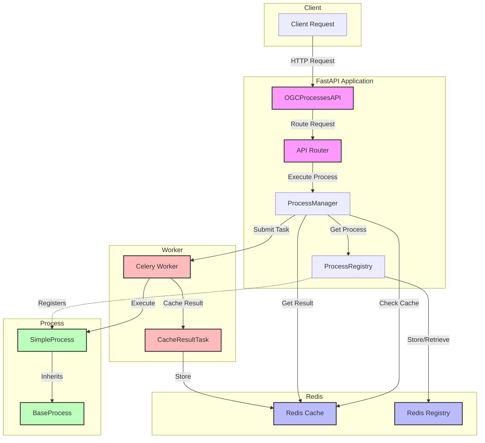
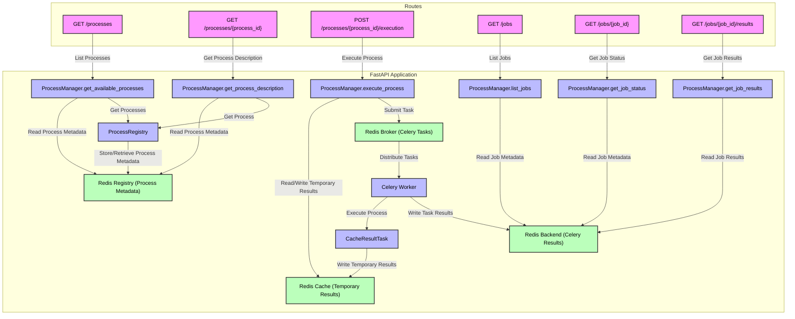

# fastprocesses

A library to create a FastAPI-based OGC API Processes wrapper around existing projects. This library simplifies the process of defining and registering processes, making it easy to build and deploy OGC API Processes.

AI helped to create this code.

## Version: 0.15.5

### Description

fastprocesses is a Python library that provides a simple and efficient way to create OGC API Processes using FastAPI. It allows you to define processes, register them, and expose them through a FastAPI application with minimal effort, following the OGC API Processes 1.0.0 specification.

### Features

- **OGC API Processes Compliance**: Fully implements the OGC API Processes 1.0.0 Core specification
- **FastAPI Integration**: Leverages FastAPI for building high-performance APIs
- **Process Management**: Supports both synchronous and asynchronous process execution
- **Job Control**: Implements job control options (sync-execute, async-execute)
- **Output Handling**: Supports various output transmission modes (value, reference)
- **Result Caching**: Built-in Redis-based caching for process results
- **Celery Integration**: Asynchronous task processing using Celery
- **Pydantic Models**: Strong type validation for process inputs and outputs
- **Logging**: Uses `loguru` for modern logging with rotation support

`fastprocesses` uses Celery for async execution of arbitrary processes and result retrieval from a backend like Redis. For deterministic processes, that means processes that return the same results for identical inputs, redis is used as temporary cache. For both, the celery backend and the temporary Redis cache, time to live can be configured.

### Architecture



### Routes



### Usage

1. **Define a Process**: Create a new process by subclassing `BaseProcess` and using the `@register_process` decorator.

```python
from fastprocesses.core.base_process import BaseProcess
from fastprocesses.core.models import (
    ProcessDescription,
    ProcessInput,
    ProcessJobControlOptions,
    ProcessOutput,
    ProcessOutputTransmission,
    Schema,
)
from fastprocesses.processes.process_registry import register_process

@register_process("simple_process")
class SimpleProcess(BaseProcess):
    # Define process description as a class variable
    process_description = ProcessDescription(
        id="simple_process",
        title="Simple Process",
        version="1.0.0",
        description="A simple example process",
        jobControlOptions=[
            ProcessJobControlOptions.SYNC_EXECUTE,
            ProcessJobControlOptions.ASYNC_EXECUTE
        ],
        outputTransmission=[
            ProcessOutputTransmission.VALUE
        ],
        inputs={
            "input_text": ProcessInput(
                title="Input Text",
                description="Text to process",
                schema=Schema(
                    type="string",
                    minLength=1,
                    maxLength=1000
                )
            )
        },
        outputs={
            "output_text": ProcessOutput(
                title="Output Text",
                description="Processed text",
                schema=Schema(
                    type="string"
                )
            )
        },
        keywords=["text", "processing"],
        metadata={
            "created": "2024-02-19",
            "provider": "Example Organization"
        }
    )

    async def execute(
        self,
        exec_body: Dict[str, Any],
        job_progress_callback: JobProgressCallback
    ) -> Dict[str, Any]:
        input_text = inputs["inputs"]["input_text"]
        output_text = input_text.upper()
        return {"output_text": output_text}
```

2. **Create the FastAPI Application**:

```python
import uvicorn
from fastprocesses.api.server import OGCProcessesAPI

app = OGCProcessesAPI(
    title="Simple Process API",
    version="1.0.0",
    description="A simple API for running processes"
).get_app()

if __name__ == "__main__":
    uvicorn.run(app, host="0.0.0.0", port=8000)
```

3. **Start the Services**:

Start Redis (required for caching and Celery):
```bash
docker run -d -p 6379:6379 redis
```

Start the Celery worker:
```bash
celery -A fastprocesses.worker.celery_app worker
```

Start the FastAPI application:
```bash
poetry run python examples/run_example.py
```

4. **Use the API**:

Execute a process (async):
```bash
curl -X POST "http://localhost:8000/processes/simple_process/execution" \
     -H "Content-Type: application/json" \
     -H "Prefer: respond-async" \
     -d '{
            "inputs": {
                "input_text": "hello world"
            },
            "outputs": {
                "lower": {}
            }
       }'
```

Execute a process (sync):
```bash
curl -X POST "http://localhost:8000/processes/simple_process/execution" \
     -H "Content-Type: application/json" \
     -H "Prefer: respond-sync" \
     -d '{
            "inputs": {
                "input_text": "hello world"
            },
            "outputs": {
                "lower": {}
            }
       }'
```

### API Endpoints

- `GET /`: Landing page
- `GET /conformance`: OGC API conformance declaration
- `GET /processes`: List available processes
- `GET /processes/{process_id}`: Get process description
- `POST /processes/{process_id}/execution`: Execute a process
- `GET /jobs`: List all jobs
- `GET /jobs/{job_id}`: Get job status
- `GET /jobs/{job_id}/results`: Get job results

### Configuration

The library can be configured using environment variables:

```bash
RESULT_CACHE_HOST="redis"
RESULT_CACHE_PORT=6379
RESULT_CACHE_DB=1

CELERY_BROKER_HOST="redis"
CELERY_BROKER_PORT=6379
CELERY_BROKER_DB=0

CELERY_RESULTS_TTL_DAYS=365 # job results are stored for this time period
CELERY_TASK_TLIMIT_HARD=900 # seconds
CELERY_TASK_TLIMIT_SOFT=600 # seconds
RESULTS_TEMP_TTL_HOURS=48 # this period determines how long results can be retrieved from cache, when the inputs are exactly the same 
```

### Notes:
!IMPORTANT!: Cache hash key is based on original unprocessed inputs always. This ensures consistent caching and cache retrieval which does not depend on arbitrary processed data, which can change when the process is updated or changed!

### Version Notes
- **0.15.0**: Implemented redis retry mechanism
- **0.14.0**: Renamed settings and allowed to add metadata to server app, added a html landing page
- **0.13.0**: Validation occurs against schema fragment provided by process description
- **0.12.0**: results will be retrieved from cache only if inputs and outputs are the same 
- **0.11.0**: improved error handling
- **0.10.0**: improved cache handling and added cache settings
- **0.9.0**: read process description from file, added set execution mode via Prefer-header
- **0.8.0**: added retry mechanism to Cache class and allow for separate connections each for Celery and results/jobs Cache
- **0.7.0**: added progress callback for job updates and SoftTimeLimit for tasks
- **0.6.0**: added paging to processes and jobs, including limit and offset query params
- **0.5.0**: Extended Schema model
- **0.4.0**: Added full OGC API Processes 1.0.0 Core compliance
- **0.3.0**: Added job control and output transmission options
- **0.2.0**: Added Redis caching and Celery integration
- **0.1.0**: Initial release with basic process support