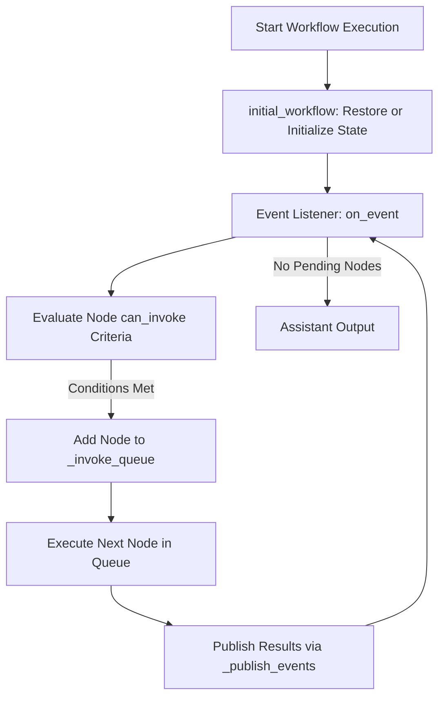
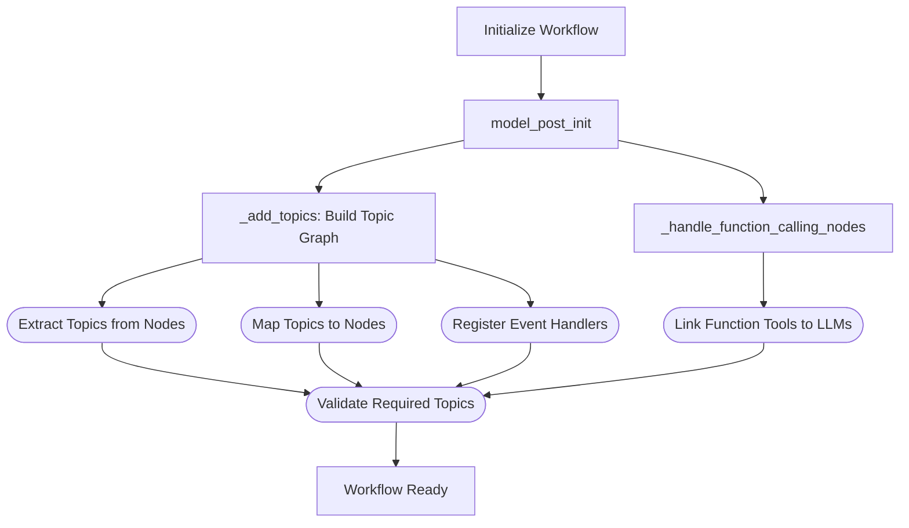
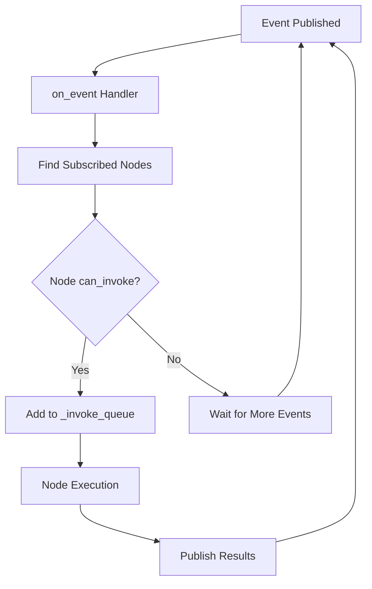
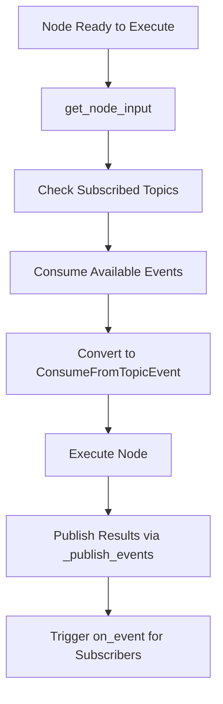
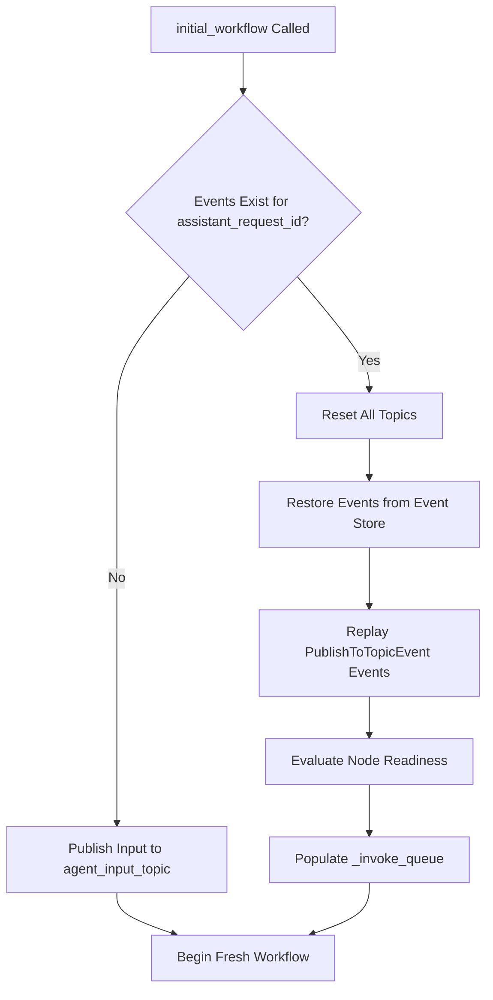

# Event-Driven Workflow

The event-driven workflow serves as the dynamic execution layer of Graphite, orchestrating node execution through a publish/subscribe (pub/sub) model. This architecture structures workflows as interconnected nodes that communicate via event queues (topics), enabling asynchronous, scalable, and flexible processing.

## Fields

The fields of the EventDrivenWorkflow are:

| Field Name          | Type                              | Description                                                                                           |
|---------------------|-----------------------------------|-------------------------------------------------------------------------------------------------------|
| `name`              | `str`                             | Unique identifier for the workflow instance (default: `"EventDrivenWorkflow"`).                       |
| `type`              | `str`                             | The type identifier for the workflow, typically matching the class name (`"EventDrivenWorkflow"`).    |
| `oi_span_type`      | `OpenInferenceSpanKindValues`     | Semantic attribute from OpenInference used for tracing and observability (default: `AGENT`).         |
| `workflow_id`       | `str`                             | Unique identifier for the workflow instance, auto-generated UUID.                                     |
| `nodes`             | `Dict[str, Node]`                 | Collection of all nodes defined within this workflow, keyed by node name.                             |
| `_topics`           | `Dict[str, TopicBase]`            | Private dictionary storing all event topics managed by the workflow.                                  |
| `_topic_nodes`      | `Dict[str, List[str]]`            | Private mapping of topic names to lists of node names subscribed to each topic.                       |
| `_invoke_queue`     | `deque[Node]`                     | Private queue of nodes that are ready to execute, triggered by event availability.                    |

## Methods

The following table summarizes key methods within the EventDrivenWorkflow class, highlighting their role in managing workflow execution, event handling, and node orchestration:

| Method Name               | Description                                                                                                                                               |
|---------------------------|-----------------------------------------------------------------------------------------------------------------------------------------------------------|
| `model_post_init`         | Model initialization hook that sets up topics and handles function calling nodes after model creation.                                                  |
| `builder`                 | Class method that returns a WorkflowBuilder for fluent workflow construction.                                                                            |
| `_add_topics`             | Sets up topic subscriptions and node-to-topic mappings from node configurations.                                                                         |
| `_add_topic`              | Registers a topic within the workflow and sets default publish event handlers.                                                                           |
| `_handle_function_calling_nodes` | Links function calling nodes with LLM nodes to enable function specification sharing.                                                             |
| `_publish_events`         | Publishes events to designated workflow topics after a node completes synchronous execution.                                                             |
| `_publish_agen_events`    | Handles publishing events for asynchronous generators, supporting streaming output.                                                                      |
| `_get_consumed_events`    | Retrieves and returns consumed events from human request and agent output topics.                                                                        |
| `invoke`                  | Synchronous workflow execution that processes nodes from the invoke queue until completion.                                                              |
| `a_invoke`                | Asynchronous workflow execution with streaming support and concurrent node processing.                                                                   |
| `_process_all_nodes`      | Processes all nodes asynchronously without blocking event streaming, managing concurrent execution.                                                      |
| `_record_consumed_events` | Records consumed output events to the event store with proper streaming handling.                                                                        |
| `_invoke_node`            | Invokes a single node asynchronously with proper stream handling and error management.                                                                   |
| `get_node_input`          | Collects and returns input events consumed by a node based on its subscribed topics.                                                                     |
| `on_event`                | Event handler that responds to topic publish events, evaluates node readiness, and queues nodes for execution.                                          |
| `initial_workflow`        | Initializes workflow state, either restoring from stored events or creating new workflow with input data.                                               |
| `to_dict`                 | Serializes the workflow to a dictionary representation including nodes, topics, and topic-node mappings.                                                |

## Workflow Execution Flow

The following diagram illustrates the execution flow of a Node within an event-driven workflow:

## Workflow Initialization

When an EventDrivenWorkflow instance is initialized, the `model_post_init` method performs several critical setup tasks:

1. **Topic Setup** (`_add_topics`): Constructs the workflow graph by analyzing each node's subscription expressions and publish destinations
2. **Function Calling Integration** (`_handle_function_calling_nodes`): Links function-calling nodes with LLM nodes to enable tool recognition

The topic setup process:

- Extracts topics from node subscription expressions using `extract_topics`
- Maps topic names to subscribing node names in `_topic_nodes`
- Registers all topics in the `_topics` dictionary with event handlers
- Validates that required `agent_input_topic` and `agent_output_topic` exist

For function calling capabilities:

- Identifies nodes using `FunctionCallTool`
- Links them with LLM nodes that publish to the same topics
- Enables LLMs to recognize and invoke available function tools

## Node Execution Process

The EventDrivenWorkflow supports both synchronous (`invoke`) and asynchronous (`a_invoke`) execution modes, each handling node orchestration differently.

### Synchronous Execution (`invoke`)

1. **Workflow Initialization**: Calls `initial_workflow` to restore state or set up new workflow
2. **Node Processing Loop**: Processes nodes from `_invoke_queue` sequentially until empty
3. **Event Collection**: Collects consumed events using `_get_consumed_events`
4. **Output Assembly**: Sorts output messages by timestamp and returns results

### Asynchronous Execution (`a_invoke`)

1. **Workflow Initialization**: Sets up initial state
2. **Concurrent Processing**: Uses `_process_all_nodes` to handle nodes concurrently
3. **Event Streaming**: Streams events as they arrive from `agent_output_topic.event_queue`
4. **Task Management**: Manages running tasks and executing nodes to prevent conflicts

### Event-Driven Node Triggering

The pub/sub model governs node execution through the `on_event` handler:

1. **Event Reception**: Receives `PublishToTopicEvent` from topics
2. **Subscriber Identification**: Finds all nodes subscribed to the published topic
3. **Readiness Check**: Evaluates each node's `can_invoke()` criteria
4. **Queue Management**: Adds ready nodes to `_invoke_queue` for execution

## Input Preparation & Execution Logic

Before executing a node, the workflow's `get_node_input` method collects all relevant events from the node's subscribed topics:

1. **Topic Iteration**: Processes each topic in `node._subscribed_topics`
2. **Event Consumption**: Uses `topic.consume(node.name)` to retrieve available events
3. **Event Conversion**: Converts topic events to `ConsumeFromTopicEvent` instances
4. **Input Assembly**: Returns list of consumed events for node execution

### Subscription Logic Support

The system provides flexible subscription expressions through topic expressions that support complex logic:

- **AND Logic**: Node executes when ALL subscription conditions are met
- **OR Logic**: Node executes when ANY subscription condition is met
- **Complex Expressions**: Combination of AND/OR operators for advanced logic

**Important Consideration for OR Logic**: When using OR-based subscriptions, nodes are queued as soon as one condition is satisfied. Messages from other subscribed topics in the OR expression may not be available when `get_node_input` executes, potentially causing data inconsistencies. Careful design is recommended when implementing OR-based logic.

### Node Execution Flow

## Restoring Unfinished Workflows

A key advantage of this event-driven architecture is its ability to restore and resume unfinished workflows. When `initial_workflow()` is called, the system:

1. **Event Store Check**: Retrieves stored events for the given `assistant_request_id`
2. **State Restoration**: If events exist, restores workflow topics and state from stored events
3. **Fresh Start**: If no events exist, publishes input to `agent_input_topic` to begin new workflow
4. **Topic Restoration**: Replays stored `PublishToTopicEvent` and `OutputTopicEvent` to restore topic states
5. **Node Queue Setup**: Evaluates node readiness and populates `_invoke_queue` appropriately

### Benefits of Workflow Restoration

- **Human-in-the-Loop Support**: Workflows can pause while awaiting user input and resume seamlessly
- **Failure Recovery**: Resume from failure points without restarting entire workflows
- **Cost Efficiency**: Prevents unnecessary re-execution of previous steps, reducing LLM call costs
- **State Consistency**: Maintains exact workflow state across interruptions

This restoration mechanism enables robust, fault-tolerant workflows that can handle interruptions gracefully while maintaining consistency and efficiency.
