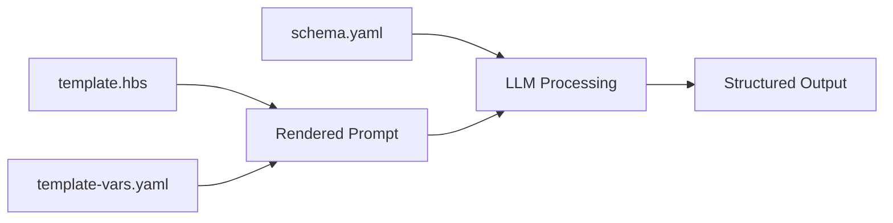

# PR Review with Handlebars Templates & YAML

This example demonstrates the new **template-based workflow** using YAML configuration and Handlebars templates for dynamic prompt generation.

## Features Demonstrated

- **YAML Support**: Use YAML files for cleaner, more readable configuration
- **Handlebars Templates**: Dynamic prompt generation with reusable templates
- **Template Variables**: Externalized configuration for easy customization
- **YAML Schema**: Define output schemas in YAML format

## Files

- `template.hbs` - Handlebars template for PR review prompts
- `template-vars.yaml` - YAML file with template variables
- `schema.yaml` - YAML schema defining the expected output structure
- `README.md` - This documentation

## How It Works

### 1. Template-Based Approach

Instead of static JSON input, this example uses:
- **Handlebars template** (`template.hbs`) - Dynamic prompt structure
- **YAML variables** (`template-vars.yaml`) - Data to populate the template
- **YAML schema** (`schema.yaml`) - Output structure definition

### 2. Template Rendering Process



### 3. Handlebars Template Features

The template demonstrates various Handlebars features:

```handlebars
{{#message role="system"}}
You are an expert in {{expertise.domain}}.
{{/message}}

{{#message role="user"}}
Review PR #{{repository.pr_number}} from {{repository.name}}:

Files: {{#each repository.files_changed}}{{this}}{{#unless @last}}, {{/unless}}{{/each}}

Focus Areas:
{{#each review_context.focus_areas}}
- {{this}}
{{/each}}
{{/message}}
```

**Features Used:**
- `{{variable}}` - Simple variable substitution
- `{{#each array}}` - Loop through arrays
- `{{#if condition}}` - Conditional rendering
- `{{#unless @last}}` - Helper for formatting lists
- `{{#message role="..."}}` - Custom helper for chat messages

## Usage

### Command

```bash
llm-ci-runner \
  --template-file examples/05-templates/pr-review-template/template.hbs \
  --template-vars examples/05-templates/pr-review-template/template-vars.yaml \
  --schema-file examples/05-templates/pr-review-template/schema.yaml \
  --output-file pr-review-result.yaml
```

### Alternative: JSON Schema

You can also use JSON schema if preferred:
```bash
# Convert YAML schema to JSON first
cat examples/05-templates/pr-review-template/schema.yaml | yq eval -o json > schema.json

llm-ci-runner \
  --template-file examples/05-templates/pr-review-template/template.hbs \
  --template-vars examples/05-templates/pr-review-template/template-vars.yaml \
  --schema-file schema.json \
  --output-file pr-review-result.json
```

## Template Variables (template-vars.yaml)

```yaml
expertise:
  domain: "security and code quality"
  focus_areas: "security vulnerabilities, code maintainability"

repository:
  name: "secure-auth-service"
  pr_number: 789
  branch: "fix/security-improvements"
  files_changed:
    - "auth/authentication.py"
    - "auth/session_manager.py"

review_context:
  focus_areas:
    - "SQL injection vulnerabilities"
    - "Input validation and sanitization"
    - "Error handling and logging"
  related_issues: [456, 789]
  deployment_env: "production"

code_diff: |
  --- a/auth/authentication.py
  +++ b/auth/authentication.py
  [... detailed diff content ...]
```

## Expected Output

The command generates structured output following the YAML schema:

```yaml
success: true
response:
  description: |
    ### Security Analysis Summary
    
    This PR implements critical security improvements to the authentication service:
    
    **Key Changes:**
    - Fixed SQL injection vulnerability in user authentication
    - Added input validation for user credentials
    - Improved session creation with proper validation
    
    **Security Impact:**
    - Eliminates high-severity SQL injection risk
    - Improves input sanitization practices
    - Enhances overall authentication security posture
    
  summary: "Fixed SQL injection vulnerability and improved input validation in authentication service"
  change_type: "security"
  impact: "high"
  security_findings:
    - type: "vulnerability_fixed"
      description: "SQL injection vulnerability eliminated by using parameterized queries"
      severity: "high"
    - type: "security_improvement"
      description: "Added comprehensive input validation for authentication parameters"
      severity: "medium"
  testing_notes:
    - "Test SQL injection attempts against the authentication endpoint"
    - "Verify input validation with edge cases (empty, null, special characters)"
    - "Ensure existing authentication flows continue to work"
  deployment_notes:
    - "No database schema changes required"
    - "Backward compatible with existing API clients"
    - "Consider monitoring authentication failure rates post-deployment"
  breaking_changes: []
  related_issues: [456, 789]
```

## Benefits of Template Approach

### 🎯 **Reusability**
- Templates can be reused across different PRs
- Variables file can be easily modified for different contexts
- Schema defines consistent output structure

### 🔧 **Maintainability**
- Separate concerns: template structure vs. data vs. schema
- YAML is more readable than JSON for complex configurations
- Easy to version control and review changes

### 🚀 **Flexibility**
- Dynamic content generation based on context
- Conditional sections based on PR type or repository
- Easy customization for different teams or projects

### 📋 **Consistency**
- Enforced schema compliance across all outputs
- Standardized prompt structure
- Predictable output format for downstream automation

## Comparison: Traditional vs Template Approach

| Traditional JSON Input | Template-Based YAML |
|----------------------|-------------------|
| Static prompt text | Dynamic template rendering |
| Hardcoded values | Variable substitution |
| JSON configuration | YAML configuration |
| Less reusable | Highly reusable |
| Manual prompt updates | Template-driven updates |

## Advanced Template Features

### Custom Message Helper

The template uses a custom `message` helper:
```handlebars
{{#message role="system"}}
System instructions here
{{/message}}

{{#message role="user"}}
User content here
{{/message}}
```

This generates proper chat message structure automatically.

### Conditional Rendering

```handlebars
{{#if review_context.related_issues}}
Related Issues: {{#each review_context.related_issues}}#{{this}}{{/each}}
{{/if}}
```

Only includes sections when data is available.

### Array Formatting

```handlebars
Files: {{#each repository.files_changed}}{{this}}{{#unless @last}}, {{/unless}}{{/each}}
```

Properly formats arrays with commas between items.

## Integration with CI/CD

This template approach is perfect for CI/CD pipelines:

```yaml
# GitHub Actions example
- name: Generate PR Review
  run: |
    llm-ci-runner \
      --template-file .github/templates/pr-review.hbs \
      --template-vars pr-context.yaml \
      --schema-file .github/schemas/pr-review.yaml \
      --output-file pr-analysis.yaml
```

## What This Demonstrates

- 🔄 **Template-driven prompt generation** with Handlebars
- 📝 **YAML configuration** for better readability
- 🎯 **Dynamic content rendering** based on context
- ✅ **Schema enforcement** with YAML schemas
- 🔧 **Reusable templates** for consistent outputs
- 🚀 **CI/CD integration** with template-based workflows 