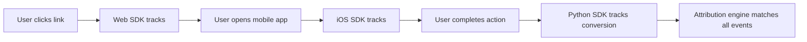

# 🐍 Lync Attribution - Python SDK

Cross-platform attribution tracking that connects web clicks to mobile app events and server-side conversions.

[](https://badge.fury.io/py/lync)
[](https://www.python.org/downloads/)
[](https://opensource.org/licenses/MIT)

## 🚀 Quick Start

```bash
pip install lync
```

```python
from lync import Lync

# Initialize
lync = Lync(
    api_base_url="https://api.lync.so",
    entity_id="your-entity-id",
    api_key="your-api-key"
)

# Track server-side conversions
lync.track_conversion(
    event_name="signup",
    customer_id="user-123",
    customer_email="user@example.com",
    custom_properties={"plan": "premium", "value": 99.99}
)

# Get attribution data
attribution = lync.get_attribution(customer_id="user-123")
print(f"Attribution confidence: {attribution['confidence']}%")
```

## 🎯 Features

- **Server-Side Attribution**: Track conversions in your Python backend
- **Cross-Platform Matching**: Connect to web clicks and mobile app events
- **Django/Flask Integration**: Easy integration with popular frameworks
- **CLI Tools**: Command-line interface for testing and automation
- **Type Safety**: Full type hints for better IDE support
- **Async Support**: Built on requests with connection pooling
- **Privacy-First**: GDPR compliant attribution without PII

## 📱 Cross-Platform Flow



## 🛠️ Installation & Setup

### Basic Installation
```bash
pip install lync
```

### With Framework Support
```bash
# For Django projects
pip install lync[django]

# For Flask projects  
pip install lync[flask]

# For FastAPI projects
pip install lync[fastapi]

# For development
pip install lync[dev]
```

### Configuration

#### Environment Variables
```bash
export LYNC_API_BASE_URL="https://api.lync.so"
export LYNC_ENTITY_ID="your-entity-id"
export LYNC_API_KEY="your-api-key"
```

#### Initialize Client
```python
from lync import Lync

# From environment variables
lync = Lync.from_env()

# Or explicit configuration
lync = Lync(
    api_base_url="https://api.lync.so",
    entity_id="your-entity-id", 
    api_key="your-api-key",
    debug=True  # Enable debug logging
)
```

## 📊 API Reference

### `Lync` Client

#### `track_conversion(event_name, **kwargs)`

Track a conversion event (signup, purchase, etc.)

```python
lync.track_conversion(
    event_name="purchase",
    customer_id="user-123",
    customer_email="user@example.com",
    click_id="click_abc123",  # Optional: from original web click
    custom_properties={
        "plan": "premium",
        "value": 99.99,
        "currency": "USD"
    }
)
```

#### `track_click(link_id, **kwargs)`

Track a server-side link click (for email campaigns, etc.)

```python
result = lync.track_click(
    link_id="email-campaign-123",
    custom_properties={"campaign": "summer-sale"}
)
print(f"Generated click_id: {result['click_id']}")
```

#### `get_attribution(customer_id=None, **kwargs)`

Retrieve attribution data for analysis

```python
attribution = lync.get_attribution(customer_id="user-123")

print(f"Matched: {attribution['matched']}")
print(f"Confidence: {attribution['confidence']}%") 
print(f"Attribution type: {attribution['attribution_type']}")
print(f"Original click: {attribution['original_click_id']}")
```

#### `generate_fingerprint(device_info=None)`

Generate server fingerprint for cross-platform matching

```python
fingerprint = lync.generate_fingerprint()
print(f"Server fingerprint: {fingerprint}")
```

### Context Manager Support

```python
with Lync(api_base_url="...", entity_id="...") as client:
    client.track_conversion("signup", customer_id="user-123")
# Session automatically closed
```

## 🔧 Framework Integration

### Django

```python
# settings.py
LYNC_CONFIG = {
    'API_BASE_URL': 'https://api.lync.so',
    'ENTITY_ID': 'your-entity-id',
    'API_KEY': 'your-api-key',
}

# views.py
from django.conf import settings
from lync import Lync

def signup_view(request):
    # Handle user signup
    user = create_user(request.POST)
    
    # Track conversion
    lync = Lync(**settings.LYNC_CONFIG)
    lync.track_conversion(
        event_name="signup",
        customer_id=str(user.id),
        customer_email=user.email,
        click_id=request.session.get('lync_click_id')
    )
    
    return redirect('dashboard')
```

### Flask

```python
from flask import Flask, request, session
from lync import Lync

app = Flask(__name__)
lync = Lync.from_env()

@app.route('/signup', methods=['POST'])
def signup():
    # Handle user signup
    user = create_user(request.form)
    
    # Track conversion
    lync.track_conversion(
        event_name="signup",
        customer_id=str(user.id),
        customer_email=user.email,
        click_id=session.get('lync_click_id')
    )
    
    return redirect('/dashboard')

@app.route('/track/<click_id>')
def track_click(click_id):
    # Store click_id for attribution
    session['lync_click_id'] = click_id
    return redirect('/landing')
```

### FastAPI

```python
from fastapi import FastAPI, Depends
from lync import Lync

app = FastAPI()
lync = Lync.from_env()

@app.post("/conversions")
async def track_conversion(
    event_name: str,
    customer_id: str,
    customer_email: str = None
):
    result = lync.track_conversion(
        event_name=event_name,
        customer_id=customer_id,
        customer_email=customer_email
    )
    return {"success": True, "result": result}
```

## 🖥️ CLI Usage

The Lync package includes a command-line interface:

```bash
# Test API connection
lync test --api-url https://api.lync.so --entity-id your-entity --api-key your-key

# Track a conversion
lync track-conversion signup \
  --customer-id user123 \
  --customer-email user@example.com \
  --api-url https://api.lync.so \
  --entity-id your-entity \
  --api-key your-key

# Generate server fingerprint
lync fingerprint

# With JSON output
lync fingerprint --format json
```

## 🔒 Privacy & Security

- **GDPR Compliant**: No PII stored without explicit consent
- **Secure by Default**: All requests use HTTPS
- **Configurable Retention**: Set your own data retention policies
- **API Key Authentication**: Secure server-to-server communication
- **Request Signing**: Optional request signature verification

## 📈 Attribution Analytics

Track key server-side metrics:

```python
# Get attribution insights
attribution = lync.get_attribution(customer_id="user-123")

if attribution['matched']:
    print(f"✅ Attribution found!")
    print(f"Original click: {attribution['click_timestamp']}")
    print(f"Conversion: {attribution['conversion_timestamp']}")
    print(f"Time to convert: {attribution['time_to_conversion']}s")
    print(f"Campaign: {attribution['campaign_data']['name']}")
else:
    print("❌ No attribution found")

# Batch attribution analysis
customers = ["user-1", "user-2", "user-3"]
for customer_id in customers:
    attribution = lync.get_attribution(customer_id=customer_id)
    print(f"{customer_id}: {attribution['confidence']}% confidence")
```

## 🧪 Testing

```python
import pytest
from lync import Lync
from lync.exceptions import LyncAPIError

def test_track_conversion():
    lync = Lync(
        api_base_url="https://test.lync.so",
        entity_id="test-entity",
        api_key="test-key"
    )
    
    result = lync.track_conversion(
        event_name="test_signup",
        customer_id="test-user-123"
    )
    
    assert "success" in result
    assert result["success"] is True
```

## 🔧 Advanced Configuration

```python
from lync import Lync
from lync.types import DeviceInfo

# Custom device info
device_info = DeviceInfo(
    platform="server",
    os_name="Ubuntu",
    os_version="20.04",
    timezone="America/New_York"
)

lync = Lync(
    api_base_url="https://api.lync.so",
    entity_id="your-entity-id",
    api_key="your-api-key",
    timeout=60.0,  # Request timeout
    retries=5,     # Retry attempts
    debug=True     # Debug logging
)

# Track with custom device info
lync.track_conversion(
    event_name="signup",
    customer_id="user-123",
    device_info=device_info
)
```

## 🛟 Error Handling

```python
from lync import Lync
from lync.exceptions import LyncAPIError, LyncConfigurationError

try:
    lync = Lync(api_base_url="", entity_id="test")
except LyncConfigurationError as e:
    print(f"Configuration error: {e}")

try:
    lync.track_conversion("signup", customer_id="user-123")
except LyncAPIError as e:
    print(f"API error {e.status_code}: {e}")
    if e.response_data:
        print(f"Details: {e.response_data}")
```

## 🛟 Support

- 📖 [Full Documentation](https://docs.lync.so/python)
- 💬 [Discord Community](https://discord.gg/lync)  
- 🐛 [GitHub Issues](https://github.com/lync-so/lync-sdk/issues)
- 📧 [Email Support](mailto:support@lync.so)

## 📄 License

MIT License - see [LICENSE](LICENSE) file for details.

---

**Made with 🐍❤️ by the Lync team** 