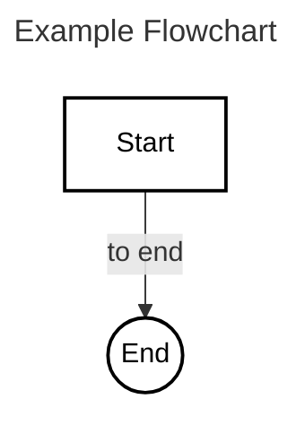
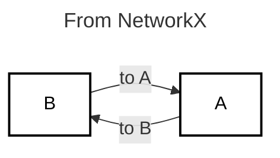

# MerGram

**Programmatically generate [Mermaid](https://mermaid.jd.org) diagrams and charts using Python.**

[](https://www.repostatus.org/#wip)

[](LICENSE)
[](https://github.com/blakeaw/mergram/releases)
[](https://github.com/astral-sh/ruff)

MerGram currently supports constructing Mermaid flowcharts, with plans to expand support for additional diagram and chart types in future releases.
 

## Features

- Build Mermaid flowcharts using Python classes
- Support for nodes, links, and subgraphs, and style assignments
- Export diagrams to Mermaid `.mmd` or `.mermaid` files
- Optional integration with [networkx](https://networkx.org/) for graph conversion

### What's New in 

### v0.3.0

* `Style` class that can be used to add `style ...` lines to flowcharts
* Fixes to style-related outputs for nodes

#### v0.2.0

* `Flowchart.to_markdown` function to get a string representation of the flowchart embedded in a Markdown Mermaid code block.
* `Flowchart.to_html` function to get a string representation of the flowchart embedded in HTML. 

## Installation

```bash
pip install mergram
```

To enable networkx integration:

```bash
pip install mergram[networkx]
```

## Usage

### Basic Flowchart

```python
from mergram.flowchart import Flowchart, Node, Link

fc = Flowchart("Example Flowchart")
a = Node("A", label="Start")
b = Node("B", label="End", shape='circle')
fc += a
fc += b
fc += Link(a, b, text="to end")

print(fc)
```
Generates the following mermaid diagram code:

    ---
    title: Example Flowchart
    ---
    flowchart TB
        A@{ shape: rect, label: Start }
        B@{ shape: circle, label: End }
        A-->|to end|B
        style A fill:#fff, stroke:#000, stroke-width:2px, color:#000
        style B fill:#fff, stroke:#000, stroke-width:2px, color:#000

That looks like: 


### From NetworkX

```python
import networkx as nx
from mergram.flowchart import Flowchart

G = nx.DiGraph()
G.add_edge("A", "B", label="to B")
G.add_edge("B", "A", label="to A")
fc = Flowchart("From NetworkX", orientation='LR')
fc.from_networkx(G)
print(fc)
```
    ---
    title: From NetworkX
    ---
    flowchart LR
        B@{ shape: rect, label: B }
        A@{ shape: rect, label: A }
        A-->|to B|B
        B-->|to A|A
        style A fill:#fff, stroke:#000, stroke-width:2px, color:#000
        style B fill:#fff, stroke:#000, stroke-width:2px, color:#000




### Export to File

```python
fc.write("diagram.mmd")
```

## Optional Dependencies

- `networkx`: For converting existing graphs to Mermaid flowcharts.

## License

MIT License

## Contributing

Contributions are welcome! Please open issues or pull requests.
