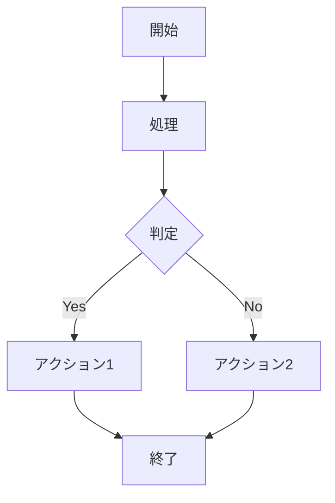

# 使用方法

## プラグイン設定

`mkdocs.yml`でプラグインを設定してください：

```yaml
plugins:
  - mermaid-to-image:
      enabled: true              # デフォルト: true
      enabled_if_env: "ENABLE_PDF_EXPORT"  # 環境変数による制御（オプション）
      output_dir: "assets/images" # デフォルト: "assets/images"
      theme: "default"           # "default", "dark", "forest", "neutral"
      preserve_original: false   # デフォルト: false
      error_on_fail: false       # デフォルト: false
      log_level: "INFO"          # "DEBUG", "INFO", "WARNING", "ERROR"
```

### 主要設定項目

- **enabled**: プラグインの有効/無効
- **enabled_if_env**: 環境変数による条件付き有効化
- **output_dir**: 生成画像の保存ディレクトリ
- **theme**: ダイアグラムテーマ
- **preserve_original**: 元のMermaidコードを保持するか
- **error_on_fail**: エラー時にビルドを停止するか

### 高度な設定

```yaml
plugins:
  - mermaid-to-image:
      mmdc_path: "mmdc"                    # mermaid-cliコマンドパス
      mermaid_config: "path/to/config.json" # Mermaid設定ファイル
      css_file: "path/to/custom.css"       # カスタムCSSファイル
      puppeteer_config: "path/to/config.json" # Puppeteer設定ファイル
```

## PDF出力との組み合わせ

### 環境変数による条件付き画像化

PDF生成時のみMermaidダイアグラムを画像化したい場合は、`enabled_if_env`オプションを使用します：

```yaml
plugins:
  - search
  - mermaid-to-image:
      enabled_if_env: ENABLE_PDF_EXPORT
      image_format: png
      theme: default
  - to-pdf:
      cover_subtitle: 'Project Documentation'
      output_path: docs.pdf
```

### 使用方法

**通常のHTMLビルド**（Mermaidは動的レンダリング）：
```bash
mkdocs build
mkdocs serve
```

**PDF生成用ビルド**（Mermaidは静的画像化）：
```bash
ENABLE_PDF_EXPORT=1 mkdocs build
```

### 環境変数の判定仕様

`enabled_if_env`の動作：

| 環境変数の状態 | プラグイン動作 | 備考 |
|---------------|---------------|------|
| 未設定 | 無効化 | プラグイン処理をスキップ |
| `=""` | 無効化 | 空文字列は無効と判定 |
| `=" "` | 無効化 | 空白のみは無効と判定 |
| `="0"` | **有効化** | 値があれば有効化 |
| `="1"` | 有効化 | 推奨値 |
| `="false"` | **有効化** | 文字列値があれば有効化 |

**注意**: 環境変数に何らかの値が設定されていれば（`0`、`false`等でも）プラグインが有効化されます。

### 実用的なワークフロー例

**CI/CDでの自動PDF生成**：
```yaml
# GitHub Actions例
- name: Build documentation
  run: mkdocs build

- name: Generate PDF
  run: ENABLE_PDF_EXPORT=1 mkdocs build

- name: Upload PDF artifact
  uses: actions/upload-artifact@v3
  with:
    name: documentation-pdf
    path: site/*.pdf
```

**開発時の使い分け**：
```bash
# 開発時（高速）
mkdocs serve

# HTMLプレビュー
mkdocs build

# PDF生成確認
ENABLE_PDF_EXPORT=1 mkdocs build
```

## Mermaidダイアグラムの記述

### 基本的な記述方法



## ビルドと実行

### 通常のビルド

```bash
make build    # 静的サイト生成（画像変換実行）
make serve    # 開発サーバー（画像変換スキップ）
```

### ログレベル指定

環境変数でログレベルを制御することも可能：

```bash
LOG_LEVEL=DEBUG make build
```

## 生成される成果物

- **変換前**: Mermaidコードブロック
- **変換後**: 画像タグ（``）
- **生成画像**: 設定した`output_dir`に保存
- **キャッシュ**: 設定した`cache_dir`に保存（再利用）

### 生成画像の確認

```bash
# デフォルト設定の場合
ls site/assets/images/

# カスタム設定の場合
ls site/[your_output_dir]/
```

## パフォーマンス最適化

### キャッシュ活用

- `cache_enabled: true`（推奨）
- 同じダイアグラムの再生成を回避
- ビルド時間を大幅短縮

### 並列処理対応

```yaml
plugins:
  - mermaid-to-image:
      # 大量のダイアグラムがある場合の最適化設定
      error_on_fail: false
```
