# MoFA_Stage

English | [中文](README_cn.md)

MoFA_Stage is a web-based development tool for managing and editing Nodes and Dataflows in the MoFA framework.

## Features

- **Agent Management**
  - Browse Agent list
  - Create and copy Agents
  - Edit Agent files
  - Run and stop Agents
  - View execution logs

- **Terminal Access**
  - Web terminal
  - SSH connections
  - ttyd integration

- **Code Editing**
  - Text editor
  - File browser
  - VSCode Server integration (optional)

## Technology Stack

**Backend**
- Python + Flask
- WebSocket support
- SSH terminal integration
- RESTful API

**Frontend**
- Vue 3 + Element Plus
- Monaco editor

**Third-party Services**
- ttyd (recommended)
- code-server (optional)


### Quick Start

#### Environment Requirements

**System Support**
- Linux (supports apt-get and yum package managers)
- macOS
- Windows is not currently supported, WSL (Windows Subsystem for Linux) is recommended

**Software Requirements**
- Python 3.8 or higher
- Node.js 14 or higher
- MoFA framework installed

#### Installation and Run Scripts

The project provides two scripts:

- **install**: One-click installation of all dependencies
  ```bash
  chmod +x install
  ./install
  ```
  Automatically installs backend/frontend dependencies with options for Docker or traditional installation. After installation, it will prompt whether to run, selecting yes will execute the run script. For local deployment, choose non-docker deployment.

- **run**: One-click service startup
  ```bash
  chmod +x run
  ./run
  ```
  Supports both Docker and traditional deployment modes. For local deployment, choose non-docker deployment.

##### Docker Deployment (Recommended)

###### Using Docker avoids all environment issues for the fastest deployment:

```bash
# Simply run the installation script to choose docker deployment
./install
./run

# Or configure separately:

# One-line frontend deployment
docker run -d -p 3000:80 liyao1119/mofa-stage-frontend

# Start backend
cd backend && python app.py
```

**🚀 Quick Start (30-second deployment)**

**Method 1: Using Official Image (Recommended)**

```bash
# 1. Pull and start frontend
docker run -d -p 3000:80 --name mofa-frontend \
  --add-host=host.docker.internal:host-gateway \
  liyao1119/mofa-stage-frontend:latest

# 2. Clone repository and start backend
git clone https://github.com/mofa-org/mofa-stage.git
cd mofa-stage/backend
pip install -r requirements.txt
python app.py

# 3. Access system
# Open browser: http://localhost:3000
```

**Method 2: Local Build**

```bash
# 1. Clone code
git clone https://github.com/mofa-org/mofa-stage.git
cd mofa-stage

# 2. Use installation script (supports Docker mode selection)
./install

# 3. Start services
./run
```

**📋 System Requirements**

- Docker Desktop ([Download](https://www.docker.com/products/docker-desktop/))
- Python 3.8+ (backend only)
- 4GB available memory

### Development Mode (Manual Startup)

1. Start the backend
```bash
cd backend
python app.py
```

2. Start the frontend (development mode)
```bash
cd frontend
npm run dev
```

Access http://localhost:3000.

### Production Deployment

1. Build the frontend
```bash
cd frontend
npm run build  # Generates in the dist directory
```

2. Deployment methods (choose one)

**Using Nginx**

```nginx
server {
    listen 80;
    
    # Static files
    location / {
        root /path/to/mofa_stage/frontend/dist;
        try_files $uri $uri/ /index.html;
    }
    
    # API forwarding
    location /api {
        proxy_pass http://localhost:5002;
        proxy_set_header Host $host;
        proxy_set_header X-Real-IP $remote_addr;
    }
    
    # WebSocket
    location /api/webssh {
        proxy_pass http://localhost:5001;
        proxy_http_version 1.1;
        proxy_set_header Upgrade $http_upgrade;
        proxy_set_header Connection "upgrade";
    }
}
```

**Simple Deployment**

Using Python's built-in HTTP server:
```bash
cd frontend/dist
python -m http.server 3000
```

Start the backend:
```bash
cd backend
python app.py
```

## Common Issues

### Port Occupation

If you encounter port occupation issues, you can use this command to release ports:

```bash
for port in 3000 5001 5002 7681; do
    pid=$(lsof -t -i:$port)
    if [ -n "$pid" ]; then
        kill -9 $pid
        echo "Released port $port"
    fi
done
```

### Port Description

| Service | Port | Description |
|---------|------|-------------|
| Frontend | 3000 | Web interface |
| Backend API | 5002 | Flask service |
| WebSSH | 5001 | SSH terminal |
| ttyd | 7681 | Web terminal |
| VS Code | 8080 | Code editor |

### ttyd Installation Failure

If ttyd automatic installation fails, you can refer to the [ttyd GitHub page](https://github.com/tsl0922/ttyd) for manual installation.

### Docker-Specific Issues

**Q: Port already in use?**
```bash
# Check process using port 3000
lsof -i :3000
# Or change port mapping
docker run -d -p 8000:80 ...
```

**Q: Container cannot connect to backend?**
Make sure backend service is running:
```bash
cd backend && python app.py
```

**Q: How to update to latest version?**
```bash
docker pull liyao1119/mofa-stage-frontend:latest
docker stop mofa-frontend
docker rm mofa-frontend
# Re-run docker run command
```

**Q: How to view container logs?**
```bash
docker logs mofa-frontend
```

## Docker Advanced Configuration

### Custom Build

```bash
cd frontend
# Build after modifying configuration
docker build -t my-mofa-frontend .
docker run -d -p 3000:80 my-mofa-frontend
```

### Troubleshooting

1. **Check if Docker is running properly**
   ```bash
   docker ps
   ```

2. **Check network connections**
   ```bash
   curl http://localhost:3000
   curl http://localhost:5002/api/settings
   ```

3. **Restart container**
   ```bash
   docker restart mofa-frontend
   ```

## Directory Structure

```
mofa-stage/
├── backend/
│   ├── app.py              # Main application
│   ├── config.py           # Configuration
│   ├── routes/             # API routes
│   │   ├── agents.py       # Agent management
│   │   ├── terminal.py     # Terminal features
│   │   ├── webssh.py       # SSH connections
│   │   ├── vscode.py       # VSCode integration
│   │   ├── settings.py     # Settings management
│   │   ├── ttyd.py         # ttyd integration
│   │   └── mermaid.py      # Chart rendering
│   ├── utils/              # Utility modules
│   │   ├── mofa_cli.py     # MoFA command wrapper
│   │   ├── file_ops.py     # File operations
│   │   └── ttyd_manager.py # ttyd management
│   └── requirements.txt    # Python dependencies
├── frontend/
│   ├── src/
│   │   ├── views/          # Page components
│   │   ├── components/     # UI components
│   │   ├── api/            # API calls
│   │   ├── store/          # State management
│   │   └── router/         # Routing
│   └── package.json        # Node.js dependencies
├── install.sh              # Installation script
└── run.sh                  # Startup script
```

## User Journey

```mermaid
graph TD
    A[🔧 Environment Setup] --> B[⚙️ System Configuration]
    B --> C[🤖 Agent Development]
    C --> D[🔄 Dataflow Orchestration]
    D --> E[🔍 Debugging & Optimization]
    
    A --> A1[Install MoFA Framework]
    A --> A2[Launch MoFA Stage]
    A --> A3[Access Web Interface]
    
    B --> B1[Configure MoFA Path]
    B --> B2[Select Terminal Mode]
    B --> B3[Test Connections]
    
    C --> C1[Browse Agent List]
    C --> C2[Create New Agent]
    C --> C3[Edit Agent Code]
    C --> C4[Test Agent]
    
    D --> D1[Create Dataflow]
    D --> D2[Connect Agents]
    D --> D3[Set Parameters]
    D --> D4[Run Dataflow]
    
    E --> E1[View Execution Logs]
    E --> E2[Use Terminal Debugging]
    E --> E3[Performance Monitoring]
    E --> E4[Version Management]
```


