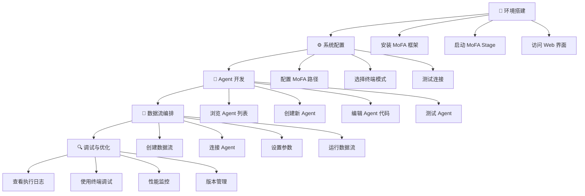

# MoFA_Stage

[English](README.md) | 中文

MoFA_Stage 是一个 Web 界面的开发工具，用于管理和编辑 MoFA 框架中的 Nodes 和 Dataflows。

## 功能

- **Agent 管理**
  - 浏览 Agent 列表
  - 创建和复制 Agent
  - 编辑 Agent 文件
  - 运行和停止 Agent
  - 查看运行日志

- **终端访问**
  - Web 终端
  - SSH 连接
  - ttyd 集成

- **代码编辑**
  - 文本编辑器
  - 文件浏览
  - VSCode Server 集成（可选）

## 技术栈

**后端**
- Python + Flask
- WebSocket 支持
- SSH 终端集成
- RESTful API

**前端**
- Vue 3 + Element Plus
- Monaco 编辑器

**第三方服务**
- ttyd（推荐）
- code-server（可选）


### 快速开始

#### 环境要求

**系统支持**
- Linux（支持 apt-get 和 yum 包管理系统）
- macOS
- Windows 暂不支持，推荐使用 WSL（Windows Subsystem for Linux）

**软件要求**
- Python 3.8 或更高
- Node.js 14 或更高
- 已安装 MoFA 框架

#### 安装和运行脚本

项目提供了两个脚本：

- **install**: 一键安装所有依赖
  ```bash
  chmod +x install
  ./install
  ```
  自动安装后端/前端依赖，支持选择 Docker 或传统安装方式。运行后会提示是否运行，选择是则执行run脚本。本地部署时，应选择非docker部署。

- **run**: 一键启动服务
  ```bash
  chmod +x run
  ./run
  ```
  支持 Docker 和传统部署模式。本地部署时，应选择非docker部署。

##### 关于Docker 部署（推荐）

###### 使用 Docker 可以避免所有环境问题，实现最快速的部署：

```bash
# 直接运行安装脚本即可选择docker部署
./install
./run

# 也可以单独配置：

# 一行命令部署前端
docker run -d -p 3000:80 liyao1119/mofa-stage-frontend

# 启动后端
cd backend && python app.py
```

**🚀 快速开始（30秒部署）**

**方法一：使用官方镜像（推荐）**

```bash
# 1. 拉取并启动前端
docker run -d -p 3000:80 --name mofa-frontend \
  --add-host=host.docker.internal:host-gateway \
  liyao1119/mofa-stage-frontend:latest

# 2. 克隆仓库并启动后端
git clone https://github.com/mofa-org/mofa-stage.git
cd mofa-stage/backend
pip install -r requirements.txt
python app.py

# 3. 访问系统
# 打开浏览器：http://localhost:3000
```

**方法二：本地构建**

```bash
# 1. 克隆代码
git clone https://github.com/mofa-org/mofa-stage.git
cd mofa-stage

# 2. 使用安装脚本（支持选择Docker模式）
./install

# 3. 启动服务
./run
```

**📋 系统要求**

- Docker Desktop（[下载地址](https://www.docker.com/products/docker-desktop/)）
- Python 3.8+（仅后端需要）
- 4GB 可用内存

### 开发模式（手动启动）

1. 启动后端
```bash
cd backend
python app.py
```

2. 启动前端（开发模式）
```bash
cd frontend
npm run dev
```

访问 http://localhost:3000 。

### 生产部署


1. 构建前端
```bash
cd frontend
npm run build  # 生成在 dist 目录
```

2. 部署方式（二选一）

**使用 Nginx**

```nginx
server {
    listen 80;
    
    # 静态文件
    location / {
        root /path/to/mofa_stage/frontend/dist;
        try_files $uri $uri/ /index.html;
    }
    
    # API 转发
    location /api {
        proxy_pass http://localhost:5002;
        proxy_set_header Host $host;
        proxy_set_header X-Real-IP $remote_addr;
    }
    
    # WebSocket
    location /api/webssh {
        proxy_pass http://localhost:5001;
        proxy_http_version 1.1;
        proxy_set_header Upgrade $http_upgrade;
        proxy_set_header Connection "upgrade";
    }
}
```

**简易部署**

使用 Python 自带的 HTTP 服务器：
```bash
cd frontend/dist
python -m http.server 3000
```

启动后端：
```bash
cd backend
python app.py
```

## 常见问题

### 端口占用

如果遇到端口占用问题，可以用这条命令释放端口：

```bash
for port in 3000 5001 5002 7681; do
    pid=$(lsof -t -i:$port)
    if [ -n "$pid" ]; then
        kill -9 $pid
        echo "释放了端口 $port"
    fi
done
```

### 端口说明

| 服务 | 端口 | 说明 |
|------|------|------|
| 前端 | 3000 | Web界面 |
| 后端API | 5002 | Flask服务 |
| WebSSH | 5001 | SSH终端 |
| ttyd | 7681 | Web终端 |
| VS Code | 8080 | 代码编辑器 |

### ttyd 安装失败

如果 ttyd 自动安装失败，可以参考 [ttyd GitHub 页面](https://github.com/tsl0922/ttyd) 手动安装。

### Docker 相关问题

**Q: 提示端口被占用？**
```bash
# 查看占用3000端口的进程
lsof -i :3000
# 或更改端口映射
docker run -d -p 8000:80 ...
```

**Q: 容器无法连接后端？**
确保后端服务已启动：
```bash
cd backend && python app.py
```

**Q: 如何更新到最新版本？**
```bash
docker pull liyao1119/mofa-stage-frontend:latest
docker stop mofa-frontend
docker rm mofa-frontend
# 重新运行docker run命令
```

**Q: 如何查看容器日志？**
```bash
docker logs mofa-frontend
```

## Docker 高级配置

### 自定义构建

```bash
cd frontend
# 修改配置后构建
docker build -t my-mofa-frontend .
docker run -d -p 3000:80 my-mofa-frontend
```

### 故障排查

1. **检查Docker是否正常运行**
   ```bash
   docker ps
   ```

2. **检查网络连接**
   ```bash
   curl http://localhost:3000
   curl http://localhost:5002/api/settings
   ```

3. **重启容器**
   ```bash
   docker restart mofa-frontend
   ```

## 目录结构

```
mofa-stage/
├── backend/
│   ├── app.py              # 主应用
│   ├── config.py           # 配置文件
│   ├── routes/             # API 路由
│   │   ├── agents.py       # Agent 管理
│   │   ├── terminal.py     # 终端功能
│   │   ├── webssh.py       # SSH 连接
│   │   ├── vscode.py       # VSCode 集成
│   │   ├── settings.py     # 设置管理
│   │   ├── ttyd.py         # ttyd 集成
│   │   └── mermaid.py      # 图表渲染
│   ├── utils/              # 工具模块
│   │   ├── mofa_cli.py     # MoFA 命令封装
│   │   ├── file_ops.py     # 文件操作
│   │   └── ttyd_manager.py # ttyd 管理
│   └── requirements.txt    # Python 依赖
├── frontend/
│   ├── src/
│   │   ├── views/          # 页面组件
│   │   ├── components/     # UI 组件
│   │   ├── api/            # API 调用
│   │   ├── store/          # 状态管理
│   │   └── router/         # 路由配置
│   └── package.json        # Node.js 依赖
├── install.sh              # 安装脚本
└── run.sh                  # 启动脚本
``` 

## 用户旅程图



