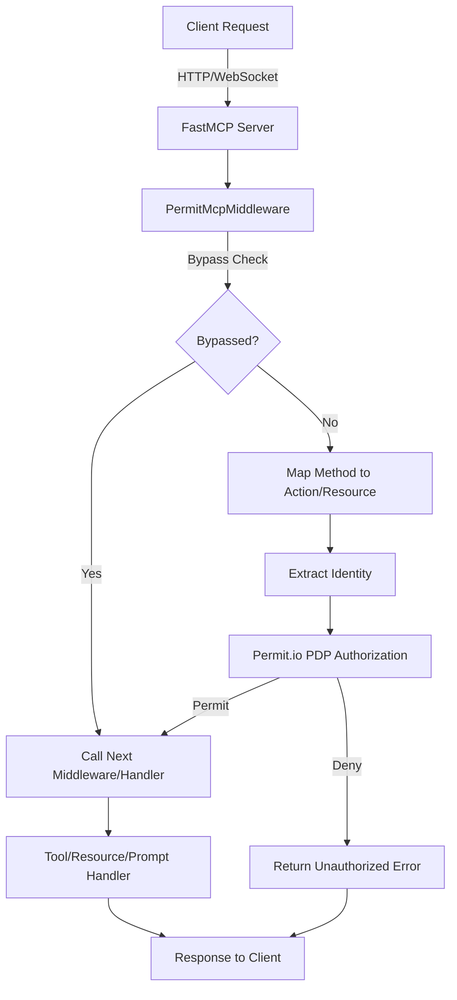

# permit-fastmcp

A FastMCP middleware that adds Permit.io authorization to your MCP servers. This middleware intercepts MCP requests and validates them against Permit.io policies before allowing them to proceed.

## Introduction

`permit-fastmcp` provides seamless integration between FastMCP servers and Permit.io's authorization system. It acts as middleware that:

- Intercepts all MCP requests (tools, resources, prompts)
- Validates permissions using Permit.io's Policy Decision Point (PDP)
- Logs authorization decisions for audit purposes
- Supports configurable bypass methods for initialization and health checks

This enables fine-grained access control for your MCP tools and resources based on user identity, roles, and attributes.

## Installation

```bash
# Using UV (recommended)
uv add permit-fastmcp

# Using pip
pip install permit-fastmcp
```

## Quick Start

### 1. Basic Usage

```python
from fastmcp import FastMCP
from permit_fastmcp.middleware import create_permit_middleware

# Create your FastMCP server
mcp = FastMCP("My MCP Server")

# Add Permit.io authorization middleware
mcp.add_middleware(create_permit_middleware(
    permit_api_key="your-permit-api-key"
))

@mcp.tool
def my_tool(data: str) -> str:
    return f"Processed: {data}"

if __name__ == "__main__":
    mcp.run(transport="http")
```

### 2. Advanced Configuration

```python
from permit_fastmcp.middleware import create_permit_middleware

# Configure with custom settings
middleware = create_permit_middleware(
    permit_pdp_url="http://localhost:7766",
    permit_api_key="your-api-key",
    enable_audit_logging=True,
    bypass_methods=["initialize", "ping", "health/*"]
)

mcp.add_middleware(middleware)
```

## Quickstart: Example Server with JWT Authentication

This project includes an example FastMCP server with Permit.io authorization and JWT-based authentication.

### 1. Install dependencies

```bash
uv venv
source .venv/bin/activate
uv sync
```

### 2. Run the example server

```bash
python permit_fastmcp/example_server/example.py
```

### 3. Login and get a JWT token

Use the `login` tool with username/password (e.g., `admin`/`password` or `client`/`client`). This will return a JWT token.

### 4. Call a tool with JWT authentication

Use the `greet-jwt` tool, passing the JWT as a Bearer token in the `Authorization` header. The tool will greet the user extracted from the JWT.

- Example JWT header: `Authorization: Bearer <your-token>`

See `permit_fastmcp/example_server/example.py` for the full example implementation.

## Getting Started

Follow these steps to get up and running with permit-fastmcp:

1. **Clone the repository**

   ```bash
   git clone <repository-url>
   cd permit-fastmcp
   ```

2. **Set up a virtual environment (recommended)**

   ```bash
   uv venv
   source .venv/bin/activate
   uv sync
   ```
   Or use `python3 -m venv .venv && source .venv/bin/activate && pip install -r requirements.txt`.

3. **Run the example server**

   ```bash
   python permit_fastmcp/example_server/example.py
   ```

4. **Login to get a JWT token**

   Use the `login` tool with username/password (e.g., `admin`/`password` or `client`/`client`). This will return a JWT token.

5. **Call a tool with JWT authentication**

   Use the `greet-jwt` tool, passing the JWT as a Bearer token in the `Authorization` header:

   ```http
   Authorization: Bearer <your-token>
   ```

6. **Explore and extend**

   - Review the example server in `permit_fastmcp/example_server/example.py`.
   - See the configuration options in `permit_fastmcp/middleware/config.py`.
   - Add your own tools and customize the middleware as needed.

For more advanced configuration and integration with Permit.io, see the sections below.

## Configuration

### Environment Variables

All configuration can be set via environment variables with the `PERMIT_MCP_` prefix:

```bash
# Permit.io configuration
export PERMIT_MCP_PERMIT_PDP_URL="http://localhost:7766"
export PERMIT_MCP_PERMIT_API_KEY="your-api-key"

# Method configuration
export PERMIT_MCP_KNOWN_METHODS='["tools/list","tools/call","resources/read"]'
export PERMIT_MCP_BYPASSED_METHODS='["initialize","ping"]'

# Prefix configuration
export PERMIT_MCP_ACTION_PREFIX="mcp_"
export PERMIT_MCP_RESOURCE_PREFIX="mcp_"

# Logging configuration
export PERMIT_MCP_ENABLE_AUDIT_LOGGING="true"
```

### Using .env file

Create a `.env` file in your project root:

```env
PERMIT_MCP_PERMIT_PDP_URL=http://localhost:7766
PERMIT_MCP_PERMIT_API_KEY=your-api-key
PERMIT_MCP_ENABLE_AUDIT_LOGGING=true
PERMIT_MCP_ACTION_PREFIX=mcp_
PERMIT_MCP_RESOURCE_PREFIX=mcp_
```

### Configuration Settings Reference

| Environment Variable | Description | Default |
|---------------------|-------------|---------|
| PERMIT_MCP_KNOWN_METHODS | Methods recognized for resource/action mapping | ["tools/list", "prompts/list", "resources/list", "tools/call", "resources/read", "prompts/get"] |
| PERMIT_MCP_BYPASSED_METHODS | Methods that bypass authorization checks | ["initialize", "ping", "notifications/*"] |
| PERMIT_MCP_ACTION_PREFIX | Prefix for Permit.io action mapping | "" |
| PERMIT_MCP_RESOURCE_PREFIX | Prefix for Permit.io resource mapping | "mcp_" |
| PERMIT_MCP_MCP_SERVER_NAME | Name of the MCP server (used as resource name for tool calls) | "mcp_server" |
| PERMIT_MCP_PERMIT_PDP_URL | Permit.io PDP URL | "http://localhost:7766" |
| PERMIT_MCP_PERMIT_API_KEY | Permit.io API key | "" |
| PERMIT_MCP_ENABLE_AUDIT_LOGGING | Enable or disable audit logging | true |
| PERMIT_MCP_IDENTITY_MODE | Identity extraction mode: 'jwt', 'fixed', 'header', or 'source' | "fixed" |
| PERMIT_MCP_IDENTITY_HEADER | Header to extract identity from (for 'jwt' and 'header' modes) | "Authorization" |
| PERMIT_MCP_IDENTITY_HEADER_REGEX | Regex to extract token from header (for 'jwt' mode) | "[Bb]earer (.+)" |
| PERMIT_MCP_IDENTITY_JWT_SECRET | JWT secret or public key (for 'jwt' mode) | "" |
| PERMIT_MCP_IDENTITY_JWT_FIELD | JWT field to use as identity (for 'jwt' mode) | "sub" |
| PERMIT_MCP_IDENTITY_FIXED_VALUE | Fixed identity value (for 'fixed' mode) | "client" |
| PERMIT_MCP_JWT_ALGORITHMS | Allowed JWT algorithms (for 'jwt' mode) | ["HS256", "RS256"] |
| PERMIT_MCP_PREFIX_RESOURCE_WITH_SERVER_NAME | Whether to prefix resources with the MCP server name (for non-tool calls) | true |

## Identity Extraction Options

The middleware supports several modes for extracting the user identity from incoming requests. This is controlled by the `PERMIT_MCP_IDENTITY_MODE` environment variable. The available modes are:

- `fixed`: Always use a fixed identity value (set by `PERMIT_MCP_IDENTITY_FIXED_VALUE`).
- `header`: Extract the identity from a specific HTTP header (set by `PERMIT_MCP_IDENTITY_HEADER`).
- `jwt`: Extract and verify a JWT from a header, and use a field from the JWT payload as the identity (set by `PERMIT_MCP_IDENTITY_HEADER`, `PERMIT_MCP_IDENTITY_HEADER_REGEX`, `PERMIT_MCP_IDENTITY_JWT_SECRET`, and `PERMIT_MCP_IDENTITY_JWT_FIELD`).
- `source`: Use the `source` field from the context (if present).

**JWT Mode Details:**

- The JWT is extracted from the header using a regex (default: after the word "Bearer ").
- The JWT is verified using the secret or public key provided in `PERMIT_MCP_IDENTITY_JWT_SECRET`.
- The identity is taken from the field specified by `PERMIT_MCP_IDENTITY_JWT_FIELD` (default: `sub`).
- Supported algorithms: `HS256`, `RS256` (configurable via `PERMIT_MCP_JWT_ALGORITHMS`).

**Security Best Practices:**

- Never commit your JWT secret or private key to version control.
- Use environment variables or a secure secret manager to provide secrets in production.
- Always use HTTPS in production to protect headers and tokens in transit.
- Validate the JWT's expiration (`exp`) and issued-at (`iat`) claims.
- Use strong, unique secrets for HMAC (HS256) or a secure public/private key pair for RSA (RS256).

**Example JWT Header:**

    Authorization: Bearer <your-jwt-token>

See the `permit_fastmcp/example_server/example.py` for a working example of JWT authentication and identity extraction.

### Examples

#### 1. Fixed Identity (default)

```env
PERMIT_MCP_IDENTITY_MODE=fixed
PERMIT_MCP_IDENTITY_FIXED_VALUE=my-client-id
```

#### 2. Identity from HTTP Header

```env
PERMIT_MCP_IDENTITY_MODE=header
PERMIT_MCP_IDENTITY_HEADER=X-Client-ID
```

#### 3. Identity from JWT in Authorization Header

```env
PERMIT_MCP_IDENTITY_MODE=jwt
PERMIT_MCP_IDENTITY_HEADER=Authorization
PERMIT_MCP_IDENTITY_HEADER_REGEX=[Bb]earer (.+)
PERMIT_MCP_IDENTITY_JWT_SECRET=your-jwt-secret-or-public-key
PERMIT_MCP_IDENTITY_JWT_FIELD=sub
```

#### 4. Identity from Context Source Field

```env
PERMIT_MCP_IDENTITY_MODE=source
```

- The identity will be taken from the `source` field of the context if present, otherwise 'unknown'.

- The JWT is extracted from the header using the regex (default: after the word "Bearer ").
- The JWT is verified using the provided secret or public key.
- The identity is taken from the specified field in the JWT payload (default: `sub`).

### Customization

- You can change the header name, regex, or JWT field as needed for your environment.
- If you use a different signing algorithm, adjust the code or open an issue for support.

## How It Works

### Request Flow

1. **Request Interception**: The middleware intercepts all MCP requests
2. **Method Extraction**: Extracts the method name and parameters
3. **Bypass Check**: Skips authorization for configured bypass methods
4. **Permission Mapping**: Maps MCP methods to Permit.io actions and resources
5. **Authorization Check**: Calls Permit.io PDP to validate permissions
6. **Response**: Either allows the request to proceed or returns an error

### Method Mapping

The middleware automatically maps MCP methods to Permit.io resources:

- `tools/call` → `mcp_tools:tool_name` (execute action)
- `resources/read` → `mcp_resources:resource_uri` (read action)
- `prompts/get` → `mcp_prompts:prompt_name` (read action)
- `tools/list` → `mcp_tools` (access action)
- `resources/list` → `mcp_resources` (access action)
- `prompts/list` → `mcp_prompts` (access action)

### User Identity

By default, the middleware uses `context.source` as the user identifier. You can customize this by extending the `_extract_principal_info` method in your middleware subclass.

## MCP Request Flow with Permit.io Authorization

The following diagram illustrates the flow of an MCP request through the Permit.io authorization middleware:



This flow ensures that every request is checked against your Permit.io policies before being processed by your MCP tools or resources.

## Permit.io Setup

### 1. Create Permit.io Account

1. Sign up at [permit.io](https://permit.io)
2. Create a new project and environment
3. Get your API key from the dashboard

### 2. Set Up PDP (Policy Decision Point)

```bash
# Pull and run the PDP container
docker pull permitio/pdp-v2:latest
docker run -it -p 7766:7000 \
  --env PDP_DEBUG=True \
  --env PDP_API_KEY=your-api-key \
  permitio/pdp-v2:latest
```

### 3. Configure Policies

In your Permit.io dashboard:

1. **Create Resources**: Define your MCP resources (tools, resources, prompts)
2. **Create Actions**: Define actions (execute, read, access)
3. **Create Roles**: Define user roles and permissions
4. **Assign Permissions**: Grant roles permission to perform actions on resources

Example policy: "Users with 'developer' role can execute tools in the 'mcp_tools' resource"

## Development

### Local Development Setup

```bash
# Clone the repository
git clone <repository-url>
cd permit-fastmcp

# Set up virtual environment with UV
uv venv
source .venv/bin/activate  # On macOS/Linux
# or .venv\Scripts\activate on Windows

# Install dependencies
uv sync

# Run tests
uv run pytest
```

### Adding New Dependencies

```bash
# Add new dependency
uv add <package-name>

# Install all dependencies
uv sync
```

## Examples

### Basic Server with Authorization

```python
from fastmcp import FastMCP
from permit_fastmcp.middleware import create_permit_middleware

mcp = FastMCP("Secure MCP Server")

# Add authorization middleware
mcp.add_middleware(create_permit_middleware(
    permit_api_key="your-api-key"
))

@mcp.tool
def secure_tool(data: str) -> str:
    # This tool will only be accessible to authorized users
    return f"Secure result: {data}"

@mcp.tool
def public_tool() -> str:
    # This tool will be accessible to all users (if policy allows)
    return "Public information"
```

### Custom User Extraction

```python
from permit_fastmcp.middleware import PermitMcpMiddleware

class CustomPermitMiddleware(PermitMcpMiddleware):
    def _extract_principal_info(self, context):
        # Extract user from custom headers or context
        user_id = getattr(context, 'user_id', None)
        if not user_id:
            # Fallback to source
            user_id = getattr(context, 'source', 'unknown')
        
        attributes = {
            "source": getattr(context, 'source', 'unknown'),
            "user_id": user_id
        }
        return user_id, attributes

# Use custom middleware
mcp.add_middleware(CustomPermitMiddleware(
    permit_api_key="your-api-key"
))
```

## Troubleshooting

### Common Issues

1. **PDP Connection Error**: Ensure your PDP container is running and accessible
2. **Authorization Denied**: Check your Permit.io policies and user assignments
3. **Method Not Found**: Verify the method is in your `KNOWN_METHODS` configuration

### Debug Logging

Enable debug logging to troubleshoot issues:

```python
import logging
logging.basicConfig(level=logging.DEBUG)
```

## Contributing

1. Fork the repository
2. Create a feature branch
3. Make your changes
4. Add tests
5. Submit a pull request

## License

This project is licensed under the Apache License 2.0. See the LICENSE file for details.

