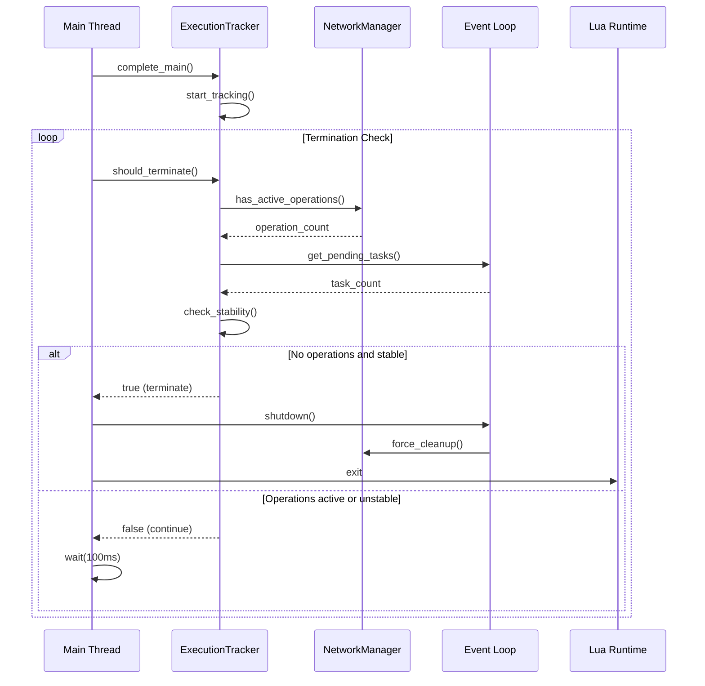

# PLua Architecture Documentation

## Unified Coroutine Callback Model

**All Lua callbacks in PLua (timers, network, WebSocket, etc.) are always wrapped in coroutines by the runtime.**

- When a callback is invoked (e.g., timer fires, network event, WebSocket message), PLua automatically creates a coroutine and runs the callback inside it.
- If the callback yields (e.g., waiting for another event), the coroutine is suspended and can be resumed by a future callback.
- If the callback returns or errors, the coroutine is cleaned up. Errors are caught and printed to the log.
- **User code can always yield/resume in any callback, without worrying about coroutine context.**
- There is no need for users to check `coroutine.isyieldable()` or manually wrap their own coroutines for event handlers.
- This model applies to all timer, interval, network, and WebSocket callbacks.

### Example

```lua
setTimeout(function()
  print("Timer fired!")
  local ok, data = coroutine.yield("wait for something")
  print("Resumed with:", ok, data)
end, 1000)
```

The above will always work, regardless of how the callback is invoked.

---

## Timer and Interval System

PLua implements timers and intervals in pure Lua, using the unified coroutine callback model. All timer callbacks are run in coroutines, so they can yield/resume as needed.

## Network and WebSocket Callbacks

All network and WebSocket event callbacks are also run in coroutines. This means you can write synchronous-looking code using `yield`/`resume` patterns in any network or WebSocket event handler.

---

## Error Handling

If a callback errors, the error is caught and printed to the log. Dead coroutines are cleaned up automatically.

---

## Benefits

- **Simplicity:** Users never need to check coroutine context or wrap their own coroutines for event handlers.
- **Consistency:** All callbacks behave the same way, regardless of source.
- **Safety:** Errors are caught and reported, and resources are managed automatically.

---

## Overview

PLua is a Python-based Lua interpreter that uses the Lupa library to provide a Lua 5.4 environment with custom Python-extended functions. The system is built around an asyncio event loop architecture that enables true asynchronous operations while maintaining compatibility with Lua's synchronous programming model.

## Core Architecture

### High-Level System Architecture


### Event Loop Management Architecture


## Asyncio Integration Strategy

### Threading Model

PLua uses a hybrid threading model to bridge Lua's synchronous execution with Python's asyncio:


### Execution Phases

The system tracks execution phases to determine when to terminate:


## Network Architecture

### TCP/UDP Connection Management


### Network Operation Flow


## Timer Architecture

### Timer Management System


## Extension System Architecture

### Extension Registration and Discovery


### Extension Function Flow


## Termination Detection

### Smart Shutdown Architecture


### Termination Flow



## Web Server Architecture

### Web Server Integration


## Debugging Architecture

### MobDebug Integration


## Key Design Principles

### 1. Thread Safety
- Lua execution happens in the main thread
- Asyncio operations run in the event loop thread
- Callbacks are executed in the main thread via `call_soon()`
- Background operations use thread pools for CPU-intensive tasks

### 2. Graceful Termination
- Smart detection of active operations
- Stability checking to avoid premature termination
- Force cleanup when timeout is reached
- Proper event loop shutdown

### 3. Extension System
- Registry-based function discovery
- Category-based organization
- Automatic Lua table creation
- Support for both sync and async operations

### 4. Error Handling
- Comprehensive exception handling in all layers
- Graceful degradation for network failures
- Proper cleanup on errors
- Debug output for troubleshooting

## Performance Considerations

### Event Loop Efficiency
- Single event loop per process
- Efficient task scheduling
- Minimal overhead for callback execution
- Proper resource cleanup

### Memory Management
- Connection pooling for network operations
- Automatic cleanup of completed operations
- Proper Lua object lifecycle management
- Memory leak prevention through proper shutdown

### Scalability
- Support for multiple concurrent connections
- Efficient timer management
- Background thread pools for heavy operations
- Web server with async request handling

## Future Enhancements

### Planned Improvements
1. **Connection Pooling**: Implement connection reuse for HTTP requests
2. **Streaming Support**: Add support for streaming network operations
3. **WebSocket Support**: Native WebSocket client and server
4. **Database Extensions**: Add database connectivity extensions
5. **Plugin System**: Allow third-party extension development
6. **Performance Profiling**: Built-in performance monitoring
7. **Distributed Tracing**: Support for distributed operation tracing

### Architecture Evolution
- Maintain backward compatibility
- Incremental feature additions
- Performance optimization
- Enhanced debugging capabilities
- Better error reporting and recovery

## Single-Process, Embedded API Server

The FastAPI server is now always started and managed by the PLua interpreter itself (embedded). This provides a unified, single-process architecture for development and testing.

### Architecture Overview


### Key Features

- **Single Process**: No separate API server process or registration required
- **Direct Integration**: API calls go directly to `_PY.fibaroapi()` function
- **Redirect Support**: Can redirect requests to real HC3 servers for testing
- **Non-blocking HTTP**: Asyncio-based HTTP requests prevent blocking
- **Legacy Fallback**: Automatic fallback to urllib-based requests if needed

### HTTP Request Architecture

The system uses a hybrid HTTP request approach:


### HTTP Client Implementation

The HTTP client uses a multi-layered approach:

1. **Primary**: Asyncio-based with httpx (non-blocking)
2. **Fallback**: Legacy urllib-based implementation
3. **Threading**: Separate thread for asyncio operations
4. **Timeout**: Configurable timeouts with automatic fallback

```python
# Primary implementation (asyncio + httpx)
async def async_request():
    async with httpx.AsyncClient(timeout=30.0) as client:
        response = await client.request(method, url, headers=headers, data=body)
        return response.json()

# Fallback implementation (urllib)
def legacy_request():
    with urllib.request.urlopen(request, context=context, timeout=10) as response:
        return json.loads(response.read().decode())
```

### Redirect Handling

The embedded API server can handle redirects to external HC3 servers:

```lua
-- Lua handler can return redirect response
function handle_devices_request()
    return {
        _redirect = true,
        hostname = "http://192.168.1.57/",  -- Full URL
        port = 80
    }
end
```

The server automatically:
1. Detects `_redirect` flag in response
2. Extracts hostname and port
3. Makes HTTP request to external server
4. Returns actual data from external server

### Benefits

- **Simplified Setup**: No need to run separate API server
- **Better Integration**: Direct access to Lua environment
- **Flexible Testing**: Can mock data or redirect to real servers
- **Non-blocking**: HTTP requests don't block the main thread
- **Reliable**: Multiple fallback mechanisms ensure operation
- **Development Friendly**: Easy to switch between mock and real data

### Usage

To run PLua with the new architecture:

```bash
# Install in development mode
uv pip install -e .

# Run a Lua script
plua [your_lua_file.lua]

# Or use the module form
python -m plua [your_lua_file.lua] 