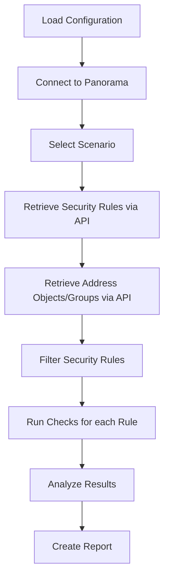

# pins

[](https://pypi.org/project/policy-inspector/)
[](https://pypi.org/project/policy-inspector/)
[](https://opensource.org/licenses/MIT)
[](https://github.com/psf/black)
[](https://python-poetry.org/)

**Policy Inspector for Palo Alto Networks** - Analyze firewall security policies and detect shadowed rules.


**pins** is a command-line tool that connects directly to your Palo Alto Panorama to analyze firewall security policies in real-time. It identifies shadowed rules, validates configurations, and provides comprehensive security policy insights.

## Key Features

- **🔍 Shadowing Detection**: Identifies rules that will never trigger due to preceding rules
- **🌐 Direct API Integration**: Connects to Panorama via REST API - no manual exports needed
- **🔧 Multi-Device Group Support**: Analyze multiple device groups simultaneously
- **📊 Advanced Analysis**: Resolves IP addresses for precise shadowing detection
- **📈 Multiple Output Formats**: Text, HTML, JSON, and CSV reporting
- **🔌 Extensible Framework**: Easy to add custom scenarios and checks

---

## Table of Contents

- [A Simple Example](#a-simple-example)
- [Installation](#installation)
- [Quick Start](#quick-start)
- [Usage](#usage)
- [Configuration Options](#configuration-options)
- [Scenarios](#scenarios)
- [Available Examples](#available-examples)
- [Troubleshooting](#troubleshooting)
- [Contributing](#contributing)
- [License](#license)

## A Simple Example

Get started in seconds with the built-in examples:

```bash
# Try the demo with sample data
pins run example shadowing-basic

# Or analyze your actual Panorama device groups
pins run shadowing --device-groups "Production" "DMZ"
```

**What it does:** Scans your firewall rules and identifies which ones are "shadowed" (hidden behind other rules and will never execute).

> [!NOTE]  
> pins requires direct connectivity to Palo Alto Panorama and uses REST API for all data retrieval. No manual file exports needed.

## Installation

```bash
pip install policy-inspector
```

**Alternative methods:**

```bash
# Using pipx (recommended for CLI tools)
pipx install policy-inspector

# Using poetry
poetry add policy-inspector
```

**Requirements:** Python 3.9+

## Documentation

For detailed documentation, advanced usage, and API reference, visit our [documentation site](https://pins.readthedocs.io/) _(coming soon)_.

**Quick Links:**

- [Configuration Guide](#configuration-options)
- [Available Scenarios](#scenarios)
- [Troubleshooting](#troubleshooting)
- [Contributing Guide](#contributing)

## Quick Start

### Prerequisites

Before using pins, ensure you have:

- **Direct network access** to your Palo Alto Panorama instance
- **Valid credentials** with API access permissions
- **REST API enabled** on your Panorama (version 10.0 or higher recommended)

### 1. Try the Demo First

Before connecting to your Panorama, see how _pins_ works with built-in example data:

```shell
# See available examples
pins run example --help

# Run a basic example
pins run example shadowing-basic
```

This demonstrates shadowing analysis using sample firewall rules. Even if the display output isn't fully implemented yet, you'll see the analysis process in action.

**What you'll see:**

- Connection to mock data sources
- Loading of security rules and objects
- Processing messages showing the analysis workflow

### 2. Create Configuration File

For real analysis, create a `config.yaml` file with your Panorama connection details:

```yaml file=config-quickstart.yaml
# Configuration file for Policy Inspector (pins)
# Save this as config.yaml in your working directory

# Panorama connection settings
panorama:
    hostname: "your-panorama.company.com"
    username: "your-username"
    password: "your-password"
    api_version: "v11.1"
    verify_ssl: false
# Optional: Control output formats
# show: ["text"]  # Display results in terminal
# export: ["html", "json"]  # Export results to files

# Optional: Specify device groups to analyze
# device_groups: ["Production", "DMZ"]
```

**Security Note:** For production use, consider using environment variables for credentials instead of storing passwords in config files.

### 3. Run Your First Analysis

Now analyze your actual firewall policies:

```shell
# Analyze specific device groups using your config
pins run shadowing --device-groups "DG-Production" "DG-DMZ"

# Advanced analysis with IP address resolution
pins run shadowingvalue --device-groups "DG-Production"

# Use a custom config file location
pins run shadowing --config /path/to/your-config.yaml --device-groups "Production"
```

**Expected Output:**

- A summary of shadowed rules displayed in your terminal
- Optional export to HTML/JSON files if configured
- Clear identification of which rules are being shadowed and why

> [!NOTE]  
> If you see "No show function registered" messages, this indicates the display formatting is still in development. The analysis logic runs successfully, but output formatting may need additional implementation.

### Common First-Time Issues

**"No device groups found":**

- Verify device group names are exactly as they appear in Panorama
- Check that your API user has read permissions for the specified device groups

**"Connection refused":**

- Ensure Panorama's management interface is accessible from your network
- Verify that the REST API is enabled on Panorama

**"Authentication failed":**

- Double-check username and password in your config file
- Ensure the API user account is not locked or expired

### Troubleshooting

If you encounter issues during setup or execution:

**Configuration Issues:**

- Ensure your `config.yaml` file is correctly formatted (YAML syntax)
- The config file option is `--config` not `--config-file`
- Device groups parameter uses `--device-groups` (multiple values supported)

**Connection Problems:**

- Verify network connectivity to your Panorama instance
- Check API credentials and permissions
- Ensure REST API is enabled on Panorama

**Getting Help:**

- Use `pins --help` to see all available commands
- Use `pins run <command> --help` for command-specific options
- Run `pins run example shadowing-basic` to test with sample data first

## Usage

### Basic Commands

```bash
# Show main help
pins --help

# List all available scenarios
pins list

# Show help for a specific scenario
pins run shadowing --help
```

### Running Analysis

```bash
# Basic shadowing analysis
pins run shadowing --device-groups "Production" "DMZ"

# Advanced analysis with IP address resolution
pins run shadowingvalue --device-groups "Production"

# Use custom config file
pins run shadowing --config /path/to/config.yaml --device-groups "Production"

# Export results to multiple formats
pins run shadowing --device-groups "Production" --show table --export html json
```

### Working with Examples

```bash
# See all available examples
pins run example --help

# Run specific examples
pins run example shadowing-basic
pins run example shadowing-multiple-dg
pins run example shadowingvalue-basic
pins run example shadowingvalue-with-export
```

### Configuration Options

You can customize the analysis behavior in your `config.yaml`:

```yaml
# Panorama connection (required for live analysis)
panorama:
    hostname: "panorama.company.com"
    username: "api-user"
    password: "secure-password"
    api_version: "v11.1" # Default: v11.1
    verify_ssl: false # Default: false

# Optional: Control output formats
show: ["text"] # Console output: text, table, rich
export: ["html", "json"] # File exports: html, json, csv

# Optional: Default device groups to analyze
device_groups: ["Production", "DMZ"]
```

**Alternative: Use CLI Options**

You can override any config file setting using command-line options:

```shell
# Override config file settings
pins run shadowing \
  --panorama-hostname panorama.company.com \
  --panorama-username admin \
  --panorama-password \
  --device-groups "Production" \
  --show table \
  --export json
```

## Scenarios

List of currently available scenarios.

### Shadowing (`shadowing`)

Identifies policies that will never be triggered because they're
completely hidden behind earlier rules in the processing order.

It checks if all these elements are covered by a preceding rule:

- Same action (allow/deny)
- Same or broader source and destination zones
- Same or broader source and destination addresses
- Same or broader applications
- Same or broader services (ports)

When **all conditions match**, the later rule is **flagged as
shadowed**.

**Usage:**

```shell
pins run shadowing --device-groups "DG-Production"
```

### Advanced Shadowing (`shadowingvalue`)

Advanced version of [Shadowing](#shadowing). It analyzes the
actual IP addresses behind Address Objects and Address Groups.

It identifies shadowing at the precise IP subnet level by resolving Address
names to actual IP addresses, providing more accurate detection of truly
shadowed rules.

**Usage:**

```shell
pins run shadowingvalue --device-groups "DG-Production"
```

**Requirements:**

- Address Objects and Address Groups must be accessible via Panorama API
- Proper API permissions to read object configurations

## Details

### How does it work?

_pins_ connects directly to your Palo Alto Panorama and analyzes security policies in real-time.



**Key Features:**

- **Real-time Analysis**: Direct API connection to Panorama eliminates the need for manual file exports
- **Device Group Support**: Analyze multiple device groups simultaneously
- **Flexible Configuration**: YAML-based configuration with environment-specific settings
- **Multiple Output Formats**: Support for text, HTML, and JSON report formats

### What _Scenarios_ is?

A scenario is a set of [checks](#what-_check_-is) that **evaluate firewall rules
against specific issues or configurations**. Each scenario is
designed to identify particular problem, such as shadowing rules, rules without
logging, or other security policy issues.

### What _Check_ is?

A _check_ is simply a function. It takes security policy or policies
as an argument, assess whether the policies fulfill a check or not.

## Available Examples

You can explore _pins_ functionality with built-in examples that use mock data:

```shell
# Basic shadowing scenario
pins run example shadowing-basic

# Multiple device groups scenario
pins run example shadowing-multiple-dg

# Advanced shadowing with IP resolution
pins run example shadowingvalue-basic

# Advanced example with export options
pins run example shadowingvalue-with-export
```

**Example Output Walkthrough:**

When you run an example, you'll see:

1. **Initialization**: Connection to mock data sources
2. **Data Loading**: Security rules and address objects being processed
3. **Analysis**: The shadowing detection logic running
4. **Results**: Analysis results (formatting may vary based on implementation status)

## Troubleshooting

### Common Issues

**Connection Errors:**

- Verify network connectivity to Panorama
- Check if REST API is enabled on Panorama
- Confirm API user has proper permissions

**Authentication Failures:**

- Verify username and password in config.yaml
- Ensure API user account is not locked
- Check if multi-factor authentication is disabled for API user

**No Rules Found:**

- Verify device group names are correct
- Check if the specified device groups contain security rules
- Ensure API user has read permissions for the device groups

### Configuration Tips

**For Production Use:**

```yaml
panorama:
    hostname: "panorama.company.com"
    username: "pins-api-user"
    password: "secure-password"
    verify_ssl: true # Enable SSL verification
    api_version: "v11.1"
```

**For Testing/Lab:**

```yaml
panorama:
    hostname: "lab-panorama.local"
    username: "admin"
    password: "admin"
    verify_ssl: false # Default: false (for self-signed certs)
    api_version: "v11.1" # Default: v11.1
```

**Security Best Practices:**

- Use dedicated API user accounts with minimal required permissions
- Consider environment variables for passwords: `password: "${PANORAMA_PASSWORD}"`
- Enable SSL verification (`verify_ssl: true`) in production environments

## Output Formats

_pins_ supports multiple output formats for both display and export:

**Display Options (`--show`):**

- **text**: Human-readable console output (default)
- **table**: Structured table format
- **rich**: Enhanced formatting with colors and styling

**Export Options (`--export`):**

- **json**: Machine-readable format for integration with other tools
- **html**: Rich web-based reports with interactive elements
- **csv**: Spreadsheet-compatible format

**Configure in YAML:**

```yaml
show: ["text"] # Console output
export: ["html", "json"] # File exports
```

**Or use CLI options:**

```shell
pins run shadowing --device-groups "Production" --show table --export json html
```

## Contributing

We welcome contributions! Here's how you can help:

**🐛 Found a bug?** [Open an issue](https://github.com/Kanguros/pins/issues)  
**💡 Have a feature idea?** [Start a discussion](https://github.com/Kanguros/pins/discussions)  
**🔧 Want to contribute code?** Check our [development setup](#development)

### Development

Set up your development environment:

```bash
git clone https://github.com/Kanguros/pins
cd pins
poetry install --with=dev
pre-commit install --install-hooks
```

Run tests and checks:

```bash
pytest
pre-commit run --all-files
```

## Community & Support

- **📚 Documentation**: _(coming soon)_
- **💬 Discussions**: [GitHub Discussions](https://github.com/Kanguros/pins/discussions)
- **🐛 Issues**: [GitHub Issues](https://github.com/Kanguros/pins/issues)
- **📧 Email**: Contact the maintainer at [urbanek.kamil@gmail.com](mailto:urbanek.kamil@gmail.com)

## License

This project is licensed under the MIT License - see the [LICENSE](LICENSE) file for details.
