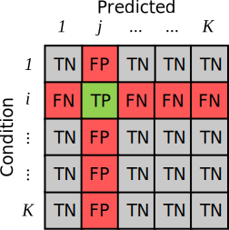

# Generating Confusion Matrices

Let $f$ be some classification model, $f:\mathcal{X}\rightarrow \mathcal{Y}$. Evaluated on a dataset $(x_{n},y_{n})\in\mathcal{D}$ of size $N$, the classifier produces a set of predictions $\hat{y}_n$, whose value lies in $\{1..|\mathcal{Y}|\}$; i.e., for each input data point, the classification produces a probable class.

The confusion matrix, $\mathbf{C}$, is a $\left|\mathcal{Y}\right|\times\left|\mathcal{Y}\right|$ matrix whose entries contain the count of each $(y_{n}, \hat{y}_{n})$ pair. Thus, element $\mathbf{C}_{i,j}$ denotes the number of times the model predict class $i$, when it should have predicted class $j$.

In a binary classification scenario ($|\mathcal{Y}|=2$), each element of the confusion matrix has a semantic interpretation. Assuming the positive class has index $1$, element $\mathbf{C}_{1,1}$ contains the number of True Positives (TP). The model correctly predicted the condition was present. Element $\mathbf{C}_{1,2}$ contains the count of False Negatives (FN). The model predicted the condition was *not* present, when in truth it was. This is the opposite of element $\mathbf{C}_{2,1}$, the False Positives (FP). There the model does predict the condition is present, when in truth it is not. Finally, element $\mathbf{C}_{2,2}$ contains the count of all predictions which correctly estimated that the condition was not present, the True Negatives (TN).

<!-- TODO:  update this figure. FP <-> FN -->

</img>

For convenience, we normalize $\mathbf{C}$, such that $\sum_{i,j}\mathbf{C}_{i,j}=1$. Instead of counts, each element now contains the proportion of predictions that is a TP, FP, FN or TN. In effect, we can see this as the joint probability distribution $p(Y, \hat{Y})$.

## Binary Confusion Matrices

...

Totsch et al. () model the binary confusion matrix through the product of probabilities:

- The prevalence $\phi$, or how often the condition occurs

$$
\phi=\dfrac{\text{TP}+\text{FN}}{\text{TP}+\text{FN}+\text{FP}+\text{TN}}
$$

- The True Positive Rate (TPR), or the proportion of times the model predicts the condition is present, conditioned on the fact that the condition is actually present

$$\text{TPR}=\dfrac{\text{TP}}{\text{TP}+\text{FN}}$$

- The True Negative Rate (TNR), or the proportion of times the model predicts the condition is not present, conditioned on the fact that the condition is actually *not* present

$$\text{TNR}=\dfrac{\text{TN}}{\text{TN}+\text{FP}}$$

With these 3 proportions, it is possible to reconstruct the entire confusion matrix as:

$$
\mathbf{C}=\begin{bmatrix}
    \phi\cdot\text{TPR} & \phi\cdot(1-\text{TPR}) \\
    (1-\phi)\cdot(1-\text{TNR}) & (1-\phi)\cdot\text{TNR} \\
\end{bmatrix}
$$

To generate counterfactual confusion matrices, they model each probability as a [Beta-Binomial distribution](https://en.wikipedia.org/wiki/Beta-binomial_distribution), with the following posteriors:

$$
\begin{align*}
    \phi&\sim \text{Beta}\left(\alpha+\text{TP}+\text{FP},\beta+\text{FN}+\text{TN}\right) \\
    \text{TPR}&\sim \text{Beta}\left(\alpha+\text{TP},\beta+\text{FP}\right) \\
    \text{TNR}&\sim \text{Beta}\left(\alpha+\text{TN},\beta+\text{FN}\right)
\end{align*}
$$

Here, $\alpha$ and $\beta$ are prior hyperparameters.

With the Totsch model, it's possible to produce plausible synthetic confusion matrices by sampling a prevalence, true positive rate and true negative rate independently, and computing four products. At least for their purposes, this model proved highly effective at generating counterfactual confusion matrices, and allowed the authors to provide confidence intervals for any metric.

## Multi-Class Confusion Matrices

While the Totsch model is useful for binary confusion matrices, it does not allow for modelling multi-class confusion matrices. In a multi-class confusion matrix, each class has its own set of TP, FN, FP, and TN. Specifically, all the elements on the same row or column form the FN and FP, respectively, and the TN are all elements which share neither the same row or column.

</img>

Luckily, an extension is easily made. Recall that we can view the normalized confusion matrix as the joint probability distribution: $p(Y, \hat{Y})$. By the definition of the conditional probability distribution, we can rewrite this as,

$$
p(Y, \hat{Y})=p(\hat{Y}|Y)p(Y)
$$

Here $p(Y)$ is the probability of a particular condition occurring, i.e., the prevalence, and $p(\hat{Y}|Y)$ is the probability of a model making a certain prediction, given that the ground-truth condition is $Y=y$. We call this the confusion conditional.

Note that the above $\text{TPR}$ and $\text{TNR}$ rates are essentially just different elements of that confusion conditional:

$$
\begin{align*}
\text{TPR}=p(Y=2|\hat{Y}=1),&\quad (1-\text{TPR})=p(Y=1|\hat{Y}=1)\\
\text{TNR}=p(Y=1|\hat{Y}=2),&\quad (1-\text{TNR})=p(Y=2|\hat{Y}=2) \\
\end{align*}
$$

So in practice, the Totsch model is just computing the product between the prevalence of a class $p(Y)$, and the confusion conditional, $p(\hat{Y}|Y)$. This is easy to replicate in a multi-class setting. We sample each row of the confusion conditional and the prevalence marginal from a [Dirichlet-Multinomial model](https://en.wikipedia.org/wiki/Dirichlet-multinomial_distribution). Then, to construct a confusion matrix, we compute the product between the two. Specifically, we generate each synthetic confusion matrix, $\tilde{\mathbf{C}}$ as the Hadamard product between the sampled conditional confusion matrix, and the sampled prevalence vector:

$$
\begin{align*}
\tilde{\mathbf{C}}=~~&\text{Diag}(\phi)
\begin{bmatrix}
    \tilde{C}_{1}   \\
    \vdots          \\
    \tilde{C}_{|\mathcal{Y}|}
\end{bmatrix} \\
&\phi\sim\text{Dirichlet}(\alpha_{1}+\sum_{j}^{|\mathcal{Y}|}\mathbf{C}_{1,j},\ldots \alpha_{|\mathcal{Y}|}+\sum_{j}^{|\mathcal{Y}|}\mathbf{C}_{|\mathcal{Y}|,j}) \\
&\tilde{C}_{1}\sim \text{Dirichlet}(\alpha_{1,1}+\mathbf{C}_{1,1},\ldots, \alpha_{1,|\mathcal{Y}|}+\mathbf{C}_{1,|\mathcal{Y}|}) \\
&\qquad\qquad\vdots \\
&\tilde{C}_{|\mathcal{Y}|}\sim \text{Dirichlet}(\alpha_{|\mathcal{Y}|,1}+\mathbf{C}_{|\mathcal{Y}|,1},\ldots, \alpha_{|\mathcal{Y}|,|\mathcal{Y}|}+\mathbf{C}_{|\mathcal{Y}|,|\mathcal{Y}|})
\end{align*}
$$

where $\alpha$ are again various prior hyperparameters. In total, we learn $\mathcal{Y}+1$ Dirichlet-Multinomial posteriors, and sample from each independently to produce a synthetic confusion matrix. The output of the product is a $\mathcal{Y}\times \mathcal{Y}$ matrix, normalized such that $\sum_{i,j}\tilde{\mathbf{C}}_{i,j}=1$.
