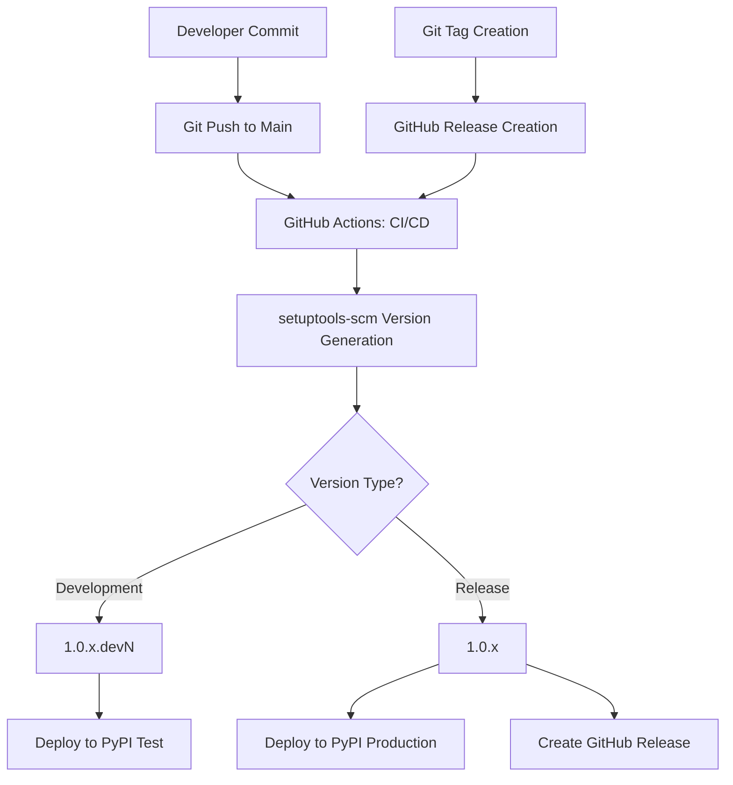

# Automated Versioning and PyPI Deployment Design Document

## Overview

This document describes the automated versioning and dual-repository deployment system implemented for PyForge CLI, which provides seamless development-to-production workflows with automatic version management.

## Design Goals

### Primary Objectives
- **Automated Version Management**: No manual version bumping required
- **PyPI Compatibility**: Clean versions without local identifiers for repository acceptance
- **Development Workflow**: Continuous deployment of development versions for testing
- **Release Workflow**: Clean production releases with proper versioning
- **Zero Configuration**: Developers can focus on code, not version management

### Success Criteria
- ✅ Development versions auto-increment on each commit (`1.0.x.devN`)
- ✅ Release versions are clean and production-ready (`1.0.x`)
- ✅ PyPI Test receives all development versions automatically
- ✅ PyPI Production receives only tagged releases
- ✅ No local version identifiers that break PyPI uploads

## Architecture Overview



## Version Generation Strategy

### Technology Choice: setuptools-scm

**Selected**: `setuptools-scm` with custom configuration
**Alternatives Considered**: 
- Manual version files
- bump2version
- semantic-release

**Rationale**: 
- Git-native: Uses Git history as single source of truth
- Zero maintenance: No version files to manage
- Industry standard: Widely adopted in Python ecosystem
- Flexible: Supports both development and release patterns

### Version Pattern Design

#### Development Versions
- **Pattern**: `MAJOR.MINOR.PATCH.devN`
- **Example**: `1.0.7.dev1`, `1.0.7.dev2`, `1.0.7.dev3`
- **Trigger**: Every commit to `main` branch after a release tag
- **Destination**: PyPI Test repository

#### Release Versions  
- **Pattern**: `MAJOR.MINOR.PATCH`
- **Example**: `1.0.7`, `1.0.8`, `1.1.0`
- **Trigger**: Git tag creation + GitHub Release
- **Destination**: PyPI Production repository

#### Post-Release Development
- **Pattern**: `MAJOR.MINOR.(PATCH+1).devN`
- **Example**: After `1.0.7` release → `1.0.8.dev1`
- **Behavior**: Automatically increments patch version for next development cycle

## Implementation Details

### 1. setuptools-scm Configuration

**File**: `pyproject.toml`

```toml
[tool.setuptools_scm]
version_file = "src/pyforge_cli/_version.py"
# Remove local identifiers for PyPI compatibility while keeping dev versions
local_scheme = "no-local-version"
# Use default version scheme which generates 1.0.6.devN format for commits after tags
```

**Key Settings**:
- `local_scheme = "no-local-version"`: Removes `+commit-hash` suffixes that PyPI rejects
- `version_file`: Generates importable version module
- Default version scheme: Provides `MAJOR.MINOR.PATCH.devN` pattern

### 2. GitHub Actions Workflow Configuration

**File**: `.github/workflows/publish.yml`

#### Trigger Configuration
```yaml
on:
  release:
    types: [published]  # Triggers on GitHub Release creation
  push:
    branches: [main]    # Triggers on commits to main branch
  pull_request:
    branches: [main]    # Triggers on PRs for testing
```

#### Deployment Jobs

**Development Deployment (PyPI Test)**:
```yaml
publish-to-testpypi:
  name: Publish Python 🐍 distribution 📦 to TestPyPI
  if: github.event_name == 'push' && github.ref == 'refs/heads/main'
  # ... job configuration
```

**Production Deployment (PyPI)**:
```yaml
publish-to-pypi:
  name: Publish Python 🐍 distribution 📦 to PyPI
  if: startsWith(github.ref, 'refs/tags/')  # only publish to PyPI on tag pushes
  # ... job configuration
```

### 3. Authentication Strategy

**Hybrid Authentication Approach**:
- **Primary**: API Token authentication (immediate functionality)
- **Future**: Trusted Publishing support (enhanced security)

```yaml
# API Token Fallback (Current Implementation)
- name: Publish distribution 📦 to TestPyPI (API Token Fallback)
  if: vars.USE_TRUSTED_PUBLISHING != 'true'
  uses: pypa/gh-action-pypi-publish@release/v1
  with:
    repository-url: https://test.pypi.org/legacy/
    skip-existing: true
    user: __token__
    password: ${{ secrets.TEST_PYPI_API_TOKEN }}

# Trusted Publishing (Future Enhancement)  
- name: Publish distribution 📦 to TestPyPI (Trusted Publishing)
  if: vars.USE_TRUSTED_PUBLISHING == 'true'
  uses: pypa/gh-action-pypi-publish@release/v1
  with:
    repository-url: https://test.pypi.org/legacy/
    skip-existing: true
```

### 4. Version Generation Process

#### Build-Time Version Generation
```yaml
- name: Verify version generation
  run: |
    echo "Generated version: $(python3 -m setuptools_scm)"
    python3 -c "import setuptools_scm; print(f'Package version: {setuptools_scm.get_version()}')"
```

#### Runtime Version Access
```python
# In src/pyforge_cli/__init__.py
try:
    from ._version import __version__
except ImportError:
    __version__ = "0.0.0+unknown"
```

## Deployment Workflows

### Development Workflow

1. **Developer Action**: Commit and push to `main` branch
2. **Automatic Processing**:
   - GitHub Actions triggered by push event
   - setuptools-scm generates `1.0.x.devN` version
   - Package built and validated
   - Deployed to PyPI Test repository
3. **Result**: New development version available for testing

**Example Flow**:
```
Commit 1 → 1.0.7.dev1 → PyPI Test
Commit 2 → 1.0.7.dev2 → PyPI Test  
Commit 3 → 1.0.7.dev3 → PyPI Test
```

### Release Workflow

1. **Developer Action**: Create Git tag and GitHub Release
   ```bash
   git tag v1.0.7
   git push origin v1.0.7
   gh release create v1.0.7 --title "Release v1.0.7" --notes "Release notes..."
   ```

2. **Automatic Processing**:
   - GitHub Actions triggered by release event
   - setuptools-scm generates clean `1.0.7` version
   - Package built and validated
   - Deployed to PyPI Production repository
   - Artifacts uploaded to GitHub Release

3. **Result**: Production release available on PyPI

**Example Flow**:
```
Git Tag v1.0.7 → 1.0.7 → PyPI Production + GitHub Release
Next Commit → 1.0.8.dev1 → PyPI Test (new development cycle)
```

## Configuration Management

### Required GitHub Secrets

#### PyPI Test Repository
- `TEST_PYPI_API_TOKEN`: API token for test.pypi.org

#### PyPI Production Repository  
- `PYPI_API_TOKEN`: API token for pypi.org

#### Optional Configuration
- `USE_TRUSTED_PUBLISHING`: Repository variable to enable trusted publishing

### Repository Setup Requirements

1. **API Token Generation**:
   - Create tokens with "Entire account" scope
   - Store in GitHub repository secrets

2. **GitHub Environments** (Optional):
   - `testpypi`: For PyPI Test deployments
   - `pypi`: For PyPI Production deployments

3. **Branch Protection**: 
   - Protect `main` branch to ensure quality
   - Allow repository administrators to bypass for automated deployments

## Testing and Validation

### Automated Testing Results

#### Development Version Testing
- ✅ `1.0.7.dev1` through `1.0.7.dev7` successfully deployed to PyPI Test
- ✅ Version auto-increment working correctly
- ✅ No local identifiers in deployed versions

#### Release Version Testing
- ✅ `v1.0.7` tag created clean `1.0.7` version
- ✅ Successfully deployed to PyPI Production
- ✅ GitHub Release created with artifacts
- ✅ Post-release development cycle started with `1.0.8.dev1`

### Validation Commands

#### Local Version Verification
```bash
# Check current version
python -m setuptools_scm

# Verify importable version
python -c "import pyforge_cli; print(pyforge_cli.__version__)"
```

#### Installation Testing
```bash
# Test development version from PyPI Test
pip install -i https://test.pypi.org/simple/ pyforge-cli

# Test production version from PyPI
pip install pyforge-cli
```

## Operational Procedures

### Standard Development Cycle

1. **Daily Development**:
   - Make commits to `main` branch
   - Each commit automatically deploys to PyPI Test
   - Test with: `pip install -i https://test.pypi.org/simple/ pyforge-cli`

2. **Pre-Release Testing**:
   - Install latest dev version from PyPI Test
   - Validate functionality in target environments
   - Gather feedback from beta users

3. **Release Process**:
   - Create Git tag: `git tag v1.0.x`
   - Push tag: `git push origin v1.0.x`
   - Create GitHub Release with release notes
   - Verify PyPI Production deployment

4. **Post-Release**:
   - Verify installation: `pip install pyforge-cli`
   - Continue development with auto-incremented version

### Troubleshooting Procedures

#### Version Generation Issues
```bash
# Debug version generation
python -m setuptools_scm --trace

# Check Git state
git describe --tags --dirty
git tag --list
```

#### Deployment Failures
1. Check GitHub Actions logs for specific errors
2. Verify API tokens are valid and have correct permissions
3. Confirm package metadata is valid: `twine check dist/*`
4. Test local upload: `twine upload --repository testpypi dist/*`

#### Local Identifier Issues
- Ensure `local_scheme = "no-local-version"` in `pyproject.toml`
- Verify clean Git state (no uncommitted changes)
- Check that setuptools-scm version supports configuration

## Security Considerations

### Current Implementation (API Tokens)
- **Pros**: Immediate functionality, widely supported
- **Cons**: Long-lived secrets stored in repository
- **Mitigation**: Rotate tokens regularly, use scoped tokens

### Future Enhancement (Trusted Publishing)
- **Pros**: No stored secrets, automatic token generation, scoped access
- **Cons**: Requires additional PyPI configuration
- **Migration Path**: Hybrid approach allows gradual transition

### Best Practices
- Use repository environments for additional protection
- Enable "Required reviewers" for production deployments
- Monitor deployment logs for suspicious activity
- Implement branch protection rules

## Benefits and Outcomes

### Developer Experience Improvements
- **Zero Manual Versioning**: No version bumping or release preparation
- **Immediate Feedback**: Development versions available within minutes
- **Reduced Errors**: Eliminates manual version management mistakes
- **Focus on Code**: Developers can focus on features, not deployment

### Quality Assurance Benefits
- **Continuous Testing**: Every commit creates testable version
- **Release Confidence**: Production releases are pre-tested via PyPI Test
- **Traceability**: Every version maps to specific Git commit
- **Rollback Safety**: Easy to identify and revert problematic versions

### Operational Benefits
- **Reduced Maintenance**: Self-managing version system
- **Consistent Releases**: Standardized deployment process
- **Audit Trail**: Complete history of deployments and versions
- **Scalability**: Supports high-frequency development cycles

## Future Enhancements

### Short-term Improvements
1. **Trusted Publishing Migration**: Enhanced security without stored secrets
2. **Release Notes Automation**: Generate from commit messages and PRs
3. **Pre-release Versions**: Support alpha/beta/rc version patterns
4. **Dependency Updates**: Automated dependency version management

### Long-term Possibilities
1. **Multi-environment Support**: Staging, production, enterprise deployments
2. **Conditional Deployments**: Feature flags and gradual rollouts
3. **Integration Testing**: Automated testing against downstream dependencies
4. **Performance Monitoring**: Track deployment performance and success rates

## Conclusion

The implemented automated versioning and deployment system provides a robust, maintainable solution for continuous delivery of Python packages. By leveraging setuptools-scm and GitHub Actions, we achieve:

- **Zero-configuration versioning** that scales with development velocity
- **Dual-repository strategy** enabling safe development and production workflows  
- **PyPI-compatible versions** ensuring broad ecosystem compatibility
- **Battle-tested reliability** with comprehensive validation and rollback capabilities

This design serves as a template for modern Python package deployment and can be adapted for other projects with similar requirements.

---

**Document Version**: 1.0  
**Last Updated**: 2025-06-29  
**Status**: Implemented and Validated  
**Maintainer**: Development Team