# RAFT Toolkit

## 📋 Table of Contents

- [RAFT Toolkit](#raft-toolkit)
  - [📋 Table of Contents](#-table-of-contents)
  - [🚀 Overview](#-overview)
    - [What is RAFT?](#what-is-raft)
      - [RAFT Training Process Flow](#raft-training-process-flow)
    - [Key Features](#key-features)
    - [RAFT vs Traditional RAG](#raft-vs-traditional-rag)
  - [📦 Installation](#-installation)
    - [Quick Start](#quick-start)
    - [Installation Options](#installation-options)
      - [🚀 **Core Installation** (Fastest - ~30-60 seconds)](#-core-installation-fastest---30-60-seconds)
      - [📊 **Standard Installation** (Recommended)](#-standard-installation-recommended)
      - [🌐 **Complete Installation**](#-complete-installation)
      - [🛠️ **Development Installation**](#️-development-installation)
      - [🎯 **Custom Combinations**](#-custom-combinations)
      - [🐳 **Docker Installation**](#-docker-installation)
  - [🌐 Usage](#-usage)
    - [Web Interface](#web-interface)
    - [Command Line Interface](#command-line-interface)
    - [Using Ollama for Local Models](#using-ollama-for-local-models)
  - [📝 RAFT Training Guide](#-raft-training-guide)
    - [Best Practices](#best-practices)
      - [Document Preparation](#document-preparation)
      - [Question Generation](#question-generation)
      - [Dataset Composition](#dataset-composition)
      - [Quality Assurance](#quality-assurance)
    - [Chunking Strategies](#chunking-strategies)
      - [📏 Chunk Size Guidelines](#-chunk-size-guidelines)
      - [🔄 Overlap Strategy](#-overlap-strategy)
      - [❓ Questions Per Chunk](#-questions-per-chunk)
      - [🎭 Distractor Configuration](#-distractor-configuration)
      - [⚙️ Strategy-Specific Recommendations](#️-strategy-specific-recommendations)
    - [The RAFT Process](#the-raft-process)
      - [1. **Training Data Generation** (This Toolkit)](#1-training-data-generation-this-toolkit)
      - [2. **Model Fine-Tuning**](#2-model-fine-tuning)
      - [3. **Evaluation \& Iteration**](#3-evaluation--iteration)
  - [📝 Template System](#-template-system)
    - [Default Template Behavior](#default-template-behavior)
    - [Available Templates](#available-templates)
      - [Embedding Templates](#embedding-templates)
      - [Question-Answer Generation Templates](#question-answer-generation-templates)
    - [Template Configuration](#template-configuration)
    - [Template Variables](#template-variables)
      - [Embedding Templates](#embedding-templates-1)
      - [QA Generation Templates](#qa-generation-templates)
    - [Domain-Specific Examples](#domain-specific-examples)
      - [Medical Documents](#medical-documents)
      - [Legal Documents](#legal-documents)
      - [Technical Documentation](#technical-documentation)
  - [🔧 Advanced Configuration](#-advanced-configuration)
    - [Rate Limiting](#rate-limiting)
      - [Why Rate Limiting Matters](#why-rate-limiting-matters)
      - [Quick Start Examples](#quick-start-examples)
      - [Rate Limiting Strategies](#rate-limiting-strategies)
      - [Available Presets](#available-presets)
    - [Enhanced Logging](#enhanced-logging)
      - [🚀 **Production Deployment**](#-production-deployment)
    - [File Utilities](#file-utilities)
  - [🏗️ Architecture \& Development](#️-architecture--development)
    - [Project Structure](#project-structure)
    - [Architecture Overview](#architecture-overview)
  - [🧪 Testing](#-testing)
    - [Running Tests](#running-tests)
    - [Test Categories](#test-categories)
    - [Dependency Troubleshooting](#dependency-troubleshooting)
    - [Docker Testing](#docker-testing)
    - [Code Quality](#code-quality)
    - [Security Scanning](#security-scanning)
  - [🛠️ Command Line Tools](#️-command-line-tools)
    - [Available Tools](#available-tools)
    - [Quick Examples](#quick-examples)
    - [Complete Workflow](#complete-workflow)
  - [🛠️ Fine-tuning \& Evaluation](#️-fine-tuning--evaluation)
    - [Model Fine-tuning](#model-fine-tuning)
    - [Legacy Tool Usage](#legacy-tool-usage)
  - [🚀 Deployment](#-deployment)
  - [📚 Documentation](#-documentation)
    - [Getting Started](#getting-started)
    - [Architecture \& Design](#architecture--design)
    - [Usage \& Reference](#usage--reference)
    - [Development \& Testing](#development--testing)
    - [Deployment \& Operations](#deployment--operations)
    - [Releases \& Changes](#releases--changes)
    - [Technical Guides](#technical-guides)
    - [Troubleshooting \& Fixes](#troubleshooting--fixes)
    - [Other Documentation](#other-documentation)

## 🚀 Overview

### What is RAFT?

**RAFT (Retrieval Augmented Fine-Tuning)** is a technique that trains language models to better utilize retrieved documents when answering questions. Unlike traditional RAG systems that rely on frozen pre-trained models, RAFT fine-tunes models specifically for document-based reasoning tasks.

The RAFT Toolkit automates the creation of training datasets by generating `{question, answer, documents}` triplets from your documents, enabling you to fine-tune models that excel at retrieval-augmented generation tasks.

#### RAFT Training Process Flow

```mermaid
graph TD
    A[📄 Input Sources<br/>Local, S3, SharePoint] --> B{🔧 RAFT Toolkit<br/>CLI or Web UI}
    
    B --> C[📑 Document Chunking<br/>Semantic/Fixed/Sentence]
    C --> D[❓ Question Generation<br/>LLM-powered Q&A creation]
    D --> E[📝 Answer Generation<br/>Context-based responses]
    E --> F[🎭 Distractor Addition<br/>Irrelevant docs for robustness]
    F --> G[📊 Training Dataset<br/>JSONL/Parquet format]
    
    G --> H[🤖 Model Fine-tuning<br/>OpenAI/HuggingFace/Azure]
    H --> I[🎯 Fine-tuned Model<br/>Domain-optimized LLM]
    
    G --> J{🛠️ Analysis Tools}
    J --> K[📈 Dataset Evaluation<br/>eval.py]
    J --> L[💬 Answer Generation<br/>answer.py]  
    J --> M[🔍 PromptFlow Analysis<br/>pfeval_*.py]
    
    K --> N[📊 Performance Metrics]
    L --> O[🔄 Model Comparison]
    M --> P[📋 Quality Assessment]
    
    N --> Q[✨ Production Model<br/>Optimized for RAG tasks]
    O --> Q
    P --> Q
    
    style B fill:#e1f5fe,color:#000000
    style J fill:#f3e5f5,color:#000000
    style Q fill:#e8f5e8,color:#000000
```



**🔧 Toolkit Components:**

- **Core Engine**: Document processing and dataset generation
- **Analysis Tools**: Six evaluation and comparison utilities  
- **Web Interface**: Visual workflow management and monitoring
- **CLI Tools**: Scriptable automation and batch processing

### Key Features

**Features:**

- 📊 **Dual Interface**: Command-line tool and modern web interface
- 🛠️ **Analysis Tools Suite**: Evaluation, answer generation, and PromptFlow analysis
- 🏗️ **12-Factor Architecture**: Cloud-native, scalable design
- 📄 **Multi-Format Support**: PDF, TXT, JSON, PPTX, and API documentation
- ☁️ **Multiple Input Sources**: Local files, Amazon S3, SharePoint Online
- 🔐 **Enterprise Authentication**: AWS credentials, Azure AD, SharePoint integration
- 🎯 **Flexible Output**: HuggingFace, OpenAI completion/chat, and evaluation formats
- ⚡ **Parallel Processing**: Configurable workers for optimal performance
- 📋 **Enhanced Logging**: Production-ready logging with progress tracking, external service integration (Sentry, DataDog), and structured output
- 📊 **Observability**: Optional LangWatch integration for LLM call tracing and performance monitoring
- 🧪 **Comprehensive Testing**: Unit, integration, API, and CLI test suites
- 🐳 **Container Ready**: Docker support for easy deployment
- 🚀 **Kubernetes Ready**: Complete Kubernetes deployment configurations

### RAFT vs Traditional RAG

| Aspect | Traditional RAG | RAFT Fine-Tuning |
|--------|-----------------|-------------------|
| **Model Training** | Uses frozen pre-trained models | Fine-tunes models on domain-specific data |
| **Document Utilization** | May ignore or misuse retrieved documents | Learns to effectively use retrieved information |
| **Performance** | Depends on base model's retrieval reasoning | Optimized for specific document types/domains |
| **Latency** | Requires runtime retrieval + inference | Faster inference with better document integration |
| **Setup Complexity** | Lower initial setup | Higher setup (requires training data generation) |
| **Customization** | Limited to prompt engineering | Deep customization through fine-tuning |

**When to Use RAFT vs Traditional RAG:**

**Use RAFT Fine-Tuning When:**

- You have consistent document types/formats
- Performance on document reasoning is critical
- You can invest time in data generation and training
- You need predictable, high-quality outputs
- Latency optimization is important

**Use Traditional RAG When:**

- Working with diverse, changing document types
- Quick prototyping or proof-of-concept needed
- Limited resources for training data generation
- Documents change frequently
- General-purpose question answering is sufficient

## 📦 Installation

> **📋 Complete Installation Guide:** For detailed installation instructions, prerequisites, Docker setup, and advanced configuration options, see [docs/INSTALLATION_GUIDE.md](docs/INSTALLATION_GUIDE.md).

### Quick Start

```bash
# Clone the repository
git clone https://github.com/your-repo/raft-toolkit.git
cd raft-toolkit

# Set up environment
cp .env.example .env
# Edit .env with your OpenAI API key

# Fast installation (core functionality only)
pip install .

# Or standard installation (recommended)
pip install .[standard]

# Test installation
python -m cli.main --datapath sample_data/sample.pdf --output ./output --preview
```

### Installation Options

Choose the installation that best fits your needs:

#### 🚀 **Core Installation** (Fastest - ~30-60 seconds)

```bash
pip install .
```

**Includes:** Basic CLI, document processing, OpenAI integration  
**Use cases:** Quick testing, lightweight deployments, basic CI

#### 📊 **Standard Installation** (Recommended)

```bash
pip install .[standard]
```

**Includes:** Full AI/ML functionality, embeddings, LangChain ecosystem  
**Use cases:** Production deployments, full RAFT functionality

#### 🌐 **Complete Installation**

```bash
pip install .[complete]
```

**Includes:** Standard + cloud services + observability  
**Use cases:** Enterprise deployments, cloud integration

#### 🛠️ **Development Installation**

```bash
pip install .[all]
```

**Includes:** Everything + development tools  
**Use cases:** Contributing, local development, full testing

#### 🎯 **Custom Combinations**

```bash
# Web interface with AI
pip install .[standard,web]

# Cloud deployment with tracing
pip install .[ai,langchain,cloud,tracing]

# Development with specific features
pip install .[standard,dev]
```

#### 🐳 **Docker Installation**

```bash
docker compose up -d
```

**🚀 Performance Note:** The optimized dependency structure provides **70-80% faster CI builds** compared to previous versions. See [CI Optimization Guide](docs/CI_OPTIMIZATION.md) for details.

**📚 Installation Resources:**

- [Complete Installation Guide](docs/INSTALLATION_GUIDE.md) - Detailed setup instructions
- [Requirements Management](docs/REQUIREMENTS.md) - Dependency structure and installation patterns

**📚 CLI Documentation:**

- [CLI Reference Guide](docs/CLI-Reference.md) - Comprehensive CLI parameter documentation
- [CLI Quick Reference](docs/CLI-Quick-Reference.md) - Quick reference card for CLI parameters

## 🌐 Usage

### Web Interface

> 📚 **See also**: [Web Interface Guide](docs/WEB_INTERFACE.md) for detailed documentation on all web UI features, analysis tools, and job management.

```bash
# Start the web server
python run_web.py

# Or with custom configuration
python run_web.py --host 0.0.0.0 --port 8080 --debug

# Open http://localhost:8000 in your browser
```

**Web UI Features:**

- 📤 **Dataset Generation**: Drag & drop file upload with visual configuration
- 🛠️ **Analysis Tools**: Six powerful evaluation and analysis tools
- ⚙️ **Visual Configuration**: Interactive forms for all settings
- 👀 **Live Preview**: See processing estimates before running
- 📊 **Job Management**: Track multiple processing jobs with real-time updates
- 📥 **Download Results**: Direct download of generated datasets and analysis results
- 📈 **Results Visualization**: Comprehensive display of metrics and statistics

**Analysis Tools Available:**

- **Dataset Evaluation**: Evaluate model performance with configurable metrics
- **Answer Generation**: Generate high-quality answers using various LLMs
- **PromptFlow Analysis**: Multi-dimensional evaluation (relevance, groundedness, fluency, coherence)
- **Dataset Analysis**: Statistical analysis and quality metrics
- **Model Comparison**: Side-by-side performance comparison
- **Batch Processing**: Automated workflows for multiple datasets

### Command Line Interface

> 📚 **Complete CLI Documentation:**
> - [CLI Reference Guide](docs/CLI-Reference.md) - Comprehensive documentation of all CLI parameters and options
> - [CLI Quick Reference](docs/CLI-Quick-Reference.md) - Quick reference card for common commands and use cases

The `tools/` directory contains powerful standalone evaluation utilities:

```bash
# Navigate to tools directory
cd tools/

# Install tool dependencies
pip install -r requirements.txt

# Run dataset evaluation
python eval.py --question-file dataset.jsonl --answer-file answers.jsonl

# Generate answers for evaluation
python answer.py --input questions.jsonl --output answers.jsonl --workers 8

# Run PromptFlow evaluation
python pfeval_chat.py --input dataset.jsonl --output evaluation.json
```

See the [tools/README.md](tools/README.md) for comprehensive documentation on all available tools.

**Basic Workflow:**

1. **Chunk Generation**: Document is split into chunks
2. **QA Generation**: LLM generates N questions and answers per chunk
3. **Distractor Appending**: Random chunks are added as distractors for each QA pair
4. **Dataset Export**: Data is saved in the specified format for fine-tuning

**Tips:**

- Use a `.env` file for OpenAI/Azure keys
- For Azure, set deployment names with `--completion-model` and `--embedding-model`
- Use `--chunking-strategy` and `--chunking-params` for best results on your data

### Using Ollama for Local Models

You can use [Ollama](https://ollama.com/) as a local OpenAI-compatible API for running models like Llama 3, Mistral, and others. This allows you to run RAFT without cloud API keys.

**1. Start Ollama with your desired model:**

```bash
ollama run llama3
```

**2. Set the OpenAI-compatible endpoint in your environment:**

```bash
export OPENAI_API_BASE_URL="http://localhost:11434/v1"
export OPENAI_API_KEY="ollama-anything"  # Any non-empty string
```

Or add these to your `.env` file:

```env
OPENAI_API_BASE_URL=http://localhost:11434/v1
OPENAI_API_KEY=ollama-anything
```

**3. Run RAFT as usual:**

```bash
python3 raft.py \
  --datapath sample_data/United_States_PDF.pdf \
  --output ./sample_ds4 \
  --distractors 4 \
  --doctype pdf \
  --chunk_size 512 \
  --questions 5 \
  --openai_key $OPENAI_API_KEY
```

**Note:**

- Ollama's API is compatible with the OpenAI API, but some advanced features may not be supported.
- You can specify different models by running `ollama run <model_name>` and setting the appropriate model in your RAFT command if needed.

## 📝 RAFT Training Guide

### Best Practices

> 📚 **See also**: [Complete Configuration Guide](docs/CONFIGURATION.md) for advanced RAFT configuration options and best practices.

#### Document Preparation

- **Quality Over Quantity**: Use high-quality, authoritative documents
- **Consistent Format**: Maintain consistent document structure and formatting
- **Domain Relevance**: Focus on documents representative of target use cases
- **Optimal Length**: Use documents of 1,000-10,000 tokens for best chunking results

#### Question Generation

- **Diverse Question Types**: Include factual, analytical, and inferential questions
- **Appropriate Difficulty**: Match question complexity to intended use case
- **Natural Language**: Generate questions that users would realistically ask
- **Coverage**: Ensure questions cover all important document sections

#### Dataset Composition

- **Distractor Ratio**: Use 3-5 distractor documents per training example
- **Oracle Probability**: Include source document 80-100% of the time
- **Balanced Difficulty**: Mix easy, medium, and hard questions
- **Size Guidelines**: Aim for 1,000-10,000 training examples minimum

#### Quality Assurance

- **Manual Review**: Sample and manually verify question-answer pairs
- **Consistency Checks**: Ensure answers are actually derivable from context
- **Bias Detection**: Check for dataset biases and systematic errors
- **Evaluation Split**: Reserve 10-20% of data for evaluation

### Chunking Strategies

Effective chunking is critical for RAFT success. Choose your strategy based on document type and use case:

#### 📏 Chunk Size Guidelines

| **Document Type** | **Recommended Chunk Size** | **Reasoning** |
|------------------|---------------------------|----------------|
| **Technical Documentation** | 300-512 tokens | Preserves complete concepts and code examples |
| **Legal Documents** | 512-768 tokens | Maintains clause/section coherence |
| **Medical Literature** | 256-512 tokens | Balances detail with focused topics |
| **Research Papers** | 512-1024 tokens | Captures complete paragraphs and findings |
| **FAQ/Knowledge Base** | 128-256 tokens | Each chunk = one question/topic |
| **News Articles** | 256-512 tokens | Preserves story coherence |

#### 🔄 Overlap Strategy

| **Overlap %** | **Use Case** | **Trade-offs** |
|--------------|-------------|----------------|
| **0%** | Distinct topics, FAQ | Clean separation, no redundancy |
| **10-20%** | Technical docs | Minimal context preservation |
| **20-40%** | Narrative content | Good context flow, some redundancy |
| **40-60%** | Complex topics | Maximum context, high redundancy |

```bash
# Low overlap for distinct topics
--chunking-params '{"overlap": 0}'

# Medium overlap for connected content  
--chunking-params '{"overlap": 100}'  # ~20% of 512 tokens

# High overlap for complex documents
--chunking-params '{"overlap": 200}'  # ~40% of 512 tokens
```

#### ❓ Questions Per Chunk

| **Questions/Chunk** | **Use Case** | **Quality vs Quantity** |
|-------------------|-------------|------------------------|
| **1-2** | High-quality, focused datasets | Maximum quality, minimal redundancy |
| **3-5** | Balanced approach (recommended) | Good quality, reasonable coverage |
| **6-10** | Comprehensive coverage | Risk of lower quality questions |

```bash
# Focused, high-quality
--questions 2 --chunk_size 512

# Balanced approach (recommended)
--questions 5 --chunk_size 384

# Comprehensive coverage
--questions 8 --chunk_size 256
```

#### 🎭 Distractor Configuration

| **Distractors** | **Training Benefit** | **Dataset Size Impact** |
|----------------|---------------------|------------------------|
| **2-3** | Basic robustness | Moderate increase |
| **4-6** | Strong robustness (recommended) | 5-7x dataset size |
| **7-10** | Maximum robustness | 8-11x dataset size |

```bash
# Recommended configuration
--distractors 4 --questions 5 --chunk_size 512

# Resource-constrained
--distractors 2 --questions 3 --chunk_size 384

# Maximum robustness
--distractors 6 --questions 3 --chunk_size 256
```

#### ⚙️ Strategy-Specific Recommendations

**🧠 Semantic Chunking** (Recommended)

```bash
--chunking-strategy semantic --chunk_size 512 \
--chunking-params '{"overlap": 50, "min_chunk_size": 200}'
```

- **Best for**: Most document types, preserves meaning
- **Overlap**: 50-100 tokens for context preservation
- **Min size**: 200 tokens to ensure meaningful chunks

**📐 Fixed Chunking**

```bash
--chunking-strategy fixed --chunk_size 384 \
--chunking-params '{"overlap": 75}'
```

- **Best for**: Consistent processing, structured documents
- **Overlap**: 15-25% of chunk size
- **Use when**: Semantic understanding less critical

**📝 Sentence Chunking**

```bash
--chunking-strategy sentence --chunk_size 256 \
--chunking-params '{"overlap": 0}'
```

- **Best for**: Natural language, narrative content
- **Overlap**: Usually 0 (sentence boundaries are natural breaks)
- **Chunk size**: Maximum tokens per chunk (actual size varies)

### The RAFT Process

#### 1. **Training Data Generation** (This Toolkit)

```bash
# Generate RAFT training dataset
python raft.py --datapath documents/ --output training_data/
```

- **Document Chunking**: Split documents into semantic chunks
- **Question Generation**: Create relevant questions for each chunk  
- **Answer Generation**: Generate accurate answers using the source chunk
- **Distractor Addition**: Include irrelevant documents to improve robustness
- **Format Conversion**: Export in format suitable for fine-tuning platforms

#### 2. **Model Fine-Tuning**

```bash
# Example with OpenAI fine-tuning
openai api fine_tunes.create \
  -t training_data.jsonl \
  -m gpt-3.5-turbo \
  --suffix "raft-medical-docs"
```

- **Platform Selection**: Choose fine-tuning platform (OpenAI, HuggingFace, etc.)
- **Model Selection**: Start with instruction-tuned base models
- **Training Configuration**: Set learning rate, epochs, batch size
- **Validation**: Monitor training metrics and validation performance

#### 3. **Evaluation & Iteration**

```bash
# Evaluate fine-tuned model
python tools/eval.py --model ft:gpt-3.5-turbo:suffix --question-file eval.jsonl
```

- **Performance Testing**: Compare against baseline models
- **Error Analysis**: Identify common failure patterns
- **Data Augmentation**: Generate additional training examples for weak areas
- **Iterative Improvement**: Refine dataset and retrain

## 📝 Template System

RAFT Toolkit includes a comprehensive template system for customizing prompts used in embedding generation and question-answer pair creation. Templates can be customized to improve quality and relevance for specific domains.

### Default Template Behavior

**No Configuration Required**: RAFT Toolkit works out of the box with intelligent defaults:

- Automatically selects appropriate templates based on model type (GPT, Llama, etc.)
- Provides robust fallback mechanisms if custom templates are not found
- Includes multiple layers of default templates for different complexity levels
- Gracefully handles missing template directories or malformed template files

```bash
# Works immediately with defaults - no template configuration needed
python raft.py --datapath docs/ --output training_data/
```

### Available Templates

#### Embedding Templates

- **`embedding_prompt_template.txt`**: Default template for embedding generation
  - Provides context and instructions for generating document embeddings
  - Supports variables: `{content}`, `{document_type}`, `{metadata}`
  - Customizable for domain-specific embedding optimization

#### Question-Answer Generation Templates

- **`gpt_template.txt`**: GPT-style question-answering template with reasoning and citations
- **`gpt_qa_template.txt`**: GPT question generation template with content filtering
- **`llama_template.txt`**: Llama-style question-answering template optimized for Llama models
- **`llama_qa_template.txt`**: Llama question generation template with complexity guidelines

### Template Configuration

**Environment Variables:**

```bash
# Custom prompt templates
export RAFT_EMBEDDING_PROMPT_TEMPLATE="/path/to/templates/my_embedding_template.txt"
export RAFT_QA_PROMPT_TEMPLATE="/path/to/templates/my_qa_template.txt"
export RAFT_ANSWER_PROMPT_TEMPLATE="/path/to/templates/my_answer_template.txt"

# Templates directory
export RAFT_TEMPLATES="/path/to/templates/"
```

**CLI Arguments:**

```bash
# Use custom templates
python raft.py --datapath docs/ --output training_data/ \
  --embedding-prompt-template "/path/to/custom_embedding.txt" \
  --qa-prompt-template "/path/to/custom_qa.txt" \
  --answer-prompt-template "/path/to/custom_answer.txt"

# Use custom templates directory
python raft.py --datapath docs/ --output training_data/ \
  --templates "/path/to/custom/templates/"
```

**Programmatic Configuration:**

```python
config = RAFTConfig(
    templates="./templates",
    embedding_prompt_template="templates/my_custom_embedding.txt",
    qa_prompt_template="templates/gpt_qa_template.txt",
    answer_prompt_template="templates/gpt_template.txt"
)
```

### Template Variables

#### Embedding Templates

- `{content}`: The document content to be embedded
- `{document_type}`: File type (pdf, txt, json, pptx, etc.)
- `{metadata}`: Additional document metadata
- `{chunk_index}`: Index of the current chunk within the document
- `{chunking_strategy}`: The chunking method used

#### QA Generation Templates

- `{question}`: The question to be answered (for answer templates)
- `{context}`: The context/chunk for question generation
- `%s`: Placeholder for number of questions to generate

### Domain-Specific Examples

#### Medical Documents

```text
Generate embeddings for medical literature that capture:
- Clinical terminology and procedures
- Drug names and dosages
- Symptoms and diagnoses
- Treatment protocols and outcomes

Content: {content}
```

#### Legal Documents

```text
Generate embeddings for legal documents focusing on:
- Legal terminology and concepts
- Case citations and precedents
- Statutory references
- Contractual terms and conditions

Document Type: {document_type}
Content: {content}
```

#### Technical Documentation

```text
Generate embeddings for technical documentation emphasizing:
- API endpoints and parameters
- Code examples and syntax
- Configuration options
- Error messages and troubleshooting

Content: {content}
Metadata: {metadata}
```

See the [templates/README.md](templates/README.md) for comprehensive template documentation and customization examples.

## 🔧 Advanced Configuration

### Rate Limiting

The RAFT Toolkit includes comprehensive rate limiting to handle the constraints imposed by cloud-based AI services. Rate limiting is **disabled by default** to maintain backward compatibility, but is highly recommended for production use to avoid hitting API limits and reduce costs.

#### Why Rate Limiting Matters

**Common Issues Without Rate Limiting:**

- API rate limit errors (HTTP 429) causing processing failures
- Unexpected costs from burst API usage
- Inconsistent processing times due to throttling
- Failed batches requiring expensive reprocessing

**Benefits of Rate Limiting:**

- **Predictable Costs**: Control API spending with token and request limits
- **Reliable Processing**: Avoid rate limit errors through intelligent throttling
- **Optimized Performance**: Adaptive strategies adjust to service response times
- **Better Monitoring**: Detailed statistics on API usage and throttling

#### Quick Start Examples

**Using Preset Configurations:**

```bash
# OpenAI GPT-4 with recommended limits
python raft.py --datapath docs/ --output training_data/ \
  --rate-limit --rate-limit-preset openai_gpt4

# Azure OpenAI with conservative limits  
python raft.py --datapath docs/ --output training_data/ \
  --rate-limit --rate-limit-preset azure_openai_standard

# Anthropic Claude with aggressive processing
python raft.py --datapath docs/ --output training_data/ \
  --rate-limit --rate-limit-preset anthropic_claude
```

**Custom Rate Limiting:**

```bash
# Custom limits for your specific API tier
python raft.py --datapath docs/ --output training_data/ \
  --rate-limit \
  --rate-limit-strategy sliding_window \
  --rate-limit-requests-per-minute 100 \
  --rate-limit-tokens-per-minute 5000 \
  --rate-limit-max-burst 20

# Adaptive rate limiting (adjusts based on response times)
python raft.py --datapath docs/ --output training_data/ \
  --rate-limit --rate-limit-strategy adaptive \
  --rate-limit-requests-per-minute 200
```

#### Rate Limiting Strategies

1. **Sliding Window** (Recommended)
   - **Best for**: Most production use cases
   - **How it works**: Tracks requests over a rolling time window
   - **Advantages**: Smooth rate distribution, handles bursts well

2. **Fixed Window**
   - **Best for**: Simple rate limiting scenarios
   - **How it works**: Resets limits at fixed intervals (every minute)
   - **Advantages**: Simple to understand, predictable behavior

3. **Token Bucket**
   - **Best for**: Bursty workloads with occasional high throughput needs
   - **How it works**: Accumulates "tokens" over time, consumes them for requests
   - **Advantages**: Allows controlled bursts above average rate

4. **Adaptive**
   - **Best for**: Unknown or variable API performance
   - **How it works**: Automatically adjusts rate based on response times
   - **Advantages**: Self-tuning, optimizes for service performance

#### Available Presets

| Preset | Service | Requests/min | Tokens/min | Burst | Use Case |
|--------|---------|--------------|------------|-------|----------|
| `openai_gpt4` | OpenAI GPT-4 | 500 | 10,000 | 50 | Production GPT-4 |
| `openai_gpt35_turbo` | OpenAI GPT-3.5 Turbo | 3,500 | 90,000 | 100 | High-throughput GPT-3.5 |
| `azure_openai_standard` | Azure OpenAI | 120 | 6,000 | 20 | Standard Azure tier |
| `anthropic_claude` | Anthropic Claude | 1,000 | 100,000 | 50 | Claude API |
| `conservative` | Any service | 60 | 2,000 | 10 | Safe/cautious processing |
| `aggressive` | Any service | 1,000 | 50,000 | 100 | Fast processing |

### Enhanced Logging

The RAFT Toolkit features a comprehensive logging system designed for production use, debugging, and integration with external monitoring tools.

#### 🚀 **Production Deployment**

**Docker with Enhanced Logging:**

```yaml
# docker-compose.yml
version: '3.8'
services:
  raft-toolkit:
    environment:
      RAFT_LOG_LEVEL: INFO
      RAFT_LOG_FORMAT: json
      RAFT_LOG_OUTPUT: both
      RAFT_SENTRY_DSN: ${SENTRY_DSN}
    volumes:
      - ./logs:/app/logs
```

**Kubernetes ConfigMap:**

```yaml
apiVersion: v1
kind: ConfigMap
metadata:
  name: raft-logging-config
data:
  RAFT_LOG_LEVEL: "INFO"
  RAFT_LOG_FORMAT: "json"
  RAFT_LOG_OUTPUT: "both"
  RAFT_LOG_STRUCTURED: "true"
```

### File Utilities

- **Split large JSONL files:**

  ```python
  from raft_toolkit.core.utils.file_utils import split_jsonl_file
  split_jsonl_file('yourfile.jsonl', max_size=50_000_000)
  ```

- **Extract random rows:**

  ```python
  from raft_toolkit.core.utils.file_utils import extract_random_jsonl_rows
  extract_random_jsonl_rows('yourfile.jsonl', 100, 'sampled_output.jsonl')
  ```

## 🏗️ Architecture & Development

### Project Structure

``` text
raft-toolkit/
├── 📁 raft_toolkit/              # Main package
│   ├── 📁 core/                  # Core business logic
│   │   ├── clients/              # External API clients
│   │   ├── config.py             # Configuration management
│   │   ├── formatters/           # Dataset format converters
│   │   ├── models.py             # Data models and schemas
│   │   ├── raft_engine.py       # Main orchestration engine
│   │   ├── security.py          # Security utilities
│   │   └── services/             # Business services
│   │       ├── dataset_service.py    # Dataset operations
│   │       ├── document_service.py   # Document processing
│   │       └── llm_service.py       # LLM interactions
│   ├── 📁 cli/                   # Command-line interface
│   │   └── main.py               # CLI entry point
│   ├── 📁 web/                   # Web interface
│   │   ├── app.py                # FastAPI application
│   │   └── static/               # Frontend assets
│   ├── 📁 tools/                 # Standalone evaluation tools
│   │   ├── eval.py               # Dataset evaluation
│   │   ├── answer.py             # Answer generation
│   │   └── pfeval_*.py          # PromptFlow evaluations
│   └── 📁 templates/             # Prompt templates
├── 📁 tests/                     # Comprehensive test suite
│   ├── unit/                     # Unit tests
│   ├── integration/              # Integration tests
│   ├── api/                      # API tests
│   └── cli/                      # CLI tests
├── 📁 docs/                      # Documentation
│   ├── WEB_INTERFACE.md          # Web UI guide
│   ├── DEPLOYMENT.md             # Deployment instructions
│   ├── CONFIGURATION.md          # Configuration reference
│   └── TEST_DIRECTORIES.md      # Test configuration guide
├── 📁 .github/                   # CI/CD workflows
│   └── workflows/
│       ├── build.yml             # Build & code quality
│       ├── test.yml              # Comprehensive testing
│       ├── release.yml           # Release automation
│       └── security.yml          # Security scanning
├── 🐳 docker-compose.yml         # Multi-service orchestration
├── 🐳 docker-compose.test.yml    # Testing environment
├── 🐳 Dockerfile                 # Multi-stage container builds
├── 🔧 requirements*.txt          # Python dependencies
├── ⚙️ .env.example              # Environment template
├── ⚙️ .env.test.example         # Test configuration template
├── 🧪 run_tests.py              # Test runner with configurable directories
├── 🌐 run_web.py                # Web server launcher
├── 📋 raft.py                   # Legacy CLI entry point
└── 📖 README.md                 # This documentation
```

### Architecture Overview

This toolkit follows **12-factor app principles** with a modular architecture:

``` text
raft-toolkit/
├── raft_toolkit/           # Main package
│   ├── core/              # Shared business logic
│   │   ├── config.py      # Configuration management
│   │   ├── models.py      # Data models
│   │   ├── raft_engine.py # Main orchestration
│   │   └── services/      # Business services
│   ├── cli/               # Command-line interface
│   ├── web/               # Web interface & API
│   └── tools/             # Evaluation tools
├── raft.py                # CLI entry point
├── run_web.py             # Web entry point
└── docker-compose.yml     # Container orchestration
```

**Benefits:**

- ✅ **Separation of Concerns**: UI and business logic decoupled
- ✅ **Environment Parity**: Same code for dev/prod
- ✅ **Configuration via Environment**: 12-factor compliance
- ✅ **Horizontal Scaling**: Stateless design
- ✅ **Container Ready**: Docker & Kubernetes support

See [ARCHITECTURE.md](docs/ARCHITECTURE.md) for detailed technical documentation.

## 🧪 Testing

The toolkit includes a comprehensive test suite covering unit tests, integration tests, API tests, and CLI tests.

### Running Tests

```bash
# Install test dependencies
pip install -r requirements-test.txt

# Run all tests
python run_tests.py

# Run specific test categories
python run_tests.py --unit           # Unit tests only
python run_tests.py --integration    # Integration tests only
python run_tests.py --api            # API tests only
python run_tests.py --cli            # CLI tests only

# Run with coverage
python run_tests.py --coverage

# Run with verbose output
python run_tests.py --verbose
```

### Test Categories

- **Unit Tests**: Core functionality and business logic
- **Integration Tests**: Service interactions and data flow
- **API Tests**: Web interface endpoints and responses
- **CLI Tests**: Command-line interface validation

**Configurable Test Directories:**

Configure test directories via CLI arguments or environment variables:

```bash
# Custom directories via CLI
python run_tests.py --integration \
  --output-dir ./ci-results \
  --temp-dir /tmp/fast-ssd \
  --coverage-dir ./coverage

# Via environment variables
export TEST_OUTPUT_DIR=./my-results
export TEST_TEMP_DIR=/tmp/my-temp
export TEST_COVERAGE_DIR=./coverage
python run_tests.py --coverage

# Docker testing with custom directories
export HOST_TEST_RESULTS_DIR=/shared/test-results
docker compose -f docker-compose.test.yml up
```

See [Test Directories Configuration Guide](docs/TEST_DIRECTORIES.md) for complete configuration guide.

### Dependency Troubleshooting

If you encounter dependency conflicts during installation:

```bash
# Run dependency checker
python scripts/check_dependencies.py

# Check for conflicts
pip check

# Clean installation
pip install -r requirements.txt --force-reinstall
```

See [Dependency Troubleshooting Guide](docs/DEPENDENCY_TROUBLESHOOTING.md) for comprehensive troubleshooting guide.

### Docker Testing

```bash
# Run tests in Docker environment
docker compose -f docker-compose.test.yml up --abort-on-container-exit

# Specific test suites
docker compose -f docker-compose.test.yml run raft-test-unit
docker compose -f docker-compose.test.yml run raft-test-integration
```

### Code Quality

```bash
# Install code quality tools
pip install -r requirements-test.txt

# Run linting
flake8 .
black --check .
isort --check-only .
mypy .

# Auto-format code
black .
isort .
```

### Security Scanning

```bash
# Install security tools
pip install bandit safety

# Run security scans
bandit -r . -f json -o security-report.json
safety scan -r requirements.txt
```

See [TESTING.md](docs/TESTING.md) for detailed testing documentation.

## 🛠️ Command Line Tools

The RAFT Toolkit includes powerful command-line tools for evaluating and analyzing datasets. These tools are automatically installed as console commands when you install the package.

### Available Tools

After installation, the following tools are available from anywhere in your terminal:

- **`raft-eval`** - Dataset evaluation with parallel processing
- **`raft-answer`** - Answer generation for evaluation datasets  
- **`raft-pfeval-chat`** - PromptFlow chat format evaluation
- **`raft-pfeval-completion`** - PromptFlow completion evaluation
- **`raft-pfeval-local`** - Local evaluation without API calls

### Quick Examples

```bash
# Evaluate model performance on a dataset
raft-eval --question-file questions.jsonl --workers 8

# Generate answers using different models
raft-answer --input questions.jsonl --output answers.jsonl --model gpt-4

# Advanced PromptFlow evaluation
raft-pfeval-chat --input dataset.jsonl --output detailed_results.json
```

### Complete Workflow

```bash
# 1. Generate dataset with main RAFT toolkit
raft --datapath document.pdf --output evaluation_data

# 2. Generate answers using the tools
raft-answer --input evaluation_data/questions.jsonl --output generated_answers.jsonl --workers 8

# 3. Evaluate performance
raft-eval --question-file evaluation_data/questions.jsonl --answer-file generated_answers.jsonl

# 4. Advanced PromptFlow evaluation
raft-pfeval-chat --input generated_answers.jsonl --output detailed_evaluation.json
```

> **📚 Complete Tools Documentation:** For detailed usage instructions, configuration options, and advanced workflows, see [docs/TOOLS.md](docs/TOOLS.md).

## 🛠️ Fine-tuning & Evaluation

### Model Fine-tuning

- See [Deployment Guide](docs/DEPLOYMENT.md) for Azure AI Studio fine-tuning guidance
- Use generated datasets with popular fine-tuning frameworks:
  - HuggingFace Transformers
  - OpenAI Fine-tuning API
  - Azure AI Studio
  - Local training with LoRA/QLoRA

### Legacy Tool Usage

The original Python scripts are still available in the `tools/` directory:

```bash
# Navigate to tools directory
cd tools/

# Basic evaluation
python eval.py --question-file YOUR_EVAL_FILE.jsonl --answer-file YOUR_ANSWER_FILE

# PromptFlow evaluations
python pfeval_chat.py --input dataset.jsonl --output results.json
python pfeval_completion.py --input dataset.jsonl --output results.json
python pfeval_local.py --input dataset.jsonl --output results.json --mode local

# Answer generation
python answer.py --input questions.jsonl --output answers.jsonl --model gpt-4
```

**Evaluation Metrics:**

- **Relevance**: How relevant is the answer to the question?
- **Groundedness**: Is the answer grounded in the provided context?
- **Fluency**: How fluent and natural is the language?
- **Coherence**: How coherent and logical is the response?
- **Similarity**: How similar is the answer to reference answers?

## 🚀 Deployment

> **📋 Complete Deployment Guide:** For detailed deployment instructions including Docker, Kubernetes, cloud platforms, CI/CD integration, and production configurations, see [docs/DEPLOYMENT.md](docs/DEPLOYMENT.md).

**Quick Deployment Options:**

- **🐳 Docker**: `docker compose up -d` for containerized deployment
- **☸️ Kubernetes**: Multi-cloud support for production scaling
- **☁️ Cloud Platforms**: AWS ECS, Azure Container Apps, Google Cloud Run
- **🔄 CI/CD**: GitHub Actions, GitLab CI, Jenkins integration
- **🔒 Security**: Container scanning, network policies, secret management

**Local Development:**

```bash
# Development mode with auto-reload
python run_web.py --debug

# Production mode
python run_web.py --host 0.0.0.0 --port 8000
```

See the [Deployment Guide](docs/DEPLOYMENT.md) for comprehensive deployment instructions.


## 📚 Documentation

### Getting Started

- [Installation Guide](docs/INSTALLATION_GUIDE.md)
- [Requirements](docs/REQUIREMENTS.md)
- [Python 311 Setup](docs/PYTHON_311_SETUP.md)

### Architecture & Design

- [Architecture](docs/ARCHITECTURE.md)
- [Project Structure](docs/PROJECT_STRUCTURE.md)
- [Configuration](docs/CONFIGURATION.md)

### Usage & Reference

- [Cli Reference](docs/CLI-Reference.md)
- [Cli Quick Reference](docs/CLI-Quick-Reference.md)
- [Input Sources](docs/INPUT_SOURCES.md)
- [Tools](docs/TOOLS.md)
- [Web Interface](docs/WEB_INTERFACE.md)

### Development & Testing

- [Testing](docs/TESTING.md)
- [Test Coverage Improvements](docs/TEST_COVERAGE_IMPROVEMENTS.md)
- [Test Directories](docs/TEST_DIRECTORIES.md)
- [Dependency Troubleshooting](docs/DEPENDENCY_TROUBLESHOOTING.md)

### Deployment & Operations

- [Deployment](docs/DEPLOYMENT.md)
- [Kubernetes](docs/KUBERNETES.md)
- [Build Optimization](docs/BUILD_OPTIMIZATION.md)
- [Ci Optimization](docs/CI_OPTIMIZATION.md)

### Releases & Changes

- [Releases](docs/RELEASES.md)
- [Combined Releases](COMBINED_RELEASES.md)
- [Quality Transition](docs/QUALITY_TRANSITION.md)

### Technical Guides

- [Nomic Embeddings](docs/NOMIC_EMBEDDINGS.md)

### Troubleshooting & Fixes

- [All Tests Fix](docs/ALL_TESTS_FIX.md)
- [Api Tests Fix](docs/API_TESTS_FIX.md)
- [Flake8 Fix](docs/FLAKE8_FIX.md)
- [Test Fixes Summary](docs/TEST_FIXES_SUMMARY.md)
- [Testing Fixes](docs/TESTING_FIXES.md)

### Other Documentation

- [Test Coverage Summary](docs/TEST_COVERAGE_SUMMARY.md)
  