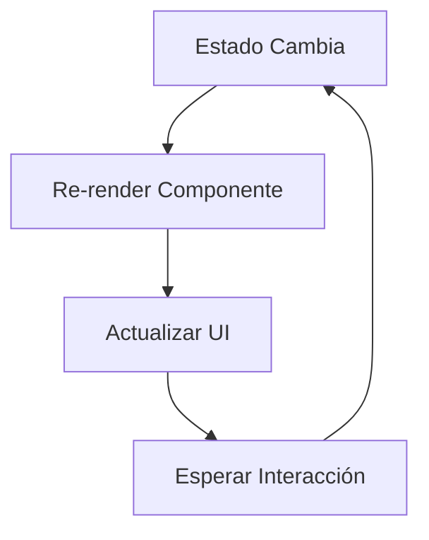

# Reactive ⚡️

[](https://opensource.org/licenses/MIT)
[](https://pypi.org/project/reactive/)


> Framework inspirado en React para crear aplicaciones CLI dinámicas con Prompt Toolkit (Python). Crea interfaces terminal con componentes, estado reactivo y hooks.

## Características principales ✨

- 🧩 **Arquitectura basada en componentes** con enfoque funcional
- ⚛️ **Hooks API** familiar (`use_state`, `use_effect`, `use_ref`)
- 🔄 **Actualizaciones de estado eficientes** con re-renderizado automático
- ⌨️ **Manejo integrado de eventos** y key bindings
- 🧪 **Testing fácil** gracias a componentes desacoplados

## Instalación 💻

```bash
pip install reactive-toolkit
```

## Ejemplo 🧪
```python
from reactive import component, Button, use_state
from prompt_toolkit.widgets import Label

@component
def CounterApp():
    count, set_count = use_state(0)
    
    def increment():
        set_count(count + 1)
    
    def decrement():
        set_count(count - 1)

    return [
        f'Contador: {count}',
        Button(text='➕ Incrementar', handler=increment),
        Button(text='➖ Decrementar', handler=decrement)
    ]

# Ejecutar la aplicación
if __name__ == "__main__":
    from reactive import create_root, run_app
    root, key_bindings = create_root(CounterApp)
    run_app(root, key_bindings=key_bindings)
```

## Flujo de trabajo básico 🔄



## Hooks disponibles 🪝

### Hooks esenciales

| Hook               | Descripción                                      |
|--------------------|--------------------------------------------------|
| `use_state()`      | Gestión básica de estado                         |
| `use_effect()`     | Manejo de efectos secundarios                    |
| `use_ref()`        | Referencias a elementos                          |
| `use_context()`    | Acceso al contexto global                        |
| `use_provider()`   | Consume datos de proveedores de contexto         |

### Hooks avanzados

| Hook                 | Descripción                                      |
|----------------------|--------------------------------------------------|
| `use_id()`           | Genera IDs únicos para accesibilidad             |
| `use_key()`          | Manejo personalizado de eventos de teclado       |
| `use_memo()`         | Memoización de valores costosos                  |
| `use_navigation()`   | Acceso a rutas y navegación                      |

### Hooks personalizados
¡Crea tus propios hooks para reutilizar lógica! Ejemplo:

```python
from reactive import hook, component, Button

@hook
def use_toggle(initial: bool = False):
    state, set_state = use_state(initial)
    toggle = lambda: set_state(not state)
    return state, toggle

# Uso en componente:
@component
def Switch():
    is_on, toggle = use_toggle()
    return Button(
        text = 'on' if is_on else 'off',
        handler = toggle
    )
```

## Contribuir 🤝
¡PRs son bienvenidos! Para contribuir:

- Haz fork del repositorio
- Crea una rama con tu feature (**git checkout -b feature/nueva-funcionalidad**)
- Haz commit de tus cambios (**git commit -am 'Agrega nueva funcionalidad'**)
- Haz push a la rama (**git push origin feature/nueva-funcionalidad**)
- Abre un Pull Request
