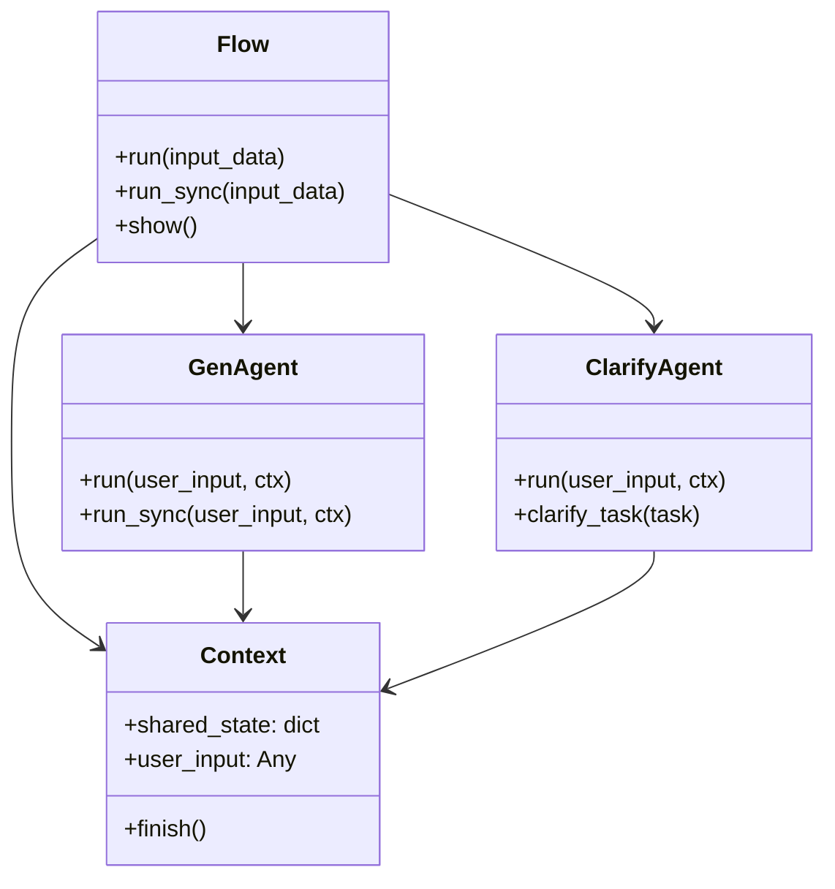

# APIリファレンス

このページでは、Refinire パッケージの主要APIの詳細なリファレンスを提供します。

## クラス・関数一覧

| 名前                     | 種別     | 概要                                                        |
|--------------------------|----------|-------------------------------------------------------------|
| get_llm                  | 関数     | モデル名・プロバイダー名からLLMインスタンスを取得           |
| create_simple_gen_agent  | 関数     | シンプルな生成エージェントを作成                           |
| create_evaluated_gen_agent| 関数    | 評価機能付き生成エージェントを作成                         |
| Flow                     | クラス   | ワークフロー管理の中心クラス                               |
| GenAgent                 | クラス   | 生成・評価機能を持つエージェントクラス                     |
| ClarifyAgent             | クラス   | 対話型タスク明確化エージェント                             |
| Context                  | クラス   | ステップ間での状態共有用コンテキスト                       |
| ConsoleTracingProcessor  | クラス   | コンソール色分けトレース出力用プロセッサ                   |
| enable_console_tracing   | 関数     | コンソールトレーシングを有効化                             |
| disable_tracing          | 関数     | トレーシング機能をすべて無効化                             |
| AgentPipeline            | クラス   | 【非推奨】生成・評価・ツール・ガードレールを統合したパイプライン |

---

## 統一LLMインターフェース

### get_llm

複数のLLMプロバイダーを統一インターフェースで扱うためのファクトリ関数です。

```python
from refinire import get_llm

# OpenAI
llm = get_llm("gpt-4o-mini")

# Anthropic Claude
llm = get_llm("claude-3-sonnet")

# Google Gemini
llm = get_llm("gemini-pro")

# Ollama（ローカル）
llm = get_llm("llama3.1:8b")
```

#### 引数

| 名前       | 型                 | 必須/オプション | デフォルト | 説明                                          |
|------------|--------------------|----------------|------------|-----------------------------------------------|
| model      | str                | 必須           | -          | 使用するLLMモデル名                           |
| provider   | str                | オプション     | None       | モデルのプロバイダー名（自動推論可）          |
| temperature| float              | オプション     | 0.3        | サンプリング温度（0.0-2.0）                  |
| api_key    | str                | オプション     | None       | プロバイダーAPIキー                          |
| base_url   | str                | オプション     | None       | プロバイダーAPIベースURL                     |
| thinking   | bool               | オプション     | False      | Claudeモデルの思考モード                      |
| tracing    | bool               | オプション     | False      | Agents SDKのトレーシングを有効化するか        |

#### 戻り値
- **LLMインスタンス**: 指定されたプロバイダーのLLMオブジェクト

#### サポートされるモデル

**OpenAI**
- gpt-4o, gpt-4o-mini
- gpt-4-turbo, gpt-4
- gpt-3.5-turbo

**Anthropic Claude**
- claude-3-5-sonnet-20241022
- claude-3-sonnet, claude-3-haiku
- claude-3-opus

**Google Gemini**
- gemini-pro, gemini-pro-vision
- gemini-1.5-pro, gemini-1.5-flash

**Ollama**
- llama3.1:8b, llama3.1:70b
- mistral:7b
- codellama:7b

---

## エージェント作成関数

### create_simple_gen_agent

シンプルな生成エージェントを作成します。

```python
from refinire import create_simple_gen_agent

agent = create_simple_gen_agent(
    name="assistant",
    instructions="あなたは親切なアシスタントです。",
    model="gpt-4o-mini"
)
```

#### 引数

| 名前         | 型    | 必須/オプション | デフォルト | 説明                           |
|--------------|-------|----------------|------------|--------------------------------|
| name         | str   | 必須           | -          | エージェント名                 |
| instructions | str   | 必須           | -          | システムプロンプト             |
| model        | str   | 必須           | -          | 使用するモデル名               |
| tools        | list  | オプション     | None       | 使用可能なツールのリスト       |

### create_evaluated_gen_agent

評価機能付きの生成エージェントを作成します。

```python
from refinire import create_evaluated_gen_agent

agent = create_evaluated_gen_agent(
    name="quality_assistant",
    generation_instructions="役立つ回答を生成してください。",
    evaluation_instructions="正確性と有用性を評価してください。",
    threshold=80.0,
    model="gpt-4o-mini"
)
```

#### 引数

| 名前                      | 型    | 必須/オプション | デフォルト | 説明                           |
|---------------------------|-------|----------------|------------|--------------------------------|
| name                      | str   | 必須           | -          | エージェント名                 |
| generation_instructions   | str   | 必須           | -          | 生成用システムプロンプト       |
| evaluation_instructions   | str   | 必須           | -          | 評価用システムプロンプト       |
| threshold                 | float | 必須           | -          | 品質閾値（0-100）              |
| model                     | str   | 必須           | -          | 使用するモデル名               |
| tools                     | list  | オプション     | None       | 使用可能なツールのリスト       |

---

## Flow/Stepアーキテクチャ

### Flow

ワークフロー管理の中心クラスです。複数のステップを組み合わせて複雑な処理フローを作成できます。

```python
from refinire import Flow, FunctionStep
import asyncio

# シンプルなFlow
flow = Flow(steps=gen_agent)

# 複数ステップのFlow
flow = Flow([
    ("step1", FunctionStep("step1", func1)),
    ("step2", FunctionStep("step2", func2))
])

# 実行
result = asyncio.run(flow.run(input_data="入力データ"))
```

#### 主要メソッド

| メソッド名 | 引数                  | 戻り値        | 説明                           |
|------------|----------------------|---------------|--------------------------------|
| run        | input_data: Any      | Context       | ワークフローを非同期実行       |
| run_sync   | input_data: Any      | Context       | ワークフローを同期実行         |
| show       | -                    | None          | ワークフロー構造を可視化       |

### Context

ステップ間での状態共有に使用するコンテキストクラスです。

```python
from refinire import Context

ctx = Context()
ctx.shared_state["key"] = "value"
ctx.finish()  # ワークフロー終了
```

#### 主要属性・メソッド

| 名前           | 型           | 説明                           |
|----------------|--------------|--------------------------------|
| shared_state   | dict         | ステップ間で共有される状態     |
| user_input     | Any          | ユーザー入力データ             |
| finish()       | メソッド     | ワークフロー終了を指示         |

---

## エージェントクラス

### GenAgent

生成・評価機能を持つエージェントクラスです。Flow内でのステップとして使用できます。

```python
from refinire.agents import GenAgent

agent = GenAgent(
    name="generator",
    generation_instructions="文章を生成してください。",
    evaluation_instructions="品質を評価してください。",
    model="gpt-4o-mini",
    threshold=75.0
)
```

#### 主要メソッド

| メソッド名 | 引数                        | 戻り値        | 説明                           |
|------------|----------------------------|---------------|--------------------------------|
| run        | user_input: str, ctx: Context | Context    | エージェントを非同期実行       |
| run_sync   | user_input: str, ctx: Context | Context    | エージェントを同期実行         |

### ClarifyAgent

対話型タスク明確化エージェントです。不明確な要求を明確化するための質問を行います。

```python
from refinire.agents import ClarifyAgent

agent = ClarifyAgent(
    name="clarifier",
    instructions="ユーザーの要求を明確化してください。",
    model="gpt-4o-mini"
)
```

---

## トレーシング機能

### enable_console_tracing

コンソールでの色分けトレーシングを有効化します。

```python
from refinire import enable_console_tracing

enable_console_tracing()
```

### disable_tracing

全てのトレーシング機能を無効化します。

```python
from refinire import disable_tracing

disable_tracing()
```

### ConsoleTracingProcessor

カスタムトレース処理用のクラスです。

```python
from refinire.tracing import ConsoleTracingProcessor

processor = ConsoleTracingProcessor(
    output_stream="console",
    simple_mode=True
)
```

---

## 非推奨API

### AgentPipeline（非推奨）

⚠️ **重要**: `AgentPipeline`は v0.1.0 で削除される予定です。新しいコードでは `GenAgent + Flow` を使用してください。

```python
# 非推奨 - 新しいコードでは使用しないでください
from refinire import AgentPipeline

pipeline = AgentPipeline(
    name="example",
    generation_instructions="文章を生成してください。",
    evaluation_instructions="品質を評価してください。",
    model="gpt-4o-mini",
    threshold=80
)
```

---

## アーキテクチャ図



## 使用例

### 基本的な使用パターン

```python
from refinire import create_simple_gen_agent, Flow, Context
import asyncio

# 1. エージェント作成
agent = create_simple_gen_agent(
    name="assistant",
    instructions="親切なアシスタントとして回答してください。",
    model="gpt-4o-mini"
)

# 2. フロー作成
flow = Flow(steps=agent)

# 3. 実行
async def main():
    result = await flow.run(input_data="こんにちは")
    print(result.shared_state["assistant_result"])

asyncio.run(main())
```

### 複雑なワークフローの例

```python
from refinire import Flow, FunctionStep, create_evaluated_gen_agent
import asyncio

def preprocess(user_input: str, ctx: Context) -> Context:
    ctx.shared_state["processed_input"] = user_input.strip().lower()
    return ctx

agent = create_evaluated_gen_agent(
    name="analyzer",
    generation_instructions="入力を分析してください。",
    evaluation_instructions="分析の正確性を評価してください。",
    threshold=80.0,
    model="gpt-4o-mini"
)

def postprocess(user_input: str, ctx: Context) -> Context:
    result = ctx.shared_state.get("analyzer_result", "")
    ctx.shared_state["final_result"] = f"最終結果: {result}"
    ctx.finish()
    return ctx

flow = Flow([
    ("preprocess", FunctionStep("preprocess", preprocess)),
    ("analyze", agent),
    ("postprocess", FunctionStep("postprocess", postprocess))
])

async def main():
    result = await flow.run(input_data="  テキストを分析して  ")
    print(result.shared_state["final_result"])

asyncio.run(main())
```

## ContextProviderインターフェース

| クラス/メソッド         | 説明                                                                 | 引数 / 戻り値                |
|---------------------|--------------------------------------------------------------------|------------------------------|
| `ContextProvider`   | すべてのコンテキストプロバイダーの抽象基底クラス。                  |                              |
| `provider_name`     | プロバイダー名（クラス変数）。                                      | `str`                        |
| `get_config_schema` | プロバイダーの設定スキーマを返す。                                  | `classmethod` → `Dict[str, Any]` |
| `from_config`       | 設定辞書からプロバイダーを生成。                                     | `classmethod` → インスタンス |
| `get_context`       | クエリに対するコンテキスト文字列を返す。                            | `query: str, previous_context: Optional[str], **kwargs` → `str` |
| `update`            | 新しい対話でプロバイダー状態を更新。                                 | `interaction: Dict[str, Any]`|
| `clear`             | プロバイダー状態をクリア。                                          |                              |

---

## 標準プロバイダー

### ConversationHistoryProvider

会話履歴を管理するプロバイダーです。

**設定例:**
```python
{
    "type": "conversation_history",
    "max_items": 10
}
```

**パラメータ:**
- `max_items` (int): 保持する最大メッセージ数（デフォルト: 10）

### FixedFileProvider

指定されたファイルの内容を常に提供するプロバイダーです。

**設定例:**
```python
{
    "type": "fixed_file",
    "file_path": "config.yaml",
    "encoding": "utf-8",
    "check_updates": True
}
```

**パラメータ:**
- `file_path` (str, 必須): 読み取るファイルのパス
- `encoding` (str): ファイルエンコーディング（デフォルト: "utf-8"）
- `check_updates` (bool): ファイル更新をチェックするか（デフォルト: True）

### SourceCodeProvider

ユーザーの質問に関連するソースコードを自動検索するプロバイダーです。

**設定例:**
```python
{
    "type": "source_code",
    "base_path": ".",
    "max_files": 5,
    "max_file_size": 1000,
    "file_extensions": [".py", ".js", ".ts"],
    "include_patterns": ["src/**/*"],
    "exclude_patterns": ["tests/**/*"]
}
```

**パラメータ:**
- `base_path` (str): コードベース分析のベースディレクトリ（デフォルト: "."）
- `max_files` (int): コンテキストに含める最大ファイル数（デフォルト: 50）
- `max_file_size` (int): 読み込む最大ファイルサイズ（バイト）（デフォルト: 10000）
- `file_extensions` (list): 含めるファイル拡張子のリスト
- `include_patterns` (list): 含めるファイルパターンのリスト
- `exclude_patterns` (list): 除外するファイルパターンのリスト

### CutContextProvider

コンテキストを指定された長さに圧縮するプロバイダーです。

**設定例:**
```python
{
    "type": "cut_context",
    "provider": {
        "type": "source_code",
        "max_files": 10,
        "max_file_size": 2000
    },
    "max_chars": 3000,
    "max_tokens": None,
    "cut_strategy": "middle",
    "preserve_sections": True
}
```

**パラメータ:**
- `provider` (dict, 必須): ラップするコンテキストプロバイダーの設定
- `max_chars` (int): 最大文字数（Noneで制限なし）
- `max_tokens` (int): 最大トークン数（Noneで制限なし）
- `cut_strategy` (str): カット戦略（"start", "end", "middle"）（デフォルト: "end"）
- `preserve_sections` (bool): カット時に完全なセクションを保持するか（デフォルト: True）

---

## RefinireAgent拡張

| クラス/メソッド         | 説明                                                                 | 引数 / 戻り値                |
|---------------------|--------------------------------------------------------------------|------------------------------|
| `context_providers_config` | コンテキストプロバイダー設定（リスト/辞書/YAML文字列）。 | `List[dict]`/`str`           |
| `get_context_provider_schemas` | 利用可能な全プロバイダーのスキーマを返す。             | `classmethod` → `Dict[str, Any]` |
| `clear_context`     | すべてのコンテキストプロバイダーをクリア。                          |                              |

---

## 使用例: SourceCodeProviderの利用

```python
from refinire.agents.context_provider_factory import ContextProviderFactory

config = {
    "type": "source_code",
    "base_path": "src",
    "max_files": 5
}
provider = ContextProviderFactory.create_provider(config)
context = provider.get_context("パイプラインの仕組みは？")
print(context)
```

---

## 使用例: YAMLライクな複数プロバイダー

```yaml
- conversation_history:
    max_items: 5
- source_code:
    base_path: src
    max_files: 3
- cut_context:
    provider:
      type: conversation_history
      max_items: 10
    max_chars: 4000
    cut_strategy: end
```

---

## 関連ドキュメント
- `docs/api_reference.md`（英語）
- `docs/context_management.md`（設計）
- `examples/context_management_example.py`（使用例） 