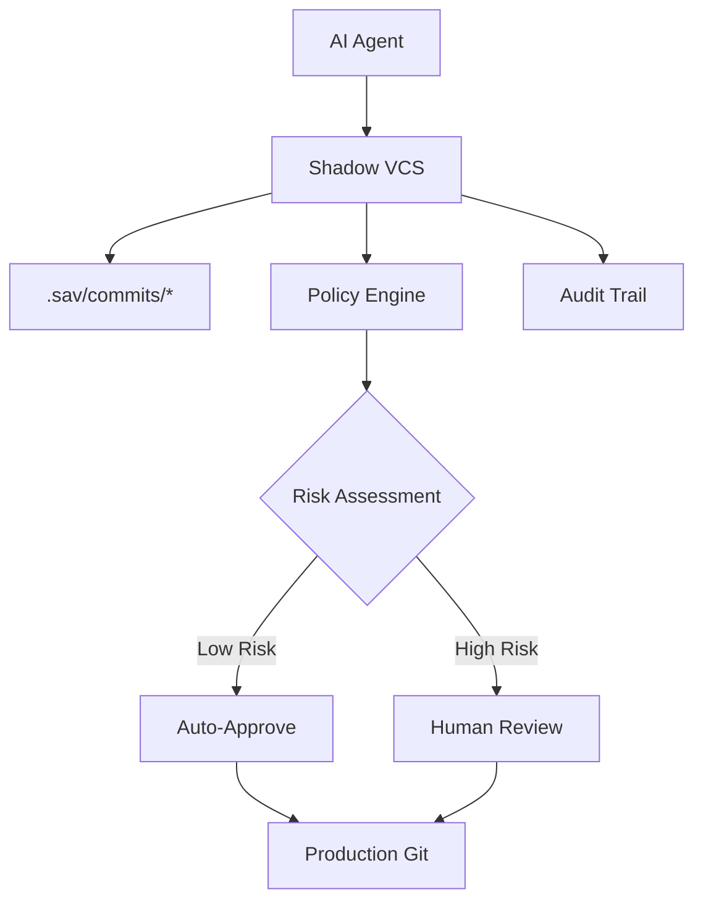

# SAV - Shadow VCS v0.1

[](LICENSE)
[](https://www.python.org/downloads/)
[](./tests)

> **A local-first "staging VCS" that lets AI agents (and humans) commit code safely—before it ever touches your production Git repository.**

---

## What is Shadow VCS?

**Shadow VCS (SAV)** is a next-generation version control system for the age of AI-assisted coding. It acts as a **secure quarantine** for code changes—especially those generated by AI agents—so you can review, test, and enforce policy before anything merges to your real Git repo.

**Why?**  
AI can write code, but it can also make mistakes, introduce security risks, or bypass your best practices. Shadow VCS gives you a **buffer zone**—like a spam filter for code—between autonomous agents and your trusted codebase.

---

## Key Features

- **Staging Isolation:** All changes land in `.sav/commits/*`—never in your main repo until approved.
- **Audit-Grade Provenance:** Every commit is fingerprinted and logged in a tamper-resistant SQLite database. Full traceability: who/what/when/why for every change, even before it hits Git.
- **Policy-Driven Quarantine:** YAML rules let you auto-approve safe changes, block dangerous ones, and require human review for anything risky.
- **Security by Default:** Detects secrets, large binaries, and suspicious patterns before they hit production.
- **Human-in-the-Loop:** You decide what gets merged—AI agents can't sneak code past you.
- **Compliance & Forensics:** Prove to auditors that risky changes were reviewed and approved by a human. Every action is logged for compliance and incident response.
- **AI Agent Safety:** Designed for AI/LLM workflows: keep agent output isolated until a human approves.
- **Not Just Another Git Wrapper:** SAV is a staging VCS, not a Git plugin. It's a new layer of control *before* Git.

---

## How It Works



---

## Quick Start

### 1. Install

**Requirements:**  
- Python 3.11+  
- Git (for production workflows)

**From source:**
```bash
git clone https://github.com/AKIFQ/sav.git
cd sav
pip install -e .
```
**(PyPI coming soon!)**

### 2. Initialize a Shadow VCS Repo

```bash
mkdir my-project
cd my-project
sav init
```
Creates `.sav/` with:
- `commits/` (quarantined changes)
- `fingerprints/` (risk data)
- `index.sqlite` (audit log)
- `constraints.yaml` (policy rules)

### 3. Make Your First Commit

```bash
echo 'print("Hello Shadow VCS!")' > hello.py
sav commit -m "Add hello script" hello.py
```
Sample output:
```
Created commit a1b2c3d4 (auto-approved by policy)
  Files: 1
  Lines: +1 -0
  Risk score: 0.0
```

### 4. Review & Approve

```bash
sav status --all
sav review a1b2c3d4
sav approve a1b2c3d4
```
Or reject with a reason:
```bash
sav reject a1b2c3d4 -r "Security concern"
```

---

## Full Usage & Commands

| Command | Description |
|---------|-------------|
| `sav init` | Initialize Shadow VCS repository |
| `sav commit -m "msg" <files>` | Create new commit |
| `sav status [--all]` | Show commit status |
| `sav review <commit-id>` | Review commit details |
| `sav approve <commit-id>` | Approve and apply commit |
| `sav reject <commit-id>` | Reject commit |
| `sav policy test` | Test policy rules |

---

## Configuration

### Policy & Risk Assessment

**Customize `.sav/constraints.yaml`:**
```yaml
rules:
  - match: "*.md"
    auto_approve: true
  - match: "*"
    condition: "risk_score < 0.3 and lines_added < 50"
    auto_approve: true
  - match: "*"
    condition: "risk_score > 0.7"
    require_role: "admin"
  - match: "*"
    auto_approve: false
```
- **Supported conditions:** `risk_score`, `lines_added`, `lines_deleted`
- **Test your rules:**
```bash
sav policy test \
  --rule '{"match": "*.py", "condition": "risk_score < 0.5"}' \
  --context '{"risk_score": 0.2, "lines_added": 10, "lines_deleted": 0}'
```

**How risk is calculated:**  
- Large changes = higher risk  
- Many files = higher risk  
- Sensitive patterns (e.g. `*.key`, `config`, `secret`) = high risk  
- Large binaries (>500KB) = high risk  
- Heavy deletions = higher risk

### Environment Variables

- `SAV_REPO_PATH` — Set default repository path
- `SAV_LOG_LEVEL` — Set logging level (default: INFO)

---

## Directory Structure

```
.sav/
├── commits/
│   └── <commit-uuid>/
│       ├── files/
│       ├── meta.json
│       └── diff.patch
├── fingerprints/
│   └── <fingerprint-uuid>.json
├── index.sqlite
└── constraints.yaml
```

---

## Security & Compliance

- **Audit-Grade Logging:** All actions and approvals are logged in `index.sqlite` for full traceability.
- **Provenance:** Every commit is fingerprinted and risk-assessed.
- **Policy Enforcement:** Block, quarantine, or require review for risky changes.
- **Sandboxed Evaluation:** Policy expressions use restricted Python `eval()`.
- **File Isolation:** Commits stored separately until approved.
- **Forensics:** Reconstruct who/what/when/why for any change—ideal for regulated industries, incident response, and supply chain security.

---

## 🤖 AI & Automation Use Cases

- **AI Agent Safety:** Keep LLM/AI-generated code isolated until a human approves.
- **Contractor/External Code:** Quarantine and review code from untrusted sources.
- **Compliance Automation:** Prove to auditors that all risky changes were reviewed and approved.
- **Preview:** v0.2+ will support direct LangChain and custom agent integration.

```python
from sav.integrations.langchain import ShadowVCSWrapper
agent = ShadowVCSWrapper(your_langchain_agent)
result = agent.run("Refactor the authentication module")
```

---

## Development & Contributing

- **Setup:**
  ```bash
  git clone https://github.com/AKIFQ/sav.git
  cd sav
  python -m venv venv
  source venv/bin/activate  # or `venv\Scripts\activate` on Windows
  pip install -e .
  pip install pytest
  ```
- **Run tests:**
  ```bash
  pytest tests/ -v
  ```
- **Pre-commit:**
  ```bash
  python scripts/prepush.py
  ```
- **Contribute:**
  1. Fork the repo
  2. Create a feature branch
  3. Commit your changes
  4. Push and open a Pull Request
- **Code style:** PEP 8, add tests, update docs for new features

---

## License

MIT License - see [LICENSE](LICENSE)

> **Shadow VCS** – Because AI agents need training wheels too! 

---
**If you like this project, please ⭐️ the repo and share your feedback!** 

