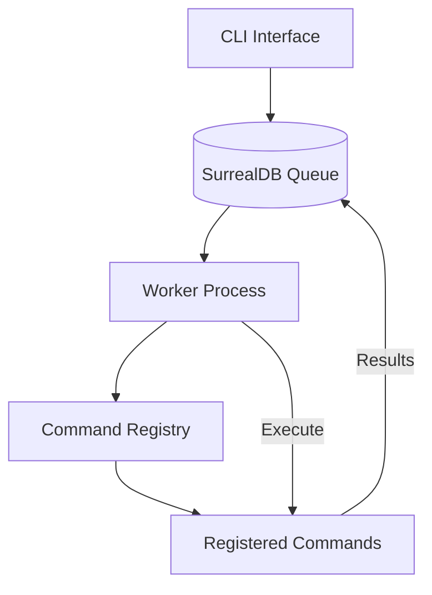

# Surreal Commands

A distributed task queue system similar to Celery, built with Python, SurrealDB, and LangChain. This system allows you to define, submit, and execute asynchronous commands/tasks with real-time processing capabilities.

## Features

- **Real-time Processing**: Uses SurrealDB LIVE queries for instant command pickup
- **Concurrent Execution**: Configurable concurrent task execution with semaphore controls
-  **Type Safety**: Pydantic models for input/output validation
-  **LangChain Integration**: Commands are LangChain Runnables for maximum flexibility
-  **Dynamic CLI**: Auto-generates CLI from registered commands
- **Status Tracking**: Track command status through lifecycle (new � running � completed/failed)
- **Persistent Queue**: Commands persist in SurrealDB across worker restarts
- **Comprehensive Logging**: Built-in logging with loguru

## Architecture Overview



## Installation

Install the package using pip:

```bash
pip install surreal-commands
```

Set up environment variables in `.env`:
```env
# SurrealDB Configuration
SURREAL_URL=ws://localhost:8000/rpc
SURREAL_USER=root
SURREAL_PASSWORD=root
SURREAL_NAMESPACE=test
SURREAL_DATABASE=test
```

4. Ensure SurrealDB is running:
```bash
# Using Docker
docker run --rm -p 8000:8000 surrealdb/surrealdb:latest start --user root --pass root

# Or install locally
# See: https://surrealdb.com/install
```

## Quick Start

### 1. Define Commands

Create your commands using the `@command` decorator:

```python
# my_app/tasks.py
from surreal_commands import command, submit_command
from pydantic import BaseModel

class ProcessInput(BaseModel):
    message: str
    uppercase: bool = False

class ProcessOutput(BaseModel):
    result: str
    length: int

@command("process_text")  # Auto-detects app name as "my_app"
def process_text(input_data: ProcessInput) -> ProcessOutput:
    result = input_data.message.upper() if input_data.uppercase else input_data.message
    return ProcessOutput(result=result, length=len(result))

# Alternative: explicit app name
@command("analyze", app="analytics")
def analyze_data(input_data: ProcessInput) -> ProcessOutput:
    return ProcessOutput(result=f"Analyzed: {input_data.message}", length=len(input_data.message))
```

### 2. Submit and Monitor Commands

```python
from surreal_commands import submit_command, wait_for_command_sync

# Submit a command
cmd_id = submit_command("my_app", "process_text", {
    "message": "hello world", 
    "uppercase": True
})

print(f"Submitted command: {cmd_id}")

# Wait for completion
result = wait_for_command_sync(cmd_id, timeout=30)
if result.is_success():
    print(f"Result: {result.result}")
```

### 3. Start the Worker

```bash
# Start the worker process (import modules from environment variable)
export SURREAL_COMMANDS_MODULES="tasks"
surreal-commands-worker

# Or specify modules directly via CLI
surreal-commands-worker --import-modules "tasks"

# With debug logging
surreal-commands-worker --debug --import-modules "tasks"

# With custom concurrent task limit
surreal-commands-worker --max-tasks 10 --import-modules "tasks"

# Import multiple modules
surreal-commands-worker --import-modules "tasks,my_app.commands"
```

### 4. Monitor with CLI Tools

```bash
# View command dashboard
surreal-commands-dashboard

# View real-time logs
surreal-commands-logs
```

## Library Structure

```
surreal-commands/
├── apps/                    # Your command applications
│   └── text_utils/         # Example app
│       ├── __init__.py
│       └── commands.py     # Command definitions
├── cli/                    # CLI components
│   ├── __init__.py
│   ├── launcher.py        # Dynamic CLI generator
│   ├── dashboard.py       # (Future) Dashboard UI
│   └── logs.py           # (Future) Log viewer
├── commands/              # Core command system
│   ├── __init__.py
│   ├── command_service.py # Command lifecycle management
│   ├── executor.py       # Command execution engine
│   ├── loader.py         # Command discovery
│   ├── registry.py       # Command registry (singleton)
│   ├── registry_types.py # Type definitions
│   └── worker.py         # Worker process
├── repository/           # Database layer
│   └── __init__.py      # SurrealDB helpers
├── cli.py               # CLI entry point
├── run_worker.py        # Worker entry point
└── .env                 # Environment configuration
```

## Core Components

### Command Registry
- Singleton pattern for global command management
- Stores commands as LangChain Runnables
- Organizes commands by app namespace

### Command Service
- Manages command lifecycle
- Validates arguments against schemas
- Updates command status in real-time

### Worker
- Long-running process polling SurrealDB
- Processes existing commands on startup
- Listens for new commands via LIVE queries
- Configurable concurrency limits

### Executor
- Handles sync/async command execution
- Type conversion and validation
- Streaming support for long-running tasks

## Advanced Usage

### Custom Command with Complex Types

```python
from typing import List, Optional
from datetime import datetime
from pydantic import BaseModel, Field

class AnalysisInput(BaseModel):
    data: List[float]
    method: str = Field(default="mean", description="Analysis method")
    threshold: Optional[float] = None

class AnalysisOutput(BaseModel):
    result: float
    method_used: str
    items_processed: int
    warnings: List[str] = []

def analyze_data(input_data: AnalysisInput) -> AnalysisOutput:
    # Your analysis logic here
    pass
```

### Async Commands

```python
async def async_process(input_data: MyInput) -> MyOutput:
    # Async processing
    await some_async_operation()
    return MyOutput(...)

# LangChain handles both sync and async
command = RunnableLambda(async_process)
```

### Execution Context

Commands can access execution metadata including the `command_id` by accepting an `execution_context` parameter:

```python
from surreal_commands import command, ExecutionContext

@command("process_with_context")
def process_with_context(input_data: MyInput, execution_context: ExecutionContext) -> MyOutput:
    # Access command_id and other execution metadata
    command_id = execution_context.command_id
    execution_time = execution_context.execution_started_at
    app_name = execution_context.app_name
    command_name = execution_context.command_name
    
    # Access user context from CLI if provided
    user_context = execution_context.user_context or {}
    user_id = user_context.get("user_id", "anonymous")
    
    # Use in processing
    result = f"Processed by {user_id} in command {command_id}"
    return MyOutput(result=result)

# Alternative: Access via kwargs
@command("process_with_kwargs")
def process_with_kwargs(input_data: MyInput, **kwargs) -> MyOutput:
    execution_context = kwargs.get("execution_context")
    if execution_context:
        command_id = execution_context.command_id
        # Use command_id in processing
    return MyOutput(result="processed")
```

**ExecutionContext Properties:**
- `command_id`: Database ID of the command
- `execution_started_at`: When execution began
- `app_name`: Application name  
- `command_name`: Command name
- `user_context`: Optional CLI context (user_id, scope, etc.)

### CLI Context vs Execution Context

- **CLI Context**: User-provided data via `--user-id`, `--scope` flags
- **Execution Context**: System-provided execution metadata including `command_id`

```python
# CLI context is available in execution_context.user_context
user_id = execution_context.user_context.get("user_id")
scope = execution_context.user_context.get("scope")
```

## Monitoring

### Check Command Status

```python
# check_results.py
import asyncio
from repository import db_connection

async def check_status():
    async with db_connection() as db:
        commands = await db.query(
            "SELECT * FROM command ORDER BY created DESC LIMIT 10"
        )
        for cmd in commands:
            print(f"{cmd['id']}: {cmd['status']}")

asyncio.run(check_status())
```

### View Logs

```bash
# Worker logs with debug info
uv run python run_worker.py --debug

# Filter logs by level
LOGURU_LEVEL=INFO uv run python run_worker.py
```

## Database Schema

Commands are stored in SurrealDB with the following structure:

```javascript
{
  id: "command:unique_id",
  app: "app_name",
  name: "command_name",
  args: { /* command arguments */ },
  context: { /* optional context */ },
  status: "new" | "running" | "completed" | "failed",
  result: { /* command output */ },
  error_message: "error details if failed",
  created: "2024-01-07T10:30:00Z",
  updated: "2024-01-07T10:30:05Z"
}
```

## Development

### Adding New Commands

1. Create a new app directory under `apps/`
2. Define your command models and logic
3. Register with the command registry
4. Restart the worker to pick up new commands

### Running Tests

```bash
# Run tests (when implemented)
uv run pytest

# With coverage
uv run pytest --cov=commands
```

### Debugging

Use the debug mode to see detailed logs:
```bash
# Debug CLI
LOGURU_LEVEL=DEBUG uv run python cli.py text_utils uppercase --text "test"

# Debug Worker
uv run python run_worker.py --debug
```

## Contributing

1. Fork the repository
2. Create a feature branch
3. Make your changes
4. Add tests if applicable
5. Submit a pull request

## Future Enhancements

- [ ] Web dashboard for monitoring
- [ ] Command scheduling (cron-like)
- [ ] Priority queues
- [ ] Result callbacks
- [ ] Retry mechanisms
- [ ] Command chaining/workflows
- [ ] Metrics and monitoring
- [ ] REST API endpoint
- [ ] Command result TTL
- [ ] Dead letter queue

## License

This project is licensed under the MIT License - see the [LICENSE](LICENSE) file for details.

## Acknowledgments

- Inspired by Celery's design patterns
- Built with SurrealDB for real-time capabilities
- Leverages LangChain for flexible command definitions