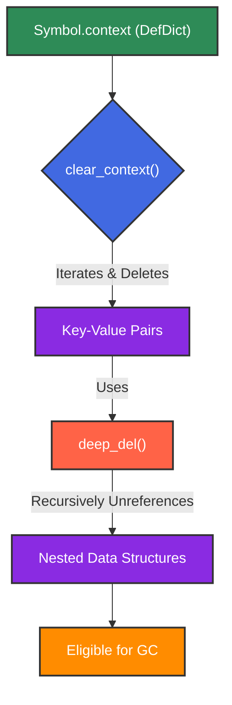

# Memory Awareness: Efficient Resource Management in Symbol

The `Symbol` framework is meticulously designed with memory efficiency as a core principle. In graph-based systems, managing memory effectively is paramount to scalability and performance, especially when dealing with a large number of interconnected entities. `Symbol` employs several strategies to minimize its memory footprint and prevent common issues like memory leaks, ensuring robust and predictable behavior.

## GC-aware Deletion

`Symbol` integrates with Python's garbage collection (GC) mechanisms to ensure that resources are released promptly when no longer needed. The `delete()` method, when invoked on a `Symbol` instance, not only severs its explicit connections (parents, children) but also considers the broader GC context. The `MEMORY_AWARE_DELETE` flag, when enabled, further enhances this by attempting to proactively manage memory associated with the deleted symb, although Python's GC ultimately handles the deallocation.

### Mechanism
- **`Symbol.delete()`**: Clears references to and from the symb (children, parents, internal pools).
- **`MEMORY_AWARE_DELETE`**: A configuration flag that, when `True`, enables additional memory management considerations during deletion, such as attempting to remove the symb from internal pools.
- **`gc.collect()`**: Explicit calls to the garbage collector are made in certain operations (e.g., `slim()`) to encourage immediate cleanup of unreferenced objects.

### Code Example
```python
import gc
from symb import Symbol

# Enable memory-aware deletion (if not already enabled in config.py)
# Symbol.MEMORY_AWARE_DELETE = True # This would typically be set in a config file

# Create some symbs and relationships
root = Symbol('Root')
child1 = Symbol('Child1')
child2 = Symbol('Child2')

root.append(child1)
child1.append(child2)

print(f"Before delete: Root children: {[c.name for c in root.children]}")
print(f"Before delete: Child1 parents: {[p.name for p in child1.parents]}")

# Delete child1
child1.delete()

print(f"After delete: Root children: {[c.name for c in root.children]}")
print(f"After delete: Child1 parents: {[p.name for p in child1.parents]}")

# Explicitly run garbage collection to see immediate effects (if any)
gc.collect()
print("Garbage collection run.")

# Note: Python's GC is non-deterministic. The effects of delete() are primarily about breaking references.
```

### Diagram

## Proactive Memory Management for `context` Attribute via `deep_del`

The `Symbol` class includes a `context` attribute, implemented as a `DefDict` (a `defaultdict` of `defaultdict`s), which allows for flexible storage of arbitrary, often transient, data associated with a `Symbol` instance. To prevent memory accumulation from this dynamic storage, `Symbol` provides `clear_context()` and utilizes the `deep_del` utility.

### Mechanism
- **`Symbol.context`**: A `DefDict` for storing arbitrary contextual data.
- **`deep_del(obj, attr)`**: A utility function designed to recursively delete an attribute and its contents from an object. It aims to ensure that complex nested structures within `context` are properly unreferenced, making them eligible for garbage collection.
- **`Symbol.clear_context()`**: Iterates through the `context` `DefDict` and explicitly deletes each key-value pair, leveraging `deep_del` where appropriate to ensure thorough cleanup.

### Code Example
```python
import gc
from symb import Symbol

s = s.MyContextSymbol

# Add nested data to context
s.context['user']['preferences']['theme'] = 'dark'
s.context['session']['id'] = 'abc-123'
s.context['temp_data'] = [1, 2, 3]

print(f"Before clear_context: {s.context}")

# Clear the context
s.clear_context()

print(f"After clear_context: {s.context}")

gc.collect()
print("Garbage collection run after clearing context.")
```

### Diagram

## Conclusion

Memory awareness is a fundamental aspect of the `Symbol` framework's design, ensuring its suitability for high-performance and long-running applications. Through GC-aware deletion, proactive management of dynamic attributes like `context`, and the strategic use of utilities like `deep_del`, `Symbol` minimizes its memory footprint and contributes to overall system stability. This commitment to efficient resource management allows developers to build complex symbic systems without undue concern for memory-related performance bottlenecks.

For a comprehensive overview of the Symbol's memory awareness, refer to the [Memory Awareness Overview Diagram](memory_awareness_overview.mmd).

---
