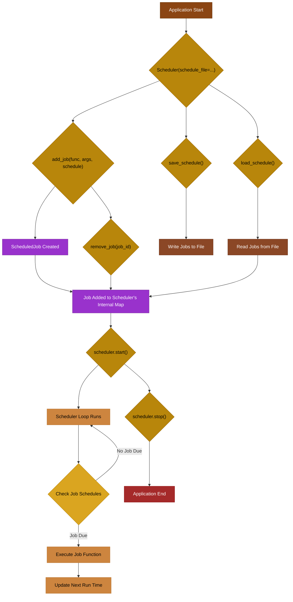
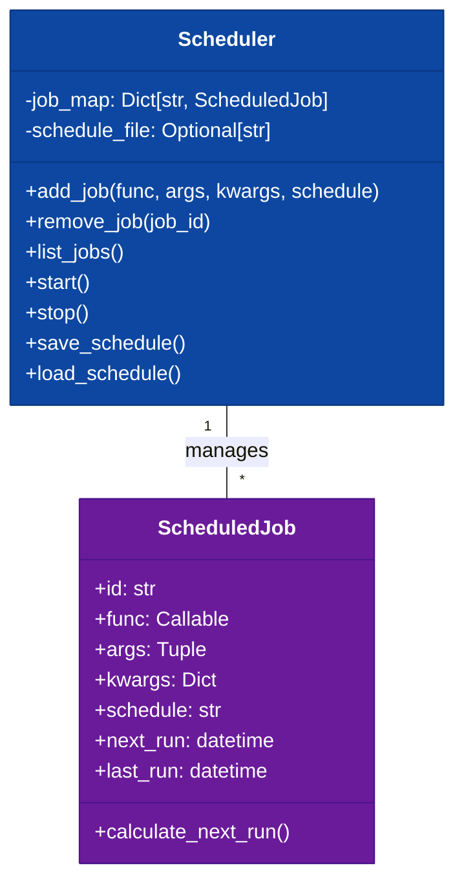

# [`«symb»`](https://github.com/ikko/symb) cookbook

**Recipes for Symbolic Mastery**

---

> ⚠ _This module is under development and incomplete. Features may differ from what's written here. Should you use it, test comprehensively, especially before using `async batch` features_
 
# Recipe 2: Scheduling Jobs with `symb.schedule`

This recipe demonstrates how to use the `symb.schedule` module to schedule and manage jobs within your `symb` applications. The `symb.schedule` module provides a robust and flexible way to execute functions at specified times or intervals.

## 1. Understanding `symb.schedule`

The `symb.schedule` module is built around the `Scheduler` class, which manages a collection of `ScheduledJob` instances. Each `ScheduledJob` encapsulates a function to be executed, its arguments, and a schedule (e.g., cron string or ISO 8601 timestamp).

### Key Components:

-   **`Scheduler`**: The central component responsible for adding, removing, listing, and running scheduled jobs.
-   **`ScheduledJob`**: Represents a single job to be executed, including the target function, its arguments, and the schedule.

## 2. Basic Usage: Adding and Running a Job

Let's start with a simple example: scheduling a function to run every minute.

```python
import symb
import datetime
import time

# 1. Define the function to be scheduled
def my_scheduled_task(message: str):
    print(f"[{datetime.datetime.now()}] Scheduled task executed: {message}")

# 2. Create a Scheduler instance
#    You can optionally provide a schedule_file to persist jobs
scheduler = symb.schedule.Scheduler()

# 3. Add a job
#    The schedule can be a cron string (e.g., "* * * * *" for every minute)
#    or an ISO 8601 timestamp for a one-time execution.
job_id = scheduler.add_job(
    func=my_scheduled_task,
    args=("Hello from scheduler!",),
    schedule="* * * * *" # Run every minute
)
print(f"Job '{job_id}' added to the scheduler.")

# 4. Start the scheduler (this will block until stopped)
print("Starting scheduler. Press Ctrl+C to stop.")
try:
    scheduler.start()
    # In a real application, you might run this in a separate thread or process
    # For demonstration, we'll keep it simple and block.
    while True:
        time.sleep(1) # Keep the main thread alive
except KeyboardInterrupt:
    print("Scheduler stopped.")
finally:
    scheduler.stop() # Ensure the scheduler is stopped cleanly
```

### Explanation:

-   We define `my_scheduled_task` as the function to be executed.
-   A `Scheduler` instance is created.
-   `scheduler.add_job()` is used to register `my_scheduled_task` with a cron schedule `"* * * * *"`.
-   `scheduler.start()` begins the scheduling loop. The `try...except KeyboardInterrupt` block allows for graceful shutdown.

## 3. Managing Jobs: Listing and Removing

You can inspect and manage the jobs currently in the scheduler.

```python
import symb
import datetime
import time

def another_task():
    print(f"[{datetime.datetime.now()}] Another task executed.")

scheduler = symb.schedule.Scheduler()

job1_id = scheduler.add_job(another_task, schedule="*/5 * * * *") # Every 5 minutes
job2_id = scheduler.add_job(lambda: print("One-time job!"), schedule=datetime.datetime.now() + datetime.timedelta(seconds=10))

print("\n--- Current Jobs ---")
for job_id, job in scheduler.job_map.items():
    print(f"ID: {job_id}, Next Run: {job.next_run}, Schedule: {job.schedule}, Function: {job.func.__name__}")

# Remove a job
scheduler.remove_job(job1_id)
print(f"\nJob '{job1_id}' removed.")

print("\n--- Jobs After Removal ---")
for job_id, job in scheduler.job_map.items():
    print(f"ID: {job_id}, Next Run: {job.next_run}, Schedule: {job.schedule}, Function: {job.func.__name__}")

# Start and stop the scheduler briefly to see the one-time job execute
print("\nStarting scheduler briefly...")
try:
    scheduler.start()
    time.sleep(15) # Wait for the one-time job to execute
except KeyboardInterrupt:
    pass
finally:
    scheduler.stop()
    print("Scheduler stopped.")
```

## 4. Persisting Schedules

For long-running applications, you'll want to persist your scheduled jobs so they are not lost when the application restarts. The `Scheduler` can load and save schedules to a file.

```python
import symb
import datetime
import os
import time

SCHEDULE_FILE = "my_schedule.json"

def persistent_task():
    print(f"[{datetime.datetime.now()}] Persistent task executed.")

# Clean up previous schedule file if it exists
if os.path.exists(SCHEDULE_FILE):
    os.remove(SCHEDULE_FILE)

# First run: Add a job and save the schedule
print("--- First Run: Adding and Saving Job ---")
scheduler1 = symb.schedule.Scheduler(schedule_file=SCHEDULE_FILE)
job_id_persistent = scheduler1.add_job(persistent_task, schedule="* * * * *")
scheduler1.save_schedule()
print(f"Job '{job_id_persistent}' added and schedule saved to '{SCHEDULE_FILE}'.")
scheduler1.stop() # Stop the first scheduler instance

# Second run: Load the schedule and run
print("\n--- Second Run: Loading and Running Job ---")
scheduler2 = symb.schedule.Scheduler(schedule_file=SCHEDULE_FILE)
print("Loaded jobs:")
for job_id, job in scheduler2.job_map.items():
    print(f"ID: {job_id}, Next Run: {job.next_run}, Schedule: {job.schedule}, Function: {job.func.__name__}")

print("Starting scheduler. Press Ctrl+C to stop.")
try:
    scheduler2.start()
    time.sleep(65) # Let it run for a bit to see the persistent task
except KeyboardInterrupt:
    print("Scheduler stopped.")
finally:
    scheduler2.stop()
    print("Scheduler stopped.")
    if os.path.exists(SCHEDULE_FILE):
        os.remove(SCHEDULE_FILE) # Clean up
```

## 5. Diagrams

### Scheduler Workflow




### `ScheduledJob` Structure



