# Symbol Architecture

## Introduction

The `symb` library is a Python framework for creating, manipulating, and reasoning about symbic data structures. It is designed to be lightweight, extensible, and memory-aware, providing a powerful foundation for a wide range of applications, from data modeling and graph analysis to scheduling and metaprogramming.

At its core, the `symb` library is built upon a layered architecture that separates the fundamental `Symbol` class from its extended functionalities. This design promotes modularity, reduces complexity, and allows for a high degree of customization through mixins and builtin extensions.

This document provides a detailed overview of the `symb` library's architecture, including its core components, builtin extensions, and the principles that guide its design.

## Core Architecture

The core architecture of the `symb` library is divided into two main layers: the **Core Layer** and the **Builtin Extensions Layer**.

```mermaid
graph TD
    subgraph "Symbol Package"
        A[symb] --> B(symb.core)
        A --> C(symb.builtins)
    end

    subgraph "Core Layer (symb.core)"
        B --> B1[symb.core.base_symb]
        B --> B2[symb.core.symb]
        B --> B4[symb.core.maturing]
        B --> B5[symb.core.mixinability]
        B --> B6[symb.core.mixin_validator]
        B --> B7[symb.core.protocols]
        B --> B8[symb.core.symbable]
        B --> B9[symb.core.time_arithmetics]
        B --> B10[symb.core.schedule]
        B --> B11[symb.core.batch_processing]
    end

    subgraph "Builtin Extensions Layer (symb.builtins)"
        C --> C1[symb.builtins.collections]
        C --> C2[symb.builtins.time_dim]
        C --> C3[symb.builtins.index]
        C --> C4[symb.builtins.path]
        C --> C5[symb.builtins.visual]
        C --> C6[symb.builtins.red_black_tree]
        C --> C7[symb.builtins.avl_tree]
        C --> C8[symb.builtins.timeline]
    end

    B2 -- uses --> B1
    B2 -- uses --> B4
    B2 -- uses --> B5
    B2 -- uses --> C1
    B2 -- uses --> C3

    B5 -- uses --> B6
    B5 -- uses --> B7
    B5 -- uses --> B8
    
    B10 -- uses --> B2

    C2 -- uses --> B2
    C3 -- uses --> B2
    C4 -- uses --> B2
    C5 -- uses --> B2
    C6 -- uses --> B2
    C7 -- uses --> B2
    C8 -- uses --> B2

    C3 -- uses --> C6
    C3 -- uses --> C7

    C5 -- uses --> B9
    C8 -- uses --> B9

    style A fill:#FFD700,stroke:#333,stroke-width:2px,color:#000000;
    style B fill:#1E90FF,stroke:#333,stroke-width:2px,color:#FFFFFF;
    style C fill:#32CD32,stroke:#333,stroke-width:2px,color:#000000;

    style B1 fill:#ADD8E6,stroke:#333,stroke-width:2px,color:#000000;
    style B2 fill:#ADD8E6,stroke:#333,stroke-width:2px,color:#000000;
    style B4 fill:#ADD8E6,stroke:#333,stroke-width:2px,color:#000000;
    style B5 fill:#ADD8E6,stroke:#333,stroke-width:2px,color:#000000;
    style B6 fill:#ADD8E6,stroke:#333,stroke-width:2px,color:#000000;
    style B7 fill:#ADD8E6,stroke:#333,stroke-width:2px,color:#000000;
    style B8 fill:#ADD8E6,stroke:#333,stroke-width:2px,color:#000000;
    style B9 fill:#ADD8E6,stroke:#333,stroke-width:2px,color:#000000;
    style B10 fill:#ADD8E6,stroke:#333,stroke-width:2px,color:#000000;
    style B11 fill:#ADD8E6,stroke:#333,stroke-width:2px,color:#000000;

    style C1 fill:#90EE90,stroke:#333,stroke-width:2px,color:#000000;
    style C2 fill:#90EE90,stroke:#333,stroke-width:2px,color:#000000;
    style C3 fill:#90EE90,stroke:#333,stroke-width:2px,color:#000000;
    style C4 fill:#90EE90,stroke:#333,stroke-width:2px,color:#000000;
    style C5 fill:#90EE90,stroke:#333,stroke-width:2px,color:#000000;
    style C6 fill:#90EE90,stroke:#333,stroke-width:2px,color:#000000;
    style C7 fill:#90EE90,stroke:#333,stroke-width:2px,color:#000000;
    style C8 fill:#90EE90,stroke:#333,stroke-width:2px,color:#000000;
```

### Legend

*   **Yellow Boxes**: Core architectural components.
*   **Blue Boxes**: Core Layer modules.
*   **Green Boxes**: Builtin extension modules.
*   **Light Blue Boxes**: Modules within the `symb.core` layer.
*   **Light Green Boxes**: Modules within the `symb.builtins` layer.
*   **Arrows**: Indicate dependencies between modules.

### Core Layer (`symb.core`)

The Core Layer provides the fundamental building blocks of the `symb` library. It includes the `Symbol` class itself, along with essential services for graph traversal, mixin-based extensibility, and memory management.

*   **`base_symb`**: Defines the foundational `Symbol` class and its core instantiation logic, preventing circular import dependencies.
*   **`symb`**: Extends the `base_symb` with advanced features such as graph traversal, indexing, maturing, and serialization.
*   **`graph`**: Provides graph traversal capabilities for `Symbol` objects.
*   **`maturing`**: Implements the "maturing" process for `Symbol` objects, which involves elevating metadata to first-class attributes and methods.
*   **`mixinability`**: Provides the core functionality for mixin-based extensibility of the `Symbol` class.
*   **`mixin_validator`**: A validator for `Symbol` mixins, using static analysis to ensure adherence to the expected interface.
*   **`protocols`**: Defines the protocols that govern the behavior of `Symbol` objects.
*   **`symbable`**: Defines the `Symbolable` protocol, used to identify objects that can be integrated into a `Symbol` instance.
*   **`time_arithmetics`**: Provides functions for performing arithmetic operations on time-related objects.
*   **`schedule`**: Provides the core scheduling logic for the `symb` project.
*   **`batch_processing`**: Provides functions for processing batches of items asynchronously and synchronously.

### Builtin Extensions Layer (`symb.builtins`)

The Builtin Extensions Layer provides a collection of optional modules that extend the functionality of the `Symbol` class. These modules are designed to be self-contained and can be used independently of one another.

*   **`collections`**: Provides custom collection classes for `Symbol` objects, such as `OrderedSymbolSet`.
*   **`time_dim`**: Provides time dimension-related functionality for `Symbol` objects.
*   **`index`**: Provides index capabilities for `Symbol` objects.
*   **`path`**: Provides pathfinding capabilities for `Symbol` objects.
*   **`visual`**: Provides visualization capabilities for `Symbol` objects.
*   **`red_black_tree`**: An implementation of a red-black tree.
*   **`avl_tree`**: An implementation of an AVL tree.
*   **`timeline`**: Provides a `Timeline` class for representing a series of time periods.
