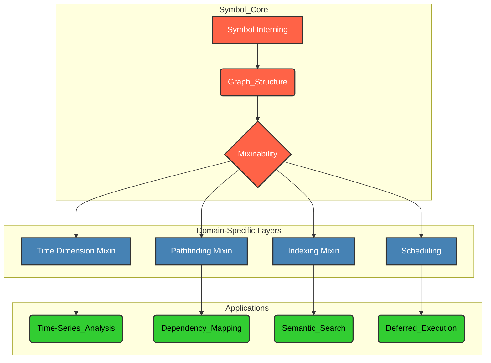

# `«symb»` Quick Guide

## A Foundational Primitive for Symbolic Systems

### Abstract

This document serves as a rapid introduction to `Symbol`, a Python library designed as a foundational primitive for constructing sophisticated symbic systems. Leveraging principles of interning, graph theory, and dynamic mixin-based extensibility, `Symbol` facilitates the creation of highly modular, performant, and semantically rich data models. This guide is tailored for researchers and practitioners with a strong background in computer science, formal methods, or knowledge representation, aiming to provide a high-level understanding and immediate utility.

### 1. Core Concepts

#### 1.1. Symbol Interning (Flyweight Pattern)

At its core, `Symbol` implements a stringent interning mechanism. Every unique string name corresponds to precisely one `Symbol` instance. This ensures referential equality (`is`) for semantically equivalent entities, optimizing memory usage and enabling O(1) lookup for symbic identities.

```python
from symb import Symbol, s

# Direct instantiation: Interning ensures uniqueness
sym_a = Symbol("concept_A")
sym_b = Symbol("concept_A")
assert sym_a is sym_b # True: Same instance

# Namespace access: Convenient interning
sym_c = s.concept_C
sym_d = s.concept_C
assert sym_c is sym_d # True: Same instance
```

#### 1.2. Graph-based Representation

`Symbol` instances inherently function as nodes in a directed acyclic graph (DAG), or more generally, a directed graph. Relationships are established through explicit `append` or `add` operations, forming parent-child connections. This structure is fundamental for modeling hierarchical data, dependencies, and complex networks.

```python
from symb import s
# Building a simple hierarchy
root_node = s.SystemRoot
sub_system_1 = s.SubSystem1
sub_system_2 = s.SubSystem2

root_node.append(sub_system_1)
root_node.append(sub_system_2)

# Accessing relationships
assert sub_system_1 in root_node.children
assert root_node in sub_system_1.parents
```

#### 1.3. Mixin-based Extensibility

`Symbol`'s architecture supports dynamic runtime extension via mixins. This allows for the modular injection of domain-specific behaviors (e.g., time dimension parsing, pathfinding, indexing) without modifying the core `Symbol` class. This pattern promotes a highly composable design, enabling researchers to tailor `Symbol`'s capabilities precisely to their problem domain.

```python
from symb import Symbol

# Time dimension mixin example
event_start = Symbol("2023-10-26T10:00:00Z")
event_end = Symbol("2023-10-26T11:30:00Z")

assert event_start.as_datetime.hour == 10
assert event_end.as_datetime.minute == 30
assert (event_end.as_datetime - event_start.as_datetime).total_seconds() == 5400.0 # 1 hour 30 minutes
```

#### 1.4. Lazy Evaluation & Performance Characteristics

Certain `Symbol` operations, particularly those involving complex graph traversals or computations on large datasets, are designed with lazy evaluation principles. This defers computation until results are explicitly required, optimizing performance for scenarios where only subsets of data are accessed.

*   **O(1) Lookup:** Due to interning.
*   **O(1) Linking:** Appending/adding children.
*   **Traversal:** Performance depends on graph density and traversal algorithm (e.g., DFS/BFS).

### 2. Illustrative Architecture: Knowledge Graph Foundation

Consider `Symbol` as the foundational layer for a dynamic knowledge graph. Each `Symbol` represents an entity or concept, and their interconnections form the graph's structure. Mixins can then imbue these entities with domain-specific semantics and behaviors.



*   **Symbol Core (Red):** Represents the fundamental, immutable aspects of `Symbol` instances.
*   **Domain-Specific Layers (Steel Blue):** Illustrates how mixins extend `Symbol` with specialized capabilities relevant to particular domains.
*   **Applications (Lime Green):** Shows how these extended `Symbol` instances can be leveraged to build concrete applications.

### 3. Considerations for Researchers

*   **Formal Verification:** The immutability of `Symbol` instances (once interned) and the explicit graph structure lend themselves well to formal verification techniques for system properties.
*   **Semantic Web Integration:** `Symbol` can serve as a lightweight, in-memory RDF-like store, where `Symbol` names are URIs and relationships form triples.
*   **Dynamic Systems Modeling:** The mixin architecture enables runtime adaptation of system behavior, crucial for simulating adaptive or self-organizing systems.
*   **Memory Footprint:** While interning optimizes for unique names, be mindful of the graph's overall memory consumption for extremely large-scale graphs. The `MEMORY_AWARE_DELETE` flag offers control over garbage collection behavior.

### 4. Advice to Engineers

1. **Model** your solution from **top to bottom** using Breadth-first search (BFS), this way you'll ensure that no high level abstraction wi'll be missing.
2. **Model** your solution **at detail** on the bottom. Choose low-level protocoral, non-protocoral and hybrid concepts then draft the conceptual zone they consists of.
3. **Review** high-level concepts, adapt and apply **takeaway lessons** observed at previous step. 

### Conclusion

`Symbol` provides a robust and flexible foundation for building complex symbic systems. Its design principles promote clarity, efficiency, and extensibility, making it an ideal tool for academic exploration and practical application in areas requiring sophisticated knowledge representation and graph-based reasoning. For deeper engagement, consult the detailed tutorials and API documentation.
