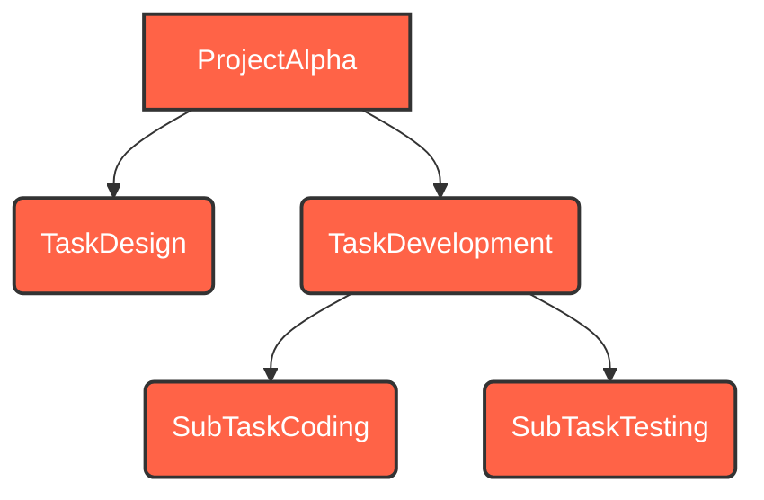
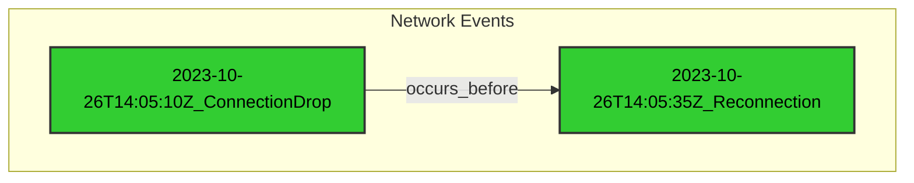
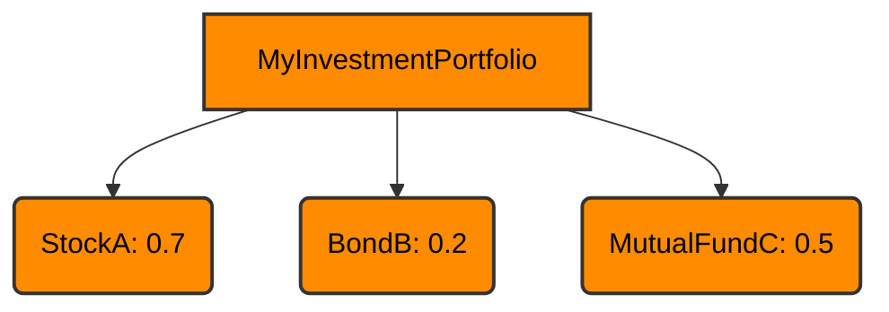

# `«symb»` Tutorial
## An Introduction to Symbolic Modeling

### Abstract

This tutorial provides a comprehensive introduction to the `Symbol` library, guiding users through its fundamental concepts and practical applications. Through a series of progressively complex examples drawn from diverse industries, we will demonstrate how `Symbol` facilitates the creation of clear, maintainable, and extensible symbic models. This document is designed for a broad audience, including software engineers, data scientists, and domain experts seeking to leverage symbic representation in their projects.

### 1. Getting Started: Setup and Basic Symbol Creation and Relationships

`Symbol` is built around the concept of unique, interned symbic entities. Every time you create a `Symbol` with a given name, you get back the exact same object. This ensures consistency and efficiency.

Simply install symb with pip
```bash
# For generic everyday usage
python -m pip install symb

# for some graphical enhancements
python -m pip install symb[visual]

# for package or mixin development 
python -m pip install symb[dev]
```

#### 1.1. Creating Symbols

Symbols can be created directly or via the convenient `s` namespace.

```python
from symb import Symbol, s

# Direct creation
project_alpha = Symbol("ProjectAlpha")
task_design = Symbol("TaskDesign")

# Using the 's' namespace (recommended for brevity)
project_beta = s.ProjectBeta
task_development = s.TaskDevelopment

print(f"Project Alpha: {project_alpha}")
print(f"Task Design: {task_design}")
print(f"Project Beta: {project_beta}")
print(f"Task Development: {task_development}")

# Interning in action: same name, same object
project_alpha_again = Symbol("ProjectAlpha")
assert project_alpha is project_alpha_again
```
<details>
<summary>Outcome</summary>

```text
Project Alpha: <Symbol: ProjectAlpha>
Task Design: <Symbol: TaskDesign>
Project Beta: <Symbol: ProjectBeta>
Task Development: <Symbol: TaskDevelopment>
```
</details>

#### 1.2. Building Relationships: Parent-Child

Symbols can be linked to form directed graphs, representing relationships like parent-child, dependency, or containment. The `append()` method establishes a one-way link, automatically managing bidirectional references.

```python
from symb import Symbol, s
from symb.builtins import apply_builtins

apply_builtins()

# Example: Project Management (Business Services)
# Modeling project phases and tasks

project_alpha = Symbol("ProjectAlpha")
task_design = Symbol("TaskDesign")
task_development = s.TaskDevelopment

project_alpha.append(task_design)
project_alpha.append(task_development)

task_development.append(s.SubTaskCoding)
task_development.append(s.SubTaskTesting)

print(f"Children of {project_alpha}: {list(project_alpha.children)}")
print(f"Parents of {task_design}: {list(task_design.parents)}")

# Visualize the project structure
print(project_alpha.to_mmd())
```
<details>
<summary>Outcome</summary>

```text
Children of <Symbol: ProjectAlpha>: [<Symbol: TaskDesign>, <Symbol: TaskDevelopment>]
Parents of <Symbol: TaskDesign>: [<Symbol: ProjectAlpha>]
graph TD
    ProjectAlpha --> TaskDesign
    ProjectAlpha --> TaskDevelopment
    TaskDevelopment --> SubTaskCoding
    TaskDevelopment --> SubTaskTesting
```
</details>



### 2. Extending Symbol Functionality with Mixins

`Symbol`'s power lies in its extensibility. You can dynamically add new behaviors and properties to `Symbol` instances using mixins. This keeps the core `Symbol` class lean while allowing for rich, domain-specific functionality.

#### 2.1. Enabling Built-in Mixins

The `apply_builtins()` function integrates a set of standard mixins, providing common functionalities like time dimension handling, indexing, and pathfinding.

```python
from symb import Symbol
from symb.builtins import apply_builtins

apply_builtins()

# Example: Telecommunications (Network Event Logging)
# Analyzing event timestamps

network_event_1 = Symbol("2023-10-26T14:05:10Z_ConnectionDrop")
network_event_2 = Symbol("2023-10-26T14:05:35Z_Reconnection")

print(f"Event 1 Datetime: {network_event_1.as_datetime}")
print(f"Event 2 Datetime: {network_event_2.as_datetime}")
print(f"Time difference: {network_event_2.as_datetime - network_event_1.as_datetime}")

# Visualize a timeline of events (conceptual, requires more complex Symbol relationships)
# This would typically involve a series of events linked chronologically.
```
<details>
<summary>Outcome</summary>

```text
Event 1 Datetime: 2023-10-26 14:05:10
Event 2 Datetime: 2023-10-26 14:05:35
Time difference: 0:00:25
```
</details>


#### 2.2. Pathfinding in Graphs

With the pathfinding mixin, you can easily find paths between connected Symbols, useful for dependency analysis or tracing flows.

```python
from symb import s
from symb.builtins import apply_builtins

apply_builtins()

# Example: Supply Chain Logistics (Transportation and Logistics)
# Tracing a product's journey through a supply chain

warehouse_a = s.WarehouseA
factory_b = s.FactoryB
distribution_c = s.DistributionCenterC
retail_d = s.RetailStoreD

warehouse_a.append(factory_b)
factory_b.append(distribution_c)
distribution_c.append(retail_d)

path = warehouse_a.path_to(retail_d)
print(f"Path from Warehouse A to Retail Store D: {[str(sym) for sym in path]}")

# Visualize the supply chain path
print(warehouse_a.to_mmd())
```
<details>
<summary>Outcome</summary>

```text
Path from Warehouse A to Retail Store D: ['<Symbol: WarehouseA>', '<Symbol: FactoryB>', '<Symbol: DistributionCenterC>', '<Symbol: RetailStoreD>']
graph TD
    WarehouseA --> FactoryB
    FactoryB --> DistributionCenterC
    DistributionCenterC --> RetailStoreD
```
</details>


### 3. Advanced Concepts: Indexing and Custom Behaviors

`Symbol` allows for more sophisticated data structures and custom logic to be integrated.

#### 3.1. Symbol Indexing

The `SymbolIndex` allows you to create weighted, searchable indexes of Symbols, enabling efficient retrieval and rebalancing based on various strategies.

```python
from symb import s

# Example: Financial Portfolio Management (Asset and Wealth Management)
# Indexing assets by risk score

portfolio = s.MyInvestmentPortfolio

# Insert assets with their risk scores (weights)
portfolio.index.insert(s.StockA, 0.7) # High risk
portfolio.index.insert(s.BondB, 0.2)  # Low risk
portfolio.index.insert(s.MutualFundC, 0.5) # Medium risk

# Traverse in-order (by weight)
print(f"Assets by risk (in-order): {[str(sym) for sym in portfolio.index.traverse()]}")

```
<details>
<summary>Outcome</summary>

```text
Assets by risk (in-order): ['<Symbol: BondB>', '<Symbol: MutualFundC>', '<Symbol: StockA>']
```
</details>



### Conclusion

This introduction has covered the core aspects of the `Symbol` library, from basic creation and relationship building to leveraging built-in mixins for time dimension handling, pathfinding, and indexing. `Symbol` provides a flexible and powerful foundation for modeling complex systems across various domains. For more in-depth exploration of advanced features and custom extensions, please refer to the Advanced Tutorial and API Documentation.

---
