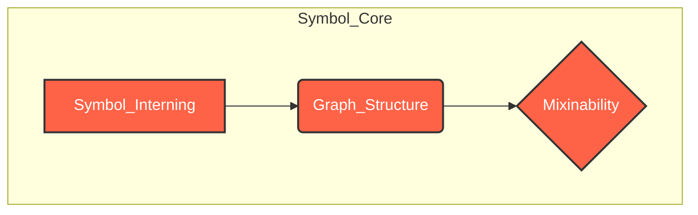
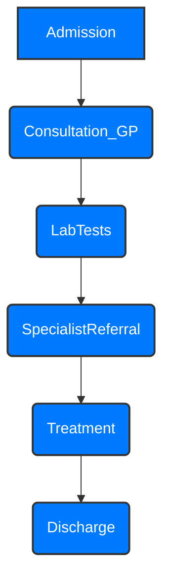
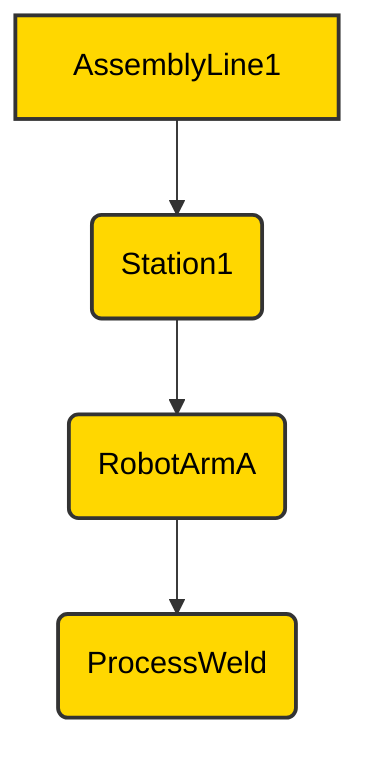
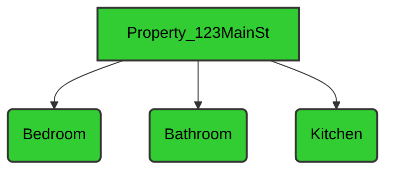

# `«symb»` Tutorial

## Symbolic Modeling and Applications

### Abstract

This advanced tutorial delves into the sophisticated capabilities of the `Symbol` library, showcasing its versatility in addressing complex modeling challenges across a wide spectrum of industries. We will explore advanced features such as custom mixin development, intricate graph manipulations, and strategic application of `Symbol` for domain-specific language (DSL) construction. Through diverse, real-world inspired examples, this guide aims to empower experienced developers and researchers to unlock the full potential of `Symbol` for highly specialized and performant symbic systems.

### 1. Deep Dive into Mixinability: Custom Behaviors and Protocols

Beyond the built-in mixins, `Symbol` allows you to define and register your own custom behaviors, enabling truly domain-specific modeling. This is achieved by creating classes that implement `Symbol`'s protocols and registering them as mixins.

#### 1.1. Custom Mixin Development: Aerospace (Aircraft Maintenance Scheduling)

Imagine modeling aircraft components and their maintenance schedules. We can create a custom mixin to handle `last_inspected` and `next_inspection_due` properties.

```python
import datetime
from symb import Symbol
from symb.core.mixinability import register_mixin
from symb.core.protocols import SymbolProtocol

class AircraftComponentMixin(SymbolProtocol):
    def __init__(self, *args, **kwargs):
        super().__init__(*args, **kwargs)
        self._last_inspected = None
        self._inspection_interval = datetime.timedelta(days=365) # Default 1 year

    @property
    def last_inspected(self) -> Optional[datetime.datetime]:
        return self._last_inspected

    @last_inspected.setter
    def last_inspected(self, dt: datetime.datetime):
        self._last_inspected = dt

    @property
    def next_inspection_due(self) -> Optional[datetime.datetime]:
        if self._last_inspected:
            return self._last_inspected + self._inspection_interval
        return None

# Register the mixin
register_mixin(AircraftComponentMixin, expand=True)

# Usage
engine = Symbol("Engine_Turbofan_A320")
engine.aircraft_component.last_inspected = datetime.datetime(2024, 1, 15)

print(f"Engine last inspected: {engine.aircraft_component.last_inspected}")
print(f"Engine next inspection due: {engine.aircraft_component.next_inspection_due}")
```
<details>
<summary>Outcome</summary>

```text
Engine last inspected: 2024-01-15 00:00:00
Engine next inspection due: 2025-01-15 00:00:00
```
</details>

### 2. Complex Graph Manipulations and Traversal Strategies

`Symbol`'s graph capabilities extend to modeling intricate relationships beyond simple parent-child hierarchies. You can represent complex networks and apply various traversal algorithms.

#### 2.1. Modeling Dependencies: Software Architecture (Technology)

Representing software modules and their dependencies is crucial for understanding system architecture. `Symbol` can model these relationships, and its traversal methods can identify critical paths or circular dependencies.

```python
from symb import s

# Example: Microservices Architecture
auth_service = s.AuthService
user_service = s.UserService
product_service = s.ProductService
payment_service = s.PaymentService

auth_service.append(user_service) # Auth depends on User
user_service.append(product_service) # User depends on Product
product_service.append(payment_service) # Product depends on Payment
payment_service.append(auth_service) # Payment depends on Auth (potential cycle!)

# Visualize the microservices dependencies
print(auth_service.to_mmd(mode="graph"))
```
<details>
<summary>Outcome</summary>

```text
graph TD
    AuthService --> UserService
    UserService --> ProductService
    ProductService --> PaymentService
    PaymentService --> AuthService
```
</details>




#### 2.2. Use Case Modeling: Healthcare (Patient Journey Mapping)

Map a patient's journey through a healthcare system, from admission to discharge, including various medical procedures and consultations. Each step can be a `Symbol`, and their sequence forms a graph.

```python
from symb import s

# Example: Patient Journey
admission = s.Admission
consultation_gp = s.Consultation_GP
lab_tests = s.LabTests
specialist_referral = s.SpecialistReferral
treatment = s.Treatment
discharge = s.Discharge

admission.append(consultation_gp)
consultation_gp.append(lab_tests)
lab_tests.append(specialist_referral)
specialist_referral.append(treatment)
treatment.append(discharge)

# Visualize the patient journey
print(admission.to_mmd())
```
<details>
<summary>Outcome</summary>

```text
graph TD
    Admission --> Consultation_GP
    Consultation_GP --> LabTests
    LabTests --> SpecialistReferral
    SpecialistReferral --> Treatment
    Treatment --> Discharge
```
</details>



### 3. Strategic Applications: DSLs and Semantic Modeling

`Symbol` is an ideal foundation for building Domain-Specific Languages (DSLs) and for rich semantic modeling, enabling more expressive and maintainable code.

#### 3.1. Building a Configuration DSL: Industrial Manufacturing (Assembly Line Configuration)

Define an assembly line using a `Symbol`-based DSL, where each `Symbol` represents a station, a robot, or a process step. This allows for a highly readable and verifiable configuration.

```python
from symb import s

# Example: Assembly Line DSL
line_1 = s.AssemblyLine1
station_1 = s.Station1
robot_arm_a = s.RobotArmA
process_weld = s.ProcessWeld

line_1.append(station_1)
station_1.append(robot_arm_a)
robot_arm_a.append(process_weld)

# You could define custom methods on 'Station' or 'RobotArm' Symbols
# via mixins to validate configurations or simulate operations.

# Visualize the assembly line configuration
print(line_1.to_mmd())
```
<details>
<summary>Outcome</summary>

```text
graph TD
    AssemblyLine1 --> Station1
    Station1 --> RobotArmA
    RobotArmA --> ProcessWeld
```
</details>



#### 3.2. Semantic Data Modeling: Real Estate (Property Attributes and Relationships)

Model real estate properties, their features, and relationships (e.g., `has_bedroom`, `located_in`). `Symbol` can represent both entities and their attributes, creating a rich semantic network.

```python
from symb import s

# Example: Property Listing
property_123 = s.Property_123MainSt
bedroom_sym = s.Bedroom
bathroom_sym = s.Bathroom
kitchen_sym = s.Kitchen

property_123.append(bedroom_sym)
property_123.append(bathroom_sym)
property_123.append(kitchen_sym)

# You could define custom mixins for property valuation, search filters, etc.

# Visualize property attributes
print(property_123.to_mmd())
```
<details>
<summary>Outcome</summary>

```text
graph TD
    Property_123MainSt --> Bedroom
    Property_123MainSt --> Bathroom
    Property_123MainSt --> Kitchen
```
</details>



### Conclusion

This advanced tutorial has demonstrated `Symbol`'s capacity for sophisticated symbic modeling. By mastering custom mixins, complex graph structures, and strategic DSL design, you can leverage `Symbol` to build highly expressive, maintainable, and performant systems across a multitude of domains. The flexibility and extensibility of `Symbol` make it an invaluable tool for tackling challenging problems in knowledge representation, system design, and data analysis. For detailed technical specifications, refer to the API Documentation.
