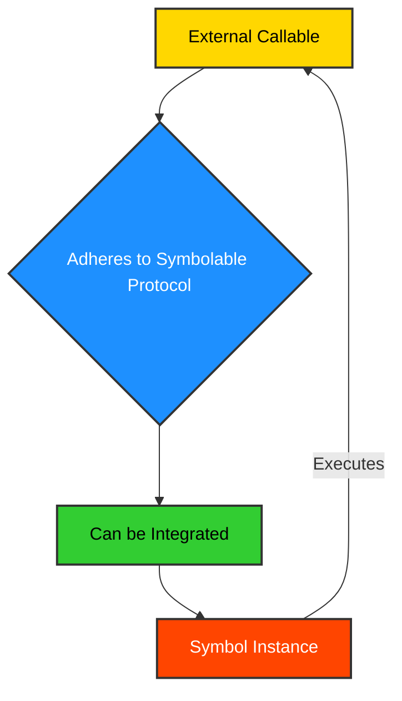
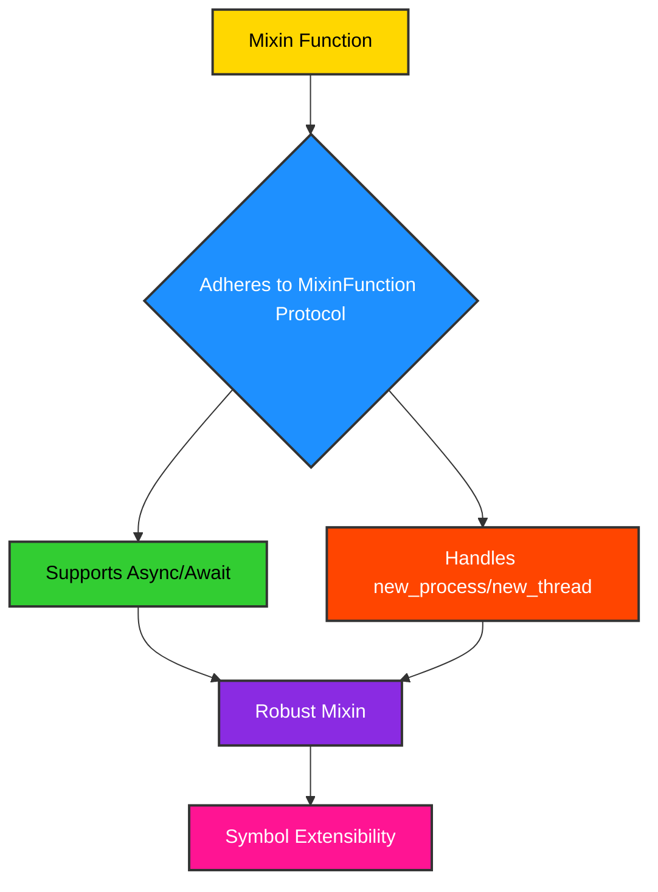
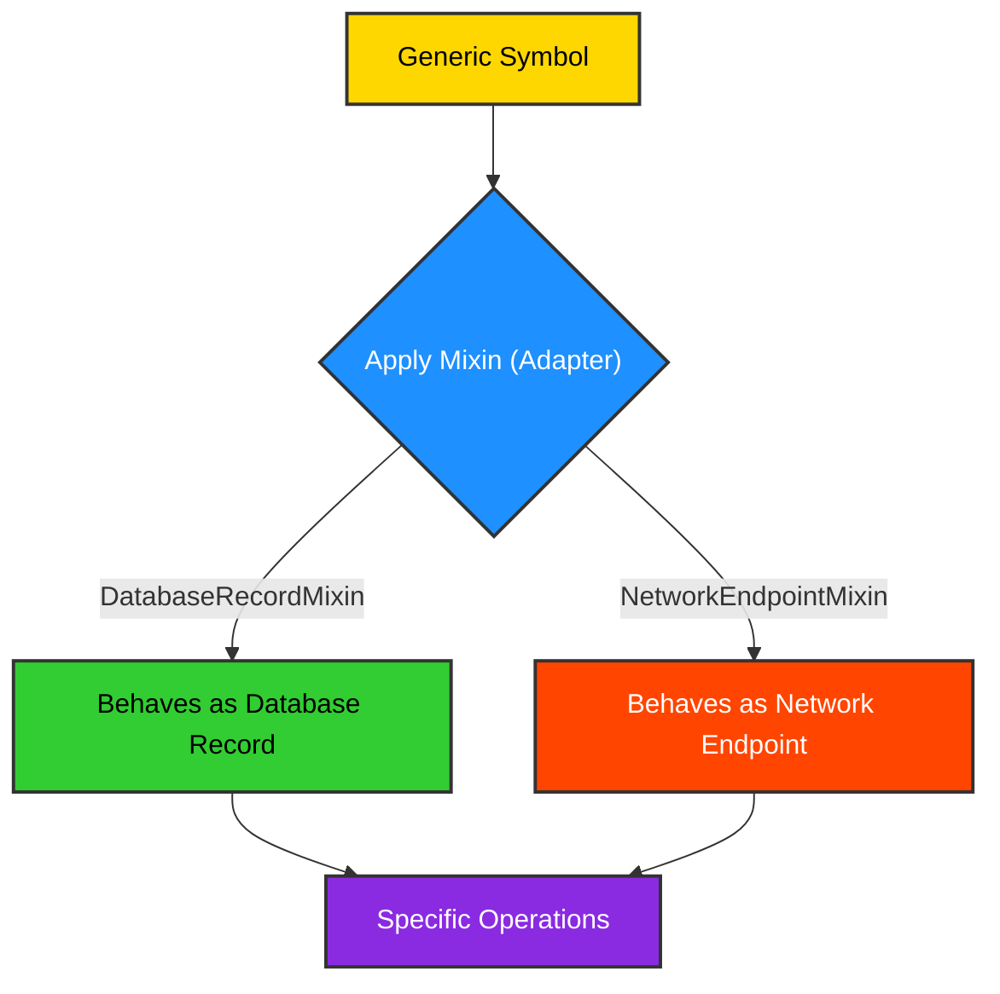
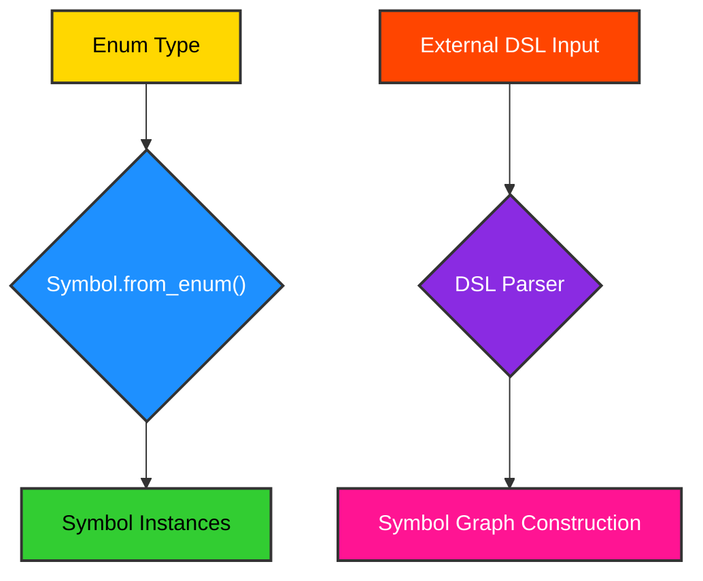

# Extensibility: Adapting Symbol to Diverse Domains

The `Symbol` framework is designed with a strong emphasis on extensibility, allowing it to be adapted and integrated into a wide array of applications and domains. This extensibility is achieved through well-defined protocols, dynamic mixin capabilities, and compatibility with external data formats like enum reflections and Domain-Specific Languages (DSLs).

## `Symbolable` Type for Robust Callable Integration

The `Symbolable` protocol defines a clear contract for objects that can be seamlessly integrated into a `Symbol` instance. By adhering to this protocol, external callable entities (functions, methods, or even classes with a `__call__` method) can be treated as first-class citizens within the `Symbol` ecosystem. This promotes a clean separation of concerns, allowing complex behaviors to be encapsulated in external modules while still being accessible and manageable through `Symbol`.

### Purpose and Usage
To ensure that any callable object can be consistently used within the `Symbol` framework, particularly when dynamically attaching behaviors or processing data.

### Code Example
```python
from symb import Symbol
from typing import Protocol, Any, Union, Awaitable
from symb.core.mixinability import register_mixin

# Define a custom Symbolable class
class MyCustomAction(Protocol):
    def __call__(self, *args: Any, **kwargs: Any) -> Union[Any, Awaitable[Any]]:
        ...

class LogActionMixin:
    def log_message(self, message: str):
        print(f"[LOG] {message}")

class CalculateSumMixin:
    def calculate_sum(self, a: int, b: int) -> int:
        return a + b

# Register mixins
register_mixin(LogActionMixin, expand=True)
register_mixin(CalculateSumMixin, expand=True)

log_symb = Symbol('Logger')
calc_symb = Symbol('Calculator')

# Using the integrated Symbolable objects
log_symb.log_message("Application started.")
result = calc_symb.calculate_sum(10, 20)
print(f"Calculation result: {result}")
```
<details>
<summary>Outcome</summary>

```text
[LOG] Application started.
Calculation result: 30
```
</details>

### Diagram

## `MixinFunction` Protocol for Formal Mixin Interface

The `MixinFunction` protocol provides a formal interface for defining mixin functions within the `Symbol` framework. This protocol ensures that mixins conform to a predictable structure, especially concerning asynchronous operations and execution contexts (new processes or threads). By adhering to `MixinFunction`, developers can create robust and interoperable mixins that seamlessly extend `Symbol`'s capabilities while maintaining system stability.

### Purpose and Usage
To define a standard for mixin functions, particularly those that might involve asynchronous operations or require specific execution environments.

### Code Example
```python
from symb import Symbol
from symb.core.mixinability import register_mixin
from symb.core.protocols import MixinFunction
import asyncio

# A mixin function conforming to MixinFunction protocol
class AsyncDataFetcher(MixinFunction):
    async def __call__(self, url: str, new_process: bool = False, new_thread: bool = True) -> str:
        print(f"Fetching data from {url} in a new thread: {new_thread}, new process: {new_process}")
        await asyncio.sleep(0.1) # Simulate async I/O
        return f"Data from {url}"

# Register the mixin
register_mixin(AsyncDataFetcher, expand=True)

# Use the mixin
async def main():
    web_symb = Symbol('WebResource')
    data = await web_symb.fetch_data("https://example.com")
    print(data)

if __name__ == "__main__":
    asyncio.run(main())
```
<details>
<summary>Outcome</summary>

```text
Fetching data from https://example.com in a new thread: True, new process: False
Data from https://example.com
```
</details>

### Diagram

## `SymbolAdapter` Mixinable Interface Enables Different Logical Structures

While not explicitly defined as a separate class in the provided code, the concept of a `SymbolAdapter` is implicitly supported through the framework's mixinability. This allows `Symbol` instances to dynamically adopt different logical structures or behaviors, effectively acting as adapters for various data models or interaction patterns. By applying specific mixins, a generic `Symbol` can be transformed to behave like a database record, a network endpoint, or a UI component, without altering its core identity.

### Purpose and Usage
To dynamically change the logical interpretation or behavior of a `Symbol` instance by applying specific mixins. This enables a single `Symbol` to represent different types of entities based on context.

### Code Example
```python
from symb import Symbol
from symb.core.mixinability import register_mixin
from symb.builtins import apply_builtins

# Define mixins for different logical structures
class DatabaseRecordMixin:
    def save(self):
        print(f"Saving {self.name} as a database record.")

    def load(self):
        print(f"Loading {self.name} from database.")

class NetworkEndpointMixin:
    def send_request(self, data):
        print(f"Sending request from {self.name} with data: {data}")

    def receive_response(self):
        print(f"Receiving response for {self.name}.")

# Register mixins
register_mixin(DatabaseRecordMixin, expand=True)
register_mixin(NetworkEndpointMixin, expand=True)

apply_builtins()

# Create a symb and apply behaviors dynamically
db_entity = Symbol('UserAccount')
db_entity.save()
db_entity.load()

network_node = Symbol('API_Gateway')
network_node.send_request({"query": "status"})
network_node.receive_response()
```
<details>
<summary>Outcome</summary>

```text
Saving UserAccount as a database record.
Loading UserAccount from database. 
Sending request from API_Gateway with data: {'query': 'status'}
Receiving response for API_Gateway.
```
</details>

### Diagram

## Compatible with Enum Reflection and External DSL Inputs

The `Symbol` framework's extensibility extends to its compatibility with external data sources and declarative formats. It can seamlessly integrate with Python's `enum` types through reflection, allowing enumeration members to be directly converted into `Symbol` instances. Furthermore, its flexible design enables the ingestion and interpretation of external Domain-Specific Language (DSL) inputs, facilitating the definition of complex symbic structures and relationships using declarative syntax.

### Purpose and Usage
To easily convert `enum` members into `Symbol` instances and to allow external DSLs to define `Symbol` structures, enhancing interoperability and declarative modeling.

### Code Example
```python
from symb import Symbol
import enum
from symb.builtins import apply_builtins

apply_builtins()

# Enum Reflection
class TrafficLight(enum.Enum):
    RED = 1
    YELLOW = 2
    GREEN = 3

# Convert enum members to Symbols
traffic_symbs = Symbol.from_enum(TrafficLight)
for sym in traffic_symbs:
    print(f"Enum Symbol: {sym.name}")

def parse_dsl(dsl_string: str):
    symbs = {}
    for line in dsl_string.split(','):
        parts = line.strip().split('->')
        if len(parts) == 2:
            source_name = parts[0].strip()
            target_name = parts[1].strip()
            source_sym = symbs.get(source_name, Symbol(source_name))
            target_sym = symbs.get(target_name, Symbol(target_name))
            source_sym.append(target_sym)
            symbs[source_name] = source_sym
            symbs[target_name] = target_sym
    return symbs

dsl_input = "user -> post, post -> comment, user -> like"
parsed_symbs = parse_dsl(dsl_input)

user_sym = parsed_symbs['user']
print("\nDSL-defined graph:")
for sym in user_sym.tree():
    print(sym.name)
```
<details>
<summary>Outcome</summary>

```text
Enum Symbol: RED
Enum Symbol: YELLOW
Enum Symbol: GREEN

DSL-defined graph:
user
post
comment
like
```
</details>

### Diagram

## Conclusion

The `Symbol` framework's commitment to extensibility empowers developers to build highly adaptable and interoperable systems. By providing clear protocols for callable integration, formal interfaces for mixins, and seamless compatibility with external data formats, `Symbol` facilitates the creation of flexible, domain-specific solutions that can evolve with changing requirements. This design philosophy ensures that `Symbol` remains a versatile tool for a wide range of symbic data manipulation tasks.

For a comprehensive overview of the Symbol's extensibility, refer to the [Extensibility Overview Diagram](extensibility_overview.mmd).

--
