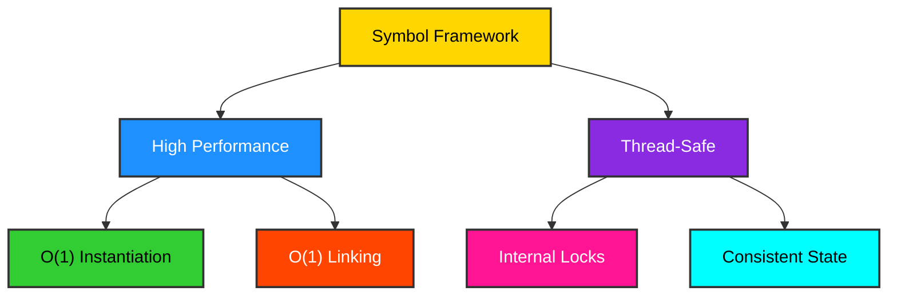
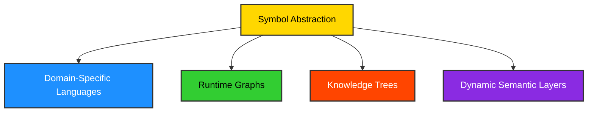
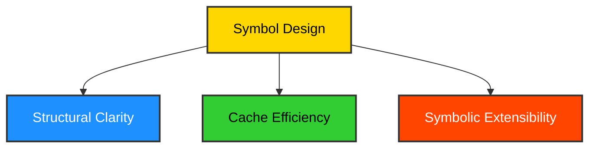

# Conclusion: The Symbol Framework - A Foundation for Advanced Data Structures

The `Symbol` framework stands as a testament to the power of well-designed abstractions in managing complex data. It provides a high-performance, semantically rich, and thread-safe symb abstraction, serving as a robust foundation for building sophisticated systems such as Domain-Specific Languages (DSLs), runtime graphs, knowledge trees, and dynamic semantic layers. The core design principles emphasize structural clarity, cache efficiency, and symbic extensibility, making it a versatile tool for modern software engineering challenges.

## High-Performance and Thread-Safe Abstraction

`Symbol` achieves high performance through its O(1) instantiation (via interning) and efficient relationship linking. The underlying mechanisms, such as Python's native list operations and optimized data structures for indexing, contribute to its speed. Furthermore, the framework is designed to be thread-safe, ensuring consistent behavior and data integrity in concurrent environments, which is crucial for multi-threaded applications and distributed systems.

### Diagram: Performance & Thread Safety

## Powering DSLs, Runtime Graphs, and Knowledge Trees

`Symbol`'s ability to represent unique entities and their relationships makes it an ideal candidate for constructing various advanced data structures:

-   **Domain-Specific Languages (DSLs)**: By mapping domain concepts to `Symbol` instances and their relationships, developers can create intuitive and expressive DSLs. This allows domain experts to define complex rules and structures using a language tailored to their specific problem space.
-   **Runtime Graphs**: `Symbol` facilitates the dynamic creation and manipulation of graphs at runtime. This is invaluable for applications requiring flexible data models, such as network topologies, dependency graphs, or process flows.
-   **Knowledge Trees**: The hierarchical and relational capabilities of `Symbol` make it suitable for building knowledge representation systems. Concepts, facts, and their interconnections can be modeled as symbs and relationships, forming a navigable knowledge base.

### Diagram: Applications

## Structural Clarity, Cache Efficiency, and Symbolic Extensibility

These three pillars underpin the `Symbol` framework's design philosophy:

-   **Structural Clarity**: The explicit representation of entities as `Symbol` objects and relationships as directed edges leads to highly readable and maintainable code. The graph structure is intuitive, making it easier to reason about complex data interdependencies.
-   **Cache Efficiency**: Through mechanisms like interning and the maturing process, `Symbol` optimizes for cache locality and reduces memory overhead. This translates to faster data access and improved overall application performance.
-   **Symbolic Extensibility**: The mixinability and protocol-driven design allow developers to extend `Symbol`'s functionality dynamically and safely. This ensures that the framework can evolve and adapt to new requirements without compromising its core stability.

### Diagram: Design Pillars

## Final Thoughts

The `Symbol` framework offers a compelling solution for developers grappling with complex, interconnected data. Its blend of performance, semantic richness, and extensibility positions it as a valuable tool for building the next generation of intelligent and adaptable software systems. By embracing the principles of symbic abstraction, `Symbol` empowers engineers to model and manipulate information with unprecedented clarity and efficiency.

---
