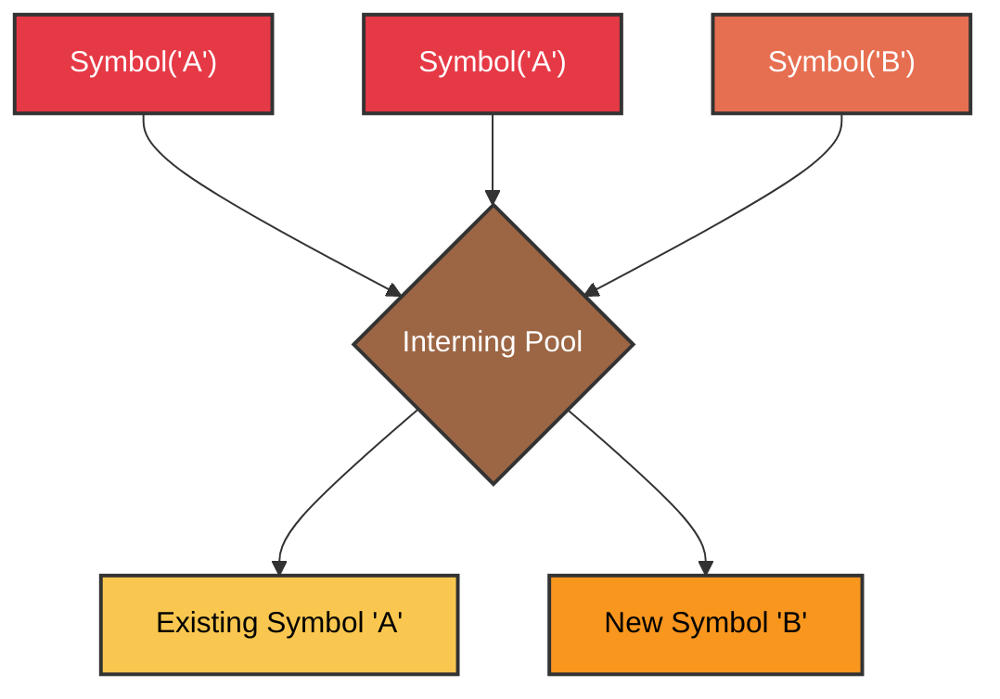
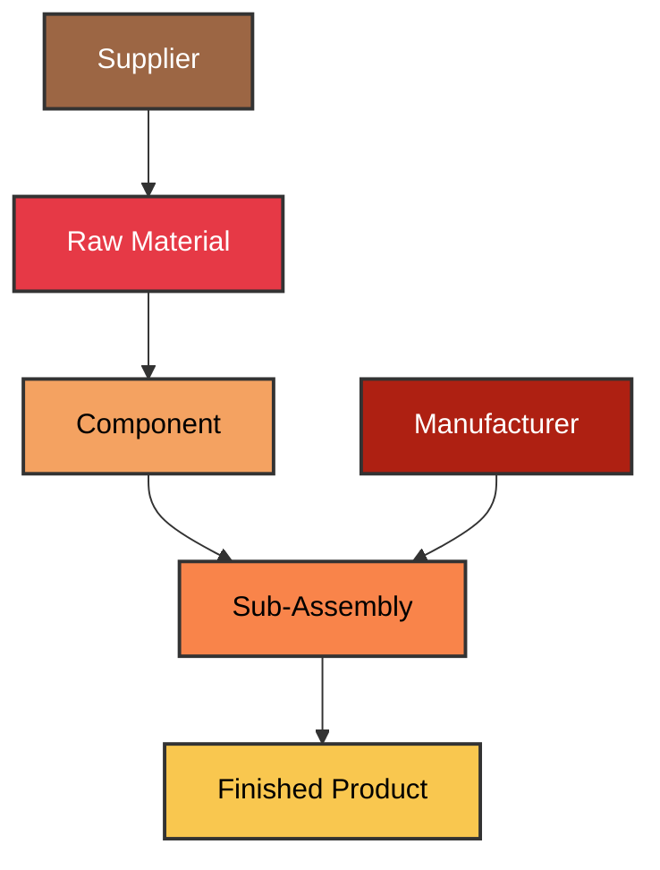
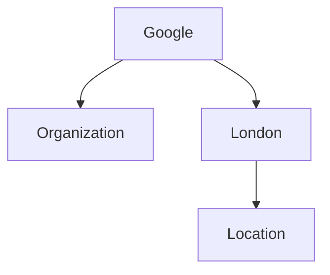

# `«symb»`

> - Imagine `symb` like a pointer that does not point to anything. 
> - Imagine `symbs` as a knowledge meta-network layer that represent semantic information about your entities and objects.

# 1.1 Symbol: The Fundamental Building Block

The `Symbol` object serves as the atomic unit within the framework, embodying a node in a dynamic, directed acyclic graph (DAG). Its design prioritizes uniqueness, efficient relationship management, and extensibility, making it a versatile primitive for diverse symbic data manipulation tasks.

## Uniqueness and Interning

Each `Symbol` instance is uniquely identified by its `name` attribute. This uniqueness is enforced through an interning mechanism, ensuring that `Symbol('A')` will always return the same object in memory as any subsequent call to `Symbol('A')`. This design choice offers significant advantages:

-   **Memory Efficiency**: Prevents redundant object creation, reducing memory footprint, especially in large graphs with many identical symbic representations.
-   **Consistency**: Guarantees that operations on a symb consistently refer to the same underlying entity, simplifying identity checks and graph integrity.
-   **Performance**: Accelerates lookups and comparisons, as identity can often be checked by memory address rather than content comparison.



## Complex Relationships and Graph Structure

`Symbol` objects are designed to form complex relationships, acting as nodes in a directed acyclic graph (DAG). Each `Symbol` maintains references to its `children` (symbs it points to) and `parents` (symbs that point to it). This bidirectional linking facilitates efficient traversal and manipulation of the graph structure.

The framework provides intuitive methods for establishing and managing these relationships:

-   `symb.add(child)`: Establishes a directed relationship from `symb` to `child`. If the relationship already exists, it is idempotent.
-   `symb.append(child)`: Similar to `add`, but ensures the child is added to the end of the children list if not already present.
-   `symb.delete()`: Removes a symb from the graph, severing its connections to parents and children.

### Illustrative Example: Supply Chain Modeling

Consider a supply chain where raw materials are transformed into finished goods. Each entity (e.g., "Supplier", "Manufacturer", "Product") can be represented as a `Symbol`. Relationships like "supplies", "manufactures", or "contains" can be modeled by connecting these symbs.


### Code Example: Building a Simple Knowledge Graph

```python
from symb import Symbol, s

# Create symbs for entities
person = Symbol('Person')
organization = Symbol('Organization')
event = Symbol('Event')
location = Symbol('Location')

# Create specific instances
alice = s.Alice
bob = s.Bob
google = s.Google
conference = s.Tech_Conference_2025
london = s.London

# Establish relationships
alice.add(person)
bob.add(person)
google.add(organization)
conference.add(event)
london.add(location)

alice.add(google) # Alice works at Google
google.add(london) # Google has an office in London
alice.add(conference) # Alice attends the conference
conference.add(london) # Conference is in London

# Traverse and visualize
print(alice.to_ascii())
print()
print(google.to_mmd())
```
<details>
<summary>Outcome</summary>

```text
- Alice
  - Person
  - Google
    - Organization
    - London
      - Location
  - Tech_Conference_2025
    - Event

graph TD
    Google --> Organization
    Google --> London
    London --> Location
```

**Rendered Mermaid Diagram:**


</details>

### Industry Applications

**High-Tech: Semantic Web and Knowledge Graphs**
```python
from symb import s, Symbol
from symb.core.mixinability import register_mixin
from symb.core.protocols import SymbolProtocol
from symb.builtins import apply_builtins

class KnowledgeGraphMixin(SymbolProtocol):
    def has_title(self, title: Symbol):
        self.add(title)

    def has_author(self, author: Symbol):
        self.add(author)

    def published_in(self, journal: Symbol):
        self.add(journal)

    def affiliated_with(self, organization: Symbol):
        self.add(organization)

    def contains(self, component: Symbol):
        self.add(component)

register_mixin(KnowledgeGraphMixin, expand=True)
apply_builtins()

# Representing a research paper and its attributes
s.Paper_A.has_title(s.The_Future_of_AI)
s.Paper_A.has_author(s.Alice_Smith)
s.Paper_A.published_in(s.Journal_of_AI_Research)
s.Alice_Smith.affiliated_with(s.University_X)

print(f"Paper A title: {s.Paper_A.children[0].name}")
print(f"Author of Paper A: {s.Paper_A.children[1].name}")
```
<details>
<summary>Outcome</summary>

```text
Paper A title: The_Future_of_AI
Author of Paper A: Alice_Smith
```
</details>

**Low-Tech: Inventory Management and Bill of Materials (BOM)**
```python
from symb import s, Symbol
from symb.core.mixinability import register_mixin
from symb.core.protocols import SymbolProtocol
from symb.builtins import apply_builtins

class KnowledgeGraphMixin(SymbolProtocol):
    def has_title(self, title: Symbol):
        self.add(title)

    def has_author(self, author: Symbol):
        self.add(author)

    def published_in(self, journal: Symbol):
        self.add(journal)

    def affiliated_with(self, organization: Symbol):
        self.add(organization)

    def contains(self, component: Symbol):
        self.add(component)

register_mixin(KnowledgeGraphMixin, expand=True)
apply_builtins()

# Modeling a bicycle BOM
s.Bicycle.contains(s.Frame)
s.Bicycle.contains(s.Wheel_Assembly)
s.Bicycle.contains(s.Handlebars)
s.Wheel_Assembly.contains(s.Rim)
s.Wheel_Assembly.contains(s.Spokes)
s.Wheel_Assembly.contains(s.Tire)

print(f"Bicycle components: {[c.name for c in s.Bicycle.children]}")
print(f"Wheel Assembly components: {[c.name for c in s.Wheel_Assembly.children]}")
```
<details>
<summary>Outcome</summary>

```text
Bicycle components: ['Frame', 'Wheel_Assembly', 'Handlebars']
Wheel Assembly components: ['Rim', 'Spokes', 'Tire']
```
</details>

## Conclusion

The `Symbol` object, with its inherent uniqueness and robust mechanisms for establishing and managing relationships, provides a powerful and flexible foundation for representing and manipulating complex, graph-based data structures across a wide spectrum of applications. Its lean design and extensibility ensure adaptability to evolving domain requirements.

---
