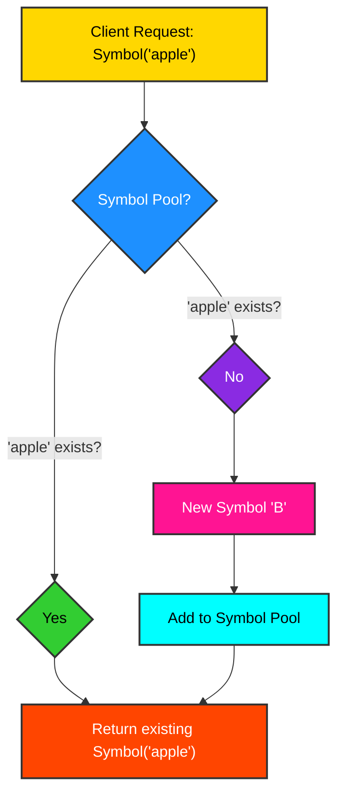

# 1.2 Flyweight Design: Optimizing Symbol Instantiation

NThe `Symbol` framework leverages the **Flyweight design pattern** to ensure the uniqueness and efficient management of `Symbol` instances. This pattern is particularly effective in scenarios where a large number of objects share common state, allowing for significant memory savings and improved performance.

## Core Principle: Shared Intrinsic State

In the context of `Symbol`, the intrinsic state—the `name` of the symb—is shared. When a request is made to create a `Symbol` with a specific name (e.g., `Symbol('apple')`), the system first checks if a `Symbol` with that name already exists in a central pool. If it does, the existing instance is returned; otherwise, a new instance is created and added to the pool.


## Advantages of Flyweight in Symbol

-   **Memory Efficiency**: By ensuring that only one instance of a `Symbol` exists for each unique name, the framework drastically reduces memory consumption, especially in applications dealing with vast numbers of symbic representations (e.g., large knowledge graphs, extensive ontologies).
-   **Consistency and Identity**: The Flyweight pattern guarantees referential equality for symbs with the same name. This means `Symbol('A') is Symbol('A')` will always evaluate to `True`, simplifying identity checks and ensuring that all references to a particular concept point to the exact same object.
-   **Performance**: Reduced object creation overhead and direct memory address comparisons contribute to faster operations, particularly in graph traversal and relationship management.

### Code Example: Demonstrating Flyweight Behavior

```python
from symb import Symbol

sym1 = Symbol('product_id_123')
sym2 = Symbol('product_id_123')
sym3 = Symbol('user_session_abc')

print(f"sym1: {sym1}")
print(f"sym2: {sym2}")
print(f"sym3: {sym3}")

print(f"Are sym1 and sym2 the same object? {sym1 is sym2}") # Expected: True
print(f"Are sym1 and sym3 the same object? {sym1 is sym3}") # Expected: False


```
<details>
<summary>Outcome</summary>

```text
sym1: <Symbol: product_id_123>
sym2: <Symbol: product_id_123>
sym3: <Symbol: user_session_abc>
Are sym1 and sym2 the same object? True
Are sym1 and sym3 the same object? False
```
</details>

### Industry Applications

**High-Tech: Compiler Design and Abstract Syntax Trees (ASTs)**
```python
from symb import s

# Simulate AST nodes for literals
literal_zero_1 = s.Literal_0
literal_zero_2 = s.Literal_0
variable_x_1 = s.Variable_X
variable_x_2 = s.Variable_X

print(f"Literal 0 (1) is Literal 0 (2): {literal_zero_1 is literal_zero_2}")
print(f"Variable X (1) is Variable X (2): {variable_x_1 is variable_x_2}")
```
<details>
<summary>Outcome</summary>

```text
Literal 0 (1) is Literal 0 (2): True
Variable X (1) is Variable X (2): True
```
</details>

**Low-Tech: Document Processing and Word Processors**
```python
from symb import s

# Simulate a document with repeated words
document_words = [s.The, s.quick, s.brown, s.fox, s.jumps, s.over, s.the, s.lazy, s.dog, s.The]

# Check if repeated words are the same Symbol object
print(f"First 'The' is same as second 'The': {document_words[0] is document_words[6]}")
print(f"First 'The' is same as third 'The': {document_words[0] is document_words[9]}")
```
<details>
<summary>Outcome</summary>

```text
First 'The' is same as second 'The': True
First 'The' is same as third 'The': True
```
</details>

## Conclusion

The integration of the Flyweight design pattern into the `Symbol` framework is a deliberate architectural choice that underpins its efficiency and robustness. It enables the creation of highly scalable symbic data structures by optimizing memory usage and ensuring consistent object identity, which are critical factors in complex data manipulation and graph-based applications.
