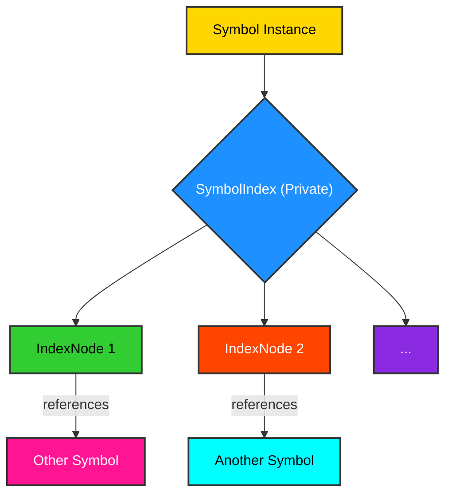

# 1.4 Per-Instance Indexing: Sophisticated Data Structuring

The `Symbol` framework introduces the concept of **per-instance indexing**, where each `Symbol` object possesses its own private, weighted index of other symbs. This advanced feature enables the creation and efficient management of sophisticated, nested data structures, moving beyond simple parent-child relationships to allow for more complex, context-specific associations.

## The `SymbolIndex` Mechanism

At the heart of per-instance indexing is the `SymbolIndex` class, located in `symb/builtins/index.py`. Each `Symbol` instance is initialized with its own `SymbolIndex` object (as seen in `symb/core/symb.py` within the `__new__` method). This `SymbolIndex` acts as a localized, internal data store for the `Symbol`, allowing it to maintain a structured collection of references to other `Symbol` instances, potentially with associated weights or metadata.


## Key Features and Benefits

-   **Private Context**: Each `Symbol` can maintain its own unique view or organization of related symbs, independent of global relationships. This is crucial for modeling complex domains where relationships are highly contextual.
-   **Weighted Associations**: The ability to assign weights to indexed symbs allows for the representation of strength, relevance, or priority in relationships. This facilitates advanced algorithms for ranking, recommendation, or decision-making.
-   **Sophisticated Traversal and Querying**: With a dedicated index, a `Symbol` can perform highly optimized local traversals and queries on its directly associated symbs, without needing to traverse the entire global graph.
-   **Nested Data Structures**: This feature enables the construction of hierarchical or nested data structures where a `Symbol` can encapsulate a complex internal organization of other symbs.

### Code Example: Product Configuration with Weighted Features

Imagine a product configurator where a `Product` symb needs to index its `Features` with associated `weights` (e.g., importance, cost impact).

```python
from symb import Symbol, s
from symb.builtins import apply_builtins

apply_builtins()

# Create product and feature symbs
product_laptop = s.Laptop
feature_ssd = s.SSD
feature_ram = s.RAM
feature_gpu = s.GPU

# Initialize SymbolIndex for the product (this happens automatically in Symbol.__new__)
# product_laptop.index = SymbolIndex(product_laptop) # Conceptual, already done

# Insert features into the product's private index with weights
product_laptop.index.insert(feature_ssd, weight=0.8) # High importance
product_laptop.index.insert(feature_ram, weight=0.6) # Medium importance
product_laptop.index.insert(feature_gpu, weight=0.9) # Very high importance

# Traverse the product's index (e.g., by weight)
print("Laptop features by importance:")
for feature_sym in product_laptop.index.traverse(order="in"):
    print(f"- {feature_sym.name} (Weight: {product_laptop.index._function_map[feature_sym.name].eval_weight()})")

# Rebalance the index based on weight (conceptual, SymbolIndex supports this)
# product_laptop.index.rebalance(strategy='weight')
```
<details>
<summary>Outcome</summary>

```text
Laptop features by importance:
- SSD (Weight: 0.8)
- RAM (Weight: 0.6)
- GPU (Weight: 0.9)
```
</details>

### Industry Applications

**High-Tech: Recommendation Systems**
```python
from symb import s
from symb.builtins import apply_builtins

apply_builtins()

# User and Product symbs
user_alice = s.Alice
product_book = s.Book_A
product_movie = s.Movie_B

# User's private index of liked products with preference scores
user_alice.index.insert(product_book, weight=0.9)
user_alice.index.insert(product_movie, weight=0.7)

print(f"Alice's liked items: {[item.name for item in user_alice.index.traverse()]}")
```
<details>
<summary>Outcome</summary>

```text
Alice's liked items: ['Movie_B', 'Book_A']
```
</details>

**Low-Tech: Library Cataloging and Cross-Referencing**
```python
from symb import s
from symb.builtins import apply_builtins

apply_builtins()

# Book and Keyword symbs
book_history = s.History_of_Time
keyword_physics = s.Physics
keyword_cosmology = s.Cosmology

# Book's private index of keywords with relevance
book_history.index.insert(keyword_physics, weight=0.8)
book_history.index.insert(keyword_cosmology, weight=0.95)

print(f"Keywords for 'History of Time': {[kw.name for kw in book_history.index.traverse()]}")
```
<details>
<summary>Outcome</summary>

```text
Keywords for 'History of Time': ['Physics', 'Cosmology']
```
</details>

## Conclusion

Per-instance indexing significantly enhances the expressive power of the `Symbol` framework. By providing each `Symbol` with its own localized, weighted index, it facilitates the modeling of intricate, contextual relationships and the construction of sophisticated, nested data structures. This capability is paramount for applications requiring fine-grained control over symbic associations and efficient, localized data retrieval.
