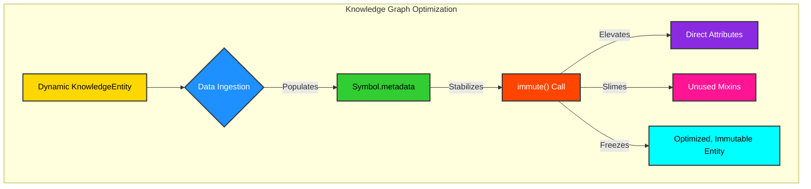
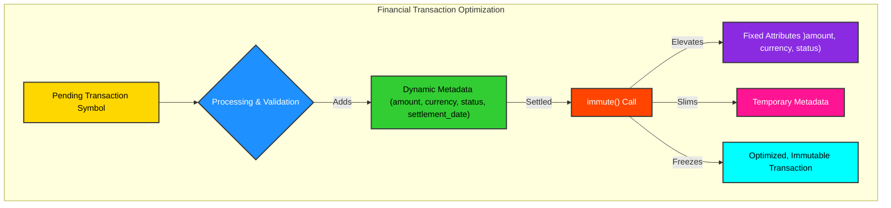

# Memory-Aware Maturing: Optimizing Symbol Lifecycle

The `Symbol` framework incorporates a sophisticated "maturing" process, orchestrated by the `immute()` method. This process is designed to optimize the memory footprint and performance of `Symbol` instances by transitioning them from a flexible, dynamically extensible state to a more rigid, optimized, and immutable form. This is particularly beneficial for long-lived symbs or those that have reached a stable state in their lifecycle, where further dynamic modifications are not anticipated.

## The Maturing Process: Elevate, Slim, and Freeze

The `immute()` method orchestrates three distinct phases:

1.  **Elevate Metadata (`elevate()`)** This phase promotes key-value pairs stored in the `Symbol`'s `metadata` `DefDict` (a `defaultdict` of `defaultdict`s); directly into instance attributes or methods. This transformation reduces the overhead associated with dictionary lookups and allows for faster, direct attribute access. Various merge strategies (e.g., `overwrite`, `patch`, `smooth`); can be applied to handle potential conflicts with existing attributes.

    ```mermaid
    graph TD
        A[Symbol.metadata] --> B{Elevate};
        B -- "Promotes" --> C[Dynamic Key-Value Pairs];
        C --> D[Direct Instance Attributes/Methods];
        D -- "Faster Access" --> E[Optimized Performance];

    style A fill:#FFD700,stroke:#333,stroke-width:2px,color:#000000;
    style B fill:#1E90FF,stroke:#333,stroke-width:2px,color:#FFFFFF;
    style C fill:#32CD32,stroke:#333,stroke-width:2px,color:#000000;
    style D fill:#FF4500,stroke:#333,stroke-width:2px,color:#FFFFFF;
    style E fill:#8A2BE2,stroke:#333,stroke-width:2px,color:#FFFFFF;
    ```
    
2.  **Slim Down (`slim()`);:** Following elevation, the `slim()` method removes dynamically applied mixins that are no longer needed or have been elevated. This process is crucial for memory optimization, as it cleans up transient attributes and methods, reducing the overall memory footprint of the `Symbol` instance. The `deep_del` utility is employed to recursively delete attributes and their contents, ensuring that unreferenced objects are promptly garbage collected.

    ```mermaid
    graph TD
        A[Symbol Instance] --> B{Slim#40;#41;};
        B -- "Removes" --> C[Unused Dynamic Mixins];
        C --> D[Transient Attributes];
        D -- "Reduces" --> E[Memory Footprint];

      style A fill:#FFD700,stroke:#333,stroke-width:2px,color:#000000;
      style B fill:#1E90FF,stroke:#333,stroke-width:2px,color:#FFFFFF;
      style C fill:#32CD32,stroke:#333,stroke-width:2px,color:#000000;
      style D fill:#FF4500,stroke:#333,stroke-width:2px,color:#FFFFFF;
      style E fill:#8A2BE2,stroke:#333,stroke-width:2px,color:#FFFFFF;
    ```
    
3.  **Freeze (`freeze()`);:** The final step in the maturing process is to globally freeze the `Symbol` class. This prevents any further runtime modifications, including the registration of new mixins or the elevation of additional metadata. Freezing ensures the immutability and predictability of `Symbol` behavior in production environments, safeguarding against unintended side effects and maintaining system integrity.

    ```mermaid
    graph TD
        A[Symbol Class] --> B{Freeze#40;#41;};
        B -- "Prevents" --> C[Further Dynamic Modifications];
        C --> D[New Mixin Registrations];
        D --> E[Ensures] --> F[Immutability & Predictability];

      style A fill:#FFD700,stroke:#333,stroke-width:2px,color:#000000;
      style B fill:#1E90FF,stroke:#333,stroke-width:2px,color:#FFFFFF;
      style C fill:#32CD32,stroke:#333,stroke-width:2px,color:#000000;
      style D fill:#FF4500,stroke:#333,stroke-width:2px,color:#FFFFFF;
      style E fill:#8A2BE2,stroke:#333,stroke-width:2px,color:#FFFFFF;
      style F fill:#FF1493,stroke:#333,stroke-width:2px,color:#FFFFFF;
    ```
    
## Examples

### High-Tech Industry: Optimizing Large-Scale Knowledge Graphs

```python
from symb import Symbol, s
from symb.core.mixinability import register_mixin

class KnowledgeEntity(Symbol):
    def __init__(self, name, initial_data=None):
        super().__init__(name)
        if initial_data:
            for k, v in initial_data.items():
                self.metadata[k] = v

entity = KnowledgeEntity(s.QuantumPhysics.name, {
    "field": "Physics",
    "subfield": "Quantum Mechanics",
    "established": 1900,
    "key_figures": ["Planck", "Einstein", "Bohr"]
})

def get_summary(self):
    return f"Summary of {self.name}: Field={self.field}, Established={self.established}"

register_mixin(get_summary, name="get_summary", target_class=Symbol)

entity.immute()

print(f"Field as attribute: {entity.field}")
print(f"Summary as attribute: {entity.get_summary()}")
```
<details>
<summary>Outcome</summary>

```text
Field as attribute: Physics
Summary as attribute: Summary of QuantumPhysics: Field=Physics, Established=1900
```
</details>



### Low-Tech Industry: Financial Transaction Processing

```python
from symb import Symbol, s

class FinancialTransaction(Symbol):
    def __init__(self, transaction_id, amount, currency, status="pending", details=None):
        super().__init__(transaction_id)
        self.metadata["amount"] = amount
        self.metadata["currency"] = currency
        self.metadata["status"] = status
        if details:
            self.metadata["details"] = details

transaction = FinancialTransaction(s.TXN_001.name, 100.50, "USD", details={"merchant": "Coffee Shop"})

transaction.metadata["status"] = "settled"
transaction.metadata["settlement_date"] = "2025-07-04"

transaction.immute()

print(f"Transaction amount: {transaction.amount} {transaction.currency}")
print(f"Transaction status: {transaction.status}")
print(f"Settlement date: {transaction.settlement_date}")
```
<details>
<summary>Outcome</summary>

```text
Transaction amount: 100.5 USD
Transaction status: settled
Settlement date: 2025-07-04
```
</details>


## Conclusion

Memory-aware maturing in the `Symbol` framework provides a powerful mechanism for optimizing the lifecycle of `Symbol` instances. By systematically elevating dynamic metadata, slimming down transient components, and freezing the class, it enables developers to achieve significant memory savings and performance improvements, particularly in data-intensive applications. This feature underscores `Symbol`'s commitment to both flexibility and efficiency.

For a visual representation of the maturing process, refer to the [Maturing Process Diagram](maturing_process.mmd).

---
