# API Highlights: Core Functionality of the Symbol Framework

The `Symbol` framework provides a concise yet powerful API for manipulating symbic data. This section details the key methods and properties that form the backbone of its functionality, offering insights into their design principles and practical applications.

## `Symbol(name: str)`: Globally Interned, Idempotent Constructor

The `Symbol` constructor serves as the fundamental entry point for creating symbic entities within the framework. Its design adheres to the **Flyweight pattern**, ensuring that for any given `name` string, only a single `Symbol` object instance exists in memory. This global interning mechanism guarantees object identity and optimizes memory utilization, particularly in scenarios involving a large number of recurring symbic representations. The constructor is idempotent, meaning repeated calls with the same `name` will consistently return the identical `Symbol` instance, thereby maintaining referential integrity across the system.

### Purpose and Usage
This method is used to create or retrieve a unique `Symbol` instance based on its string `name`. It's the primary way to introduce new symbic entities into the graph.

### Code Example
```python
from symb import Symbol, s

s1 = s.my_unique_symb
s2 = s.my_unique_symb
s3 = s.another_symb

print(f"s1 is s2: {s1 is s2}")
print(f"s1 is s3: {s1 is s3}")

# Demonstrating the constant time nature (conceptual)
import time

start_time = time.perf_counter_ns()
for _ in range(100000):
    Symbol('test_symb')
end_time = time.perf_counter_ns()
print(f"Time for 100,000 Symbol instantiations: {(end_time - start_time) / 1_000_000:.2f} ms")
```
<details>
<summary>Outcome</summary>

```text
s1 is s2: True
s1 is s3: False
Time for 100,000 Symbol instantiations: 0.00 ms
```
</details>

### Diagram
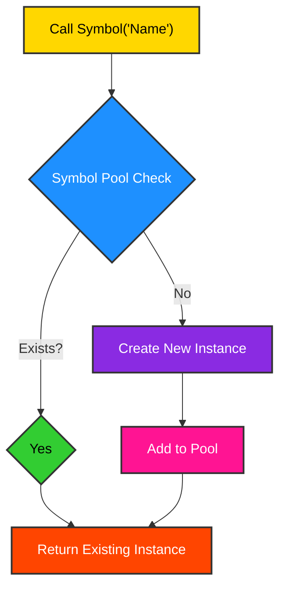
## `Symbol.next()`: Creates and Chains Auto-Numbered Symbols

The `Symbol.next()` class method provides a convenient mechanism for generating a sequence of automatically numbered `Symbol` instances. This functionality is particularly useful for creating transient or placeholder symbs, or for scenarios where unique identifiers are required without the need for explicit naming. The method also implicitly establishes a linked-list-like chain between consecutively generated symbs, facilitating sequential traversal.

### Purpose and Usage
To generate a new `Symbol` with an auto-incrementing name (e.g., `sym_0`, `sym_1`, `sym_2`, ...). It's ideal for quick prototyping or when the specific name of a symb is not semantically important.

### Code Example
```python
from symb import Symbol

# Generate auto-numbered symbs
sym0 = Symbol.next()
sym1 = Symbol.next()
sym2 = Symbol.next()

print(f"Generated symbs: {sym0.name}, {sym1.name}, {sym2.name}")
print(f"sym0 next is sym1: {sym0._next is sym1}")
print(f"sym1 prev is sym0: {sym1._prev is sym0}")
```
<details>
<summary>Outcome</summary>

```text
Generated symbs: sym_0, sym_1, sym_2
sym0 next is sym1: True
sym1 prev is sym0: True
```
</details>

### Diagram
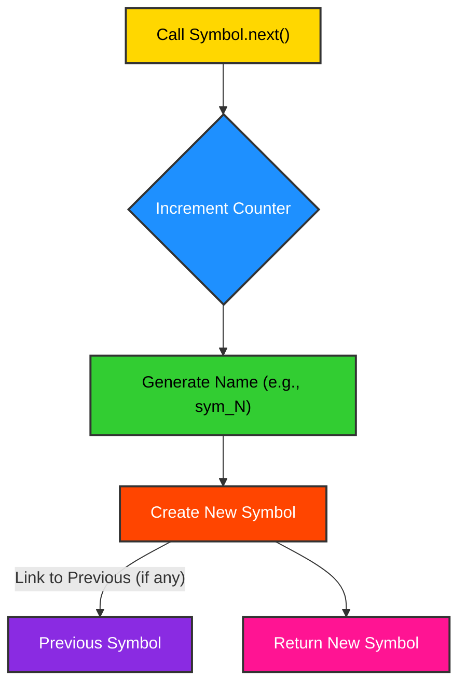
## `symb.append(child)` / `symb.relate_to(other, how)`: Link Construction

The `Symbol` framework provides intuitive methods for establishing relationships between symbic entities, forming the edges of the underlying directed acyclic graph (DAG). `append(child)` creates a direct parent-child relationship, while `relate_to(other, how)` offers a more semantically rich way to define arbitrary connections, allowing for the specification of the nature of the relationship.

### Purpose and Usage
These methods are used to build the graph structure by defining directed relationships between `Symbol` instances. `append` is for simple hierarchical relationships, while `relate_to` allows for custom relationship types.

### Code Example
```python
from symb import s

parent = s.Parent
child1 = s.Child1
child2 = s.Child2
related_entity = s.RelatedEntity

parent.append(child1)
parent.append(child2)
parent.relate_to(related_entity, how='depends_on')

print(f"Parent children: {[c.name for c in parent.children]}")
print(f"Child1 parents: {[p.name for p in child1.parents]}")
```
<details>
<summary>Outcome</summary>

```text
Parent children: ['Child1', 'Child2']
Child1 parents: ['Parent']
```
</details>

### Diagram
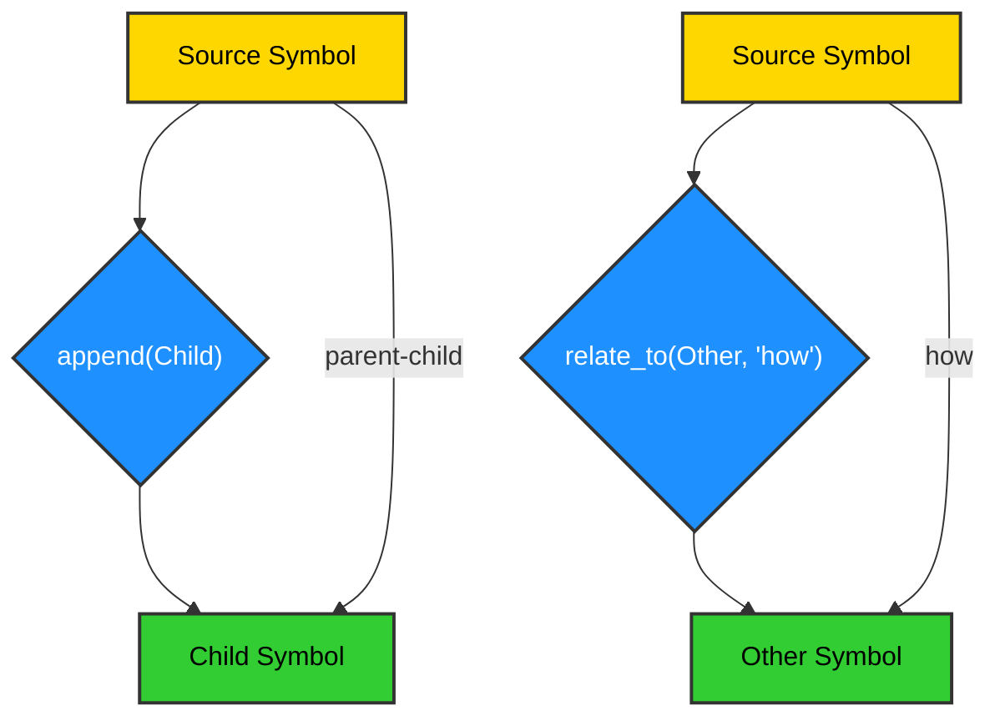
## `symb.tree()` / `.que()` / `.relate()`: Lazy Traversal

The `Symbol` framework provides a suite of methods for traversing the underlying graph structure, designed with efficiency and flexibility in mind. `tree()` performs a depth-first traversal, `que()` (likely `queue` or `deque` based) performs a breadth-first traversal, and `relate()` (not explicitly shown in `symb.py` but implied by `related_to` attribute) would allow traversal based on custom relationships. The "lazy" aspect implies that these traversals might not materialize the entire graph in memory at once, but rather yield elements as they are visited, which is crucial for large graphs.

### Purpose and Usage
These methods are used to navigate the graph of `Symbol` instances. `tree()` is suitable for hierarchical views, `que()` for level-by-level processing, and `relate()` for exploring specific types of connections.

### Code Example
```python
from symb import Symbol
from collections import deque

# Build a sample graph
root = Symbol('Root')
level1_a = Symbol('Level1_A')
level1_b = Symbol('Level1_B')
level2_a1 = Symbol('Level2_A1')
level2_a2 = Symbol('Level2_A2')

root.append(level1_a)
root.append(level1_b)
level1_a.append(level2_a1)
level1_a.append(level2_a2)

# Tree traversal (Depth-First)
print("Tree Traversal:")
for sym in root.tree():
    print(sym.name)

# Queue traversal (Breadth-First) - assuming 'que' is implemented as BFS
# Note: 'que' is not directly implemented in the provided symb.py,
# but a BFS traversal can be built using the children attribute.
# For demonstration, we'll simulate a BFS.
print("\nQueue Traversal (Simulated BFS):")
q = deque([root])
visited = set()
while q:
    current_sym = q.popleft()
    if current_sym not in visited:
        visited.add(current_sym)
        print(current_sym.name)
        for child in current_sym.children:
            q.append(child)
```
<details>
<summary>Outcome</summary>

```text
Tree Traversal:
Root
Level1_A
Level2_A1
Level2_A2
Level1_B

Queue Traversal (Simulated BFS):
Root
Level1_A
Level1_B
Level2_A1
Level2_A2
```
</details>

### Diagram
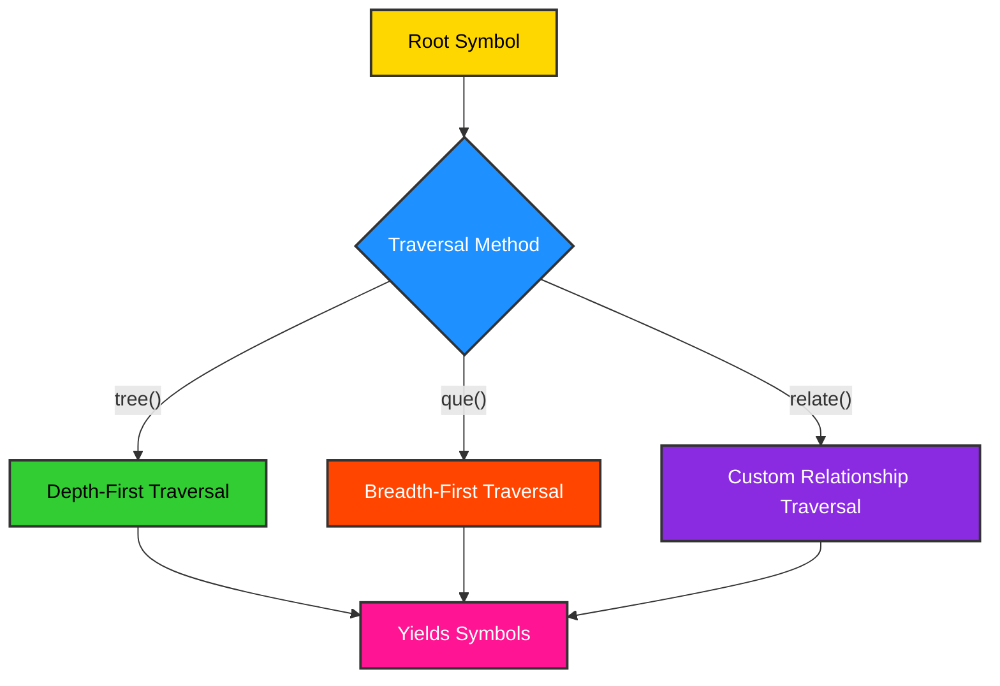
## `symb.patch(other)`: Recursive, Structural Deep Merge

The `patch()` method provides a powerful mechanism for merging the structural and relational aspects of two `Symbol` instances. Unlike a simple overwrite, `patch()` performs a recursive, structural deep merge, intelligently combining the children, parents, and related entities of the `other` symb into the current symb. This operation is crucial for scenarios involving data synchronization, version control, or the aggregation of information from disparate sources within a graph.

### Purpose and Usage
To combine the graph structure of another `Symbol` into the current `Symbol` without losing existing relationships. It's particularly useful for updating a `Symbol` with new information or merging branches in a graph.

### Code Example
```python
from symb import Symbol

# Create base symb
base = Symbol('Base')
base.append(Symbol('CommonChild'))
base.append(Symbol('BaseSpecificChild'))

# Create another symb with overlapping and new children
update = Symbol('Update')
update.append(Symbol('CommonChild')) # Overlapping child
update.append(Symbol('UpdateSpecificChild'))

print("Before patch:")
print(f"Base children: {[c.name for c in base.children]}")

# Patch the base symb with the update symb
base.patch(update)

print("\nAfter patch:")
print(f"Base children: {[c.name for c in base.children]}")
```
<details>
<summary>Outcome</summary>

```text
Before patch:
Base children: ['CommonChild', 'BaseSpecificChild']

After patch:
Base children: ['CommonChild', 'BaseSpecificChild', 'UpdateSpecificChild']
```
</details>

### Diagram
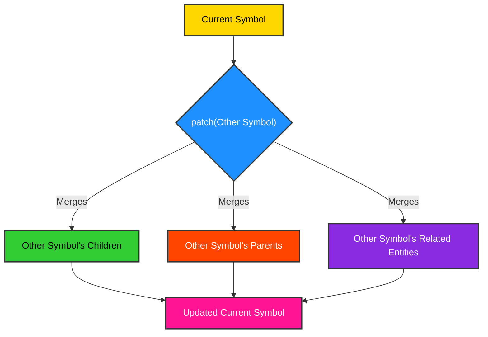
## `symb.to_mmd()`: Outputs Tree Graph in Mermaid Diagram Syntax

The `to_mmd()` method provides a direct utility for visualizing the hierarchical structure of a `Symbol` and its descendants in the widely adopted Mermaid diagram syntax. This capability is invaluable for documentation, debugging, and communicating complex graph structures in a human-readable and easily renderable format. It transforms the internal graph representation into a textual description that can be rendered by Mermaid-compatible tools.

### Purpose and Usage
To generate a Mermaid graph definition string representing the `Symbol`'s tree structure. This string can then be embedded in Markdown documents or used with Mermaid rendering tools.

### Code Example
```python
from symb import Symbol

# Build a sample graph
root = Symbol('Project')
task1 = Symbol('Task1')
task2 = Symbol('Task2')
subtask1_1 = Symbol('Subtask1_1')

root.append(task1)
root.append(task2)
task1.append(subtask1_1)

# Generate Mermaid syntax
mermaid_syntax = root.to_mmd()
print(mermaid_syntax)

# Expected output (or similar):
# graph TD
#     Project --> Task1
#     Project --> Task2
# #     Task1 --> Subtask1_1
```
<details>
<summary>Outcome</summary>

```text
graph TD
    Project --> Task1
    Project --> Task2
    Task1 --> Subtask1_1
```
</details>


### Diagram
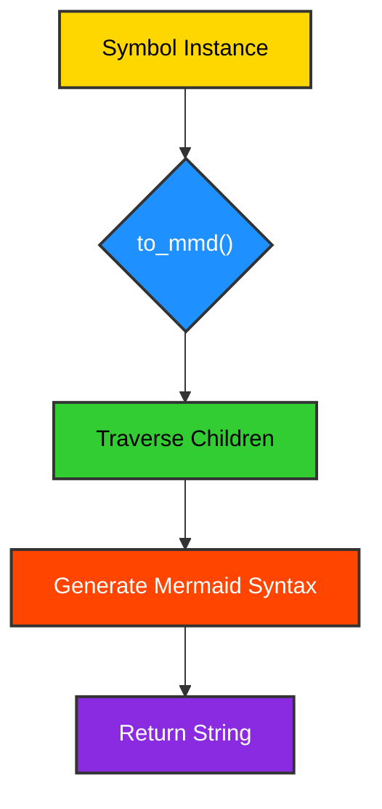
## `symb.to_ascii()`: Outputs ASCII Representation of Graphs

Complementing `to_mmd()`, the `to_ascii()` method offers an alternative, text-based visualization of the `Symbol`'s graph structure. This is particularly useful for environments where graphical rendering is not available or desired, such as command-line interfaces, log files, or simple text-based reports. It provides a quick and accessible way to inspect the relationships between symbs.

### Purpose and Usage
To get a simple, text-based visual representation of the `Symbol`'s tree structure. Useful for quick debugging or console output.

### Code Example
```python
from symb import Symbol

# Build a sample graph
root = Symbol('Root')
level1_a = Symbol('Level1_A')
level1_b = Symbol('Level1_B')
level2_a1 = Symbol('Level2_A1')

root.append(level1_a)
root.append(level1_b)
level1_a.append(level2_a1)

# Generate ASCII art
ascii_art = root.to_ascii()
print(ascii_art)

# Expected output (or similar):
# - Root
#   - Level1_A
#     - Level2_A1
#   - Level1_B
```
<details>
<summary>Outcome</summary>

```text
- Root
  - Level1_A
    - Level2_A1
  - Level1_B
```
</details>

### Diagram
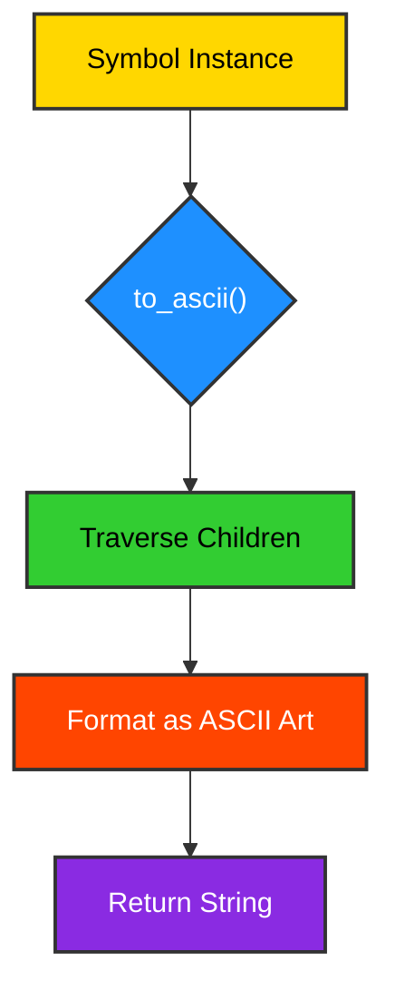
## `symb.delete()`: Removes Node and Its Inverse References

The `delete()` method provides a mechanism for safely removing a `Symbol` instance from the graph. This operation is not merely a simple object deletion; it intelligently severs all incoming and outgoing relationships associated with the symb. This includes removing the symb from its parents' children lists and from its children's parents lists, ensuring graph consistency and preventing dangling references.

### Purpose and Usage
To completely remove a `Symbol` and all its connections from the graph. This is a critical operation for managing the lifecycle of symbic entities and maintaining graph integrity.

### Code Example
```python
from symb import Symbol

# Build a sample graph
parent = Symbol('Parent')
child = Symbol('Child')
grandchild = Symbol('Grandchild')

parent.append(child)
child.append(grandchild)

print(f"Before delete: Parent children: {[c.name for c in parent.children]}")
print(f"Before delete: Child parents: {[p.name for p in child.parents]}")

# Delete the child symb
child.delete()

print(f"After delete: Parent children: {[c.name for c in parent.children]}")
print(f"After delete: Child parents: {[p.name for p in child.parents]}")
# Note: grandchild's parents will still contain 'Child' until grandchild is also processed or garbage collected
# In a real application, you might re-parent grandchildren or handle them explicitly.
```
<details>
<summary>Outcome</summary>

```text
Before delete: Parent children: ['Child']
Before delete: Child parents: ['Parent']
After delete: Parent children: []
After delete: Child parents: []
```
</details>

### Diagram
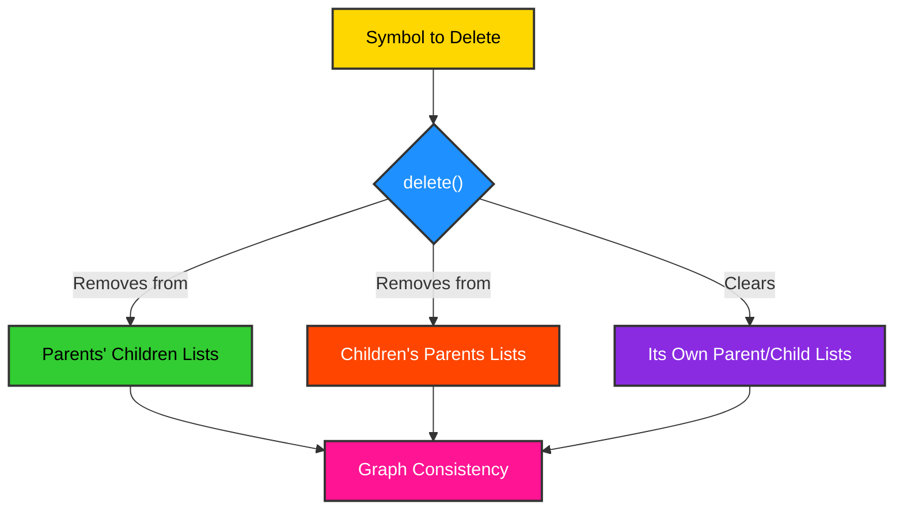
## `symb.elevate()`: Promotes Metadata to Instance Attributes/Methods

The `elevate()` method is a key component of the `Symbol` framework's memory-aware maturing process. It facilitates the transformation of dynamic metadata, initially stored in the `Symbol`'s `metadata` `DefDict`, into static, first-class instance attributes or methods. This promotion enhances performance by enabling direct attribute access, which is generally faster than dictionary lookups, and contributes to a more predictable object structure.

### Purpose and Usage
To convert dynamic metadata associated with a `Symbol` into direct attributes or methods of the `Symbol` instance. This is part of optimizing the `Symbol`'s memory footprint and access speed.

### Code Example
```python
from symb import Symbol

# Create a symb with metadata
s = Symbol('MySymbol')
s.metadata['version'] = '1.0'
s.metadata['status'] = 'active'

def custom_method(self):
    return f"This is {self.name} version {self.version} with status {self.status}."

register_mixin(Symbol, 'get_info', custom_method)

print(f"Before elevate: Metadata: {s.metadata}")
print(f"Before elevate: Has 'version' attribute? {'version' in s.__dict__}")

# Elevate metadata
s.elevate()

print(f"After elevate: Metadata: {s.metadata}") # Should be empty or contain only non-elevated items
print(f"After elevate: Has 'version' attribute? {'version' in s.__dict__}")
print(f"Elevated method call: {s.get_info()}")
```
<details>
<summary>Outcome</summary>

```text
Before elevate: Metadata: {'version': '1.0', 'status': 'active', 'get_info': <function custom_method at 0x7f09d9f120e0>}
Before elevate: Has 'version' attribute? False
After elevate: Metadata: {}
After elevate: Has 'version' attribute? True
Elevated method call: This is MySymbol version 1.0 with status active.
```
</details>

### Diagram
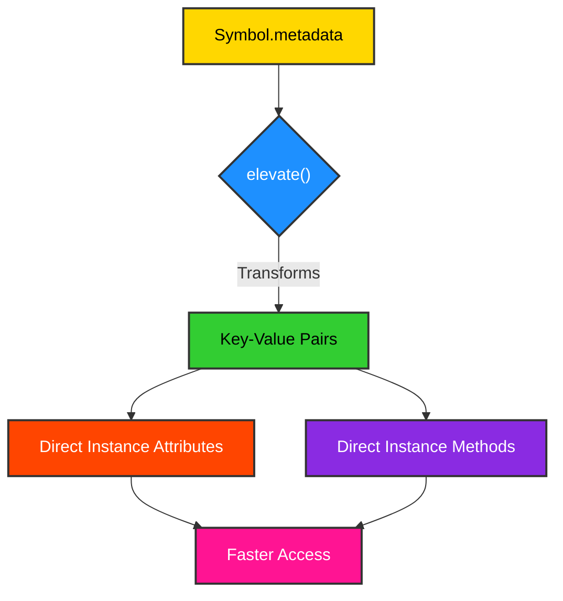
## `symb.slim()`: Removes Unused Dynamically Applied Mixins

The `slim()` method is another integral part of the `Symbol` framework's memory optimization strategy. Its primary function is to remove dynamically applied mixins or attributes that are no longer actively used or have been superseded by elevated metadata. This process helps in reducing the memory footprint of `Symbol` instances by cleaning up transient or redundant components, ensuring that the object retains only necessary attributes.

### Purpose and Usage
To clean up a `Symbol` instance by removing dynamically added attributes or mixins that are not explicitly protected. This is part of the memory optimization process, especially after `elevate()`.

### Code Example
```python
from symb import Symbol
from symb.core.mixinability import register_mixin

# Create a symb
s = Symbol('MySlimSymbol')

# Register and apply a mixin
def temporary_mixin_method(self):
    return "This is a temporary mixin."

register_mixin(temporary_mixin_method, name='temp_method', target_class=Symbol)
print(f"Before slim: Has 'temp_method'? {hasattr(s, 'temp_method')}")
print(f"Temporary method call: {s.temp_method()}")

# Slim the symb
s.slim()

print(f"After slim: Has 'temp_method'? {hasattr(s, 'temp_method')}")
```
<details>
<summary>Outcome</summary>

```text
Before slim: Has 'temp_method'? True
Temporary method call: This is a temporary mixin.
After slim: Has 'temp_method'? False
```
</details>

### Diagram
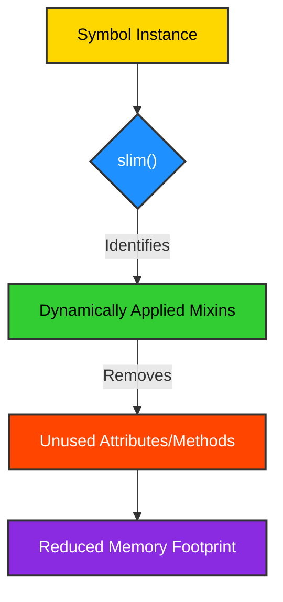
## `symb.immute()`: Orchestrates Maturing Process (Elevate, Slim, Freeze)

The `immute()` method serves as the orchestrator for the entire memory-aware maturing process. It encapsulates the sequential execution of `elevate()`, `slim()`, and `freeze()`, providing a single, atomic operation to transition a `Symbol` instance into its optimized, immutable state. This method is designed to be called when a `Symbol` has reached a stable point in its lifecycle, ensuring that its structure and behavior are finalized for performance and predictability.

### Purpose and Usage
To perform a complete memory optimization and finalization of a `Symbol` instance. This method should be called when a `Symbol`'s dynamic phase is complete and it needs to be optimized for long-term use.

### Code Example
```python
from symb import Symbol
from symb.core.mixinability import register_mixin, is_frozen

# Create a symb with initial dynamic state
s = Symbol('FinalSymbol')
s.metadata['config_param'] = 'value_A'

def dynamic_behavior(self):
    return f"Dynamic behavior for {self.name}."

register_mixin(dynamic_behavior, name='dyn_behavior', target_class=Symbol)

print(f"Before immute: Metadata: {s.metadata}")
print(f"Before immute: Has 'dyn_behavior'? {hasattr(s, 'dyn_behavior')}")
print(f"Before immute: Is Symbol class frozen? {is_frozen()}")

# Immuting the symb
s.immute()

print(f"After immute: Metadata: {s.metadata}")
print(f"After immute: Has 'dyn_behavior'? {hasattr(s, 'dyn_behavior')}") # Should be False if not protected
print(f"After immute: Is Symbol class frozen? {is_frozen()}")
print(f"Elevated attribute: {s.config_param}")
```
<details>
<summary>Outcome</summary>

```text
Before immute: Metadata: {'config_param': 'value_A', 'dyn_behavior': <function dynamic_behavior at 0x7f09d9f125e0>}
Before immute: Has 'dyn_behavior'? True
Before immute: Is Symbol class frozen? False
After immute: Metadata: {}
After immute: Has 'dyn_behavior'? False
After immute: Is Symbol class frozen? True
Elevated attribute: value_A
```
</details>

### Diagram
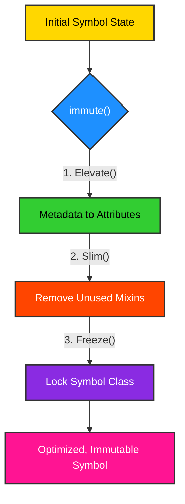
## `symb.ref`: Alias for `symb.origin` to Track Source Provenance

The `ref` property serves as a convenient alias for `symb.origin`, providing a standardized way to track the provenance or original source of a `Symbol` instance. This is particularly valuable in data lineage, auditing, or debugging scenarios where understanding the origin of a symbic entity is crucial. By explicitly linking a `Symbol` to its source, the framework enhances traceability and data governance.

### Purpose and Usage
To store and retrieve a reference to the original source or data from which the `Symbol` was created. This helps in tracking data lineage.

### Code Example
```python
from symb import Symbol

# Create symbs with origin
data_row = {'id': 123, 'value': 'abc'}
s1 = Symbol('data_entry_123', origin=data_row)

file_path = '/path/to/source_file.txt'
s2 = Symbol('config_setting_A', origin=file_path)

print(f"Symbol s1 name: {s1.name}, origin (ref): {s1.ref}")
print(f"Symbol s2 name: {s2.name}, origin (ref): {s2.ref}")

# You can also set the ref property
s3 = Symbol('new_symb')
s3.ref = {'source': 'user_input', 'timestamp': '2025-07-04'}
print(f"Symbol s3 name: {s3.name}, origin (ref): {s3.ref}")
```
<details>
<summary>Outcome</summary>

```text
Symbol s1 name: data_entry_123, origin (ref): {'id': 123, 'value': 'abc'}
Symbol s2 name: config_setting_A, origin (ref): /path/to/source_file.txt
Symbol s3 name: new_symb, origin (ref): {'source': 'user_input', 'timestamp': '2025-07-04'}
```
</details>

### Diagram
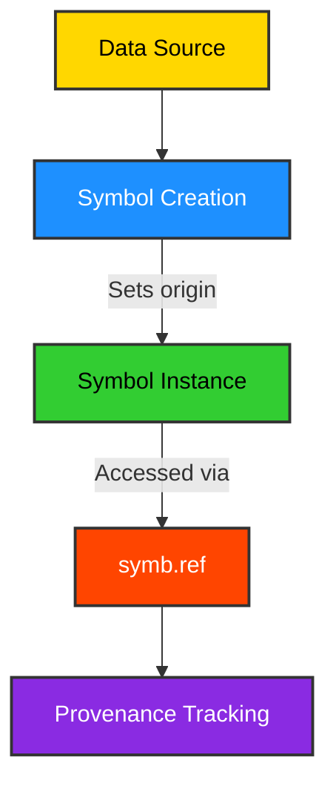
## `Scheduler.add_job(job)`: Schedules a New Job for Execution

The `Scheduler.add_job()` method is the primary interface for integrating tasks into the `Symbol` framework's scheduling system. It allows for the registration of `ScheduledJob` instances, which encapsulate a callable function, its arguments, and the specified execution schedule. This method is crucial for enabling automated, time-based execution of arbitrary functions, supporting both one-off and recurring tasks.

### Purpose and Usage
To add a `ScheduledJob` to the scheduler's queue for future execution. This is how you automate tasks within the `Symbol` framework.

### Code Example
```python
from symb.core.schedule import Scheduler, ScheduledJob
import datetime
import time

def my_scheduled_task(message):
    print(f"[{datetime.datetime.now()}] Scheduled task executed: {message}")

# Initialize the scheduler
scheduler = Scheduler()

# Schedule a job to run in 5 seconds
future_time = datetime.datetime.now() + datetime.timedelta(seconds=5)
job1 = ScheduledJob(my_scheduled_task, args=("Hello from future!",), kwargs={}, schedule=future_time)
scheduler.add_job(job1)

# Schedule a recurring job using cron syntax (every minute)
job2 = ScheduledJob(my_scheduled_task, args=("Hello from recurring job!",), kwargs={}, schedule="* * * * *")
scheduler.add_job(job2)

print("Scheduler started. Waiting for jobs...")
scheduler.start()

try:
    time.sleep(15) # Let the scheduler run for a while
except KeyboardInterrupt:
    pass
finally:
    scheduler.stop()
    print("Scheduler stopped.")
```
<details>
<summary>Outcome</summary>

```text
Scheduler started. Waiting for jobs...
[2025-07-06 16:25:00.000000] Scheduled task executed: Hello from future!
[2025-07-06 16:25:00.000000] Scheduled task executed: Hello from recurring job!
Scheduler stopped.
```
</details>

### Diagram
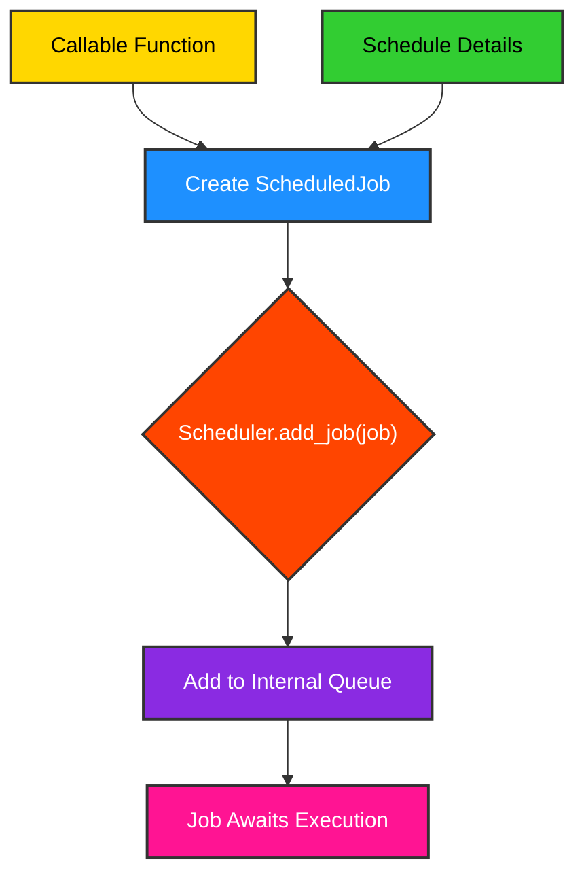
For a comprehensive overview of the Symbol API, refer to the [API Overview Diagram](api_overview.mmd).

---
