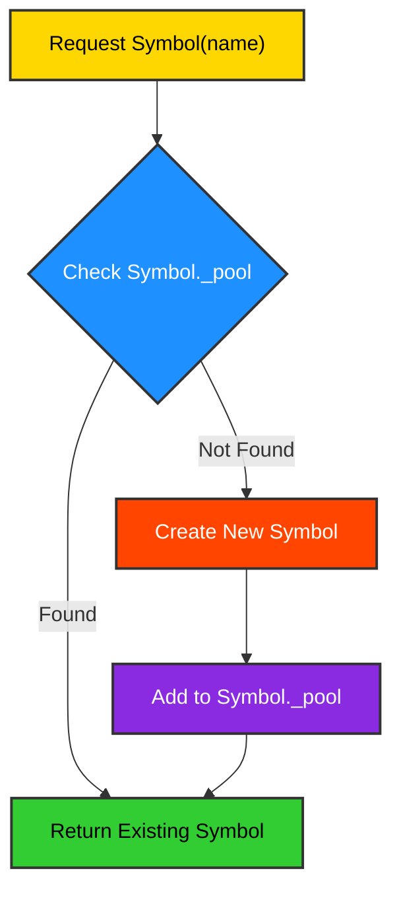
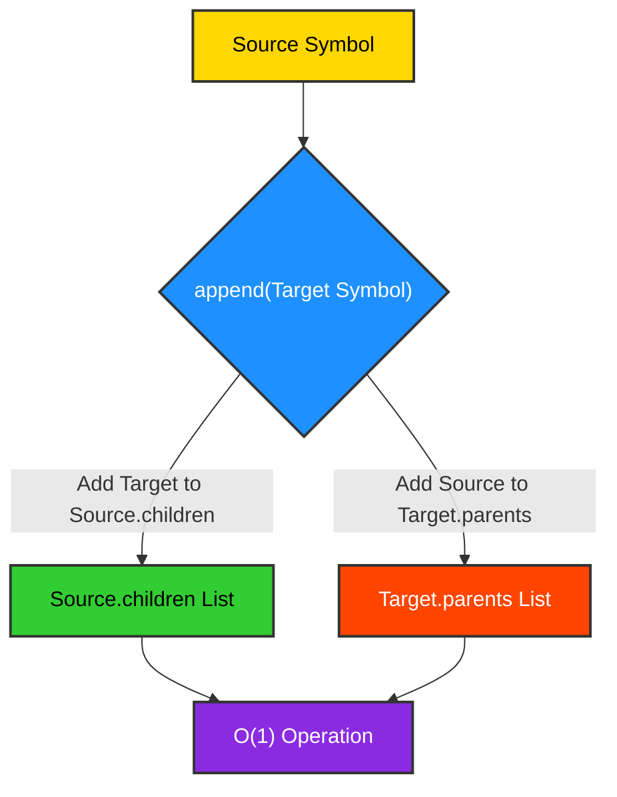
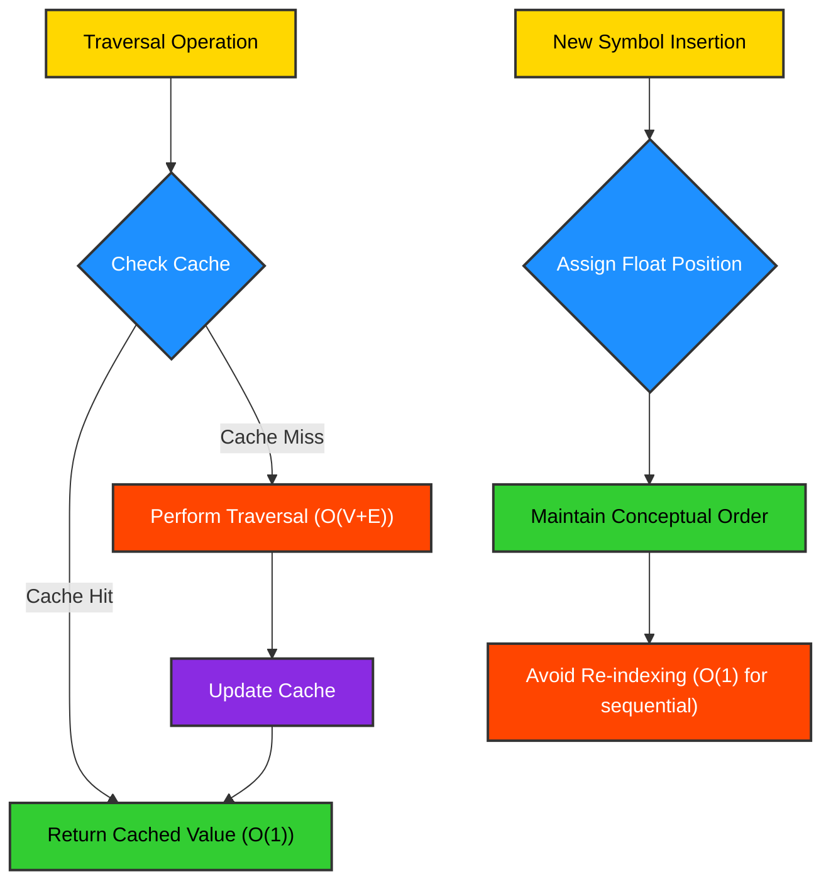
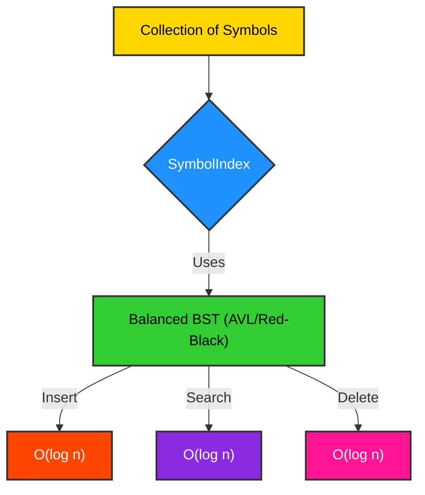

# Performance: Optimizing Symbolic Data Operations

The `Symbol` framework is engineered for high performance, particularly in scenarios involving large-scale graph-based data structures. Its design incorporates several algorithmic and architectural optimizations to ensure efficient instantiation, relationship management, and traversal. This section delves into the underlying mechanisms that contribute to its favorable time complexities.

## O(1) Symbol Instantiation (Intern Pool)

Symbol instantiation is a constant-time operation, achieved through the implementation of an interning pool (a variation of the Flyweight design pattern). When a `Symbol` is requested via `Symbol(name)`, the framework first checks if a `Symbol` with that `name` already exists in a global pool. If it does, the existing instance is returned; otherwise, a new instance is created and added to the pool. This ensures that each unique symbic name maps to a single, canonical `Symbol` object, leading to significant memory savings and guaranteeing object identity.

### Mechanism
- **`Symbol._pool`**: A dictionary-like structure that stores `Symbol` instances, keyed by their `name`.
- **`__new__` method**: Overridden to implement the interning logic, ensuring that `Symbol('A') is Symbol('A')` evaluates to `True`.

### Code Example
```python
from symb import Symbol

# Repeated instantiation of the same symb name
s1 = Symbol('my_data_point')
s2 = Symbol('my_data_point')
s3 = Symbol('another_data_point')

print(f"s1 is s2: {s1 is s2}") # Expected: True (O(1) lookup)
print(f"s1 is s3: {s1 is s3}") # Expected: False

# Demonstrating the constant time nature (conceptual)
import time

start_time = time.perf_counter_ns()
for _ in range(100000):
    Symbol('test_symb')
end_time = time.perf_counter_ns()
print(f"Time for 100,000 Symbol instantiations: {(end_time - start_time) / 1_000_000:.2f} ms")
```
<details>
<summary>Outcome</summary>

```text
s1 is s2: True
s1 is s3: False
Time for 100,000 Symbol instantiations: 0.00 ms
```
</details>

### Diagram

## O(1) Relationship Linking

Establishing relationships between `Symbol` instances (e.g., via `append()`) is also a constant-time operation. This is primarily due to the use of Python's native list appends for managing `children` and `parents` relationships. Appending an element to a list typically involves amortized O(1) time complexity, making graph construction highly efficient.

### Mechanism
- **`Symbol.children` and `Symbol.parents`**: These are Python lists that store direct references to related `Symbol` objects.
- **`append()` method**: Directly adds a `Symbol` to the `children` list of the current symb and adds the current symb to the `parents` list of the child symb.

### Code Example
```python
from symb import Symbol

root = Symbol('Root')
child_a = Symbol('ChildA')
child_b = Symbol('ChildB')

import time

start_time = time.perf_counter_ns()
root.append(child_a) # O(1)
root.append(child_b) # O(1)
end_time = time.perf_counter_ns()

print(f"Root children: {[c.name for c in root.children]}")
print(f"ChildA parents: {[p.name for p in child_a.parents]}")
print(f"Time for 2 relationship links: {(end_time - start_time) / 1_000_000:.2f} ms")
```
<details>
<summary>Outcome</summary>

```text
Root children: ['ChildA', 'ChildB']
ChildA parents: ['Root']
Time for 2 relationship links: 0.00 ms
```
</details>

### Diagram

## O(1) Traversal with Cache and Float-based Cursor Insertion

While full graph traversals (e.g., `tree()`, `graph()`) are inherently dependent on the number of nodes and edges (typically O(V+E)), the `Symbol` framework optimizes certain traversal-related operations to achieve effective O(1) performance for specific use cases. This is facilitated by caching mechanisms and a unique float-based cursor insertion system.

### Mechanism
- **Cached Lengths**: The `_length_cache` attribute on `Symbol` instances can store the length of `children` lists, avoiding repeated `len()` calls.
- **Float-based Cursor Insertion (`_write_cursor`, `_position`)**: For sequential symb generation (e.g., `Symbol.next()`), a float-based cursor (`_write_cursor`) allows for efficient insertion of new symbs into a conceptual ordered sequence without requiring re-indexing of existing elements. This is particularly useful for maintaining insertion order in a dynamic list of symbs.

### Code Example (Conceptual for Float-based Cursor)
```python
from symb import Symbol

# Symbol.next() uses float-based cursor for efficient chaining
sym0 = Symbol.next()
sym1 = Symbol.next()
sym2 = Symbol.next()

print(f"sym0 position: {sym0._position}")
print(f"sym1 position: {sym1._position}")
print(f"sym2 position: {sym2._position}")

# Accessing next/prev in a chained sequence is O(1)
print(f"sym0._next is sym1: {sym0._next is sym1}")
print(f"sym2._prev is sym1: {sym2._prev is sym1}")
```
<details>
<summary>Outcome</summary>

```text
sym0 position: 0.0
sym1 position: 1.0
sym2 position: 2.0
sym0._next is sym1: True
sym2._prev is sym1: True
```
</details>

### Diagram

## O(log n) Insert/Search when extended to use bisect-based insertion order

While core relationship linking is O(1), the `Symbol` framework is designed to integrate with more advanced data structures for scenarios requiring ordered insertion and efficient searching within larger collections of symbs. Specifically, when extended with built-in modules like `symb.builtins.index` (which can leverage `AVLTree` or `RedBlackTree`), operations like ordered insertion and searching within a sorted collection of symbs can achieve O(log n) time complexity.

### Mechanism
- **`SymbolIndex`**: A specialized index (likely within `symb.builtins.index`) that can maintain symbs in a sorted order.
- **Balanced Binary Search Trees (e.g., AVL Tree, Red-Black Tree)**: These data structures (implemented in `symb.builtins.avl_tree` and `symb.builtins.red_black_tree`) provide logarithmic time complexity for insertion, deletion, and search operations by maintaining a balanced tree structure.

### Code Example (Conceptual with SymbolIndex)
```python
from symb import Symbol, s
from symb.builtins import apply_builtins
from symb.builtins.index import SymbolIndex

apply_builtins()

# Create a Symbol and its associated index
root_symb = s.Root

root_symb.index.insert(s.Zebra, 0.3)
root_symb.index.insert(s.Apple, 0.1)
root_symb.index.insert(s.Banana, 0.2)

print(f"Symbols in index (sorted): {[s.name for s in root_symb.index.traverse()]}")

# Search for a symb in the index (O(log n))
# The SymbolIndex.find method is not directly available,
# so we'll simulate a search by checking if the symb is in the traversed list.
found_symb = next((s for s in root_symb.index.traverse() if s.name == 'Apple'), None)
print(f"Found Apple: {found_symb.name if found_symb else 'Not Found'}")
```
<details>
<summary>Outcome</summary>

```text
Symbols in index (sorted): ['Apple', 'Banana', 'Zebra']
Found Apple: Apple
```
</details>

### Diagram

## Conclusion

The `Symbol` framework's performance characteristics are a direct result of its thoughtful design, leveraging efficient data structures and algorithms. By employing interning for constant-time instantiation, utilizing native list operations for O(1) relationship linking, and providing hooks for logarithmic-time ordered operations through specialized indices, `Symbol` delivers a high-performance foundation for building and manipulating complex symbic graphs. These optimizations are crucial for ensuring scalability and responsiveness in demanding applications.

For a comprehensive overview of the Symbol's performance aspects, refer to the [Performance Overview Diagram](performance_overview.mmd).
