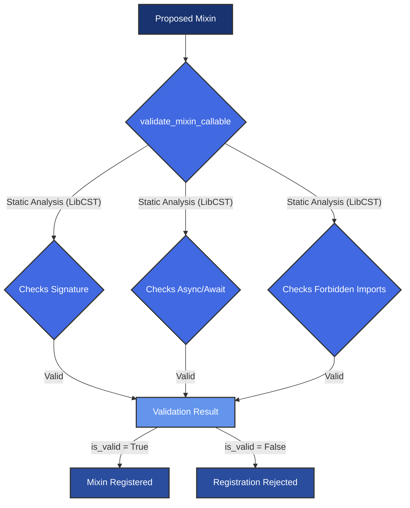
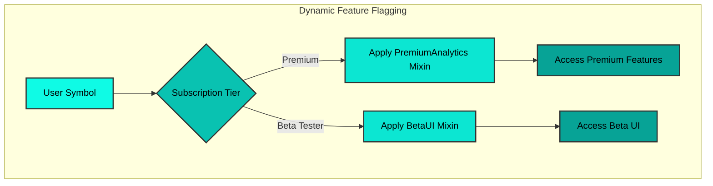
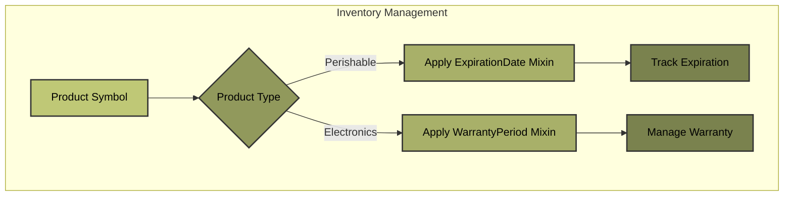

# Mixinability: Dynamic Extensibility of Symbol Instances

The `Symbol` framework introduces a sophisticated mixinability mechanism, enabling the dynamic extension of `Symbol` instances at runtime. This capability is crucial for building highly adaptable and modular systems, allowing behaviors and attributes to be attached to symbs based on contextual needs without altering their core definition. This approach aligns with principles of open/closed principle and composition over inheritance, fostering a flexible and maintainable codebase.

## Dynamic Extension and Validation

At its core, mixinability in `Symbol` is managed through the `register_mixin` function, which facilitates the attachment of new functionalities (methods, properties, or even data attributes) to the `Symbol` class. A critical aspect of this process is the rigorous validation performed by `symb.core.mixin_validator`. This module employs static analysis, leveraging `LibCST`, to ensure that proposed mixins adhere to a predefined interface and do not introduce security vulnerabilities or architectural inconsistencies.

### Validation Process
The validation process encompasses several key checks:
- **Signature Conformance**: Ensures that mixin functions correctly accept `self` as their first argument, maintaining consistency with instance methods.
- **Asynchronous Consistency**: Verifies that asynchronous mixins are properly declared with `async` and that synchronous mixins are not mistakenly marked as asynchronous.
- **Forbidden Operations**: Scans for potentially unsafe operations or imports (e.g., direct file system access via `os` or `subprocess` modules), mitigating risks in dynamic code injection.

This proactive validation ensures the robustness and integrity of the `Symbol` ecosystem, preventing the introduction of malformed or malicious code.


## Freezing Mechanism

To ensure stability and prevent unintended modifications in production environments, the `Symbol` framework provides a `freeze()` mechanism. Once invoked, `freeze()` prevents any further registration or modification of mixins, effectively locking down the `Symbol` class's behavior. This is particularly valuable in long-running applications or systems where dynamic changes could lead to unpredictable states.

## Examples

**High-Tech: Dynamic Feature Flagging in SaaS Platforms**
```python
from symb import Symbol, s
from symb.core.mixinability import register_mixin, freeze

class FeatureMixins:
    def enable_premium_analytics(self):
        return f"Premium analytics enabled for {self.name}"

    def enable_beta_ui(self):
        return f"Beta UI enabled for {self.name}"

register_mixin(Symbol, "premium_analytics", FeatureMixins.enable_premium_analytics)
register_mixin(Symbol, "beta_ui", FeatureMixins.enable_beta_ui)

user_premium = s.user_premium_tier
user_beta = s.user_beta_tester

print(user_premium.premium_analytics())
print(user_beta.beta_ui())

freeze()
if not register_mixin(Symbol, "new_feature", lambda self: "New feature"):
    print("Failed to register new_feature: Symbol class is frozen.")
```


### Low-Tech Industry: Inventory Management System

In an inventory management system, different types of products might have unique behaviors (e.g., perishable items needing expiration date tracking, electronics needing warranty information). Mixinability allows these behaviors to be attached dynamically.

```python
from symb import Symbol
from symb.core.mixinability import register_mixin

class ProductMixins:
    def get_expiration_date(self):
        # In a real system, this would fetch from a database or attribute
        return "2025-12-31"

    def get_warranty_period(self):
        return "1 year"

# Create product symbs
apple = s.Apple
laptop = s.Laptop

# Apply mixins based on product type
register_mixin(Symbol, "expiration_date", ProductMixins.get_expiration_date)
register_mixin(Symbol, "warranty_period", ProductMixins.get_warranty_period)

# Access product-specific behaviors
print(f"Apple expiration: {apple.expiration_date()}")
# Output: Apple expiration: 2025-12-31

print(f"Laptop warranty: {laptop.warranty_period()}")
# Output: Laptop warranty: 1 year
```


## Conclusion

Mixinability in the `Symbol` framework provides a powerful and secure mechanism for dynamic extensibility. By combining runtime flexibility with static validation and a freezing capability, it enables developers to build highly modular, adaptable, and robust systems across various domains, from complex high-tech applications to traditional enterprise solutions.

For a visual representation of the mixin application flow, refer to the [Mixinability Flow Diagram](mixinability_flow.mmd).

---
