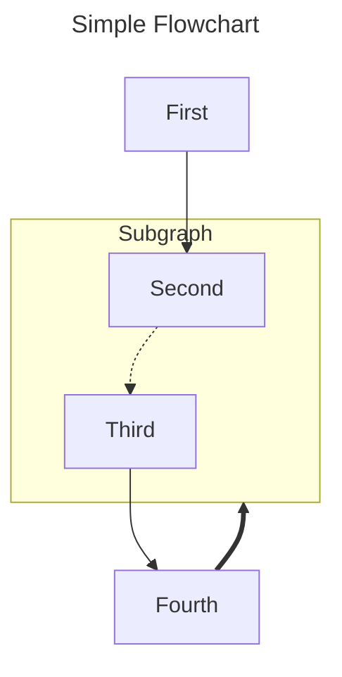

# syrenka
syrenka is mermaid markdown generator

## Description

The aim of this project is to provide easy to use classes for generating mermaid charts and diagrams.

## Installation

`pip install syrenka`

## CLI

To use syrenka from command line try:

```
python -m syrenka -h
```

for example, to generate python classdiagram:
```
python -m syrenka classdiagram <path/to/folder>
```

to generate python class diagram for project with src/ structure we can either do:
```
python -m syrenka classdiagram <project_dir>/src
```
or
```
python -m syrenka classdiagram <project_dir> --detect-project-dir
```

- there is also option to filter files, see `python -m syrenka classdiagram -h` for more details
- there is now an option to put global functions/assignments in pseudo-class _globals_ per module with flag `--globals-as-class`


## Example

Diagrams displayed here are generated from mermaid markdown generated by syrenka converted with `mmdc` into svg.

### SyrenkaAstClassDiagram
This is example is using python `ast` approach for generating the class diagram.

<!-- EX3_MERMAID_DIAGRAM_BEGIN -->

<!-- EX3_MERMAID_DIAGRAM_END -->

And the code snippet used to generate it:

<!-- EX3_SYRENKA_CODE_BEGIN -->
```python
"""Example SyrenkaClassDiagram with ast backend."""

# from io import StringIO
import sys
from pathlib import Path

from syrenka.base import ThemeNames
from syrenka.classdiagram import SyrenkaClassDiagram, SyrenkaClassDiagramConfig
from syrenka.lang.python import PythonModuleAnalysis

class_diagram = SyrenkaClassDiagram("syrenka class diagram", SyrenkaClassDiagramConfig().theme(ThemeNames.NEUTRAL))
class_diagram.add_classes(PythonModuleAnalysis.classes_in_path(Path(__file__).parent.parent / "src"))

# file can be anything that implements TextIOBase
# out = StringIO() # string buffer in memory
out = sys.stdout  # stdout
# out = open("syrenka.md", "w") # write it to file

class_diagram.to_code(file=out)

# StringIO
# out.seek(0)
# print(out.read())
```
<!-- EX3_SYRENKA_CODE_END -->

### SyrenkaClassDiagram
This example uses `importlib.import_module` + `ast` approach.
Here are current classes in syrenka module - syrenka generated mermaid diagram, rendered to svg with use of mmdc:

<!-- EX1_MERMAID_DIAGRAM_BEGIN -->

<!-- EX1_MERMAID_DIAGRAM_END -->

So how do we get it?
This is a code snippet that does it:

<!-- EX1_SYRENKA_CODE_BEGIN -->
```python
"""Example SyrenkaClassDiagram."""

# from io import StringIO
import sys

from syrenka.base import ThemeNames
from syrenka.classdiagram import SyrenkaClassDiagram, SyrenkaClassDiagramConfig
from syrenka.lang.python import PythonModuleAnalysis

class_diagram = SyrenkaClassDiagram("syrenka class diagram", SyrenkaClassDiagramConfig().theme(ThemeNames.NEUTRAL))
class_diagram.add_classes(PythonModuleAnalysis.classes_in_module(module_name="syrenka", nested=True))

# file can be anything that implements TextIOBase
# out = StringIO() # string buffer in memory
out = sys.stdout  # stdout
# out = open("syrenka.md", "w") # write it to file

class_diagram.to_code(file=out)

# StringIO
# out.seek(0)
# print(out.read())
```
<!-- EX1_SYRENKA_CODE_END -->

### SyrenkaFlowchart

#### Sample flowchart
Here is the sample flowchart:

<!-- EX4_MERMAID_DIAGRAM_BEGIN -->

<!-- EX4_MERMAID_DIAGRAM_END -->

and the code behind it:

<!-- EX4_SYRENKA_CODE_BEGIN -->
```python
"""Example SyrenkaFlowchart usage."""

from io import StringIO
from pathlib import Path

import syrenka.flowchart as sf
from syrenka.generate import generate_diagram_image

flowchart = sf.SyrenkaFlowchart(
    "",
    sf.FlowchartDirection.TOP_TO_BOTTOM,
    nodes=[
        sf.Subgraph(
            "one",
            nodes=[
                sf.Node("a1"),
                sf.Node("a2"),
            ],
        ),
        sf.Subgraph(
            "two",
            direction=sf.FlowchartDirection.LEFT_TO_RIGHT,
            nodes=[
                sf.Node("b1"),
                sf.Node("b2"),
            ],
        ),
        sf.Subgraph(
            "three",
            direction=sf.FlowchartDirection.BOTTOM_TO_TOP,
            nodes=[
                sf.Node("c1"),
                sf.Node("c2"),
            ],
        ),
    ],
)

flowchart.connect_by_id("c1", "a2").connect_by_id("a1", "a2")
flowchart.connect_by_id("b1", "b2").connect_by_id("c1", "c2")
flowchart.connect_by_id("one", "two").connect_by_id("three", "two").connect_by_id("two", "c2")

out = StringIO()
flowchart.to_code(file=out)

print(out.getvalue())

generate_diagram_image(out.getvalue(), Path("out.svg"), overwrite=True)
```
<!-- EX4_SYRENKA_CODE_END -->

#### Simple flowchart
Here is the simple flowchart:

<!-- EX2_MERMAID_DIAGRAM_BEGIN -->

<!-- EX2_MERMAID_DIAGRAM_END -->

and the code behind it:

<!-- EX2_SYRENKA_CODE_BEGIN -->
```python
"""Example Simple SyrenkaFlowchart."""

import sys

import syrenka.flowchart as sf

fl = sf.SyrenkaFlowchart(title="Simple Flowchart", direction=sf.FlowchartDirection.TOP_TO_BOTTOM)
fl.add(sf.Node(identifier="1", text="First"))
sub = sf.Subgraph(identifier="s", text="Subgraph")
sub.add(sf.Node(identifier="2", text="Second"))
sub.add(sf.Node(identifier="3", text="Third"))
fl.add(sub)
fl.add(sf.Node(identifier="4", text="Fourth"))

fl.connect_by_id("1", "2")
fl.connect_by_id(source_id="2", target_id="3", edge_type=sf.EdgeType.DOTTED_LINK)
fl.connect_by_id("3", "4").connect_by_id("4", "s", sf.EdgeType.THICK_LINK)

fl.to_code(file=sys.stdout)
```
<!-- EX2_SYRENKA_CODE_END -->
