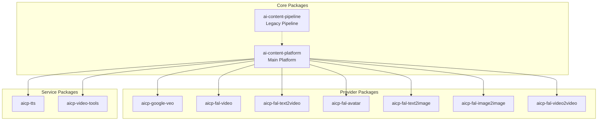

# Package Organization Visual Guide

## 📊 Current vs Proposed Structure

### Current Structure (Flat)
```
veo3-video-generation/
├── ai_content_pipeline/       # Mixed with implementation
├── ai_content_platform/       # New package
├── veo3_video_generation/     # Google implementation  
├── fal_video_generation/      # FAL implementation
├── fal_text_to_video/         # Another FAL service
├── fal_avatar_generation/     # Another FAL service
├── fal_text_to_image/         # Another FAL service
├── fal_image_to_image/        # Another FAL service
├── fal_video_to_video/        # Another FAL service
├── text_to_speech/            # TTS service
├── video_tools/               # Utilities
└── (mixed files, READMEs, configs...)
```

### Proposed Structure (Organized Monorepo)
```
ai-content-suite/              # New root name
├── 📦 packages/               # All packages organized by type
│   ├── 🎯 core/             # Core functionality
│   │   ├── platform/         # ai-content-platform (main)
│   │   └── pipeline/         # ai-content-pipeline (legacy)
│   │
│   ├── 🔌 providers/        # AI service providers
│   │   ├── google/
│   │   │   └── veo/         # aicp-google-veo
│   │   └── fal/
│   │       ├── video/       # aicp-fal-video
│   │       ├── text2video/  # aicp-fal-text2video
│   │       ├── avatar/      # aicp-fal-avatar
│   │       ├── text2image/  # aicp-fal-text2image
│   │       ├── image2image/ # aicp-fal-image2image
│   │       └── video2video/ # aicp-fal-video2video
│   │
│   └── 🛠️ services/        # Utility services
│       ├── tts/             # aicp-tts
│       └── video-tools/     # aicp-video-tools
│
├── 📚 docs/                 # Unified documentation
├── 🧪 tests/                # Shared test utilities
├── 🔧 scripts/              # Build & deploy scripts
└── 📋 examples/             # Usage examples
```

## 🎨 Package Relationships



## 📦 Installation Scenarios

### Scenario 1: Basic User (Just TTS)
```bash
pip install aicp-tts
```
Gets: Text-to-speech functionality only

### Scenario 2: FAL AI User
```bash
pip install ai-content-platform[fal]
```
Gets: Platform + all FAL AI providers

### Scenario 3: Enterprise User
```bash
pip install ai-content-platform[all]
```
Gets: Everything including Google Veo

### Scenario 4: Developer
```bash
git clone repo
make install  # Installs all in dev mode
```

## 🏗️ Package Naming Strategy

| Current Name | Package Name | Import Name | PyPI Name |
|-------------|--------------|-------------|-----------|
| ai_content_platform | platform | `ai_content_platform` | `ai-content-platform` |
| ai_content_pipeline | pipeline | `ai_content_pipeline` | `ai-content-pipeline` |
| veo3_video_generation | google/veo | `aicp_google_veo` | `aicp-google-veo` |
| fal_video_generation | fal/video | `aicp_fal_video` | `aicp-fal-video` |
| fal_text_to_video | fal/text2video | `aicp_fal_text2video` | `aicp-fal-text2video` |
| text_to_speech | tts | `aicp_tts` | `aicp-tts` |
| video_tools | video-tools | `aicp_video_tools` | `aicp-video-tools` |

## 🚀 Migration Benefits

### Before (Current)
- ❌ Confusing flat structure
- ❌ Unclear dependencies
- ❌ Hard to find related code
- ❌ Difficult to install subsets

### After (Proposed)
- ✅ Clear categorization
- ✅ Explicit dependencies
- ✅ Easy navigation
- ✅ Flexible installation
- ✅ Better for contributors
- ✅ Scalable architecture

## 🔧 Quick Start Commands

```bash
# 1. Reorganize structure
./scripts/reorganize.sh

# 2. Install everything for development
make install-dev

# 3. Run all tests
make test-all

# 4. Build all packages
make build-all

# 5. Publish to PyPI (when ready)
make publish-all
```

## 📈 Growth Path

```
Phase 1: Current flat structure
         ↓
Phase 2: Reorganize into monorepo
         ↓
Phase 3: Add proper packaging
         ↓
Phase 4: Publish to PyPI
         ↓
Phase 5: Community plugins
```

This organization supports both immediate needs and long-term growth!